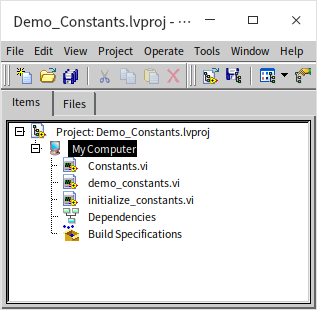
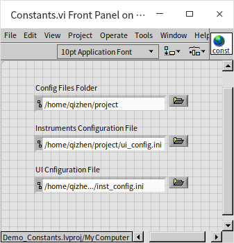
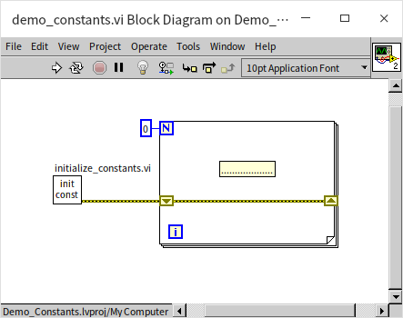
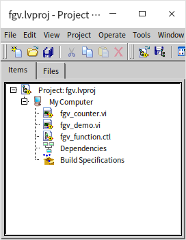
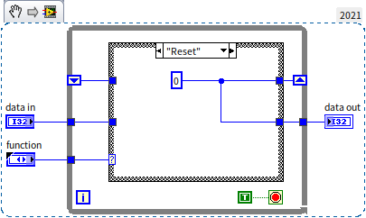
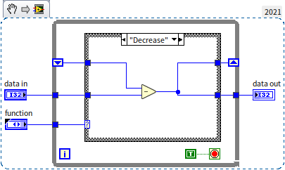
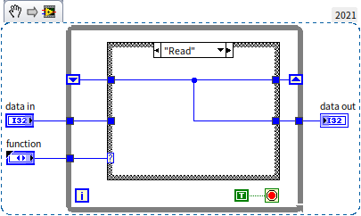
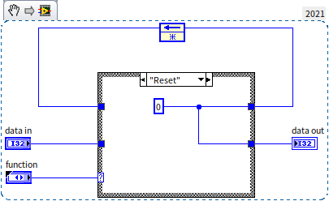

# Global Variables and Functional Global Variables

## Global Variables

Global variables, akin to [local variables](data_and_controls#local-variables), are objects that facilitate the continuous flow of data in and out. The key difference between them is that local variables can only be used within the VI (Virtual Instrument) where their associated controls reside, whereas global variables can be utilized in any VI within a program. When using global variables, data is stored in a designated memory space and does not travel along data wires. Instead, you can directly read from or write to the global variable wherever necessary.

In LabVIEW, global and local variables are features that can be easily overused due to their convenience, allowing data to be read and written at any place and time. However, they pose significant risks, often leading to inexplicable and challenging debugging errors. Furthermore, they disrupt the logical order of data flow, severely diminishing the program's readability and maintainability. As such, the use of global and local variables should be minimized in programming. We have discussed appropriate scenarios for using local variables in the [Local Variables](data_and_controls#data-sharing-across-multiple-threads) section. As for global variables, it is advisable to limit their use primarily to defining constants, and to avoid using them in other situations. Let's delve deeper into the methods and issues related to the use of global variables.

### Creating a Global Variable
To create a blank global variable VI in LabVIEW, select "Global Variable" from the New dialog box.

Alternatively, on a VI's block diagram, you can create a blank global variable instance by selecting "Programming -> Structures -> Global Variable" from the function palette. Double-clicking this instance opens a blank global variable VI. This type of VI is unique as it only has a front panel and no block diagram. On the front panel of the global variable VI, you can place multiple controls, each representing a separate piece of global variable data. Since a single global variable VI can store various global variable data, it's convenient to group related global data in one global variable VI for streamlined management.

Whether a control is for input or display, the global variable it represents is both readable and writable. To use this global variable data in a VI, simply drag the global variable VI onto the block diagram to create a global variable instance, and then perform read or write operations on it. The rectangle with a small globe icon in the image below represents a global variable instance. In the same version of LabVIEW, global and local variables have a similar appearance on the block diagram, differing only in their icons: one is a small globe, and the other is a small house.

Through this global variable instance, the program can access and modify the data stored in the global variable. If a global variable VI contains multiple global variable data entries (i.e., multiple controls), you can link this instance to different data within the global variable either by left-clicking on it or via the "Select Item" option in the right-click menu.

Generally, to avoid confusion, we often refer to the global variable VI, global variable data, and global variable instance collectively as simply a global variable.

### Data Race Conditions

A race condition occurs in programming when the outcome of a program becomes unpredictable due to multiple threads accessing the same resource simultaneously. Consider the program illustrated below. Assume the initial value of the global variable 'Data' is 0. What would be its value after running this VI?

From a logical standpoint, the program is designed to first add 2 to 'Data' and then subtract 1, aiming for a final result of 1. However, the actual result after running the VI could be 1, 2, or even -1. The code is divided into two segments, with no data wire connecting them. As per LabVIEW's operational mechanism previously discussed, these two code segments should run simultaneously in different threads. To clarify, "simultaneously" here is a macroscopic term. If we define simultaneous as a time difference of less than 10 milliseconds, then it can be said that the computer is executing two tasks at the same time. However, at a microscopic scale, say in nanoseconds, the computer might not be truly executing two tasks "simultaneously". Sometimes, code segments in different threads may run synchronously on two CPUs; other times, the computer might complete one thread's code and immediately run the other's, with the time gap being just a few nanoseconds. Human perception of time is relatively coarse, so for us, it appears as if the computer is executing two tasks concurrently.

Let's analyze the program from a microscopic time perspective: The program does not specify the execution sequence of the upper and lower code segments, making the order of execution random. If the program first completes the entire code in the upper segment and then executes the lower segment, the final value of 'Data' would be 1. However, if the program first executes the read operation and the addition in the upper segment, then switches to the other thread for the read operation and subtraction in the lower segment, followed by writing the global variable in the upper segment and finally in the lower segment, the final value of 'Data' could be -1. Hence, the program's result is indeterminate, indicating the presence of a race condition.

Local variables can also lead to race conditions, as demonstrated in the program below:

This program incorporates two delay subVIs, "Stall Data Flow.vim", each causing a one-millisecond delay. These delays are introduced to increase the likelihood of race conditions, thereby simplifying their explanation. Let's assume the initial value of the local variable 'Numeric' is 0.

* If the program sequence starts by extracting data 0 at point A, increments it by 1, writes the data at point B (making the local variable value 1), retrieves data from point C (still 1), subtracts 1, and writes the result at point D, the final result of the local variable would be 0.
* If the program first retrieves data 0 at point A, adds 1, then retrieves data from point C (where the local variable is still 0), writes data 1 at point B, subsequently subtracts 1 from the data read at point C, and writes the result at point D, the final result for the local variable would be -1.
* If the program first retrieves data 0 at point A, adds 1, retrieves data from point C, subtracts 1, writes the result -1 at point D, and finally writes data 1 at point B, the final result for the local variable would be +1.

Naturally, such unpredictable code is undesirable in any project. Local variables are even more problematic compared to global variables because they only function within a single VI. With careful inspection of a VI, it might be possible to detect code that triggers race conditions. However, global variables, which can be read and written across all VIs, greatly increase the difficulty of problem-solving. This issue is particularly acute in large-scale projects involving multiple collaborators, where it becomes challenging to ensure that a global variable hasn't been altered by someone else in a different VI.

Beyond the potential for race conditions, global variables also diminish code readability, as they don't clearly indicate the data's origin. The data wires and the direction of data flow are important for understanding LabVIEW code. Moreover, each time a VI reads data from a global variable, LabVIEW generates a new copy of the data, leading to decreased execution efficiency. Considering these multiple disadvantages, the usage of global variables should be avoided whenever possible.

### Using Semaphores to Avoid Data Race Conditions

Given the topic of data race conditions, let's explore a fundamental method to prevent them: using semaphores to protect critical sections. A critical section refers to a part of a program that accesses shared resources, which are not capable of being simultaneously accessed by multiple threads. Examples of such resources include counters, timers, data files, printers, measurement instruments, and data acquisition hardware. If these resources are read or written by multiple threads at the same time, they can cause data chaos. The code for reading and writing global and local variables that led to race conditions in our previous example should be classified as critical sections.

Using semaphores is a low-level approach, and it's often unnecessary for such methods in typical LabVIEW programming. Many of LabVIEW's common features already incorporate critical section protection, relieving programmers from needing to address these issues separately. For instance, Functional Global Variables and [In-Place Element Structures](pattern_pass_by_ref#data-reference-node), which we will cover later, have built-in critical section protection mechanisms. They employ semaphore-like mechanisms at their core to protect data. Let's seize this opportunity to understand how they prevent data race conditions fundamentally.

A semaphore, sometimes called a signal light, is a mechanism that ensures two code segments (or two VIs) are not executed simultaneously in different threads. The process involves a thread acquiring a semaphore before entering a code segment, effectively locking it. Once a semaphore is locked, it becomes inaccessible to other threads. A thread must acquire the semaphore to proceed with its subsequent code. Upon completing the code in the critical section, the thread releases or unlocks the semaphore. If another thread has already taken the semaphore, the current thread must wait until it's released. Thus, at any given moment, only the thread that has acquired the semaphore can read or write the data, eliminating the risk of race conditions.

In LabVIEW, semaphore operation VIs are located under "Programming -> Synchronization -> Semaphore" in the function palette, symbolized by a traffic light icon. Let's use semaphores to improve upon the earlier example where a local variable caused a race condition:

The program begins by creating a semaphore for the data or resource that needs protection. You can create multiple semaphores for different resources. In this case, as we have only one local variable to protect, calling "Obtain Semaphore Reference.vi" to create a semaphore is sufficient. Following this, two threads (parallel code segments) process this local variable, and each requires a similar modification: before entering their respective code, they call "Acquire Semaphore.vi" to lock the semaphore, perform the normal operations on the local variable, and after updating the data, call "Release Semaphore.vi" to unlock the semaphore. "Acquire Semaphore.vi" will wait if the semaphore is already locked by another thread and only lock it once it's released. It's important to remember to call "Release Semaphore Reference.vi" to free up the semaphore before the main program ends. This procedure ensures the two segments of code that read and write to the local variable (the critical sections) are protected by the semaphore, preventing them from running simultaneously and thus avoiding race conditions. Now, when running this program, the result in the 'Numeric' control will consistently be 0, whether the addition or subtraction is executed first.

Here's a thought-provoking question: We use a semaphore to safeguard our data from race conditions, but who protects the semaphore itself? If two threads (operating on two CPUs) try to lock the same semaphore in the same clock cycle, wouldn't that lead to a race condition?

### Defining Constants

One of the few appropriate uses for global variables that I can envision is in small-scale projects where they serve as constants. Constants are data that do not change during the program's runtime. It's important to note that while constants don't change during runtime, they aren't immutable; hence, embedding data directly in the program code is not maintenance-friendly. For instance, if we create a report-generating program with a specified paragraph font size of "10", this value would be used in various places across different VIs. If a client later requests a font size change to 11, we would have to meticulously locate and replace every instance of "10" in the program with "11". This process is laborious, error-prone, and could lead to data omissions or inaccuracies. A more efficient method involves setting up a constant named "Font Size" with a value of 10. Wherever font size needs to be set in the program, the "Font Size" constant should be used instead of the number 10. When the requirement changes to a font size of 11, only the "Font Size" constant’s value needs alteration, with no other parts of the program requiring modification.

In text-based programming languages, constants are commonly used. For instance, the C language often utilizes macros to define constants, while languages like C++ and Java use the 'const' keyword. LabVIEW lacks a dedicated mechanism for defining constants. If a program requires only a few constants, they can be conveniently returned as data from a subVI. For the earlier example, a VI named "Font Size.vi" with an output parameter for font size data would suffice. However, in projects where many constants are needed, assigning a VI to each constant becomes impractical and confusing, especially in determining which VIs are used as constants. In such situations, a simpler approach is to use global variables.

We can establish a guideline that global variables in the program are only to be read, not modified. A global variable that hasn’t been set within the program retains its value as the default value of the data [control on the global variable VI](data_and_controls#control-default-values). For more complex scenarios, where some constants depend on system settings or other constants, a subVI dedicated to initializing all global variables at the start of the program can be implemented. Once these global variables are initialized, they should not be altered elsewhere in the program. With this convention in place, we can ensure that each global variable in the program remains constant, thus sidestepping the previously mentioned drawbacks associated with global variables.

Here's an example of utilizing global variables as constants. In scenarios where a program necessitates the use of global variables, it typically has a scale large enough to encompass several VIs, making the establishment of a [project](ramp_up_complex_vis#project) essential. The image below illustrates the project setup for this demonstration:

The "Constants.vi" is a global variable VI where global variables, serving as constants, are defined. These constants correspond to various file paths:

These controls have predefined default values and are ready to be used as constants within the program. However, sometimes the values of constants need to be set at each program's startup. In the demo program, "initialize_constants.vi" is employed at the start to assign values to all constants:

It sets the values of several constants based on the current VI’s path. This VI includes 'error in' and 'error out' controls, which are used solely for [managing the program's flow](structure_cond_seq#the-art-of-invisible-control) rather than transmitting actual data. In practical applications, this initialization VI is first invoked to set necessary data for all constants. After this setup, the constant global variables can only be read within the program:

Treating global variables as constants, however, is not entirely foolproof: by their nature, global variables lack a mechanism to restrict reading and writing. If a newcomer to the project team, unaware of these conventions, inadvertently modifies the value of a global variable in a lower-level VI, it could pose significant maintenance challenges. Therefore, in larger programs that require constants, it's preferable to create a [class](oop_class) for all constants. This approach involves using [class properties](oop_class#properties-data) to store constant data and employing [method access control](oop_class_pro_con#访问权限) to regulate the reading and writing of these constants. The concept and application of classes will be elaborately discussed in the [Object-Oriented Programming](oop__) chapter of this book.

## Functional Global Variables

Functional Global Variables (FGVs) in LabVIEW can store global data by leveraging the characteristics of shift registers within loop structures. These subVIs that store global data in this manner are referred to as Functional Global Variables. The basic structure of FGVs is usually consistent: they are [non-reentrant](pattern_reentrant_vi) VIs whose main component is a [conditional loop structure](pattern_state_machine#loop-with-embedded-case-structure) that iterates only once. There is an input control designated for selecting specific operations and several controls for inputting and outputting data. Functional Global Variables not only store data but also provide access and manipulation methods for this data, hence the name "functional" global variables: they combine global variable storage with functionality.

### Creating Functional Global Variables

FGVs in LabVIEW are a crucial way to encapsulate both data and methods. Encapsulation here means grouping together closely related data and methods into a relatively independent module. This form of encapsulation is akin to that in [object-oriented encapsulation](oop_basic#encapsulation-data-abstraction), albeit through different means. In FGVs, data is stored within shift registers, and all functionalities, or encapsulated methods, are directly accessible through the FGV VI. We will demonstrate how FGVs are implemented and operate using an example. Let's consider the implementation of a "counter" with four features: resetting the count to zero, incrementing the count by a specified amount, decrementing the count, and reading the current count value.

The following image displays the project created for our FGV demonstration:

"fgv_counter.vi" is the VI that realizes the functional global variable. Its front panel appears as follows:

All FGVs include a control dedicated to specifying which function (often referred to as an "Action") to execute. An effective way to implement this is through an [enumeration type](data_custom_control#enum) control. In this example, we utilize the "function" control to determine the function being called, offering four enumeration options: Reset (to zero the count), Increase (to increment the count), Decrease (to decrement the count), and Read (to display the current count). FGVs also feature several controls for data input and output, as each function may necessitate distinct data types. In our case, we require a single input data "data in" to define the amount for incrementing or decrementing, along with an output data "data out" to relay the current count.

FGVs employ loop structures mainly to exploit their shift registers, resulting in each loop executing only once per call. Without any initialization data connected to the shift register, each invocation of the FGV retrieves data stored from the previous call and saves the data at the end of the current VI execution. This method ensures that the data in the shift register can be saved, processed, or used throughout the program's duration. It's critical to set FGV VIs as non-reentrant to maintain consistency in the data across different parts of the program.

The four images below depict the block diagrams of the FGV processing various functions:

  

  

The program's functionality is quite straightforward: "Reset" stores the value 0 in the shift register; "Increase" and "Decrease" modify the value in the shift register by the input data and store the outcome; "Read" simply extracts and presents the data from the shift register.

For loops intended to run only once, a [feedback node](data_array#feedback-node) can be a suitable substitute for the loop structure and its shift register. Essentially still a shift register, the feedback node eliminates the loop structure, simplifying the block diagram. The image below showcases an FGV using a feedback node, achieving the same functionality as the earlier example:

In FGV design, incorporating error handling wiring can aid in ensuring correct sequencing of FGV invocations during usage.

### Advantages and Disadvantages of Functional Global Variables

FGVs have two main advantages compared to regular global variables.

Firstly, FGVs prevent race conditions. Since an FGV's VI is [non-reentrant](pattern_reentrant_vi), there's no possibility of two FGV VIs executing simultaneously when used as subVIs. Even if invoked concurrently, only one FGV subVI at a time will access data from the shift register, process it, write the results back, and then exit. This sequential process ensures that another subVI cannot read the same shift register before the first one completes its operation.

For example, in the program depicted below, the result is guaranteed to be count = 0:

Even if the increment and decrement subVIs are called in separate threads, the result remains deterministic. However, it's important to understand that solving race conditions doesn't equate to arbitrary usage order of global variables. While race conditions are resolved to prevent unpredictable results, an incorrect sequence can still yield incorrect outcomes. In this case, the sequence of addition and subtraction doesn’t impact the final result, but the sequence of the reset operation is crucial. Doing addition before or after a reset will lead to different results.

The second advantage of FGVs is their ability to limit user operations on data. Data within an FGV can be seen as private to the FGV VI, accessible only within the FGV. Other VIs in the project can manipulate this data solely through the FGV's provided methods. This access restriction enhances data security significantly, especially since module authors and users are often different programmers who may not fully understand the safe handling of the module's data. Therefore, imposing necessary limitations to prevent misuse of the module's data by users is crucial.

In the FGV example previously discussed, users cannot arbitrarily set the counter value; they are limited to resetting, incrementing, or decrementing it. In some instances, the functionality to read data can be withheld, fully isolating the global data from the module user. They can only access results post-data processing via the FGV's provided methods, effectively safeguarding the global data from improper alteration.

Additionally, when dealing with large amounts of global data (like a long array), FGVs can be used to write or read specific parts of the data as needed, thereby avoiding the transfer of large data blocks and improving program efficiency. Considering these points, FGVs should be the preferred choice when global variables are necessary.

The main drawback of FGVs compared to regular global variables is the additional coding effort required, making their creation a bit more labor-intensive.

### Applications of Functional Global Variables

FGVs boast a history even older than global variables, having been present since LabVIEW 2.0, whereas global variables were introduced in LabVIEW 3.0. Despite having "global variable" in their name, FGVs extend well beyond the basic concept of global variables. In eras prior to LabVIEW's integration of LvClass and event structures, FGVs were the most effective tools for encapsulating data and methods and limiting access. Over time, FGVs have been known by various names, including LV2 Global (originating from LabVIEW 2.0), Action Engine, VIGlobals, among others. Historically, they have been a cornerstone in the application of software engineering principles within LabVIEW, highly revered by many LabVIEW programmers, and many of LabVIEW's own modules are based on the FGV approach.

A classic example is the module for reading and writing configuration files (INI files) in older LabVIEW versions. In LabVIEW versions up to 8.6, opening `[LabVIEW]\vi.lib\Utility\config.llb\\onfig Data Registry.vi` reveals that this VI is a foundational module for the "configuration file VI". The function palette "Programming -> File I/O -> Configuration File VIs" includes VIs that provide interfaces for INI files. However, a closer look at these VIs' block diagrams shows they mainly act as interface wrappers, all ultimately calling "Config Data Registry.vi" to execute their functionalities. "Config Data Registry.vi", employing the FGV model, offers operations like adding or deleting keys in INI files:

FGVs are often used in scenarios such as:

- Protecting Critical Sections. Critical sections are program segments that access shared resources incapable of simultaneous multi-threaded access. Resources like counters, timers, data files, printers, measuring devices, and data acquisition hardware are susceptible to chaos when accessed by programs from multiple threads simultaneously. The non-reentrant nature of FGVs effectively ensures that only one thread's program can access these resources at any given time, eliminating the need for programmers to manually use semaphores for data protection.
- Encapsulating Reusable Function Modules. FGVs excel at encapsulating closely related data and methods, while also restricting external program access to the module's data. This results in high internal cohesion and low external coupling, meaning the module's internal code is functionally specific and closely related, with minimal dependence on external components. Such modules are exceptionally suitable for repeated use across different applications.

While FGVs offer numerous advantages, they also have limitations when used in larger functional modules. Since FGVs and state machines are both based on conditional loop structures, the drawbacks associated with state machines apply to FGVs as well. For example, they can only display code from one branch at any given time, hindering the ease of reading the program.

In modules created with the FGV approach, nearly all functionalities and data interfaces are consolidated within the FGV VI. If a module's functionality is extensive, the VI can become cluttered with complex connections. Using subVIs might not sufficiently simplify it. For instance, the previously shown FGV is quite intricate, and understanding its operation may require detailed study and analysis.

Complex modules typically involve numerous data interfaces. Placing all these interfaces on one VI can overwhelm and confuse users. This is why LabVIEW doesn’t directly expose "Config Data Registry.vi" for user use, but instead further encapsulates its structure, with each VI handling only a couple of user-facing interface data points. This method significantly eases the user experience.

Placing all structural data in a single VI can also create maintenance challenges. For instance, adding or altering a feature might require introducing new parameters or even altering the VI's connection pattern.

The above-mentioned drawbacks are mitigated in [LvClass](oop_class), which additionally supports features like inheritance and polymorphism. Hence, for developing large-scale programs that require data access control and encapsulation, object-oriented programming based on LvClass should be prioritized. In newer versions of LabVIEW, the configuration file read/write module discussed earlier has been rewritten using LvClass.

However, employing LvClass entails creating many extra VIs. Therefore, for modules with straightforward data and functionality (such as a counter), FGVs remain a viable option.

## Practice Exercise

- The counter example discussed in the article has a limitation: only one counter can be utilized in an application, as the counting data is global. Accessing the counter from any part of the application will yield the same counting data. Consider how to employ FGVs to develop an enhanced version of the counter that allows the use of multiple such counters within a single application. Each counter should operate independently, without interference from others. The new counter should only need to perform four basic functions: "Reset", "Increment", "Decrement", and "Read Data".
