# Global Variables and Functional Global Variables

## Global Variables

Global variables, like [local variables](data_and_controls#local-variables), are objects that pass data in and out without wires. The key difference is that local variables are restricted to the local VI where their associated controls reside, while global variables can be accessed by any VI in the application. When using a global variable, data is stored in a designated memory block, and you can read from or write to it directly from any block diagram.

In LabVIEW, global and local variables are often overused because they offer a quick way to pass data without wiring. However, they are highly unsafe: they introduce race conditions that are hard to debug, disrupt the dataflow paradigm, and severely reduce code readability and maintainability. Therefore, you should minimize their use. We discussed appropriate use cases for local variables in [Local Variables](data_and_controls#data-sharing-across-multiple-threads). As for global variables, they should generally be restricted to defining constants and avoided in other scenarios. Let's examine the operations and problems associated with global variables.

### Creating a Global Variable

To create a new global variable in LabVIEW, select **Global Variable** from the **New** dialog box:

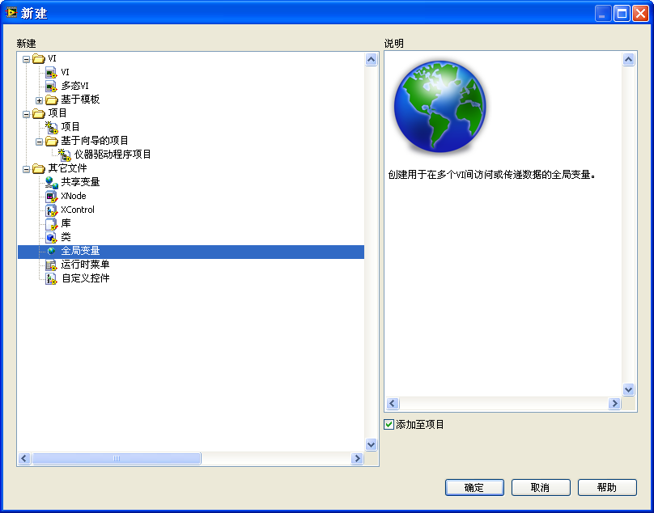

Alternatively, you can place a global variable on a block diagram by selecting **Programming -> Structures -> Global Variable** from the Functions palette. Double-clicking this global variable node opens a special global variable VI. This VI has only a Front Panel and no Block Diagram. You can place multiple controls on its front panel, where each control acts as an independent global variable. Because a single global variable VI can hold multiple variables, grouping related data inside one global variable VI simplifies management:

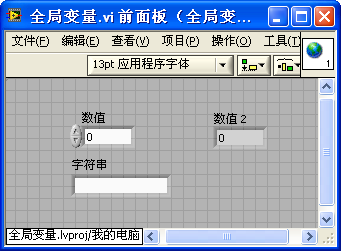

Whether a control on the global panel is an input (control) or an output (indicator), the global variable it represents is always readable and writable. To use a global variable, drag its VI file onto any block diagram to create a global variable instance, then right-click or click it to select which control to access. On the block diagram, global variables look similar to local variables, but feature a globe icon instead of a house icon:

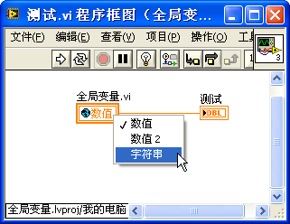

Generally, developers refer to the global variable VI, the individual controls, and their block diagram instances collectively as "global variables."

### Data Race Conditions

A **race condition** (or data race) occurs when multiple concurrent threads read and write a shared resource at the same time, making the execution order and the final result unpredictable. 

Consider the program below. If the initial value of the global variable `Data` is `0`, what is its value after the VI runs?

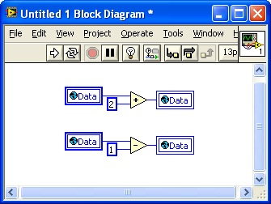

Logically, the code is designed to add `2` to `Data` and subtract `1`, expecting a final value of `1`. However, the actual result could be `1`, `2`, or even `-1`. 

Because there are no wires connecting the upper and lower code blocks, they run concurrently in different execution threads. 
- **Concurrency**: In multi-core CPU systems, the threads may execute physically in parallel on separate cores. On single-core or CPU-constrained systems, the operating system's scheduler switches rapidly between the threads at random intervals (typically in the microsecond or nanosecond range).
- Because we cannot predict when the OS will suspend one thread to execute another, the order of read and write operations is completely non-deterministic.

Let's analyze the execution flow microscopically:
- If the upper thread reads `0`, adds `2`, writes `2` back to the global variable, and *then* the lower thread reads `2`, subtracts `1`, and writes `1` back, the final value is `1`.
- If the upper thread reads `0` and pauses, then the lower thread reads `0`, subtracts `1`, and writes `-1`, and *then* the upper thread resumes, adds `2` to its local value (`0`), and writes `2`, the final value is `2`.
- If the upper thread reads `0`, adds `2`, and pauses; then the lower thread reads `0`, subtracts `1`, and writes `-1`; and *then* the upper thread resumes and writes `2`—the final result is `2`. Conversely, if the upper thread writes `2` first, and the lower thread writes `-1` last, the final result is `-1`.

Local variables also cause race conditions, as shown here:

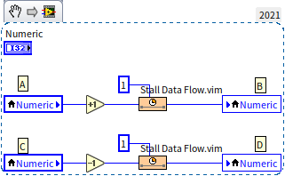

This program uses two delay VIs (`Stall Data Flow.vim`) set to $1\text{ ms}$ to simulate real-world timing variations and increase the likelihood of a race condition. Assuming `Numeric` starts at `0`:
- **Path 1**: Node A reads `0` and writes `1` at node B. Node C reads `1` and writes `0` at node D. Result: `0`.
- **Path 2**: Node A reads `0`. Before node B writes, node C reads `0`. Node B writes `1`. Node D subtracts `1` from `0` and writes `-1`. Result: `-1`.
- **Path 3**: Node A reads `0`. Node C reads `0`. Node D writes `-1`. Node B writes `1`. Result: `1`.

This non-deterministic behavior is unacceptable in production code. Global variables are even more dangerous than local variables. Since local variables are confined to a single VI, you can identify race conditions by auditing that VI's block diagram. However, global variables can be modified by any VI in the application, making tracking and debugging data races extremely difficult. In large projects with multiple developers, ensuring that another module does not modify a global variable at the wrong time is almost impossible.

Additionally, global variables obscure data flow, making code harder to read because the origin and destination of data are not traced by wires. Furthermore, every time a VI reads from a global variable, LabVIEW creates a new data copy in memory, reducing performance. For these reasons, you should avoid global variables in your applications.

### Using Semaphores to Avoid Data Race Conditions

To prevent race conditions on shared resources (such as files, variables, hardware ports, or instruments), we must protect the **critical sections** of our code. A critical section is any block of code that accesses a shared resource that cannot be used by multiple threads simultaneously.

Using semaphores is a fundamental way to protect critical sections. In LabVIEW, you can find semaphore VIs under **Programming -> Synchronization -> Semaphore** on the Functions palette:

A **Semaphore** (or mutex lock) acts as a traffic controller:
1. Before entering a critical section, a thread must call `Acquire Semaphore.vi` to lock the semaphore.
2. If the semaphore is unlocked, the thread locks it and enters the critical section.
3. If another thread has already locked the semaphore, the acquiring thread halts and waits until the semaphore is unlocked.
4. Once the thread finishes running the critical section, it calls `Release Semaphore.vi` to unlock it, allowing waiting threads to proceed.

In the example above, we use `Obtain Semaphore Reference.vi` to create a semaphore, wrap both local variable operations in acquire-release blocks, and destroy the semaphore at the end using `Release Semaphore Reference.vi`. This ensures that the read-modify-write sequences execute atomically, guaranteeing that `Numeric` always returns `0`.

> [!NOTE]
> In normal LabVIEW programming, you rarely need to handle raw semaphores manually. Many advanced LabVIEW features, such as Functional Global Variables and In-Place Element Structures, have built-in critical section protection, using semaphore-like locks under the hood.

Here's a thought-provoking question: We use a semaphore to safeguard our data from race conditions, but who protects the semaphore itself? If two threads (operating on two CPUs) try to lock the same semaphore in the same clock cycle, wouldn't that lead to a race condition?

### Defining Constants

One acceptable use case for global variables in small projects is defining constants. A constant is a value that remains unchanged throughout the program's execution, such as file paths, default font sizes, or serial port configurations.

Hardcoding these values directly into multiple block diagrams makes code difficult to maintain. For example, if you hardcode a report font size of `10` across several VIs and later need to change it to `11`, you must manually find and update every instance. Defining a single global variable constant named `Font Size = 10` resolves this: you only need to change it once, and all references update automatically.

Unlike text-based languages that support keywords like `#define` (C) or `const` (C++/Java), LabVIEW does not have a native global constant datatype. While you can create a subVI that outputs a constant value, managing many constants this way results in too many VIs. In this case, using a global variable is simpler.

To use global variables safely as constants, establish a strict programming rule: **write to them only during initialization, and treat them as read-only elsewhere.**

Here is an example project that uses global variables as constants:

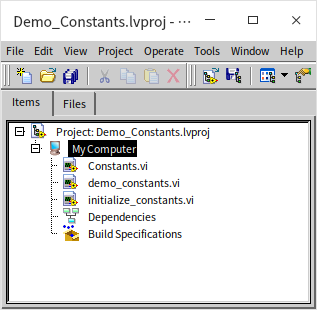

`Constants.vi` defines the global variable paths:

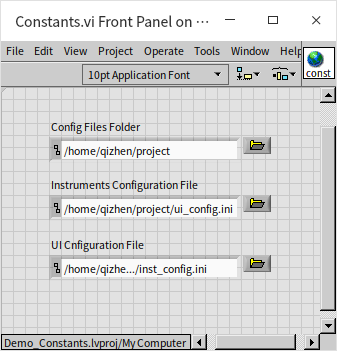

We initialize these paths at startup using `initialize_constants.vi`:

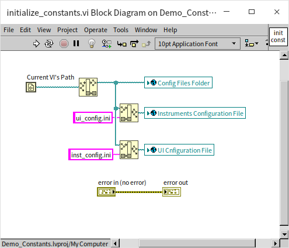

This VI computes paths relative to the current VI's location and writes them to the global variables. The error wires are used solely to control execution order. In the main application, we call the initialization VI first, and then treat the global variables as read-only:

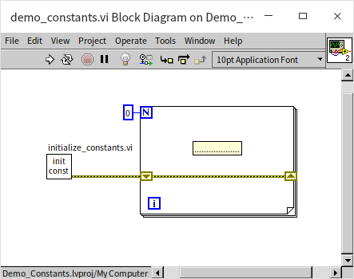

However, using global variables as constants is not completely secure because LabVIEW does not enforce read-only access on them. If a developer accidentally writes to a constant global variable in a subVI, it can cause bugs. For large applications, a safer approach is to use **Object-Oriented Programming (OOP)**: store the constant data as private class properties, and expose them only through read-only methods. We will cover this in [Object-Oriented Programming](oop__).

## Functional Global Variables

A **Functional Global Variable (FGV)** is a design pattern in LabVIEW that uses uninitialized shift registers inside a loop structure to store global data. 

An FGV is a **non-reentrant subVI** containing a Case Structure nested inside a loop designed to run exactly once. The VI has an input control to specify an operation (or "Action"), data inputs, and data outputs. Because it wraps data storage and functions inside a single subVI, it is called a "functional" global variable.

### Creating Functional Global Variables

FGVs are a primary way to implement **data encapsulation** in LabVIEW, grouping related data and methods into a single module. The data is stored securely inside the shift register, and users can only interact with it using the methods exposed by the VI.

Let's build an FGV counter that provides four operations: *Reset* (clear count), *Increase* (increment count), *Decrease* (decrement count), and *Read* (get count).

Here is the project hierarchy:

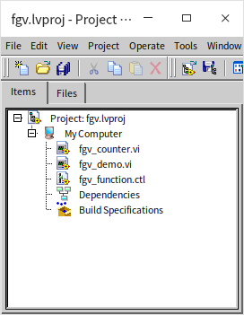

`fgv_counter.vi` contains the implementation. Its front panel is shown below:

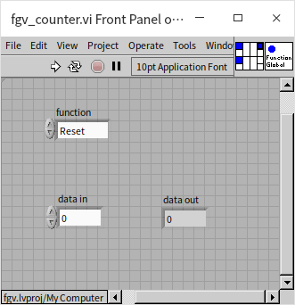

We use an [Enumeration Control](data_custom_control#enum) for the **function** (Action) input: *Reset*, *Increase*, *Decrease*, and *Read*. We also define a `data in` input and a `data out` output.

The block diagram uses a loop designed to run only once. Because the shift register is **uninitialized** (no wire connected to the left terminal outside the loop), the shift register retains its memory between VI calls. The VI must be configured as **non-reentrant** so that all instances on the block diagram share the same memory allocation.

The block diagrams for each operation are shown below:

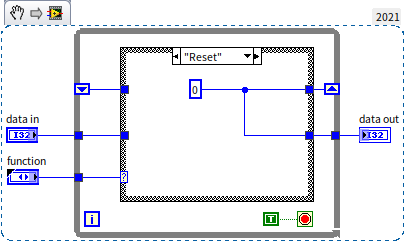  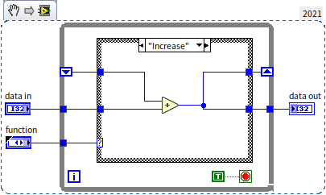

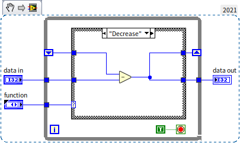  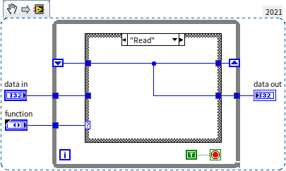

- **Reset**: Writes `0` to the shift register.
- **Increase**: Adds `data in` to the current value and updates the register.
- **Decrease**: Subtracts `data in` from the current value and updates the register.
- **Read**: Passes the current register value to `data out` without changing it.

Instead of a loop, you can use a **Feedback Node** to achieve the same behavior. The feedback node acts as a shift register but removes the need for an outer loop structure, making the diagram cleaner:

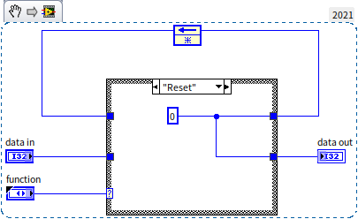

> [!WARNING]
> When using a Feedback Node inside an FGV, ensure it is configured to **initialize once during compile or load** (unconnected initialization terminal), or remove the initialization terminal entirely. If it is incorrectly configured to initialize on every call, it will fail to retain its value and won't function as a global variable.

### Advantages and Disadvantages of Functional Global Variables

FGVs offer two main advantages over standard global variables:

1. **Race Condition Prevention**: Because the FGV VI is non-reentrant, LabVIEW prevents multiple instances from executing simultaneously. If two threads call the FGV at the same time, LabVIEW serializes the calls, executing one completely before running the next. This ensures atomic read-modify-write operations on the internal data.

For example, the following program will always return `count = 0`:

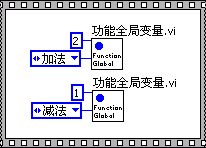

Even though the increment and decrement operations run in parallel threads, the result is deterministic. (Note: While this prevents data corruption, it does not guarantee execution order. If you need a strict sequence of operations—such as resetting before reading—you must control the execution flow using error wires).

2. **Access Control (Encapsulation)**: Data is private to the FGV. Project VIs cannot modify the internal shift register directly; they can only invoke the exposed Actions. You can restrict access by disabling direct write operations or returning processed summaries instead of raw data. For large datasets (like arrays), you can write methods to update specific elements rather than copying the entire array, which improves memory efficiency.

The primary disadvantage of FGVs is the development overhead: they require creating custom enumerations, Case Structures, and subVI wrappers.

### Applications of Functional Global Variables

FGVs have a long history in LabVIEW, dating back to LabVIEW 2.0 (predating the introduction of standard global variables in version 3.0). Before LabVIEW introduced Classes (LvClass) and Event Structures, FGVs were the standard tool for data encapsulation and critical section protection.

Over the years, developers have used different terms for this pattern:
- **FGV (Functional Global Variable)**: Typically refers to simple VI wrappers providing "read" and "write" operations to replace global variables.
- **Action Engine (AE)**: Refers to VIs that use the same shift register architecture but implement complex processing logic (like file I/O, database transactions, or communication protocols).

The counter example above is technically an Action Engine because it performs arithmetic calculations inside the VI.

A classic example of the Action Engine pattern is the INI file registration module in legacy LabVIEW versions (8.6 and earlier). The VI `[LabVIEW]\vi.lib\Utility\config.llb\Config Data Registry.vi` acts as a central registry for all open configuration files:

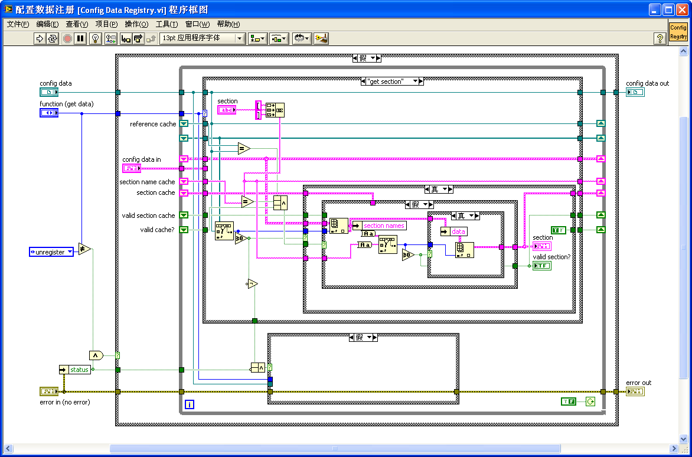

This registry uses an FGV to store all file references, allowing users to modify INI keys from separate VIs without conflicts.

Despite their advantages, FGVs have limitations:
- **Visual Clutter**: Like state machines, they hide code behind Case structures, making the diagram hard to read at a glance.
- **Complexity Scale**: In complex modules, the FGV must handle numerous data inputs and outputs, leading to a cluttered connector pane. For example, `Config Data Registry.vi` is too complex to expose directly to users, so NI wrapped it in simplified subVIs for each action.
- **Maintenance Bottlenecks**: Adding new features requires adding enum values, case branches, and modifying the subVI's terminals.

For complex architectures, you should use **LabVIEW Classes (LvClass)**. Classes support inheritance, polymorphism, and cleaner encapsulation. In modern versions of LabVIEW, the configuration file module has been refactored using LvClass. However, for simple data containers like counters or state logs, FGVs remain an efficient and practical choice.

## Practice Exercise

- The counter example shown in this section has a limitation: since the shift register memory is global, only one counter can exist in an application. If you place the counter VI in multiple locations, they will all modify the same value.
  
  **Task**: Design an enhanced counter VI that allows multiple independent counter instances to run within the same application without interfering with one another. Each instance must support the four basic actions: *Reset*, *Increment*, *Decrement*, and *Read*.

  *Tips: You can solve this using two different approaches:*
  1. **Update the Internal Data Structure**: Instead of storing a single numeric value in the shift register, store an array or a Map of values. Add a "Counter Name" string input to the VI's connector pane to act as a key, allowing the VI to track and update multiple independent counts inside the same shift register.
  2. **Modify the VI Execution Settings**: Set the VI's execution properties to **Preallocated clone reentrant execution**. By changing this setting, every instance placed on a block diagram gets its own private memory space (clone). Analyze whether this configuration allows you to run multiple independent counters without using a shared global register (note that this transforms the VI from a globally shared register into a set of independent, local memory blocks).
