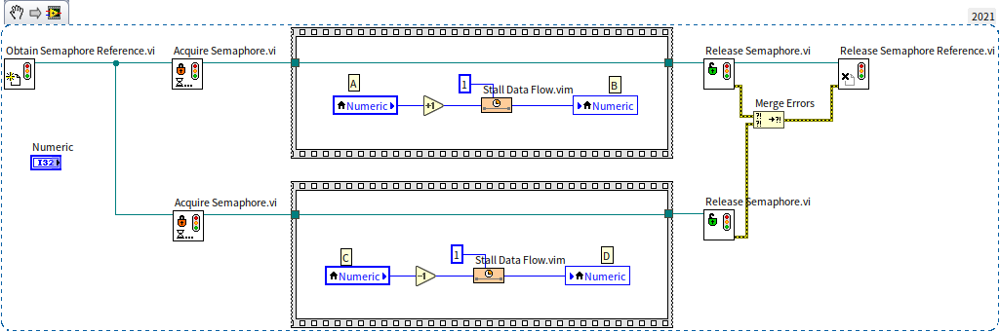
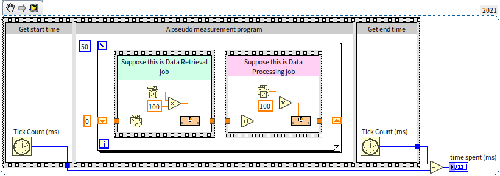
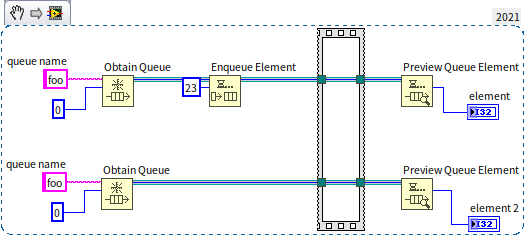
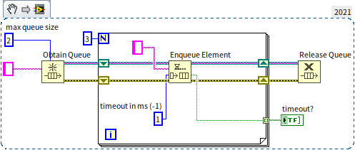
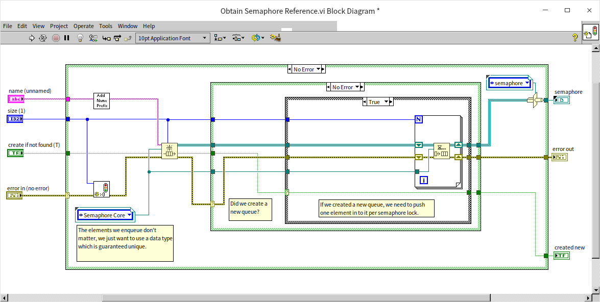
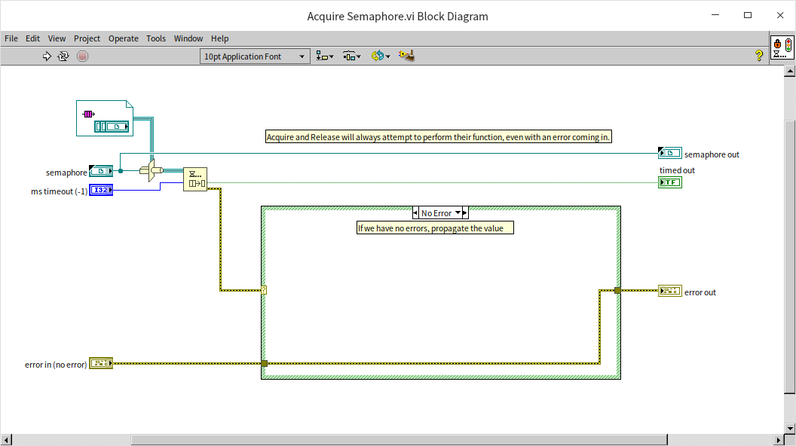
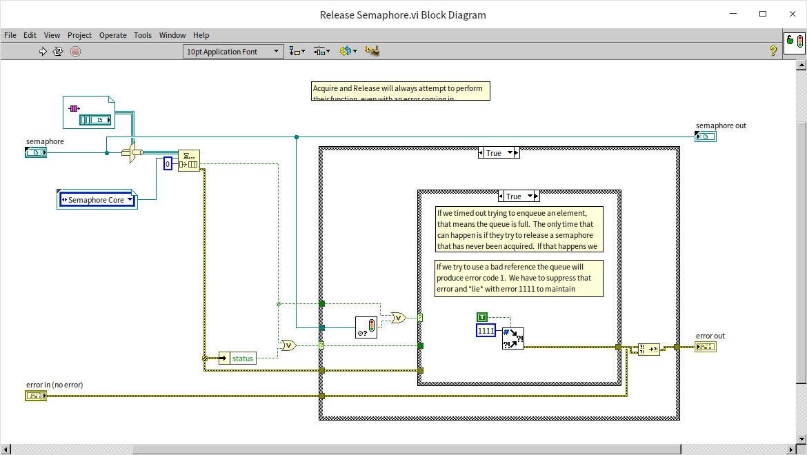

# Passing by Reference

Passing by value is the preferred method of parameter passing in LabVIEW, as it aligns with the dataflow-driven programming model. However, in certain scenarios, passing by reference is unavoidable, particularly when a program needs to operate on the same data across different threads.

In C++, a reference is represented by a 4-byte (in 32-bit operating systems) or 8-byte (in 64-bit operating systems) piece of data that points to the address of a data block. The actual data is stored in a memory space accessible to multiple resources. In LabVIEW, the approach to passing by reference is more varied.

## LabVIEW's Built-In Reference Data Types

In common text programming languages like C and Java, data passed into a sub-function can be specified as pass-by-value or pass-by-reference. LabVIEW, however, operates differently. It does not allow for specifying whether data should be passed by value or reference. Instead, LabVIEW's data types are categorized into those meant for value passing and those designed for reference passing.

Controls located in the "Reference Handle" section of the controls palette are data types meant for passing by reference:


In block diagrams, these reference data types are represented by dark green thin wires. For example, the semaphore reference we discussed in the [Global Variables](pattern_global_data#using-semaphores-to-avoid-race-conditions) section is a typical reference data type. In the program shown below, the green thin wires interconnecting the subVIs are transmitting the semaphore reference:



Apart from the "Reference Handle" controls on the palette, LabVIEW also has other data types that, despite having different wire colors, function as reference data types. These include hardware device handles (such as VISA resource names, IVI logical names), notifications, events, queues, among others.

In LabVIEW, there are numerous reference data types that aren't listed on the control palette. For instance, as discussed in the [Event Structure](pattern_ui#dynamic-events-1) section, methods for creating references for objects like panes and Boolean controls don't have their reference controls readily accessible on the controls palette. Instead, obtaining these types of reference controls requires an indirect approach: first, create a reference for a specific object, then generate a control from the reference's terminal. Here's an example of such reference controls:


Reference data types themselves are represented by a 4-byte piece of data that points to another object. In practice, the object to which the reference points is what's actually used in the program. The various reference types differ in the nature of the objects they point to; some may point to a file, others to an instrument device, and some to a specific VI or control.

On block diagrams using these pass-by-reference data types, the 4-byte reference data flows along the data wire, while the object it points to remains unchanged. If a reference points to a large data block, transferring the compact 4-byte reference is much more efficient than moving the entire data block. At branches in the data wires, LabVIEW only needs to replicate the 4-byte reference data, not the object it references. The duplicate reference still points to the original object, allowing different program branches to access the same object or data.

## Global Variables

Beyond LabVIEW's built-in reference data types that can convey specific data references, other methods can be employed to pass any data block by reference.

Global variables (and local variables) represent one of the simplest ways to pass data by reference. The data in a global variable is stored in a fixed memory location, accessible via global variables in various VIs or threads.

Using global variables involves simply placing the VI or node representing the global variable into the program, providing access to its data. While this method has its benefits, the drawbacks are more significant. Data wires are vital for understanding LabVIEW programs, as they indicate the sequence of program execution, data transfer, and processing. Losing this crucial insight makes it challenging to trace the origins and modifications of data, thus significantly reducing the program's readability and maintainability.

Therefore, data wires are often crucial. Even when passing by reference, it's preferable to maintain a data wire for transmitting the reference.


## Queues

### Queues as Data Structures

We previously introduced queues as data structures in the [State Machine](pattern_state_machine#multi-state-transitions) section. A queue is a structure capable of storing multiple elements of the same type. Its behavior is similar to a line for buying tickets: data enters the queue as customers join a line, with those joining first being served and leaving first. In a queue, data adheres to the First In, First Out (FIFO) principle, meaning each time data is extracted, it's always the element that was added earliest.

In LabVIEW, a Queue is a unique data structure. While most structures like Arrays, Maps, Sets, etc., use value passing, queues are passed by reference. This distinction arises from the early days of LabVIEW, when its applications were more limited, often for creating basic testing programs. LabVIEW primarily managed straightforward data types, such as hardware test results, without the need for complex structures for representation. However, due to LabVIEW's automatic multi-threading, users could unintentionally create multi-threaded programs, necessitating an efficient method for data transfer between threads. This led to the adoption of queues, designed as reference types to facilitate data sharing across threads.

To this day, functions related to queues are located under "Programming -> Synchronization" on the function palette, not grouped with other data structures under "Data Containers".


Queues typically refer to unidirectional queues, which operate on a simple FIFO basis, where data elements can only enter at the rear and exit at the front. A data structure often compared with queues is the "Stack" (also briefly introduced in the [State Machine](pattern_state_machine#designing-the-data-structure) section). Stacks resemble a handgun magazine, where data inserted into the stack, akin to bullets loaded into a magazine, exits in the reverse order of entry. Data in a stack must adhere to the Last In, First Out (LIFO) principle.

Another variation is the double-ended queue, which allows data elements to enter from the front and exit from the rear. Double-ended queues can function as either queues or stacks. LabVIEW offers semi-double-ended queues; while they don’t permit data to exit from the rear, they do allow data to enter from the front. Thus, LabVIEW’s queues can be used as stacks when necessary.


### Queues for Data Transfer Between Different Threads

In LabVIEW, queues have a crucial role beyond data storage and facilitating First In, First Out (FIFO) operations: they enable data exchange between different threads. A common pattern in LabVIEW testing programs involves multiple threads running simultaneously, where one thread is dedicated to data acquisition and another to processing and displaying the data. This requires an efficient method for storing data acquired by one thread and later retrieving it for processing by another.

To illustrate how queues are used in such scenarios, let's look at a simplified "mock" data acquisition and analysis program:



This program's main structure, a typical setup for measuring execution time, might be familiar from the [Flat Sequence Structure](structure_cond_seq#flat-sequence-structure) section. The outer sequence structure has three frames: the first records the current system time before test code execution; the second frame runs the code whose execution time is being tested; and the third frame again captures the current time. The difference between the times in the third and first frames gives the execution duration of the test code.

In the second frame, there's a loop that iterates 50 times. Each iteration begins with a "virtual" data acquisition module, represented by the code inside the green sequence structure. This module simulates data acquisition by generating a random number on each iteration. To mimic the time-consuming nature of data acquisition, a random delay of 0-100 milliseconds is introduced. After acquisition, data is processed by the module inside the red sequence structure, which also simulates a processing delay of 0-100 milliseconds.

Running this program yields variable total execution times due to its random elements, typically around 5 seconds. The loop runs 50 times, each iteration taking between 0-200 milliseconds, averaging around 100 milliseconds, summing up to approximately 5 seconds. However, the program's efficiency could be improved since data acquisition and analysis currently proceed sequentially, limiting it to one operation at a time. By running data acquisition and analysis in parallel threads, execution time can be nearly halved. The key is to process the previously acquired data while simultaneously acquiring new data. The improved program code for this parallel execution is as follows:


In the enhanced program, the data acquisition and processing modules remain the same but are now positioned vertically instead of horizontally. Importantly, these modules are no longer connected directly by data wires, enabling them to run in parallel. The processing module retrieves data from a shift register, which the acquisition module stored during the previous iteration. This approach allows the data module to acquire new data while the processing module works on the previously acquired data. To accommodate this, the loop now needs 51 iterations to process and acquire 50 data sets. A more rigorous program might skip the processing module on the first iteration and ignore the acquisition module on the last. However, these considerations are omitted in this demonstration.

This programming model is akin to a pipeline model. It mirrors a production line where a product undergoes multiple sequential processes, with each worker handling one process. As a product undergoes the first process, the worker responsible for the second process is also active, working on the second process for the preceding product.

Running this program again, its efficiency noticeably increases, with execution times averaging around 3.5 seconds. While not halving the time, it marks a significant improvement of about 30%. However, there's still potential for further optimization. In this pipeline model, only the acquisition and analysis tasks within the same iteration can run simultaneously. If the acquisition module completes its task quickly but the processing module is still busy, the acquisition module has to wait. An improvement would involve the acquisition module moving on to the next data set as soon as it completes its task. This leads to multiple data sets being acquired but not yet processed, necessitating a temporary storage solution for these sets until they can be processed. This is where queues are beneficial: each acquired data set is placed in a queue, and the processing module in another thread retrieves and processes data from the queue. The revised program is as follows:


The program begins by creating a queue with "Obtain Queue" and then distributes the queue's reference to both the data acquisition and processing modules. The acquisition module enqueues each data item it generates, while the processing module dequeues and processes data from the queue. If the queue is empty, "Dequeue Element" waits until new data is added by the acquisition module before continuing with the processing. Finally, the program calls "Release Queue" to dispose of the created queue. The runtime of this optimized program typically falls under 3 seconds.

This approach is also known as the producer-consumer model: the program's two main threads consist of one producing data and the other consuming it.


### Queue Naming

When creating a new queue with the "Obtain Queue" function, you have the option to assign a unique name to the queue. In a given project, each queue's name must be distinct from all others. If a new queue is created in any sub-VI within the same project and a queue with the same name already exists, "Obtain Queue" won’t create a new queue. Instead, it accesses the existing queue with that name. For instance, in the program depicted below, the two threads aren’t connected by data wires, but they utilize the same queue:



In this program, the "Preview Queue Element" function retrieves the value of the first element in the queue without removing it. When the program is run, the values displayed in the "element" and "element 2" output controls are identical, both showing 23, because they are previewing the same queue. The program includes an empty sequence structure, which serves a synchronizing function. It ensures that the "Preview Queue Element" operation in the lower thread only occurs after the "Enqueue Element" operation in the upper thread.

Generally, for every call to "Obtain Queue", there should be a corresponding call to "Release Queue". The acquisition and release of queues are tracked and should be balanced. If a created queue is not released, it will persistently consume memory. If the "force destroy" parameter in the "Release Queue" function is set to "true", this function will immediately destroy the queue, rendering it inaccessible to other threads.


### Considerations for Implementing the Producer-Consumer Model

When utilizing queues in the producer-consumer model, it's crucial to anticipate potential exceptions, such as one of the program's threads encountering an error or becoming non-responsive.

If the consumer thread experiences an issue and is unable to process data effectively, or if it processes data too slowly, data produced by the producer thread will start accumulating in the queue. If too much data piles up, it could consume excessive memory, potentially straining the entire system. Therefore, when designing such programs, it may be necessary to impose a limit on the queue's length. If the number of elements in the queue exceeds a reasonable limit, it could indicate a problem. In such cases, stopping the program to investigate and resolve the issue is advisable. The "Get Queue Status" function can be used to monitor the queue's length.

You can also set a maximum queue size limit in the "Obtain Queue" function. The default value of the "max queue size" parameter is -1, indicating no limit on the queue length. However, setting this parameter to a positive integer will limit the queue size, causing the enqueue operation to pause once the queue reaches its maximum capacity. This pause lasts until other threads dequeue some elements, making room for new entries. If the queue remains full and elements aren't dequeued, the program could end up waiting indefinitely, a scenario best avoided. Therefore, it’s a good practice to include a timeout parameter in the enqueue operation, defined by a positive integer representing milliseconds. In the following example, the maximum queue length is set to 2. When the program tries to insert a third data item, the element won't be added to the queue, and the enqueue operation's "timeout" parameter will output a "true" value:



Likewise, it's important to consider scenarios where the producer thread might encounter exceptions. In such situations, the consumer thread might indefinitely wait for data that never arrives. To prevent this endless waiting, a timeout parameter should also be set for the dequeue operation in the consumer thread, ensuring it doesn’t get stuck in a perpetual waiting state.


### Utilizing Queues as Data References

We can utilize queues to facilitate passing our custom data types by reference. This involves creating a new queue that accommodates only a single element and using it to store the data to be referenced. When passing parameters between VIs, the queue's reference is transmitted, allowing the extraction and use of the data from the queue as needed.

The program depicted below initializes a data structure for passing by reference:


The type of data being referenced here is a cluster composed of three elements. The final output, "data out", is technically a reference to the queue. However, since the queue stores our user-defined data, "data out" can also serve as a reference to the cluster data we've created.

Passing by reference is often crucial for accessing the same data across various threads. It's vital to prevent race conditions in such data accesses. This means that while one thread accesses the referenced data, other threads should ideally wait and not simultaneously access the same data. We've previously discussed using semaphores to avert race conditions with global variables in the [Global Variables](pattern_global_data#using-semaphores-to-avoid-data-race-conditions) section. For reference data constructed via queues, queue features can be leveraged for a straightforward solution to race conditions. Here's how it works:

When a VI, let's call it "A", needs to access the referenced data, it should first dequeue the only element in the queue. After processing the data, the new data is then enqueued. This approach ensures that the queue is immediately emptied upon executing VI A, preventing other threads (with VIs like "B" using a similar mechanism) from retrieving data from the now-empty queue. These threads must wait until VI A finishes its operations and repopulates the queue. This method effectively prevents race conditions where multiple threads access the same data simultaneously. The image below illustrates sample code for processing the data:


In the example shown next, both the "Set Name.vi" and "Set Number.vi" sub-VIs use the code designed to prevent race conditions, as shown above. While they operate independently and can be run concurrently by LabVIEW, the race condition prevention mechanism ensures they do not access the referenced data at the same time. Instead, they sequentially adjust the Name and Number elements in the referenced data:


When employing reference passing, it's essential to manage memory appropriately. For instance, in our example, the queue was created specifically for reference passing. This queue should be properly disposed of before the program's conclusion to prevent potential memory leaks.


### Data Log File Reference Handle

Using queues is a highly efficient way to pass data by reference and offers good readability. However, it is an unconventional solution. Queue controls and data lines are always seen as "queues", which may be confusing for programmers unfamiliar with this use case. Using LabVIEW's standard deep green thin lines for reference passing can improve the program's readability.

The "Data Log File Reference Handle" from the Reference Handles control palette is often used to represent user-defined reference data types. When a new "Data Log File Reference Handle" control is placed on a VI's front panel, it appears as an empty rectangular box. Placing different types of controls inside this box transforms it into a special reference data type.

For custom reference data types, an enumeration control is usually placed within the frame of the "Data Log File Reference Handle" control:


This combination creates a new reference data type control:


The enumeration typically contains a single item for displaying relevant hint text. Enumeration is chosen because it can display hint text, and LabVIEW treats enumerations with different item texts as distinct data types. Different enumerations inside the Data Log File Reference Handle control frame signify different reference data types. Defining each unique user-defined reference as a specific type enhances program safety. For example, reference data of different types cannot be assigned or compared to each other:


Imagine a scenario in an application where two string arrays are used to store the names of experimenters and instrument equipment numbers, respectively. The application requires accessing these data sets by reference. In this scenario, they represent two completely different sets of data, each managed by its own set of VIs. It's essential to prevent the cross-use of VIs and data. If the same reference data type is used for both sets, passing the names to a VI intended for equipment numbers wouldn't immediately flag an error, allowing the program to run, albeit with potential runtime issues. Using distinct reference data types for each set would instantly highlight an error if names were passed to the equipment number VI, as the data wire would break and prevent the program from running.

When using a custom Data Log File Reference Handle to signify reference data types, as opposed to queues, there's an additional step: the queue created for the referenced data needs to be converted into the custom reference handle data type using a type casting function before being passed out of the sub-VI. In the application, sub-VIs then pass data using the deep green lines of the reference handle. When receiving this reference, the sub-VI must convert it back to a queue for use:


## How Semaphores are Implemented in LabVIEW

In LabVIEW, several VIs that operate on semaphores are open-source, allowing us to understand and learn from their implementation.

First, let's look at the VI for creating a semaphore, "Obtain Semaphore Reference.vi":



This program's main structure should be somewhat familiar. Its core part involves creating a queue, adding an element to it, and then converting the queue's reference into a custom Data Log File Reference Handle to serve as the semaphore reference handle. This is a classic use of queues for passing data by reference, as discussed earlier. In this program, the length of the queue is not fixed to 1 but is specified by the user. This is because some resources protected by semaphores allow multiple concurrent accesses. For instance, an instrument with two independent data acquisition channels might allow simultaneous access from two threads. In such scenarios, the semaphore count (or the queue length) should be set to 2.

Next, let's look at the VI for locking a semaphore, "Acquire Semaphore.vi":



This too is a classic use of queues for passing data by reference. The VI performs one action: it removes an element from the queue. If the queue is empty, it will wait at this point.

The following image shows the VI for unlocking a semaphore, "Release Semaphore.vi":



This VI simply adds an element to the queue, where the value of the element itself is not significant.

Upon reviewing these codes, we can see that the implementation of semaphores in LabVIEW is relatively straightforward: at its core, a queue is used as the semaphore. If the queue is empty, it signifies that the semaphore is locked; if it's not empty, the semaphore is unlocked.


## Utilizing C Language for References

Implementing data references through C language is a bit more complex than using queues, and this method should ideally be avoided in programming. However, if an application already includes modules written in C, and the data is used in both the C and LabVIEW code, it might be reasonable to store this data in a C-implemented module.

The concept involves storing data in a memory space allocated by C, with C then providing LabVIEW with the memory address of the data. In LabVIEW, this memory address is typically passed between VIs as a parameter. When necessary, data is retrieved from the memory for use within LabVIEW.

Below is an example C++ function for allocating memory for data and passing out its pointer:

```cpp
int stdcall CreateBuffer ( // Allocate space for data and output its pointer
  const char data[],       // Data content
  int size,                // Size of data
  char** bufPointer        // Pointer to return the newly allocated space
) {
  char* buffer = new char[size + 4]; // Allocate memory for data and its size information
  *((int*) buffer) = size;            // Store data size in the first 4 bytes of the new space
  memcpy(buffer + 4, data, size);     // Save the data in the remaining space
  *bufPointer = buffer;               // Assign the new memory space to bufPointer parameter
  return 0;                           // Return from the function
}

int stdcall GetBufferData (   // Retrieve data content from its memory address
  char* bufPointer,           // Memory address of the data
  char* data                  // To return the data content
) {
  int size = *((int*) bufPointer);  // Get the data size
  memcpy(data, bufPointer + 4, size); // Copy the data content to the provided address
  return 0;                           // Return from the function
}
```

In LabVIEW, when you need to create a reference for a particular set of data, you can use the function above to store the data in a memory space allocated by C. LabVIEW code then only transmits the memory address. When the data is needed later in the program, it can be accessed using this address value.

Whether using a U32 numeric value or a queue to represent a reference, both can pose security issues for the data. Therefore, in the program, you could convert the memory address into a custom reference handle, using this to represent the data reference:


This programming approach involves LabVIEW calling C/C++ functions, which will be covered in detail in the [Dynamic Link Library](external_call_dll) section of this book.


## Data Value Reference Nodes in LabVIEW

LabVIEW introduced nodes for passing data by reference in its 2009 version. The relevant nodes, "New Data Value Reference" and "Delete Data Value Reference", can be found on the function palette under "Programming -> Application Control -> Memory Control".


The "New Data Value Reference" node is designed to create a reference for a specific piece of data. Conversely, the "Delete Data Value Reference" node is used to retrieve the original data from its reference. These functions serve as alternatives to the data reference methods that use queues and custom data record file reference handles, which were discussed earlier. 

Consider the following example: a program inputs an array, then needs to modify the data within this array in two parallel sub-VIs. Each sub-VI might change different elements of the array. The output array is expected to reflect changes made by both sub-VIs. To achieve this, the program initially generates a reference for the array data, which is then distributed to the two sub-VIs. Once both sub-VIs complete their processes, the program retrieves the modified data from the reference.


Most functions and sub-VIs in LabVIEW operate on a value-passing basis. When they require the use of referenced data, the reference must first be converted into data. After processing, this data is then converted back into a reference, as demonstrated in the image below:


This process often leads to data duplication, especially with large data sets, potentially decreasing program efficiency. To counter this, the "In Place Element Structure" (located under "Programming -> Structures" in the function palette) should be employed. This structure handles the extraction and reinsertion of data from a reference more efficiently, as shown in the image below:


Using the "In Place Element Structure" encourages LabVIEW to utilize the original address of the array, thus minimizing unnecessary data duplication and enhancing the efficiency of reference passing. More detailed discussions on optimizing memory usage will be addressed in the [Memory Optimization](optimization_memory) section of the book.


## Handling Deadlocks in Reference Passing

To ensure multi-thread safety, LabVIEW's "In Place Element Structure" locks the data referenced during processing. Other threads requiring operation on the same data must wait until all code within the "In Place Element Structure" completes. This approach prevents data race conditions from multiple threads reading and writing the same memory data, akin to [protecting critical sections with semaphores](pattern_global_data#using-semaphores-to-avoid-data-race-conditions).

For example, the program in the first image runs in 1 second. This is because the two "In Place Element Structures" process different data, allowing simultaneous execution.


Conversely, the program in the second image takes 2 seconds, as the two "In Place Element Structures" process the same data and cannot execute concurrently.


The introduction of a "lock" mechanism introduces the potential for inadvertent deadlocks. Notably, nesting "In Place Element Structures" for the same data reference should be avoided to prevent deadlocks. The program in the third image demonstrates this issue:


In this scenario, the program stalls at the inner "In Place Element Structure", waiting for the outer structure to finish and release the locked data. However, the outer structure requires completion of all its internal code before it can terminate. This mutual waiting creates a deadlock.
