# Passing by Reference

**Pass-by-value** is the standard way to pass parameters in LabVIEW, as it aligns perfectly with the dataflow-driven model. However, **pass-by-reference** is sometimes necessary, especially when multiple parallel threads must access or modify the same shared data block.

In C/C++, a reference or pointer is a memory address (typically 4 bytes on a 32-bit OS or 8 bytes on a 64-bit OS) that points to a memory block where the actual data resides. This memory space is shared among multiple variables or threads. LabVIEW offers a wider variety of pass-by-reference techniques.


## LabVIEW's Built-In Reference Data Types

In text-based languages like C++ or Java, you can declare whether a function parameter is passed by value or by reference. LabVIEW does not allow you to configure this on individual wires. Instead, LabVIEW categorizes its datatypes into two groups: **value-based** datatypes and **reference-based** datatypes.

Controls in the **Refnum** category of the Controls palette are reference-based datatypes:

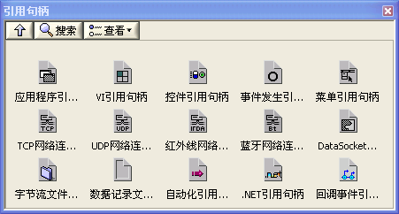

On the block diagram, reference-based datatypes are represented by thin, dark green wires. For example, the semaphore reference we used in [Global Variables](pattern_global_data#using-semaphores-to-avoid-data-race-conditions) is a typical refnum. In the diagram below, the thin green wires passing between the subVIs carry the semaphore reference:

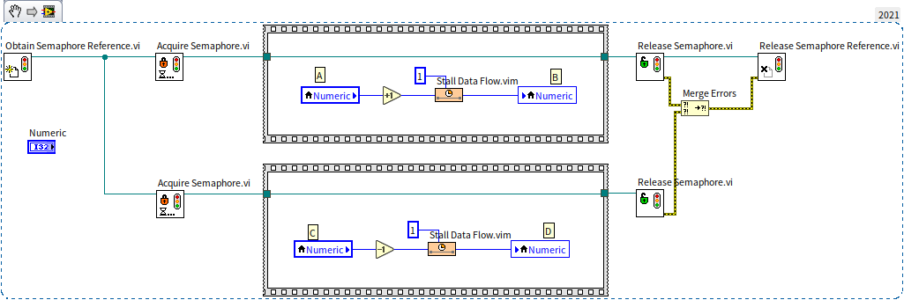

In addition to the Refnum palette, LabVIEW includes other datatypes that act as reference types, even though their wire colors differ. These include hardware session handles (such as VISA resource names, IVI logical names), notifications, user events, and queues.

Many reference types do not have dedicated controls on the palette. For example, as shown in [Event Structure](pattern_ui#dynamic-events-1), references to front panel objects like panes, splitters, or Boolean controls must be created dynamically. To create a control for these references, you must first generate the reference from an object, then right-click its output terminal and select **Create -> Control**. Here is an example of these custom reference controls:

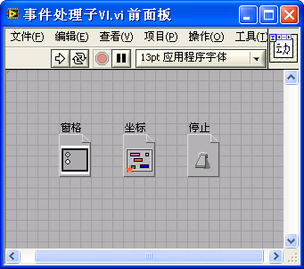

A reference is simply a 4-byte pointer to a target object. The program interacts with the underlying object, not the 4-byte refnum. The type of a reference determines what kind of object it points to—such as files, instruments, VIs, or controls.

On the block diagram, only the 4-byte reference value flows along the data wire, while the target object remains anchored in memory. If the reference points to a massive array or database, passing the 4-byte refnum is extremely fast and memory-efficient. When a reference wire splits on the block diagram, LabVIEW only copies the 4-byte pointer, not the target object itself. Both branches point to the same shared object, allowing parallel processes to read and write to it.


## Global Variables

In addition to LabVIEW's built-in reference types, you can implement pass-by-reference using custom data containers.

Global (and local) variables are the simplest way to implement pass-by-reference. The variable's data is stored in a fixed memory location, which can be accessed from different VIs and threads.

While simple, this method is highly discouraged because it breaks the dataflow model. Data wires are critical for understanding LabVIEW code, as they define the sequence of execution, data transfer, and processing. Losing this visual structure makes it hard to see where data originates or where it is modified, reducing code readability and maintainability.

Therefore, you should always try to use data wires, even when passing data by reference.


## Queues

### Queues as Data Structures

We introduced queues as data structures in [State Machine](pattern_state_machine#multi-state-transitions). A queue is a linear data structure that stores elements of the same type. It functions like a ticket queue: elements enter at the back (enqueue) and exit from the front (dequeue), enforcing a **First-In, First-Out (FIFO)** order.

In LabVIEW, a Queue is a unique data container: while other containers like Arrays, Maps, and Sets are value-based, queues are **reference-based**. In the early days of LabVIEW, most programs were simple test sequences that did not require complex data structures. However, because LabVIEW executes code in parallel threads by default, developers needed a way to transfer data between threads safely. NI designed queues as reference-based types to act as thread-safe data pipelines.

Because of this history, queue functions are located in the **Programming -> Synchronization** palette rather than the Data Containers palette:

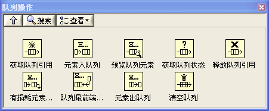

A standard queue is unidirectional (FIFO). A related data structure is the **Stack** (discussed in [State Machine](pattern_state_machine#designing-the-data-structure)), which behaves like a gun magazine: bullets loaded last are fired first, enforcing a **Last-In, First-Out (LIFO)** order.

A double-ended queue (deque) allows adding and removing elements from both ends. LabVIEW's queue is semi-double-ended: while elements can only be removed from the front, they can be inserted at either the front or the back. This flexibility allows you to use a LabVIEW queue as a stack when needed.


### Queues for Data Transfer Between Threads

In addition to storing data, queues are the primary mechanism for exchanging data between concurrent threads. A common architecture in LabVIEW test programs uses two loops running in parallel: one loop for high-speed data acquisition and another loop for data analysis, logging, and display. This requires a thread-safe buffer to transfer samples between loops.

Let's look at a sequential data acquisition and analysis program:

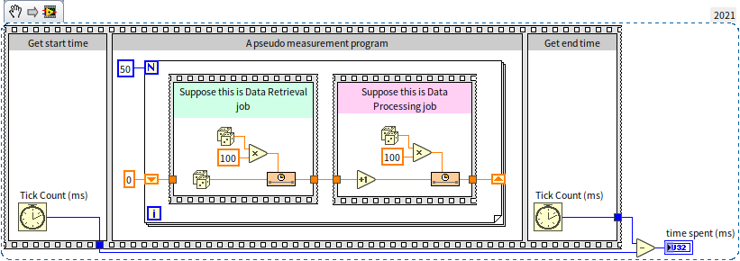

This program uses a Flat Sequence Structure to measure execution time. Frame 0 records the starting timestamp, frame 1 executes the loop, and frame 2 records the ending timestamp. The difference determines the execution time.

Inside the loop (which runs 50 times), a virtual acquisition block (green) generates a random number and delays for 0-100 ms to simulate hardware capture. Then, a processing block (red) simulates analysis, delaying for 0-100 ms.

Because acquisition and processing run sequentially, each iteration takes 0-200 ms (averaging 100 ms), resulting in a total run time of about 5 seconds. We can improve this by running them in parallel threads:

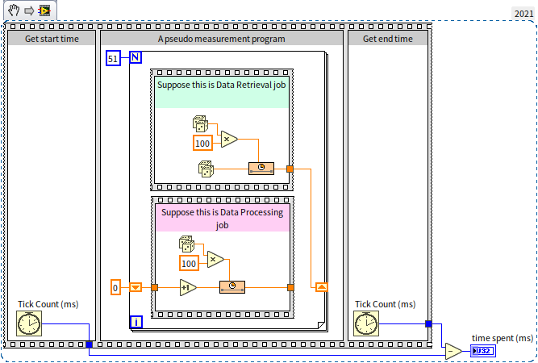

Here, we arrange the blocks vertically and remove the direct wire between them to allow parallel execution. The processing block reads data from a shift register stored in the previous iteration. This creates a pipeline: while the acquisition block captures dataset $i$, the processing block analyzes dataset $i-1$. 

This pipeline reduces the execution time to around 3.5 seconds (a 30% improvement). However, it is still sub-optimal. If the acquisition block finishes its step quickly but the processing block is still busy, the acquisition loop must wait. 

We can optimize this further by letting the acquisition loop run ahead and store samples in a buffer. The processing loop can then retrieve and process them at its own pace. A queue is the perfect buffer for this:

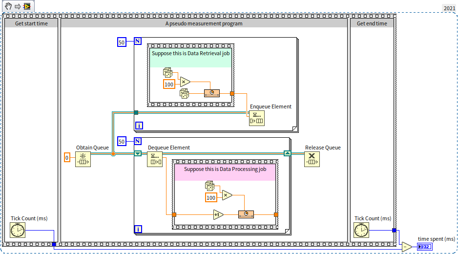

The program creates a queue using `Obtain Queue` and passes its reference to both loops. The acquisition loop enqueues elements as they are generated. The processing loop dequeues elements. If the queue is empty, `Dequeue Element` halts the loop and waits until the acquisition loop adds a new element. Finally, `Release Queue` destroys the queue. This optimized program runs in under 3 seconds.

This architecture is called the **Producer-Consumer** design pattern: one loop produces data, and the other consumes it.


### Queue Naming

When creating a queue using `Obtain Queue`, you can assign it a string name. Queue names are globally unique. If a subVI calls `Obtain Queue` with a name that already exists in memory, LabVIEW does not create a new queue; instead, it returns a reference to the existing queue.

This allows disconnected block diagrams to share the same queue, as shown below:

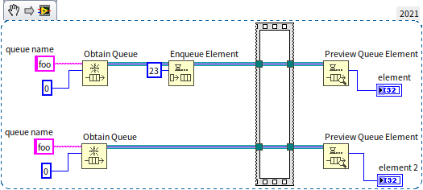

`Preview Queue Element` inspects the front element of the queue without removing it. Because both threads open a queue named `"MyQueue"`, they share the same buffer. The empty sequence structure synchronizes the threads, ensuring the lower thread previews the element only after the upper thread enqueues `23`. Both outputs display `23`.

Every call to `Obtain Queue` should be paired with a `Release Queue` call. LabVIEW tracks references to keep the queue in memory; if a queue is not released, it causes a memory leak. If you set the **force destroy** parameter of `Release Queue` to True, LabVIEW immediately destroys the queue, releasing its memory and invalidating all other references to it in other threads.


### Considerations for Implementing the Producer-Consumer Model

When designing a Producer-Consumer system, you must handle potential exceptions, such as one of the loops crashing or lagging:

- **Lagging Consumer**: If the consumer loop slows down or stalls, the producer will continue enqueuing data, causing the queue to grow and consume memory. If left unchecked, this can crash the application due to out-of-memory errors. You can monitor queue length using `Get Queue Status.vi`.
- **Limiting Queue Size**: You can set a **max queue size** in `Obtain Queue`. If the queue reaches this limit, the enqueue function will block, pausing the producer loop until the consumer removes an element. To prevent the producer from locking up indefinitely, set a **timeout** value (in milliseconds) on the enqueue node. The node will abort and return a True timeout value if the queue remains full:

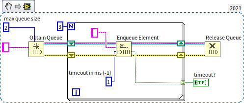

- **Stalled Producer**: If the producer crashes, the consumer will wait indefinitely. You should also configure a timeout on the `Dequeue Element` node so the consumer loop can recover or exit if no data arrives.


### Utilizing Queues as Data References

You can use queues to pass custom datatypes (like clusters) by reference. To do this, create a single-element queue to act as the data container. VIs can then pass the queue refnum to share access to the underlying cluster.

The following code initializes this custom reference structure:

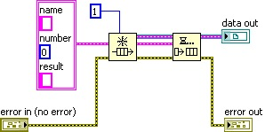

The referenced data is a 3-element cluster. The output `data out` is a refnum pointing to the queue, which acts as a reference to our cluster.

To prevent race conditions when multiple threads access this shared data, we use the queue's blocking behavior:
1. When a VI needs to read or write the data, it calls `Dequeue Element` to extract the cluster, leaving the queue empty.
2. If another thread tries to access the data, its dequeue node will block because the queue is empty.
3. Once the first thread finishes modifying the cluster, it calls `Enqueue Element` to place it back into the queue.
4. The waiting thread now unblocks and retrieves the updated data.

This guarantees mutual exclusion (mutex) without requiring manual semaphores:

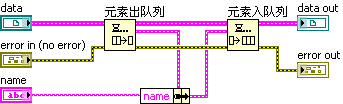

In the program below, both `Set Name.vi` and `Set Number.vi` modify the shared reference. Because they use this dequeue-enqueue locking mechanism, they execute sequentially without data conflict:

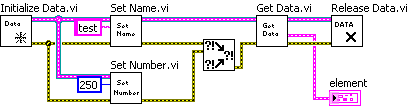

*Note: Since the queue was created dynamically, you must call `Release Queue` at the end of the program to prevent memory leaks.*


### Data Log File Refnum

While using queues as data references is highly efficient, it is an unconventional design pattern. A developer reading the code might be confused by why a "queue" is used to represent a single data record. To improve readability, we can wrap the queue reference in LabVIEW's standard dark green Refnum wire.

We can use a **Data Log File Refnum** to represent custom reference types:
1. Place a **Data Log File Refnum** control on the front panel.
2. Drag an Enumeration control containing a descriptive type name (e.g., `"MyClassRef"`) into the Refnum container:

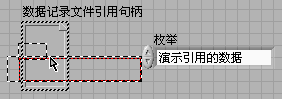
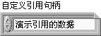

LabVIEW treats Refnums containing different enumerations as distinct datatypes. This enforces **strict type safety**: you cannot cross-wire different custom reference types:

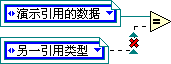

For example, if you have references for `"UserNames"` and `"DeviceIDs"`, type safety prevents you from accidentally wiring a user reference to a VI that expects a device ID.

To implement this, we use the `Type Cast` function to convert the internal queue reference into our custom Refnum type before passing it out of the subVI. When a subVI receives the Refnum, it casts it back to a queue to perform the dequeue-modify-enqueue operations:

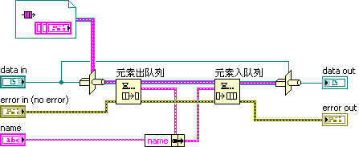


## How Semaphores are Implemented in LabVIEW

Many of LabVIEW's synchronization VIs are open-source. Inspecting them reveals that semaphores are built using these exact queue-based reference techniques.

Let's look at `Obtain Semaphore Reference.vi`:

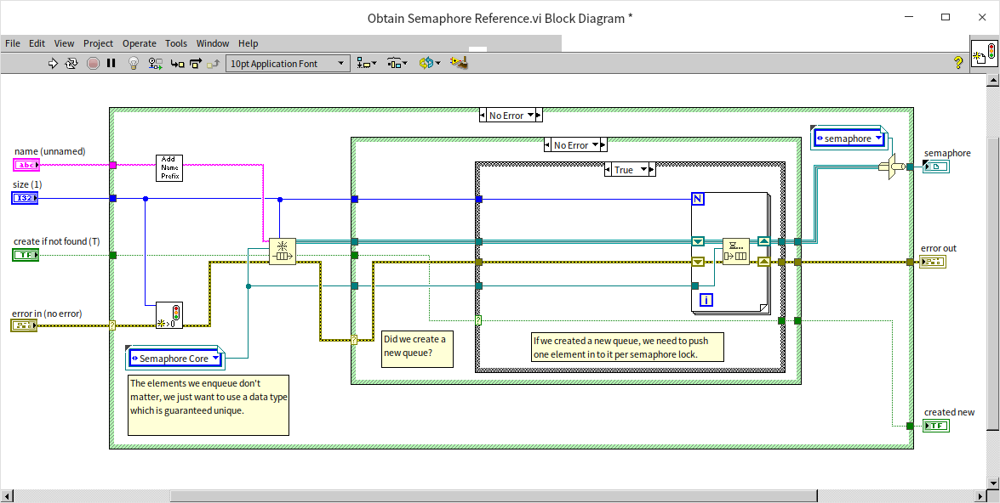

This VI creates a queue, pre-fills it with dummy elements, and casts the queue reference into a Data Log File Refnum (the semaphore handle). The size of the queue represents the semaphore's available resources (usually `1` for mutual exclusion, or more if a resource supports concurrent accesses).

Here is `Acquire Semaphore.vi`:

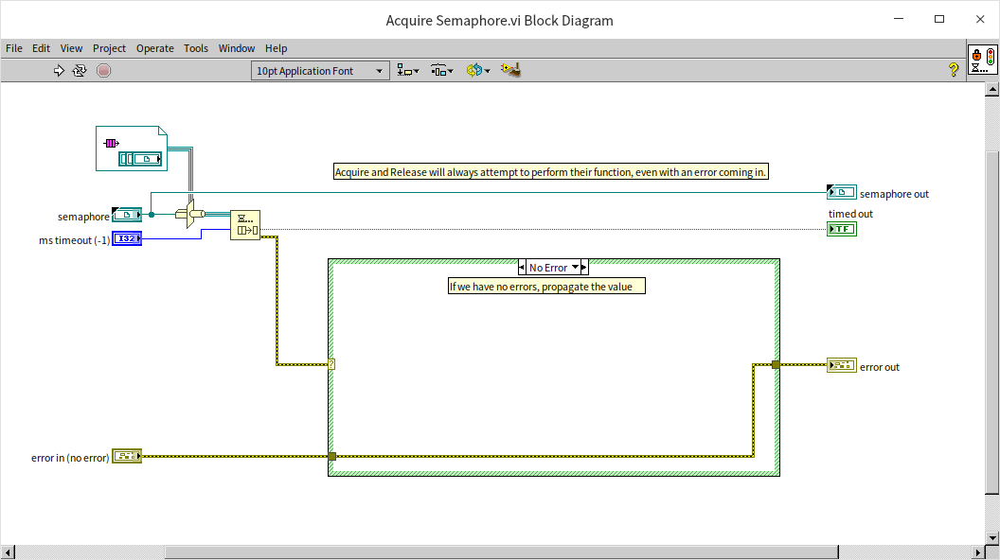

This VI casts the semaphore handle back to a queue and calls `Dequeue Element`. If the queue is empty (all resources are locked), the node blocks and waits.

Here is `Release Semaphore.vi`:

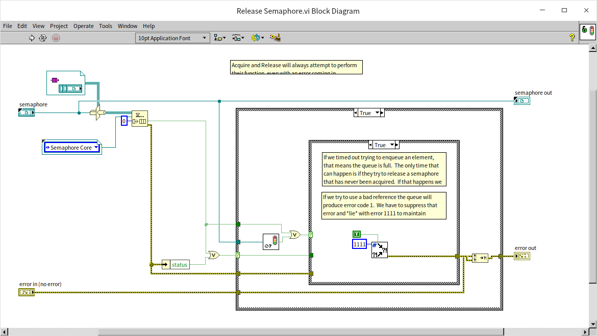

This VI adds a dummy element back to the queue using `Enqueue Element`, unlocking the resource for waiting threads.

Thus, semaphores in LabVIEW are simply wrapped queues: an empty queue indicates a locked semaphore, while a non-empty queue indicates an unlocked one.


## Utilizing C Language for References

You can also pass references by allocating memory in a C/C++ DLL and passing the memory address (pointer) as a U32 integer or custom Refnum inside LabVIEW. This is useful when integrating legacy C code.

The C++ code allocates memory and returns a pointer:

```cpp
int stdcall CreateBuffer ( // Allocate memory and return pointer
  const char data[],       // Data to store
  int size,                // Data size
  char** bufPointer        // Pointer to return the memory address
) {
  char* buffer = new char[size + 4]; // Allocate memory with 4-byte size header
  *((int*) buffer) = size;            // Store size in header
  memcpy(buffer + 4, data, size);     // Store data
  *bufPointer = buffer;               // Output address
  return 0;
}

int stdcall GetBufferData (   // Retrieve data from memory address
  char* bufPointer,           // Data pointer
  char* data                  // Buffer to copy data into
) {
  int size = *((int*) bufPointer);
  memcpy(data, bufPointer + 4, size); // Copy data
  return 0;
}
```

In LabVIEW, we pass the pointer value between VIs. When we need the data, we call the DLL to read it. To make the code safer, we cast the U32 address pointer into a custom Refnum:

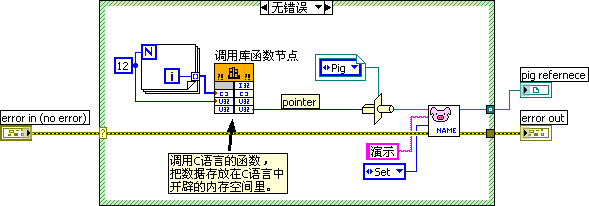

See [Dynamic Link Library](external_call_dll) for details on calling external DLLs.


## Data Value Reference Nodes in LabVIEW

To simplify reference passing, LabVIEW 2009 introduced native **Data Value References (DVRs)**. The nodes are located in **Programming -> Application Control -> Memory Control**:

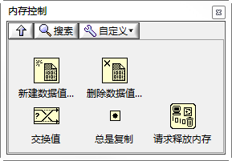

Use `New Data Value Reference` to create a DVR for a variable, and `Delete Data Value Reference` to destroy it and retrieve the data.

For example, we can generate a DBL array reference, pass it to parallel subVIs to modify elements, and then extract the final array:

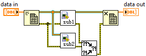

Because most VIs are value-based, modifying a DVR requires converting the reference to data, editing it, and writing it back:

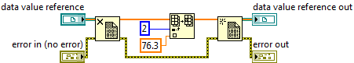

For large arrays, this conversion creates data copies in memory. To prevent this, use the **In Place Element Structure** (`Programming -> Structures -> In Place Element Structure`):

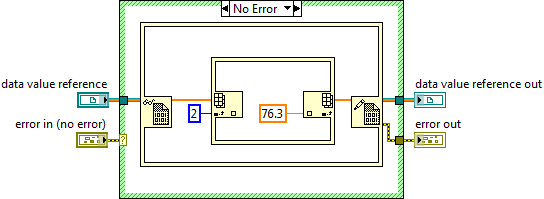

The In Place Element Structure tells the LabVIEW compiler to modify the data directly in its existing memory space, avoiding duplicate copies. See [Memory Optimization](optimization_memory) for details.


## Handling Deadlocks in Reference Passing

To prevent race conditions, the **In Place Element Structure** locks the referenced data during execution. If another thread tries to access the same DVR, it must wait until the structure completes.

For example, this program runs in 1 second because the two structures process different data references:

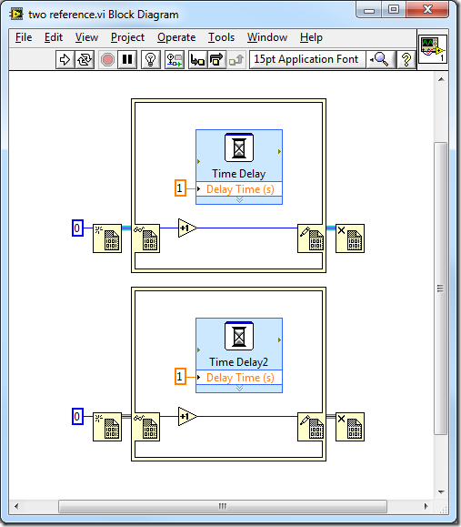

This program takes 2 seconds because both structures access the same data reference, forcing them to run sequentially:

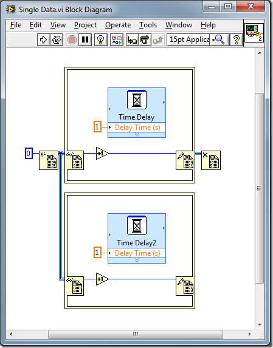

Using locks introduces the risk of **deadlocks**. You must never nest In Place Element Structures for the same DVR:

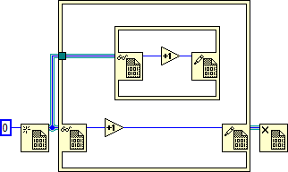

Here, the inner structure blocks and waits for the outer structure to release the DVR. However, the outer structure cannot complete until the inner code executes. This mutual block causes a permanent deadlock.
