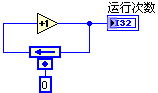
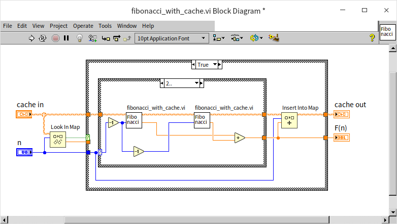
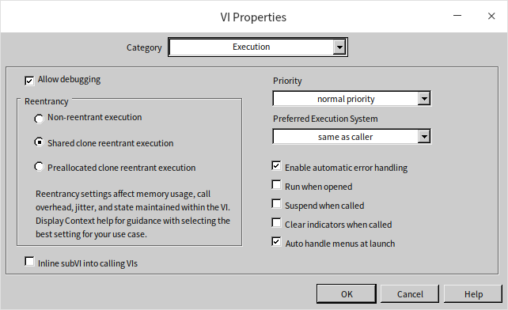

### Reentrant VIs and Recursive Algorithms

## Reentrant VIs

Reentrancy is a specific attribute for sub-VIs. By default, this attribute is not activated in VIs; however, it can be enabled in the VI's property dialog by selecting the “Reentrant execution” option. A VI with reentrancy enabled is known as a reentrant VI.

When a sub-VI is configured as reentrant, each call to this sub-VI from various parts of the program creates a new VI instance in memory. Although the sub-VI's content remains identical across different calls, these instances are independent in memory. In contrast, a non-reentrant sub-VI has only one instance in memory, and all calls access this single instance.

After setting a VI as reentrant, you have two options: “Preallocate clones for each instance” means each instance of the VI created for each call has its distinct data space, ensuring that data between them doesn't overlap. Unless specified otherwise, reentrant VIs mentioned in later chapters of this book refer to this type. “Share clones between instances” is an option introduced in LabVIEW 8.5, where instance VIs share a common data area.

### Parallel Execution of the Same VI

The diagram below demonstrates a VI with two sections in its block diagram, each invoking the same sub-VI, "Simple Calculation.vi". Notably, there are no data wires linking these two sections. Given LabVIEW's inherent support for automatic multi-threading, a pertinent question arises: Can these two instances of the same sub-VI execute concurrently?

In cases where a program employs two distinct sub-VIs, LabVIEW typically runs them in parallel, each on a separate thread. However, the scenario changes when the same sub-VI is called from multiple locations. The concurrent execution depends on the sub-VI’s configuration. If "Simple Calculation.vi" is not set to be reentrant, they will not run simultaneously. LabVIEW is designed to fully execute one instance before initiating the other.

A non-reentrant sub-VI is unique in memory, maintaining a single set of code and data. Concurrent calls to this sub-VI, especially with varying operational data, could result in internal confusion regarding its state and data management. LabVIEW, therefore, restricts simultaneous execution to prevent such conflicts.

This design feature can be beneficial. Consider a sub-VI designed to manage the file “foo.txt”. If it's called from various points in an application, allowing parallel access could lead to data inconsistencies. For example, if one thread writes data "22" to the file and another thread immediately replaces it with "33", the file's content could become unreliable. By preventing the same sub-VI from running in parallel threads, LabVIEW safeguards against such concurrent access issues.

In summary, while LabVIEW supports parallel execution, the nature of a sub-VI’s configuration plays a critical role in determining if it can run concurrently when called from multiple points within a VI.

This feature, however, can present challenges in certain scenarios. Consider a sub-VI designed for file operations, such as reading and writing various files. Ideally, different files should be accessible concurrently. Yet, if this sub-VI is not reentrant, it restricts the application to sequential file operations. This means that if multiple files need simultaneous access, they must be processed one after another, leading to potential bottlenecks and inefficiency.

To circumvent this limitation, setting the sub-VI as reentrant enables concurrent executions in separate threads. Essentially, while one thread is engaged with this sub-VI, another can invoke it simultaneously. In LabVIEW, this scenario can be visualized as data flowing into the same sub-VI from different parts of the block diagram at the same time, hence the term “reentrant.” Each invocation of a reentrant sub-VI creates a distinct instance in the application, similar to having multiple unique sub-VIs with identical internal code. These instances can operate independently and concurrently.

Consider the following block diagram, showcasing a delay sub-VI:

This sub-VI, upon activation and in the absence of errors, introduces a pause of 1 second before resuming the program flow.

Now, observe this application diagram where the delay sub-VI is called twice, in parallel:

The total runtime of this application hinges on the reentrancy of the delay sub-VI. If it's non-reentrant, the total execution time extends to 2 seconds due to the sequential processing of each call. Conversely, if the sub-VI is reentrant, both calls can execute concurrently, effectively reducing the total runtime to 1 second.

### Copies of a Reentrant VI

When multiple instances of a reentrant VI share the same copy, they utilize a shared data space. This scenario can lead to complications: different instances may write varying data to this shared space during execution, potentially causing data confusion. To avoid such issues when different instances of a reentrant VI need to operate simultaneously using distinct data sets, it's essential to configure the sub-VI to "Preallocate copies for each instance."

The image below presents a straightforward sub-VI. This VI has a simple functionality: it increases its output data by one each time it's executed:

This VI employs a feedback node, which plays a critical role in its operation. Each time the VI is executed, the feedback node initially provides the data it received from the last run of the VI. The VI then increments this data by one and sends it back to the feedback node, preparing it for the next invocation. The '0' beneath the feedback node indicates its starting value. Upon the first invocation of this sub-VI following the launch of the main program, the feedback node outputs this initial value.

Consider the following diagram, depicting an application that utilizes the "Run Count" sub-VI:

In this setup, the behavior of the "Run Count" sub-VI significantly influences the output. The main program comprises two loops: one executes 10 times, and the other 20 times. Since there's no data connection between these loops, they can run in parallel. Nonetheless, the order of completion for these loops remains indeterminate.

When the "Run Count" sub-VI is non-reentrant, the precise values of “Count 1” and “Count 2” in the main program after each run remain unpredictable. However, it's guaranteed that one of these counts will reach 30. This certainty stems from the fact that the Run Count sub-VI is invoked a total of 30 times across both loops, ensuring the final output value is 30. The ambiguity lies in which loop's VI is the last one called, affecting the final distribution of counts.

In contrast, if the Run Count sub-VI is reentrant and configured to “Preallocate copies for each instance,” the outcomes become predictable. “Count 1” will invariably be 10, and “Count 2” will always be 20. This predictability is due to the reentrant nature of the sub-VI, where each call is treated as a separate entity, akin to invoking two distinct sub-VIs. They operate independently and consistently, with the left VI called 10 times and the right VI 20 times, regardless of the execution order.

However, if the Run Count sub-VI is reentrant but set to “Share copies among instances,” the predictability of the main program's results diminishes again. In this case, the values for “Count 1” and “Count 2” can be any number up to 30. The simultaneous execution of the two sub-VI calls is possible due to their reentrant property. Yet, the shared copy between them introduces potential data confusion. For example, if the left VI is processing with an internal run count of 8, and the right VI concurrently starts and writes the value 3 to the same data area, the left VI will erroneously register a different count.

While the option of “Sharing copies among instances” does create a risk of data confusion, it offers significant memory savings. Each additional copy generated for a sub-VI consumes more memory space. Thus, setting reentrant sub-VIs to “Share copies among instances” can be a memory-efficient strategy, provided there's no risk of data confusion. For beginners, it's advisable to avoid this setting unless the risk is well understood, except in cases like recursive algorithms where it's essential for the sub-VI to “Share copies among instances.”

## Recursive Algorithms

### The Concept of Recursion
Recursion occurs when a Virtual Instrument (VI) calls itself, either directly or indirectly. An example of indirect recursion is when VI_1 calls VI_2, and VI_2, in turn, calls VI_1. If you recall the principle of mathematical induction, recursion in programming can be viewed as a practical application of this concept. Recursive strategy involves breaking down a large, complex problem into smaller, similar problems, and then further decomposing these into even smaller ones until the entire problem is solved. While it's theoretically possible to replace recursive calls with loop structures, recursion can greatly simplify code complexity in certain scenarios. This simplification can reduce programming time and enhance code readability, making understanding and implementing recursion a valuable skill.

### Calculating Factorials

Consider the straightforward example of calculating factorials. The factorial of a positive integer involves multiplying that number by all smaller positive integers. For instance, the factorial of 3 is expressed as `3! = 3*2*1`, and similarly, `6! = 6*5*4*3*2*1`. A loop structure can be used to calculate the factorial of a number `n` by multiplying all positive integers less than or equal to `n`:

However, there's an alternative approach to factorial calculation: using induction. Instead of direct computation from the original number, we simplify the problem gradually. For example, to calculate 6!, we first compute 5! and then multiply the result by 6. This is represented by the formula `0! = 1, n! = n * (n-1)! | (n≥1)`, or as a function: `F(0) = 1, F(n) = n * F(n-1) | (n≥1)`. It's crucial in mathematical induction to have a base case; for factorials, the base case is 0, defined as 0! = 1. It's interesting to note that while the direct calculation method only applies to positive integers, the inductive method extends factorials to all non-negative integers.

Let's translate this inductive formula into a program. We start by creating a new VI and setting its reentrant property to “Share copies among instances” (Shared clone reentrant execution). The program first addresses the base case: when the input is 0, the output is 1:

For inputs greater than or equal to 1, the VI recursively calls itself with the input value decreased by 1. The output of the sub-VI is then multiplied by the input value to produce the final result:

### Calculating the Fibonacci Sequence

While the factorial problem is relatively straightforward, it doesn't entirely showcase the full potential of recursion. A more complex example to consider is the Fibonacci sequence. This sequence was first used by the Italian mathematician Fibonacci to model the growth of a rabbit population:
- Initially, there is one pair of newborn rabbits at the start of the first month.
- From the second month onward (beginning in the third month), they are capable of reproduction.
- Each month, every mature pair of rabbits gives birth to a new pair.
- The rabbits are assumed to never die.

The total number of rabbit pairs each month can be succinctly described using mathematical induction:
- `F(0) = 0`
- `F(1) = 1`
- `F(n) = F(n-1) + F(n-2)   | (n≥2)`

This formula for the Fibonacci sequence is not only straightforward but also ideal for recursive algorithmic solutions. The first step involves writing the base cases, which also serve as the recursion's termination conditions. When the input is either 0 or 1, the output will be 0 and 1, respectively:

For input values of \( n \) greater than or equal to 2, the VI recursively calls itself twice: once with \( n-1 \) and then with \( n-2 \). The final output is the sum of the results from these two sub-VI calls:

### An Efficiency Issue in Recursive

Readers are encouraged to test the program with input values not exceeding 20 to verify its accuracy. However, it's important to avoid using very large input numbers. The VI previously described is functionally correct but suffers from a significant efficiency problem with inputs greater than 20, leading to extremely long processing times. To understand why, let's examine how the program operates with an input value of 20, where it splits into two distinct paths:
- The first path computes the 19th Fibonacci number, which in turn splits to calculate the 18th Fibonacci number, and so forth;
- Meanwhile, the second path also calculates the 18th Fibonacci number – a computation that has already been carried out in the first path, resulting in redundant processing.

This pattern of calls can be visualized as a binary tree:

In this algorithm, the amount of computation required roughly doubles with each increment of the input value. This leads to an exponential relationship between the computational load and the size of the input data, giving it a time complexity of $O(2^n)$. This scenario is a typical efficiency issue in recursive programming: the same computation is redundantly executed multiple times in different parts of the program.

In the following discussion, we'll explore various strategies to mitigate this efficiency problem.

### Recursive Computation with Caching

The inefficiency in recursive computation, often due to repetitive calculations, can be effectively addressed with a straightforward solution: caching the results. If a calculation is encountered again, the program can simply retrieve the previously stored result instead of recalculating it. This approach involves implementing a cache within the program. Each time the recursive function is invoked, it first checks if the result for the intended computation already exists in the cache. If found, the result is pulled directly from the cache; if not, the calculation is performed and its result is stored in the cache for future use. This preemptive checking avoids unnecessary repetition of calculations.

The cache can be built using various data structures. For calculating the Fibonacci sequence, which requires computations for every integer starting from 0, an array is an ideal form of cache. In this setup, an array's indices represent the input values for each computational step, while the array elements store the results. However, recursive algorithm inputs are not always consecutive integers. In such cases, a more universal caching solution is to use a [Map data structure](pattern_algorithm#map). In different programming languages and contexts, this might be referred to as associative arrays, dictionaries, hash tables, or lookup trees. These structures all involve storing data as key-value pairs, where users can quickly retrieve a 'value' using a corresponding 'key.' When employing a Map for caching, the program's input data serves as the 'key,' and the resulting computation as the 'value.'

Below is an illustration of a Fibonacci number computation program enhanced with caching:

This version operates much like the basic recursive algorithm without caching. The primary difference lies in the initial step: before starting the actual computation, the program uses the “Look In Map” function to check if the required data is already cached. If it is, the cached result is used immediately. If the result is not in the cache, the program performs the recursive calculation and then employs the “Insert Into Map” function to store the new result in the cache.

Thanks to this improvement in efficiency, the program is now capable of calculating larger Fibonacci numbers. Given the potential size of these numbers, the data type for the results has been changed to a double-precision real number to accommodate larger values, even though the result is still, in essence, an integer.

### Avoiding Redundancy

Another method to boost efficiency in recursive algorithms is to ensure that each step only involves one recursive call to the function, effectively preventing redundant calculations. Here's how it works: when calculating the `n`th step, the results of the `n-1`th and `n-2`th steps are added together. However, the `n-2`th result has already been utilized in the calculation of the `n-1`th step. This means each result is used in two subsequent calculations, so it's efficient to pass this result forward as an output for the next two operations.

In this approach, the program has two inputs, `a` and `b`, representing the outcomes of the two preceding computations. When the input `n` is 0, marking the recursion's endpoint, the value of `b` is returned:

For inputs `n` greater than or equal to 1, the program makes a recursive call to itself. It passes `n-1` as the new `n` value, `a+b` as the new `a` value, and `a` as the new `b` value for the sub-VI:

This method enhances computational efficiency by streamlining the recursive process. The trade-off, however, is that the algorithm doesn't align as directly with the mathematical induction principle of the Fibonacci sequence, which may make it less intuitive. Programmers often face the challenge of balancing between a program's efficiency and its readability.

:::info

#### Calculating Fibonacci Numbers: Beyond Recursion

This section used Fibonacci numbers as an example to illustrate recursive algorithms. However, it's worth noting that recursion isn't the only way to calculate Fibonacci numbers. An alternative method is to use a loop: to determine the `n`th Fibonacci number, start by calculating the 0th Fibonacci number, then the 1st, the 2nd, and so on, iterating `n` times until reaching the `n`th number. The most efficient approach, though, employs the direct Fibonacci formula:

$F(n) = \frac{{\varphi^n - (1 - \varphi)^n}}{{\sqrt{5}}}$, where $\varphi$ represents the golden ratio, with a value of $\frac{{1 + \sqrt{5}}}{{2}}$.

:::

:::info

#### The Fascinating Case of 1/89

Since Fibonacci numbers are the topic at hand, let's delve into an interesting related fact. The number 89 is the twelfth Fibonacci number, and intriguingly, its reciprocal, 1/89, has a special relationship with the Fibonacci sequence. When expressed as a decimal, its fractional part corresponds precisely to the Fibonacci sequence:

1/89 = 0.011235....

Is this just a coincidence, or is there a genuine connection between the two? Those curious might find it rewarding to investigate this further.

:::

### Steps for Writing Recursive Programs

The following steps can be distilled from the given examples to guide the writing of recursive algorithms:
1. Determine a clear termination condition for the recursion, similar to the base case in mathematical induction. If the termination conditions for recursive calls are not set correctly, it could lead to infinite loops or even cause the program to crash.
2. Start with a conditional structure in the VI that checks whether the current input meets the recursion's termination condition. If it does, return the result defined by the base condition.
3. If the input doesn't satisfy the termination condition, find a way to break down the problem into smaller or simpler related problems. Then, use these smaller or simpler inputs to recursively call the algorithm VI itself and obtain results for these sub-problems.
4. Combine the results of these sub-problems to arrive at the solution for the current problem.

There are several considerations to keep in mind when deciding whether to use a recursive algorithm:
- Recursive algorithms can make solving certain problems much more straightforward, often offering better readability than non-recursive algorithms.
- Team members who are not experienced in recursive programming might find the code difficult to comprehend.
- Any situation that calls for a recursive algorithm can also be addressed with a loop structure. Generally, recursive algorithms are less efficient in terms of execution than loop algorithms.
- VIs involved in recursive calls must be set as reentrant, specifically with the “Share clones between instances” (Shared clone reentrant execution) option. This setting can be found on the “Execution” page of the VI properties dialog:

### Indirect Recursive Calls

Indirect recursive calls occur when two or more Virtual Instruments (VIs) call each other. For instance, take two VIs named foo.vi and bar.vi. If foo.vi calls bar.vi and bar.vi subsequently calls foo.vi, they establish an indirect recursive connection.

Previously, in the [Using State Machines](pattern_state_machine#effective-use-of-state-machines) section, we discussed a method for parsing arithmetic expressions, like computing `1+2*3-4/5`. Let's delve into how recursive methods can tackle this problem. To keep the example manageable, we'll simplify the scenario:

- The input is a string composed solely of numbers (0-9) and the four basic arithmetic operators (`+-*/`). The expression must be well-formatted, devoid of spaces or additional symbols.
- All numbers in the input are positive integers. However, due to division, the results could be real numbers.
- The operators include addition, subtraction, multiplication, and division, with multiplication and division having higher precedence than addition and subtraction.
- Parentheses are allowed and take precedence over all other operators.
- For demonstration purposes, advanced string processing functions like search and find are not used. When converting from string to number, only one character is processed at a time.

Analyzing this problem, we see that each arithmetic expression can be decomposed into an operator and two sub-expressions. For instance, the expression `1+2*3-4/5` can be divided into the operator `+` and two sub-expressions: `1` and `2*3-4/5`. When parentheses are involved, their contents can be considered a separate sub-expression. Since the same algorithm can be applied to calculate both the overall expression and its sub-expressions, a recursive algorithm is appropriate. A set of VIs is developed to manage the basic operations. The data for these operations is derived by recursively calling the same set of VIs, which then compute the sub-expressions on either side of each operator.

Given the intricate nature of the task, we developed several subordinate VIs. Recognizing that different operators in the expression have varying levels of priority, we allocated each VI to handle a specific tier of operators.

The initial VI we created, named process_add_sub.vi, is tasked with performing addition and subtraction. Here's the block diagram of this VI:

At the core of this VI is a loop that identifies all instances of the `+` and `-` operators within the current expression at a specific level, subsequently dividing the expression into several sub-expressions. It then invokes process_mul_div.vi to determine the value of each sub-expression. Following this, the program either adds or subtracts these sub-expression values, depending on the operative operator, to produce the final outcome.

The process_mul_div.vi is responsible for addressing multiplication and division. Its structure mirrors that of process_add_sub.vi quite closely. Utilizing `*` and `/` operators, it segments the expression into sub-expressions, then calls upon process_number.vi to calculate the value for each of these sub-expressions, eventually multiplying or dividing the resultant figures.

The process_number.vi focuses on handling numerical values and parentheses. While these are distinct tasks and could have been separated into different sub-VIs, for the sake of this example, we combined them into a single VI. Below is the block diagram of process_number.vi, illustrating how it processes numerical data. It sequentially reads each character in the expression; when encountering a numeral, it integrates it into the ongoing calculation:

The subsequent diagram illustrates the approach to managing parentheses. It treats the content within a pair of parentheses as an individual sub-expression, summoning the previously mentioned process_add_sub.vi to compute its value, thereby establishing an indirect recursive call:

The process_add_sub.vi can act as the primary entry point for the program. Alternatively, a separate demo.vi could also be crafted for demonstration purposes:

## Data Space Considerations

### Why Standard VIs Can't Be Used for Recursive Calls

LabVIEW's approach to recursion is quite unique compared to most other programming languages. Typically, languages that support recursion don't require any special setup for functions to be recursively callable. However, in LabVIEW, standard VIs (non-reentrant VIs) cannot implement recursion through static calling methods. In simpler terms, a VI cannot serve as its own sub-VI.

In many programming languages, each function call is allocated a separate data space for use by the sub-function. For a non-reentrant sub-VI in LabVIEW, each call accesses data from the same area, a design choice aimed at efficiency. Due to this configuration, a single sub-VI can only run once at any particular time. This is essential for data integrity in multi-threaded contexts within LabVIEW. If multiple threads were to simultaneously read and write to the same memory space, unpredictable errors might occur. For instance, if Thread A writes a value of 5.0 to memory and then reads it back, it expects to retrieve 5.0. However, in a multi-thread scenario, Thread B might write a different value, like 7.0, to that memory address immediately after Thread A's write operation, causing Thread A to read the incorrect value. These complexities of multi-threading and memory management in LabVIEW are further explored in the chapters on [LabVIEW's Operational Mechanisms](optimization_mechanism) and [Multi-threaded Programming](optimization_multi_thread).

In recursive algorithms, a sub-VI is often called again before the completion of its previous call. Therefore, non-reentrant sub-VIs aren't suitable for recursive applications. Even a reentrant VI configured to “Preallocate clones for each instance” isn't ideal for recursion. When statically calling such a reentrant sub-VI, LabVIEW places its data space within the parent VI that calls it, meaning the data space is allocated before the program starts running. However, with recursive calls, it's not possible to pre-determine the number of times a sub-VI will be invoked since this number dynamically changes. LabVIEW cannot ascertain how many separate data spaces to prepare, thus making recursive calls unworkable.

### Data Space Allocation Methods

With the release of LabVIEW 8.6, two distinct options for data space allocation became available when setting a VI as reentrant: “Share clones between instances” (Shared clone reentrant execution) and “Preallocate clones for each instance” (Preallocated clone reentrant execution).

Before LabVIEW 8.6, the only available option for reentrant VIs was "Preallocate clones for each instance." This method involves allocating individual data spaces for each instance of a reentrant VI prior to the program's execution, during the compilation phase. For example, if a sub-VI is invoked in three separate locations by a main VI, it would have three separate data spaces allocated. However, this approach comes with a couple of significant drawbacks.

First, it's challenging to predict the number of times a reentrant sub-VI will be called before the program runs, especially in cases involving recursive algorithms. In recursion, each iteration requires creating a new instance of the recursive VI. The depth of the recursion, tied to the input data, is only determinable at runtime, making it impractical to ascertain the necessary number of data space copies in advance.

Second, the "Preallocate clones for each instance" approach can lead to inefficiencies. Imagine a reentrant VI, VI A, that is called at three different points within a main VI, labeled as instances 1, 2, and 3. If the overall program runs for three seconds, with instance 1 running at the 0-second mark, instance 2 at 1 second, and instance 3 at 2 seconds, each data space for VI A is used only momentarily and remains idle for the rest of the time. There's potential for significant memory savings if these data spaces could be reused more efficiently.

To tackle these challenges, LabVIEW introduced an innovative method for allocating data space to reentrant VIs: “Share clones between instances”. This terminology, however, might be somewhat misleading. It could erroneously suggest that a single data space is shared across all instances of a reentrant VI, which would not only be inaccurate but also compromise the functionality of reentrant VIs.

In practice, the “Share clones between instances” approach still allows most reentrant VI instances to have their own independent data spaces. Unlike the pre-allocation method, these spaces are not assigned during the compilation of the program. Data space is instead allocated dynamically at the time a VI instance is executed and is subsequently released once that instance's execution concludes. This means if two instances are invoked in separate VIs, they do not share the same data space. However, if they are called within the same VI, they can indeed utilize the same data space—hence the use of "share" in the naming convention. A term like “Dynamic Space Allocation” might more aptly describe this method.

While “Share clones between instances” does enhance space efficiency, it also comes with its own set of trade-offs. The processes of allocating and then reclaiming data space consume time and additional computing resources, implying a trade-off between time efficiency and space efficiency.

The choice of setting for a reentrant VI should be based on its usage patterns. If the VI is not frequently called within the application, or if its instances tend to run concurrently, then setting it to “Preallocate clones for each instance” is advised. On the other hand, if the VI is called regularly and each instance operates for a brief duration without overlapping, “Share clones between instances” becomes a more suitable option. Specifically for recursive calls, the “Share clones between instances” setting is essential.

### Pros and Cons of Reentrant VIs

On the whole, I have a preference for reentrant VIs and typically set the VIs I develop to be reentrant. The primary advantage of reentrant VIs is their enhanced performance efficiency, as the same VI can operate concurrently across various threads. Furthermore, the output of a reentrant VI is entirely dependent on its input data; a specific input will consistently yield a predictable output. This leads to greater encapsulation and portability, allowing reentrant VIs to be seamlessly integrated into new projects without concerns about differing project environments impacting the VI's behavior.

So, why does LabVIEW default new VIs to non-reentrant? Reentrant VIs come with internal programming requirements. Some VIs, when set to reentrant, may experience data races (a topic we delve into more deeply in the [Global Variables](pattern_global_data) section), which could lead to incorrect outputs. Such issues can pose significant challenges for LabVIEW beginners. Take the "Copies of a Reentrant VI" section, for example, where the “Run Count” sub-VI undergoes 30 parallel calls. Intuitively, users might expect the output to be 30, but if the “Run Count” sub-VI were reentrant, the result might not consistently be 30, potentially leading to confusion.

Which VIs should be set as reentrant, and when do I recommend it? If a VI’s output is determined solely by its inputs, without storing any internal state that could impact the result, then setting it as reentrant is ideal. However, configuring a VI as reentrant can be risky in certain situations unless its functionality is thoroughly understood and verified:
- The VI incorporates any type of [global variable](pattern_global_data).
- The VI utilizes uninitialized [shift registers](data_array).
- The VI employs uninitialized or only initially initialized feedback nodes, like the aforementioned “Run Count” sub-VI.
- The VI involves operations like [file read/write](pattern_file), or interacts with external devices, such as data acquisition hardware.

## Exercise

- Develop a VI that calculates all permutations of an input array using a recursive algorithm. For instance, given the input array [1, 2, 3], the output should be a two-dimensional array, with each row representing a different permutation of these three input values:

[[1,2,3], [1,3,2], [2,1,3], [2,3,1], [3,1,2], [3,2,1]]