# Reentrant VIs and Recursive Algorithms

## Reentrant VIs

Reentrancy is a configuration setting for sub-VIs. By default, VIs in LabVIEW are non-reentrant. You can enable reentrancy in the VI Properties dialog by selecting **Reentrant execution** under the **Execution** category. A VI with this setting enabled is called a reentrant VI.

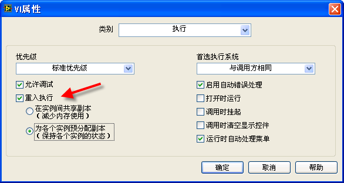

When a sub-VI is configured as reentrant, each call site of the sub-VI in the program allocates its own independent clone instance in memory. Although the sub-VI's code remains identical across all calls, these instances operate with separate data spaces. In contrast, a non-reentrant sub-VI has only a single instance in memory, and all call sites share that single instance.

Once you enable reentrancy, you must choose between two memory allocation settings:
- **Preallocate clones for each instance**: LabVIEW allocates a separate clone instance in memory for each call site on the block diagram at compile time. This ensures that their data spaces never overlap. Unless specified otherwise, reentrant VIs mentioned in later chapters of this book refer to this type.
- **Share clones between instances**: Introduced in LabVIEW 8.5, this option allocates a pool of clone instances at runtime. Call sites dynamically request clones from the pool when execution begins and return them when finished, optimizing memory utilization.

### Parallel Execution of the Same VI

The diagram below shows a VI with two independent sections on its block diagram, both calling the same sub-VI, "Simple Calculation.vi". Because there are no data wires linking these two sections, and because LabVIEW inherently supports automatic multi-threading, you might wonder: Can these two calls to the same sub-VI execute concurrently?

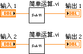

When a program uses two distinct sub-VIs, LabVIEW can run them in parallel on separate threads. However, if the same sub-VI is called from multiple locations, concurrent execution depends on the sub-VI's configuration. If "Simple Calculation.vi" is non-reentrant, the calls cannot run simultaneously. LabVIEW will finish executing one call before starting the other.

A non-reentrant sub-VI exists as a single instance in memory, sharing its data space across all call sites. If parallel threads were allowed to call it concurrently, their input data would overwrite each other, corrupting the internal state and outputs. To prevent such conflicts, LabVIEW serializes access to non-reentrant sub-VIs.

This serialization can be beneficial. For example, if a sub-VI writes to a single resource like a log file "foo.txt", allowing parallel access from multiple threads could corrupt the file's contents (e.g., if one thread's write is interrupted by another). By default, LabVIEW prevents concurrent execution of non-reentrant VIs to safeguard against such resource conflicts.

However, this non-reentrant behavior can cause bottlenecks. Suppose a sub-VI is designed to perform file I/O operations where the filepath is passed as an input. Ideally, the application should be able to read or write different files in parallel. If the sub-VI is non-reentrant, all file I/O operations across the application are forced to run sequentially, leading to unnecessary delays.

To overcome this, you can configure the sub-VI as reentrant. This allows it to run concurrently on separate threads. While one thread is executing the sub-VI, another thread can call it at the same time—hence the term "reentrant". Under the hood, LabVIEW allocates a separate data space (clone) for each call, making them behave as if they were completely separate VIs with identical code, capable of running independently and concurrently.

Consider the following block diagram showcasing a delay sub-VI:

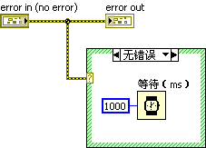

When called, this sub-VI pauses for 1 second (if no error is present) before returning.

Now, consider this application diagram where the delay sub-VI is called twice in parallel:

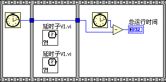

The total runtime depends on whether the delay sub-VI is reentrant. If it is non-reentrant, the total execution time will be 2 seconds because the calls run sequentially. If the sub-VI is reentrant, both calls run in parallel, reducing the total runtime to 1 second.

### Clones of a Reentrant VI

When multiple call sites of a reentrant VI use shared clones, they retrieve clone instances from a common pool. This can lead to issues if the VI maintains internal state (such as via uninitialized shift registers or feedback nodes). A clone run by one call site might later be checked out and run by another call site, carrying over its internal state and causing data corruption. To prevent this when independent state is required, you must configure the VI to **Preallocate clones for each instance** (Preallocated clone reentrant execution).

The image below shows a simple sub-VI that increments its output by one each time it is executed:

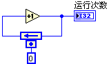

This VI employs a feedback node, which plays a critical role in its operation. Each time the VI runs, the feedback node provides the value from the previous execution. The VI increments this value by one and feeds it back to the node for the next run. The '0' beneath the feedback node indicates its initial value, which is output on the very first execution after the main program launches.

Consider the following diagram of an application that calls this "Run Count" sub-VI:

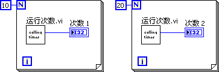

In this setup, the behavior of the "Run Count" sub-VI significantly influences the output. The main program contains two parallel loops: one runs 10 times and the other runs 20 times. Because there is no data connection between them, they run in parallel, and their execution order is indeterminate.

If the "Run Count" sub-VI is non-reentrant:
The exact final values of "Count 1" and "Count 2" are unpredictable. However, because the single instance in memory is called 30 times in total, the final value returned by the last call will always be 30. Which indicator displays which number depends entirely on the order in which the loops execute their final iterations.

If the "Run Count" sub-VI is reentrant with **Preallocate clones for each instance**:
The outputs are completely predictable. "Count 1" will always be 10, and "Count 2" will always be 20. This is because LabVIEW allocates separate clones for each call site. The two loops interact with independent data spaces, acting as two distinct sub-VIs.

If the "Run Count" sub-VI is reentrant with **Share clones between instances**:
The outputs become unpredictable again. The values of "Count 1" and "Count 2" can be any number up to 30. Because they run in parallel, LabVIEW dynamically allocates clone instances from a shared pool. A clone instance initialized and incremented by the first loop might be checked out by the second loop in its next iteration, sharing and corrupting the internal state between the two loops.

Although sharing clones can cause race conditions when VIs maintain state, it offers significant memory savings. Because preallocating clones creates a separate copy for every single call site (even if they never run at the same time), it consumes more memory. Sharing clones allows LabVIEW to maintain a smaller pool of instances. As a best practice, beginners should avoid sharing clones if the VI maintains state (e.g., using shift registers or feedback nodes), except in specific designs like recursive algorithms where sharing clones is required.

## Recursive Algorithms

### The Concept of Recursion

Recursion occurs when a VI calls itself, either directly or indirectly. An example of indirect recursion is when `VI_1` calls `VI_2`, and `VI_2` subsequently calls `VI_1`. In programming, recursion is the practical counterpart to mathematical induction. A recursive strategy solves a complex problem by breaking it down into smaller, similar sub-problems, and recursively solving them until reaching a simple base case. While any recursive algorithm can theoretically be rewritten using iterative loops, recursion can significantly simplify code structure for naturally recursive problems (like tree traversals or divide-and-conquer algorithms), improving readability and maintainability.

### Calculating Factorials

Consider the simple example of calculating factorials. The factorial of a positive integer $n$ (written as $n!$) is the product of all positive integers less than or equal to $n$. For instance, $3! = 3 \times 2 \times 1 = 6$. We can calculate this iteratively using a loop:

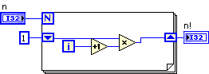

Alternatively, we can define factorials recursively:
- Base case: $0! = 1$
- Recursive case: $n! = n \times (n-1)!$ for $n \ge 1$

This translates to the function $F(0) = 1$ and $F(n) = n \times F(n-1)$.

To implement this recursively in LabVIEW, we create a new VI and configure it for **Shared clone reentrant execution** (VI Properties -> Execution -> Reentrant execution -> Share clones between instances). First, the VI handles the base case: if the input is 0, the output is 1.

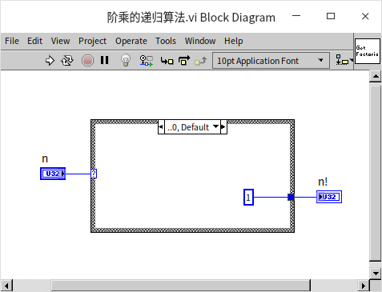

For inputs greater than or equal to 1, the VI decrements the input by 1, calls itself recursively as a sub-VI, and multiplies the result by the original input:

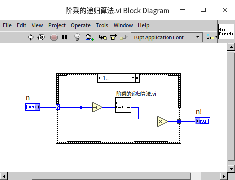

### Calculating the Fibonacci Sequence

A more complex example is the Fibonacci sequence, which models the growth of an idealized rabbit population:
- A single pair of newborn rabbits is placed in a field at the start of month 1.
- Rabbits can mate at the age of one month, so at the end of the second month, a female produces a new pair of rabbits.
- Each pair of rabbits breeds another pair every month from the second month onward.
- Rabbits never die.

The number of pairs in month $n$ can be defined recursively:
- $F(0) = 0$
- $F(1) = 1$
- $F(n) = F(n-1) + F(n-2)$ for $n \ge 2$

We can implement this recursive definition directly in LabVIEW. First, we define the base cases (the termination conditions): if the input is 0 or 1, the VI returns 0 or 1, respectively.

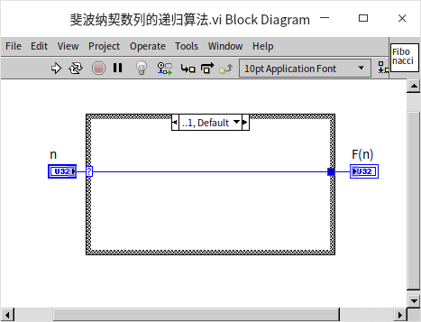

For $n \ge 2$, the VI calls itself twice recursively—once for $n-1$ and once for $n-2$—and returns the sum of the two results:

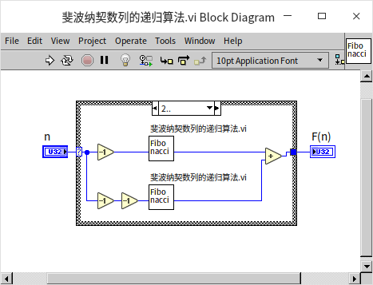

### Efficiency Issues in Recursion

You can test this Fibonacci VI with inputs up to 20 to verify its correctness. However, you should avoid passing larger numbers. Although the algorithm is correct, this naive implementation is highly inefficient and suffers from redundant calculations. For example, to calculate $F(20)$, the program splits into two branches:
- The first branch computes $F(19)$, which in turn computes $F(18)$ and $F(17)$.
- The second branch computes $F(18)$, which repeats the entire calculation already being performed by the first branch.

We can visualize this call pattern as a binary tree:

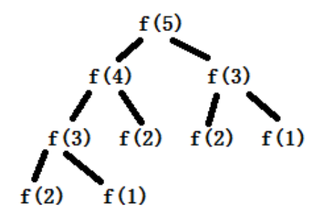

Because the computation roughly doubles with each increment of $n$, the algorithm has an exponential time complexity of $O(2^n)$. The same values are redundantly calculated multiple times across different branches of the recursion tree.

Let's explore how to resolve this efficiency bottleneck.

### Recursive Computation with Caching (Memoization) {#recursive-computation-with-caching}

The redundant calculations in recursion can be eliminated by caching (or memoizing) the results. When the VI computes a value, it stores the result in a cache. Before performing any recursive calls, it checks if the result is already in the cache. If it is, the VI returns the cached value immediately, bypassing the calculation.

For consecutive integer inputs starting at 0, an array can serve as a simple cache. However, for more general inputs, a **Map** is the standard data structure. In LabVIEW, a Map stores key-value pairs (using the input as the key and the computed result as the value), allowing fast lookups.

The figure below shows the recursive Fibonacci VI optimized with a Map cache:

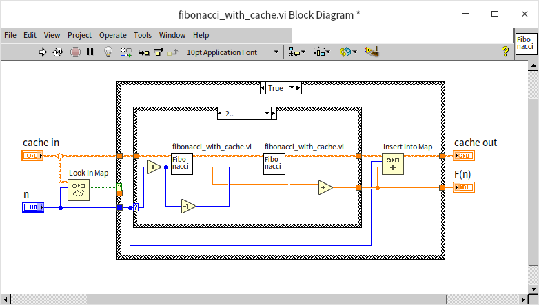

Before starting the computation, the VI uses the **Look Up in Map** function to check if the result for $n$ is already cached. If found, it returns the cached value. If not, it computes the value recursively, uses the **Insert Into Map** function to cache the result, and returns it.

Because of the drastic efficiency improvement, this VI can calculate much larger Fibonacci numbers. The output data type is changed to double-precision float to handle large values without overflow.

### Tail Recursion

Another way to optimize the recursive Fibonacci algorithm is to use a **tail-recursive** approach, passing the intermediate results down the call stack to avoid branching. By passing the two preceding Fibonacci values as parameters, we eliminate redundant computations entirely, reducing the time complexity to $O(n)$.

In this approach, the VI has two accumulator inputs, `a` and `b`, representing the two preceding values. When $n = 0$ (the base case), it returns `b`:

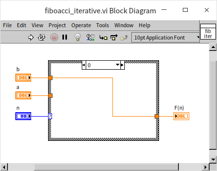

For $n \ge 1$, the VI calls itself recursively, passing $n-1$ as the new input, $a+b$ as the new `a`, and `a` as the new `b`:

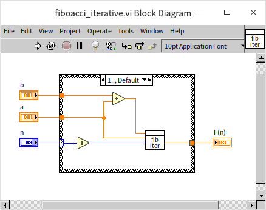

This tail-recursive approach runs in linear time $O(n)$ and is highly efficient. The trade-off is that the block diagram is less intuitive because it doesn't map directly to the standard mathematical definition of the Fibonacci sequence.

:::info
#### Calculating Fibonacci Numbers: Beyond Recursion

While Fibonacci numbers are a classic example of recursion, recursion is not the most efficient way to compute them. An iterative loop starting from 0 and moving up to $n$ is highly efficient and uses minimal memory. Alternatively, you can use Binet's formula to compute any Fibonacci number in $O(1)$ time:

$F(n) = \frac{\varphi^n - (1 - \varphi)^n}{\sqrt{5}}$

where $\varphi$ is the golden ratio: $\varphi = \frac{1 + \sqrt{5}}{2} \approx 1.618$.

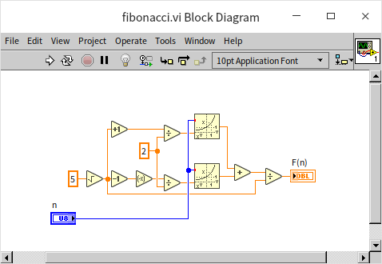
:::

:::info
#### The Fascinating Case of 1/89

The number 89 is the 11th Fibonacci number ($F(11) = 89$, using 0-indexed notation where $F(0)=0, F(1)=1, F(2)=1, F(3)=2 \dots$). Interestingly, its reciprocal $1/89$ generates the Fibonacci sequence in its decimal representation:

$1/89 = 0.011235955 \dots$

Which can be written as the sum of shifted Fibonacci numbers:
$0.01 + 0.001 + 0.0002 + 0.00003 + 0.000005 + 0.0000008 + 0.00000013 + \dots = 0.011235955 \dots$
:::

### Steps for Writing Recursive Programs

When designing recursive algorithms in LabVIEW, follow these steps:
1. **Define a base case (termination condition)**: Ensure there is a clear boundary condition where the VI returns a result directly without recursing. Without this, the VI will run indefinitely, leading to a stack overflow or program crash.
2. **Check the base case first**: Use a Case Structure at the entry point of the VI. If the input meets the base case, return the predefined value.
3. **Decompose and recurse**: If the input does not meet the base case, break the problem into smaller sub-problems. Call the VI recursively (as a sub-VI) with the simplified inputs.
4. **Combine results**: Aggregate the outputs of the recursive calls to compute the final result for the current step.

Keep these design considerations in mind:
- **Readability**: Recursion is highly suited for hierarchical or divide-and-conquer structures, making the code much easier to read and maintain than equivalent iterative algorithms.
- **Complexity**: Developers unfamiliar with recursion might find the code difficult to trace and debug.
- **Performance**: Recursion has call overhead and memory overhead. If performance is critical, rewrite the algorithm iteratively using loops.
- **Reentrancy Requirement**: Any VI called recursively in LabVIEW must be configured for **Shared clone reentrant execution** (found under VI Properties -> Execution). Preallocated reentrancy is incompatible with recursion because LabVIEW cannot statically predict the dynamic call depth at compile time.

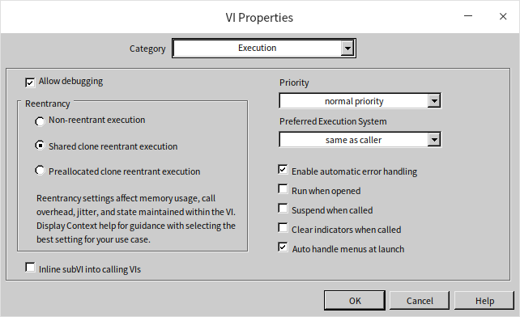

### Mutual Recursion (Indirect Recursion)

Mutual recursion (or indirect recursion) occurs when two or more VIs call each other. For example, if `foo.vi` calls `bar.vi`, and `bar.vi` calls `foo.vi`, they form a mutually recursive loop.

Earlier, in the [Using State Machines](pattern_state_machine#effective-use-of-state-machines) section, we discussed parsing arithmetic expressions (like `1+2*3-4/5`) using a state machine. Mutual recursion provides an elegant alternative known as **recursive descent parsing**.

To keep the parser simple, we assume the following constraints:
- The input string contains only numbers (0-9) and basic arithmetic operators (`+`, `-`, `*`, `/`) with no spaces.
- All numbers in the input are positive integers (though division can yield real numbers).
- Multiplication and division have higher precedence than addition and subtraction.
- Parentheses are supported and have the highest precedence.
- String parsing is done character-by-character without advanced search functions.

Using recursive descent, we decompose the expression based on operator precedence. We create three mutually recursive VIs, each handling a different level of priority:
1. `process_add_sub.vi`: Handles addition and subtraction (lowest precedence).
2. `process_mul_div.vi`: Handles multiplication and division (medium precedence).
3. `process_number.vi`: Handles individual numbers and parentheses (highest precedence).

#### process_add_sub.vi
This VI parses addition and subtraction. It loops through the expression to identify `+` and `-` operators at the current precedence level, dividing the expression into terms. It calls `process_mul_div.vi` to evaluate each term, and then sums or subtracts the results:

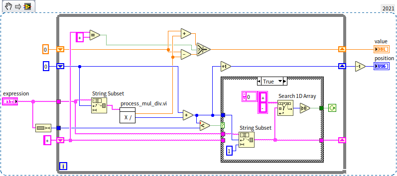

#### process_mul_div.vi
This VI evaluates multiplication and division. It splits terms into factors using `*` and `/` operators, calls `process_number.vi` to evaluate each factor, and multiplies or divides the results:

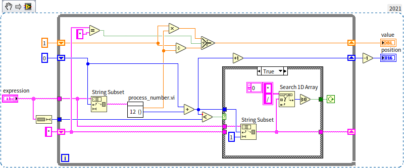

#### process_number.vi
This VI handles numbers and parentheses. When it encounters digits, it compiles them into a number:

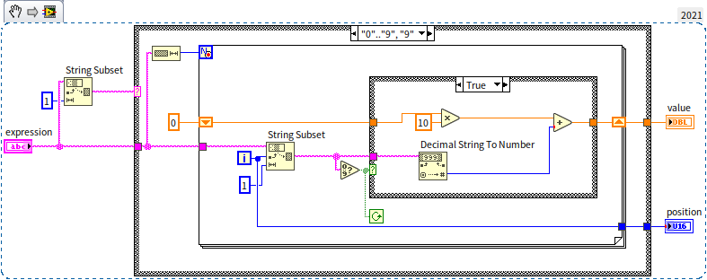

When it encounters a parenthesis `(`, it treats the contents inside as a nested expression and calls `process_add_sub.vi` to evaluate it, completing the mutual recursion loop:

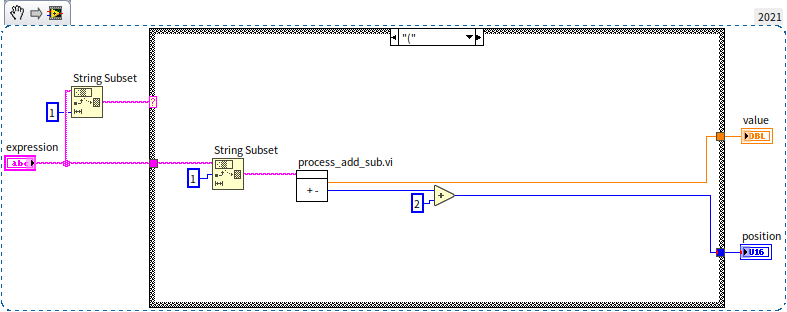

The parser is invoked by calling `process_add_sub.vi` with the full expression string. We can construct a simple `demo.vi` to test it:

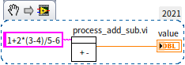

## Data Space Considerations

### Why Standard VIs Cannot Be Used for Recursion

In text-based programming languages, functions support recursion natively because the compiler automatically allocates a new stack frame for each function call. In LabVIEW, standard (non-reentrant) VIs use static memory allocation. Only one copy of the VI's data space exists in memory. Consequently, a VI cannot place a static call to itself on its own block diagram.

This static allocation design exists for performance and thread safety. In LabVIEW's multi-threaded execution model, serializing access to a non-reentrant VI ensures that parallel threads do not overwrite each other's inputs or internal states (such as shift registers). If multiple threads could call a non-reentrant VI concurrently, it would result in severe data corruption. For example, if Thread A writes a value to the VI's controls and begins execution, Thread B could overwrite those inputs before Thread A retrieves the results. For a detailed discussion on memory allocation and thread safety, see [LabVIEW's Operational Mechanisms](optimization_mechanism) and [Multi-threaded Programming](optimization_multi_thread).

Since recursion requires a VI to be invoked again before its previous execution completes, static non-reentrant memory allocation cannot support it.

Even a reentrant VI configured for **Preallocate clones for each instance** cannot be used for recursion. With preallocation, LabVIEW allocates a distinct clone in memory for each call site icon on the block diagram at compile time. Since a recursive call tree expands dynamically at runtime depending on the input data, the compiler cannot predict how many clones to allocate, and the VI will fail to compile.

### Clone Allocation Methods

LabVIEW provides two options for reentrant VI memory allocation: **Preallocate clones for each instance** (Preallocated clone reentrant execution) and **Share clones between instances** (Shared clone reentrant execution).

Before LabVIEW 8.6, only preallocated reentrancy was supported. While it guarantees that each call site has a dedicated memory space, it has two major limitations:
1. **No support for recursion**: Since the call depth is dynamic, static compile-time allocation cannot support recursive paths.
2. **Memory inefficiency**: If a reentrant VI is called at ten different places on a diagram, ten separate memory clones are allocated. Even if these call sites run sequentially and never overlap, their memory remains locked and cannot be reused by other call sites.

To solve these limitations, LabVIEW introduced **Share clones between instances**. With this setting:
- Memory clones are not allocated statically at compile time.
- Instead, LabVIEW creates a dynamic pool of clones at runtime.
- When a call site executes, it checks out an available clone from the pool, runs it, and returns it to the pool upon completion.
- If multiple call sites execute concurrently, they check out separate clones. If they run sequentially, they can share the same clone from the pool.

This dynamic allocation makes shared reentrancy highly memory-efficient. However, it introduces a performance trade-off, as checking clones in and out of the pool adds a small runtime overhead.

### Choosing the Right Reentrancy Setting

Your choice of reentrancy should depend on the VI's design and usage:
- If a VI is called frequently, has a very short execution time, or requires maximum execution speed, use **Preallocate clones for each instance** to avoid pool management overhead.
- If a VI is called at many places but rarely runs concurrently, or if it is recursive, use **Share clones between instances**.

### Pros and Cons of Reentrant VIs

As a general best practice, configuring VIs to be reentrant is highly recommended. Reentrancy enables parallel execution across multiple threads, leading to better performance. Furthermore, reentrant VIs that do not store state are completely stateless, meaning their outputs depend solely on their inputs. This clean encapsulation makes them highly portable and safe to reuse across different projects.

However, LabVIEW defaults new VIs to non-reentrant because reentrancy requires a solid understanding of state management. Configuring a VI as reentrant can introduce race conditions if the VI maintains internal state across calls. 

You should avoid setting a VI as reentrant (or exercise extreme caution) if:
- The VI reads or writes to [global variables](pattern_global_data).
- The VI contains uninitialized [shift registers](data_array).
- The VI contains uninitialized feedback nodes (like the "Run Count" example).
- The VI performs file I/O or interacts with physical hardware (where concurrent access to the resource must be avoided).

## Practice Exercise

- Develop a VI that calculates all permutations of an input array using a recursive algorithm. For instance, given the input array `[1, 2, 3]`, the output should be a two-dimensional array, with each row representing a different permutation of these three input values:

  `[[1,2,3], [1,3,2], [2,1,3], [2,3,1], [3,1,2], [3,2,1]]`

