# State Machine

## Loop with Embedded Case Structure

The loop with an embedded Case Structure is a composite pattern that nests a Case Structure inside a loop (either a For Loop or a While Loop). This is one of the most frequently used patterns in LabVIEW programming.

Suppose you need to develop a test program that executes several test tasks sequentially, such as Task A, Task B, and Task C. The standard sequential approach would look like this:

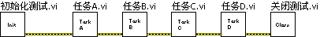

However, if requirements change, a rigid sequential structure lacks the flexibility to adapt. For instance, different products may require different test sequences: Product 1 might need tasks A, B, and C, while Product 2 requires C, B, and A. Writing and maintaining a separate test VI for every product variation quickly becomes a maintenance nightmare.

A much better approach is to pass the desired test sequence dynamically into a loop with an embedded Case Structure:

In a real application, the "Task Queue" would typically be a front panel input control, allowing users to select or import a sequence of tasks dynamically without modifying the code. In this simple illustration, it is represented as a block diagram array constant. The array contains the names of the tasks in their execution order. During each loop iteration, the program extracts one task name from the array, and the Case Structure selects and executes the corresponding case branch.

## Single-State Transition

If your program's logic is more complex—for example, if the next task to run depends on the outcome of the current task—you cannot predetermine the task list. Instead, the next step must be decided dynamically at runtime. You can implement this behavior using the following pattern:

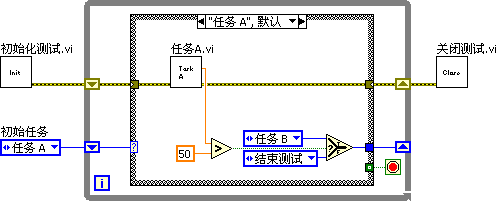

The program starts with a default initial task. After the code inside the Case Structure executes, it evaluates the results and determines the next task. A While Loop is used because the total number of iterations is unknown at compile time. A shift register passes the next state to the loop's next iteration. Additionally, the Case Structure includes an "End Test" case that passes a `True` value to the loop's conditional terminal to stop execution.

This architecture is called a **State Machine**. A state machine consists of a set of discrete states. The program exists in exactly one state at a time and transitions to another state in response to inputs or conditions. In LabVIEW, each case branch of the Case Structure represents a state, and each iteration of the While Loop represents a state execution and transition.

Because state machines are so common, LabVIEW provides a built-in template. You can access it from the LabVIEW startup screen:

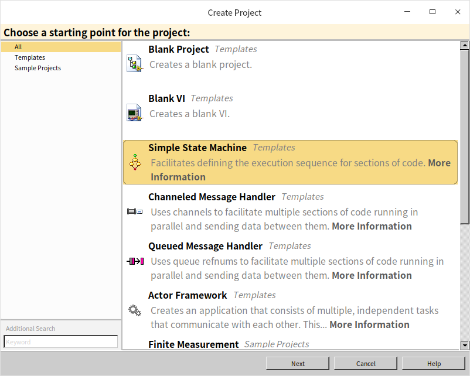

Alternatively, you can create it via **File -> New... -> VI -> From Template -> Frameworks -> Design Patterns -> Standard State Machine**:

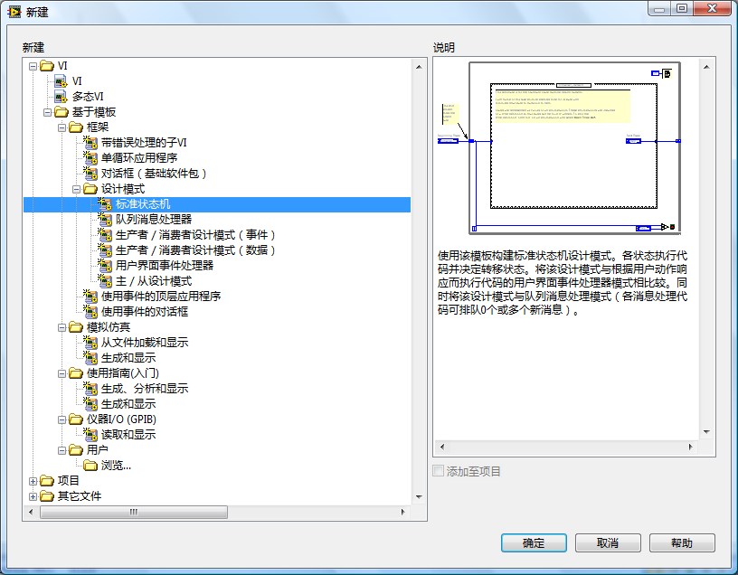

Using this template ensures a standard, readable structure for managing complex, state-dependent logic.

## Multi-State Transitions

In a standard state machine, each state can only determine its immediate successor. However, complex applications may require scheduling multiple future states. This can be achieved by using a queue to hold pending states.

A queue is a First-In, First-Out (FIFO) data structure. In LabVIEW, Queue VIs are located under **Programming -> Synchronization -> Queue Operations**. Although LabVIEW queues are primarily designed for inter-thread communication (as discussed in the [Pass by Reference](pattern_pass_by_ref#queues) section), they can also be used as a state buffer to store and sequence upcoming states.

The figure below shows a queue-based state machine (often called a **Queued State Machine** or QSM, which is a precursor to the standard **Queued Message Handler** pattern):

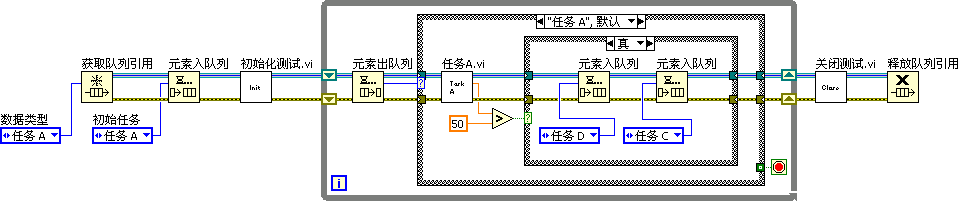

The process begins by creating a queue to hold the states. The initial state is enqueued before entering the loop. In each loop iteration, the next state is dequeued and fed into the Case Structure's selector terminal. At the end of a state execution, the code can enqueue multiple future states, allowing the program to schedule complex multi-step sequences dynamically.

## Effective Use of State Machines

State machines are an excellent way to design and document program execution. A common LabVIEW development workflow is to design a state transition diagram on paper or a whiteboard first, and then translate it directly into LabVIEW code.

However, state machines have two primary limitations:
1. **Readability**: Because a Case Structure (like Event Structures and Stacked Sequence Structures) can only display one case branch at a time on the block diagram, it is difficult to read the entire program's flow at a glance.
2. **Complexity and Scalability**: When an application grows to dozens or hundreds of states, the state diagram becomes spaghetti-like, and a Case Structure with too many branches becomes difficult to maintain. For large applications, you should modularize your states into hierarchical levels. For example, a main manufacturing VI might have high-level states like *Design*, *Production*, and *Testing*. The *Testing* state can then call a SubVI that runs a child state machine with sub-states like *Test Keyboard* and *Test Screen*.

Historically, before LabVIEW introduced Event Structures, state machines were used to poll user interface controls. Today, Event Structures have completely replaced polling state machines for UI programming. The **Event Loop** pattern (discussed in the [Event Structure](pattern_ui) section) is itself a type of state machine, but using Event Structures is much more efficient for UI events.

In computer science, state machines (like Finite State Automata) are widely used for lexical analysis, parsing, and compiler design. In the following section, we will build a parser for arithmetic expressions using a state machine to demonstrate these principles.

### Program Requirements

We will develop a program that evaluates arithmetic expressions presented as a string. To keep the example manageable, we assume the following constraints:
- The input string contains only digits (0-9) and the four basic arithmetic operators (`+`, `-`, `*`, `/`) with no spaces. Any other characters will trigger an error.
- All numbers in the input are positive integers (though division can yield real numbers).
- Multiplication and division have higher precedence than addition and subtraction.
- String parsing must be done character-by-character without advanced search functions.

For example, the input `"1+2*3-4/5-6"` should evaluate to `0.2`.

### Designing the Data Structure

We cannot evaluate the string strictly from left to right because multiplication and division take precedence over addition and subtraction. When we encounter an addition or subtraction operator, we must temporarily store it and its operand until we determine if a higher-precedence operator follows.

For simple precedence rules, this could be handled using shift registers. However, to support general expressions (including parentheses), we need a **Stack** data structure. A stack is a Last-In, First-Out (LIFO) data structure, similar to a physical stack of plates or a bullet magazine: you push elements onto the top and pop them from the top.

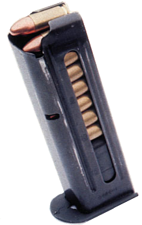

Although LabVIEW does not have a native Stack data type, its Queue implementation is highly flexible. The standard Queue functions allow you to insert elements at either the front or the back of the queue (enqueue/dequeue). By always inserting and retrieving elements from the same side (using **Enqueue Element at Opposite End** and **Dequeue Element**), we can use a LabVIEW queue as a stack.

We will use two stacks: a data stack for operands/results, and an operator stack for operators. The input string itself will be stored in a character queue for sequential reading.

As the program reads characters, it pushes operands and operators onto their stacks. It then evaluates precedence to decide when to pop operands and perform calculations.

### Designing the State Diagram

We can decompose the parsing process into six distinct states:
- **Init**: Checks the next character. If it is a digit, transitions to *Construct Number*. If the queue is empty, transitions to *Calculate*.
- **Construct Number**: Combines consecutive digit characters into a single integer. If the next character is still a digit, remains in this state. If the queue is empty, transitions to *Calculate*. If it is `+` or `-`, transitions to *Check Stack 1*. If it is `*` or `/`, transitions to *Check Stack 2*.
- **Check Stack 1**: Evaluates the operator at the top of the operator stack. If the stack is empty, transitions to *Push*. Otherwise, transitions to *Calculate*.
- **Check Stack 2**: Evaluates the operator at the top of the operator stack. If the stack is empty or contains `+` or `-` (which have lower precedence), transitions to *Push*. If it contains `*` or `/` (same precedence), transitions to *Calculate*.
- **Push**: Pushes the parsed number and current operator onto their respective stacks, then transitions back to *Init*.
- **Calculate**: Pops an operator and two operands, performs the calculation, and pushes the result back onto the data stack. It then determines the next state based on the next operator. If the operator stack is empty, the program terminates.

The state diagram is illustrated below:

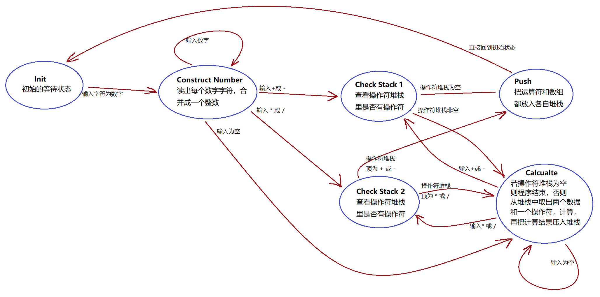

### Programming the Application

First, we create a Type-defined Enumeration (typedef enum) control listing all our state names. Using a typedef ensures that any changes to the state list will propagate automatically throughout the application.

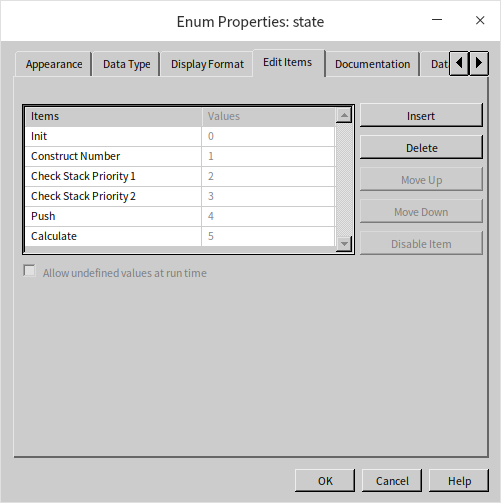

The application uses a standard single-state transition state machine structure, with a While Loop, a Case Structure, and initialization/cleanup code:

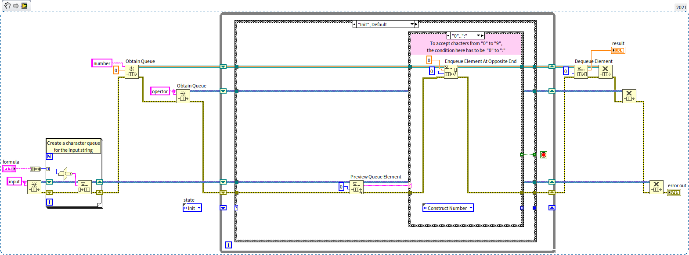

- The sub-loop in the bottom left converts the input string into a character queue.
- The two wires passing through the While Loop's shift registers represent the data stack (top) and operator stack (bottom).
- Each case branch processes its data and outputs the next state.

The image above shows the **Init** state. When it detects a digit, it transitions to **Construct Number** and pushes an initial `0` onto the data stack to initialize the number construction process.

> [!NOTE]
> In older LabVIEW versions, using the range `"0".."9"` in a Case Structure's string selector label does not match the character `"9"` due to ASCII sorting bugs. You must explicitly write `"0".."9", "9"` to handle this case. See [Case Structure with String Inputs](structure_cond_seq#other-data-types) for details.

The **Construct Number** state retrieves the working value from the data stack, multiplies it by 10, adds the new digit value, and pushes the updated value back:

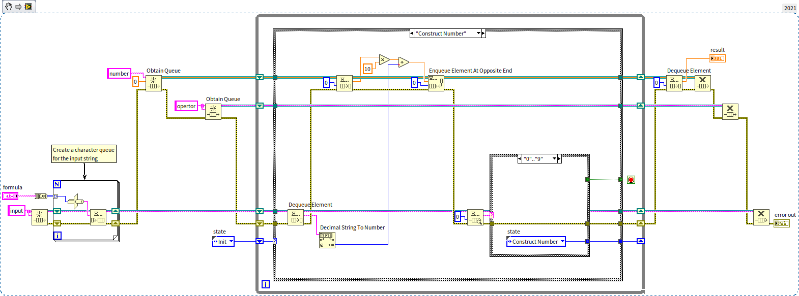

The **Calculate** state pops the operator and the top two operands from the data stack, performs the calculation (e.g., addition in the case below), pushes the result back, and checks the next character to determine the next state:

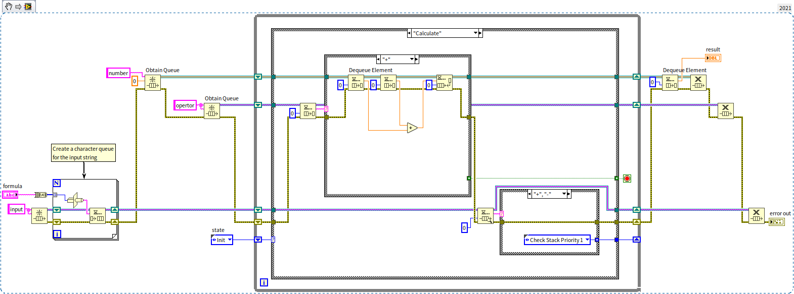

## Practice Exercise

* Create a VI that simulates a traffic light controller using a state machine. The front panel should feature three indicators: Red, Yellow, and Green. The controller should loop through the following sequence:
  1. Green light only (for 5 seconds).
  2. Green light flashing + Yellow light (for 2 seconds).
  3. Yellow light only (for 1 second).
  4. Red light only (for 5 seconds).

