# Event Structure and UI

## Event Structure

The Event Structure is a control flow structure similar in appearance to the [Case Structure](structure_cond_seq). The key difference is their execution trigger: while a Case Structure executes a branch based on an input value, an Event Structure executes a specific event case based on the occurrence of an asynchronous event (such as a mouse click or key press).

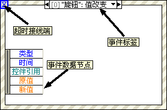

When an event occurs, LabVIEW detects it automatically and routes it to the Event Structure, eliminating the need to wire polling data lines. The event label at the top of the structure indicates the event associated with the active case. The Event Data Node, located on the inner left border of the Event Structure, provides event-specific details, such as the timestamp of the event, a reference to the control that generated the event, or keyboard/mouse coordinates.

## Classifying Events by Source

In LabVIEW, events are categorized into six major sources. You can view and edit these in the **Edit Events** dialog. Each source offers a list of specific events that you can configure.

To set up an Event Structure:
1. Place a few controls on the Front Panel.
2. Add an Event Structure to the Block Diagram.
3. Right-click the border of the Event Structure and select **Add Event Case...** or **Edit Events Handled by This Case...** to open the Edit Events dialog.

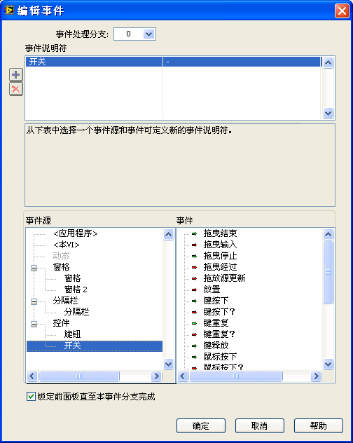

The six event sources are:

### Application Events
Application events represent changes in the overall state of the LabVIEW application. These include events like application shutdown, changes to the Help window state, or timeouts.

The default event case in an Event Structure is the **Timeout** event. By default, the timeout terminal (marked by an hourglass icon at the top left of the structure) is unwired, which means it will never time out. If you wire a value in milliseconds ($n$) to this terminal, the Event Structure will execute the Timeout case if no other events occur within $n$ milliseconds.

For example, the program below executes the Timeout case every 100 milliseconds:

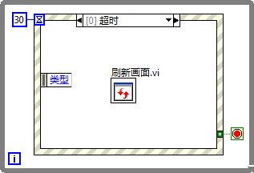

### This VI Events
These events correspond to state changes of the current VI. Examples include resizing the Front Panel window, closing the window, or selecting a custom menu item.

### Dynamic Events
Dynamic events handle events that are registered programmatically at runtime rather than statically at design time. These are discussed in detail in the [Dynamic Events](#dynamic-events-1) section below.

### Pane Events
Pane events relate to user interactions with a specific pane of the Front Panel, such as mouse movement, scrolling, or pane resizing.

By default, a VI's Front Panel consists of a single pane. You can divide the Front Panel into multiple panes using splitter bars. These can be found in the Controls Palette under **Modern -> Layout -> Horizontal (Vertical) Splitter Bar**:

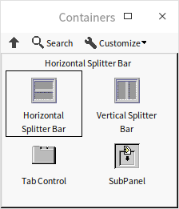

Dragging a splitter bar onto the Front Panel divides it into separate panes. Each pane behaves as an independent container with its own scrollbars and controls:

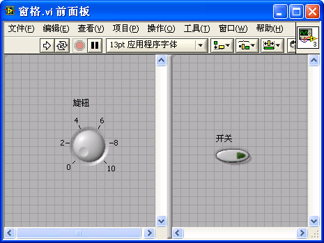

> [!NOTE]
> Right-clicking inside a pane displays the Controls Palette to place new controls. To configure pane properties or display settings, you must right-click on the scrollbar or the splitter bar itself.

### Splitter Events
These events are generated when a user interacts with a splitter bar, such as dragging it to resize panes.

### Control Events
This is the most common event source. It includes events generated by Front Panel controls, such as a user clicking a button or changing the value of a numeric control. The **Value Change** event is the most frequently handled control event.

## Event Editing Process

Unlike Case Structures where you type selector values directly, Event Structures require you to define event specifiers using the **Edit Events** dialog.

Right-click the Event Structure border and select **Add Event Case...** to open the Edit Events dialog:

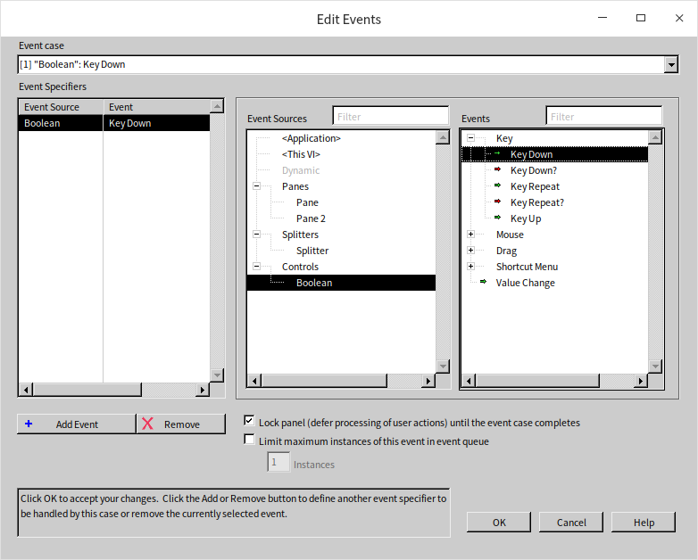

To configure an event case:
1. Select an event source from the **Event Sources** list (e.g., a specific control).
2. Select the event from the **Events** list (e.g., **Value Change**).
3. The selected event will appear in the **Event Specifiers** list.
4. You can click the green plus icon to add multiple events to the same case. This allows a single case to handle value changes from multiple controls.

Sometimes, a single user action can trigger events across multiple hierarchical levels. For instance, clicking a Boolean switch inside a pane triggers events on both the switch control and the pane itself.

LabVIEW propagates events in the following order:
- **Keyboard Events** (e.g., Key Down, Key Up) are only sent to the control that currently has keyboard focus.
- **Mouse Events** (e.g., Mouse Down, Mouse Up) propagate from the outside in. Clicking a Boolean control inside a cluster inside a pane triggers events in this order: Pane -> Tab Control (if any) -> Cluster -> Boolean control.
- **Value Change Events** propagate from the inside out. Changing the value of a Boolean control nested inside a cluster triggers the Boolean control's Value Change event first, followed by the Cluster's Value Change event.

Below is a simple program with a "Stop" button and an Event Structure configured to handle the "Stop" button's **Value Change** event:

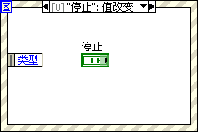

When this VI runs, execution pauses at the Event Structure. Because the Event Structure is only configured to handle the "Stop" button's value change, it ignores all other mouse and keyboard actions. Once the user clicks the "Stop" button, the Event Structure executes the corresponding case, the loop terminates, and the VI stops.

## Notification Events vs. Filter Events

LabVIEW events are classified into two types based on when they execute relative to the user action: **Notification Events** and **Filter Events**.

### Notification Events
Notification events occur *after* LabVIEW has processed the user's action. For example, when a user enters text in a string control, LabVIEW updates the control's value and then generates the **Value Change** notification event. The event case can read the new value and perform post-processing tasks. Notification event names are written in standard text (e.g., `Value Change`).

### Filter Events
Filter events occur *before* LabVIEW processes the user's action. When a user performs an action, LabVIEW halts processing, runs the corresponding filter event case, and decides whether to proceed with the action based on the value passed to the **Ignore?** terminal inside the event case. Filter event names always end with a question mark (e.g., `Key Down?` or `Panel Close?`).

The typical execution sequence for a filter event is:
$$\text{User Action} \rightarrow \text{Filter Event Case Executes} \rightarrow \text{Decision (Ignore?)} \rightarrow \text{Default Action Executes} \rightarrow \text{Notification Event}$$

For example, suppose we want to create a string input control for entering phone numbers that only accepts digits (`0-9`) and hyphens (`-`), rejecting all other keystrokes.

We can implement this behavior using the **Key Down?** filter event:

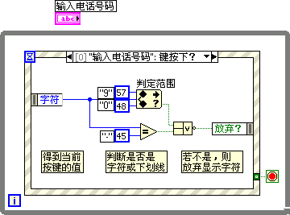

In this event case, the program reads the ASCII character code of the pressed key from the Event Data Node. It checks if the character is a digit or a hyphen. If it is not, it wires a `True` value to the **Ignore?** terminal. LabVIEW will discard the keystroke, and the character will not appear in the string control.

If a VI contains multiple Event Structures, notification events are broadcast to all of them simultaneously. However, filter events are processed sequentially; if the first Event Structure discards the event by setting **Ignore?** to `True`, subsequent Event Structures will not receive it.

> [!WARNING]
> Using multiple Event Structures in a single VI can lead to highly complex, non-deterministic behaviors that make debugging extremely difficult. You should always use a single Event Structure per VI to handle all interface events.

## Using Event Structures

In real-world applications, you need to handle multiple events continuously. To keep the program running and responsive, the Event Structure is typically placed inside a While Loop, creating an **Event Loop**.

An Event Structure is used without a loop only in rare cases, such as a simple dialog box that waits for a single "OK" button click before closing.

Let's look at the continuous running example from the [Keeping a VI Running](ramp_up_complex_vis#implementing-continuous-execution) section:

This program is highly inefficient because it runs the addition and updates the UI indicator every 200 milliseconds, even if the input values have not changed. Increasing the delay would improve CPU efficiency but would make the interface laggy.

A much better approach is to let the VI sleep until an input value changes. We can achieve this using an Event Loop:

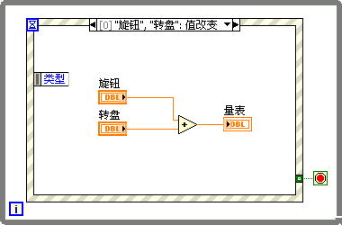

In this program:
- The While Loop starts and enters the Event Structure.
- The Event Structure sleeps, consuming zero CPU cycles, until a user interacts with the controls.
- When the user changes the value of the "Knob" or "Dial", the **Value Change** event case executes instantly, performs the addition, updates the result indicator, and returns `False` to the loop's conditional terminal to keep the loop running.

We also need a case to handle the "Stop" button:

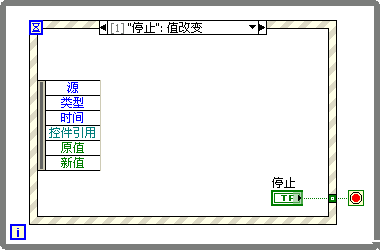

When the "Stop" button's value changes, we wire a `True` constant to the While Loop's conditional terminal to stop the loop and exit the program.

It is critical to place the "Stop" button's control terminal inside the event case that handles its value change. What happens if we place the terminal outside the loop and only wire a `True` constant from the event case, as shown below?

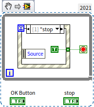

In LabVIEW, Boolean buttons have a **Mechanical Action** setting (see [Boolean Controls](data_number#boolean-controls)). For buttons configured with a **latching** mechanical action (such as *Latch when pressed* or *Latch when released*), LabVIEW resets the control's value back to its default state only after the control's Block Diagram terminal or local variable is read by the execution engine. 

If the terminal is placed outside the loop, it is never read during the loop's execution. As a result, the button will remain stuck in its pressed state, acting like a switch:

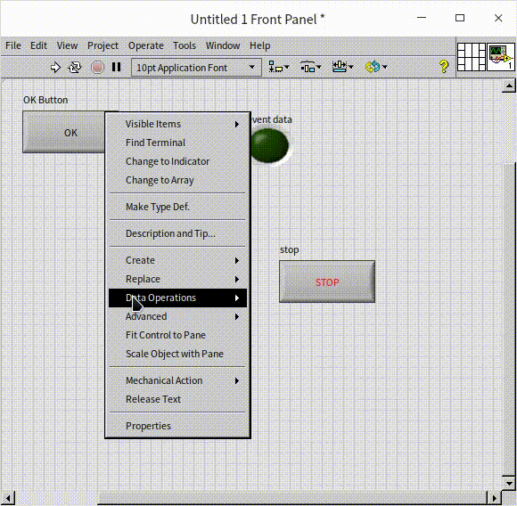

Additionally, latching buttons only trigger a **Value Change** event once when pressed. When they automatically reset back to their default state, they do not trigger a second event. Therefore, in the incorrect implementation below, the value of the `NewVal` event data node remains perpetually `True` after the first press:

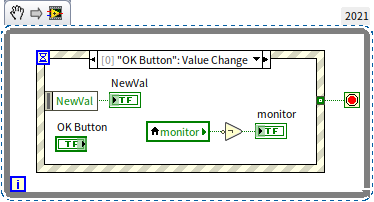

Can we wire the "Stop" button terminal directly to the While Loop's conditional terminal instead of using an event case, as shown below?

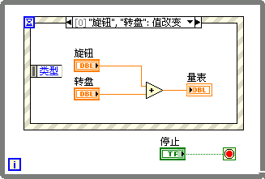

This implementation is incorrect. Because the terminal is outside the Event Structure, the While Loop's conditional terminal cannot be evaluated until the Event Structure completes execution. If the user clicks the "Stop" button while the Event Structure is waiting for an event, the program will remain blocked inside the Event Structure and will not stop. You must handle the "Stop" button's value change inside the Event Structure to exit the loop.

## Dynamic Events

By default, the **Dynamic Events** section in the Edit Events dialog is empty because dynamic events must be registered programmatically at runtime. The VIs for managing dynamic events are located in the Functions Palette under **Programming -> Dialog & User Interface -> Events**:

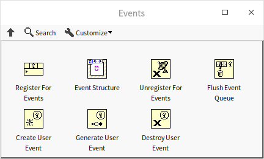

Static events (those added directly in the Edit Events dialog) are limited to controls located on the same block diagram. However, in modular applications that dynamically load SubVIs (see [Loading and Running SubVIs](vi_server_for_subvi)), a SubVI's Event Structure may need to handle events from controls located on a caller VI's Front Panel. Since the SubVI's block diagram does not contain the controls, you cannot select them statically.

LabVIEW solves this problem using **Dynamic Events**. You pass a control reference from the caller VI to the SubVI, register the event programmatically, and route the registration wire to the Event Structure.

To register a dynamic event:
1. Create a control reference on the caller VI (see [Pass by Reference](pattern_pass_by_ref)).
2. Pass the reference to the SubVI.
3. In the SubVI, connect the reference to the **Register For Events** node.
4. Right-click the node input and select the event you want to register (e.g., **Value Change**).
5. Right-click the Event Structure border and select **Show Dynamic Event Terminal**. This adds a dynamic event terminal (marked by a small satellite antenna icon) to the left border.
6. Connect the event registration wire to the dynamic event terminal.

Once registered, the dynamic events will appear under the **Dynamic** category in the Edit Events dialog.

Let's look at an example. We want to design a program where clicking the mouse on the main VI's pane displays the click coordinates, but we want all event handling code to run inside a SubVI.

The main VI's Front Panel:

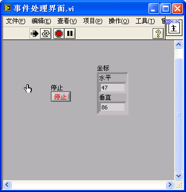

The main VI's Block Diagram:

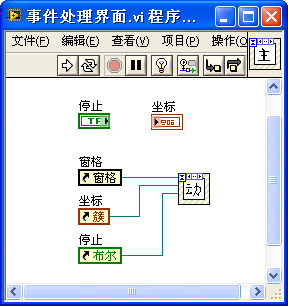

To allow the SubVI to monitor and manipulate the main VI's controls, we generate references for the "Coordinates" indicator, the "Stop" button, and the Front Panel's pane. Right-click the controls (or scrollbar for the pane) and select **Create -> Reference**. We pass these 4-byte refnums to the SubVI.

In the SubVI, we create reference input controls by right-clicking the reference terminals on the block diagram and selecting **Create -> Control**:

In the SubVI Block Diagram, we register the events:

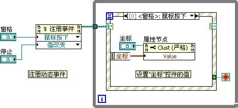

We connect the pane and "Stop" button references to the **Register For Events** node. The registration refnum is wired to the Event Structure's dynamic event terminal, allowing us to select the dynamic events in the Edit Events dialog.

> [!NOTE]
> Dynamic events are triggered by the Front Panel controls pointed to by the references, not by the reference controls themselves.

Inside the **Pane: Mouse Down** dynamic event case, we read the mouse coordinates from the Event Data Node and update the main VI's "Coordinates" control by passing the data to its **Value** property node:

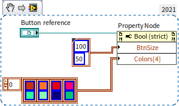

## User Events

Static and dynamic events are triggered by hardware user interactions (mouse, keyboard) or application state changes. If you need to trigger custom events programmatically from other parts of your Block Diagram, you can use **User Events**.

User Events are a type of dynamic event. You create them using the **Create User Event** function, register them, and then trigger them using the **Generate User Event** function, which passes custom data to the event case.

Suppose we want to generate a custom "Warning" event whenever a numeric value $A > 10$ or a string length $B > 10$.

We can design the program as follows:

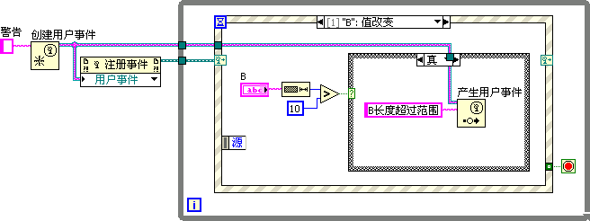

1. **Create User Event**: We wire a string constant to the **user event data type** input. The data type of this constant defines the payload data type of the user event, and the constant's label defines the event name (e.g., "Warning").
2. **Register**: We wire the user event refnum to the **Register For Events** node and connect it to the Event Structure's dynamic event terminal.
3. **Generate**: Inside the **B: Value Change** static event case, we check if the string length exceeds 10. If it does, we call **Generate User Event** and pass the warning message string "B length exceeds range".

In the **Warning** dynamic event case, we retrieve the custom payload string directly from the Event Data Node:

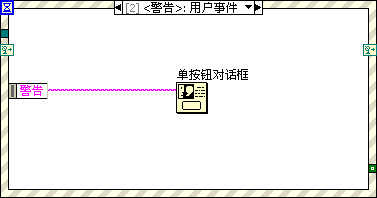

User events are highly effective for managing application initialization, state transitions, and clean shutdown procedures across different threads.

## Block Diagram Design for Interface Programs

A simple interface program has a block diagram like this:

However, real-world applications require initialization before the loop starts and cleanup after it terminates. This often results in a cluttered block diagram with large blocks of code surrounding the main Event Loop:

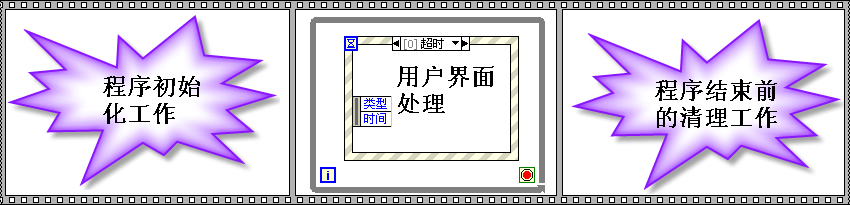

To improve readability and follow clean coding standards, you should minimize the code located outside the Event Loop. We can achieve this by converting initialization and cleanup tasks into custom User Events:

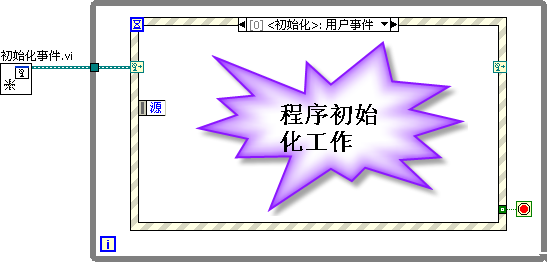

In this clean design, only a single Initialization SubVI runs outside the loop. The block diagram is simple and easy to understand.

The block diagram of the **Init Events.vi** SubVI is shown below:

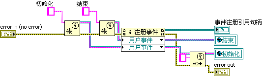

This SubVI creates the "Init" and "Exit" user events, registers them, and immediately fires the "Init" event. When the main VI enters the Event Loop, it immediately executes the **Init** event case to perform all startup tasks.

To make the user events accessible across different parts of the application without cluttering the diagram with wires, we can store the event refnums in global variables. Because these global variables are only written to once during startup and read-only elsewhere, they do not introduce race conditions.

When the user clicks the "Stop" button, instead of terminating the loop immediately, we fire the "Exit" user event. This ensures the program transitions to the cleanup case before stopping:

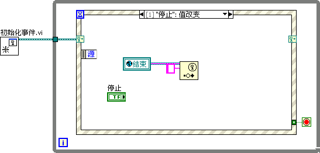

We also configure the **Panel Close?** filter event to trigger the "Exit" user event, ensuring a clean shutdown if the user closes the window using the OS close button.

The **Exit** event case performs all cleanup tasks (e.g., closing file paths, releasing hardware resources, and destroying the user event refnums) and wires `True` to the While Loop's conditional terminal to terminate the program:

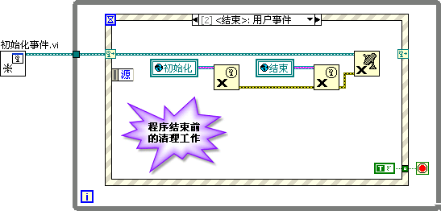

## Designing Generic User Events

As an application grows, you may need to add many different user events. Using separate user event refnums for each task can become tedious because each new event requires a new global variable, changes the data type of the registration refnum, and requires updating all wired connections.

A more scalable approach is to design a single, generic user event and differentiate event types using a custom data structure. The event data can be configured as a cluster containing **Event Name** (a string or enum) and **Event Data** (a Variant or a LabVIEW Object, discussed in the [Object-Oriented Programming](oop__) chapter). This allows a single user event structure to route and handle diverse tasks.

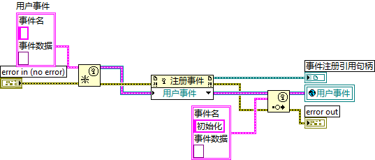

LabVIEW provides built-in VIs that implement this pattern under `[LabVIEW]\resource\importtools\Common\Event\Method`.

The diagram below shows an application utilizing LabVIEW's built-in event manager:

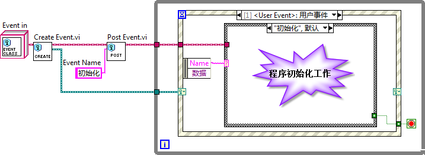

Here, we instantiate a generic event object class. When triggering an event, we pass the event name string. The Event Loop captures the event, reads the name, and uses a Case Structure inside the event case to execute the corresponding logic.

## Handling Time-Consuming Code

It is critical **never** to place long-running operations (taking more than 200 milliseconds) directly inside an event case. 

By default, LabVIEW enables the **Lock front panel until this event case completes** option for event cases. If an event case takes seconds or minutes to execute, the Front Panel will freeze, the OS will mark the window as "Not Responding", and the user may assume the program has crashed.

Even if you disable front panel locking, user clicks and keystrokes will be queued up and executed rapidly once the busy event case completes, leading to unpredictable UI behaviors.

To handle long-running operations:

### 1. Show a Busy Cursor
If an operation takes a few seconds, change the cursor to an hourglass/busy indicator to notify the user. LabVIEW provides VIs for this under **Programming -> Dialog & User Interface -> Cursor**:

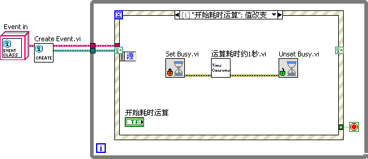

### 2. Run the Task on a Separate Thread
For very long tasks (e.g., data acquisition, file streaming, or intensive calculations), you must run the task on a separate thread outside the UI thread. This is typically achieved using the **Producer-Consumer** architecture or by dynamically launching asynchronous VIs (see [Dynamically Loading and Running SubVIs](vi_server_for_subvi)).

## Additional Considerations

- **Button Value Changes**: Always use the **Value Change** event to detect button clicks. Do not use *Mouse Down* or *Mouse Up*, as they do not account for keyboard navigation or users dragging the mouse off the button before releasing.
- **Single Event Case**: Avoid putting unrelated events in the same event case. Keep event cases focused and modular.
- **Single Event Structure**: Never place more than one Event Structure inside the same loop, and avoid using multiple Event Structures in a single VI.
- **Programmatic Value Changes**: Assigning a value to a control's terminal or local variable does not trigger a Value Change event. If you want to trigger the event programmatically, use the control's **Value (Signaling)** property node:

' Property")

## Callback VIs

While LabVIEW UI programming typically relies on Event Loops, text-based languages use callback functions (registering a function to run automatically when an event occurs).

LabVIEW supports callback execution using **Callback VIs**. Instead of handling the event in the main Event Loop, you register a SubVI as a callback. When the event occurs, LabVIEW runs the callback VI in parallel, preventing the main UI from blocking.

For example, suppose we have a VI with two dials: the left dial rotates continuously, while the right dial rotates only when a button is pressed. If we place the right dial's rotation code in the main Event Loop, it will block the loop and freeze the left dial's rotation. Using a Callback VI solves this.

The Main Front Panel:

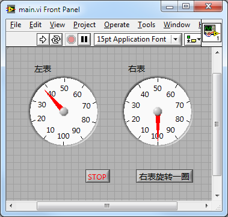

The Main VI Block Diagram:

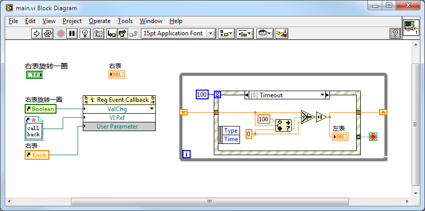

- The main Event Loop handles the left dial's rotation using a 100 ms timeout.
- The left section registers a Callback VI for the "Rotate Right Dial" button's Value Change event using the **Register Event Callback** node (located under **Connectivity -> ActiveX** on the palette). Although located in the ActiveX palette, it is fully capable of registering callback VIs for native LabVIEW controls.

The Register Event Callback node requires:
- **Event Source**: The reference to the "Rotate Right Dial" button.
- **User Parameter**: The reference to the "Right Dial" indicator, so the callback VI can update it.
- **Callback VI Reference**: A reference to the callback VI. You can right-click this terminal and select **Create Callback VI** to generate a template VI.

The Callback VI block diagram:

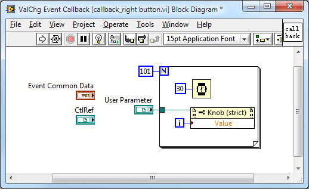

When the button is clicked, LabVIEW runs the Callback VI asynchronously, allowing both dials to rotate simultaneously without interference.

> [!IMPORTANT]
> Because Callback VIs are invoked by the LabVIEW execution engine, they run independently of the main VI. If you stop the main VI while a callback is running, the callback will continue to run until it finishes. To force an immediate stop, pass a reference to the main VI's stop button as a User Parameter and monitor it using an Event Structure inside the callback VI.

## QMH vs. Event-Driven State Machine

When designing user interfaces, you must coordinate UI events and background tasks. This leads to two primary structural choices:
1. **Queued Message Handler (QMH)**: The Case Structure is the outer loop controller, and the Event Structure is nested inside the Idle/Idle-Wait case.
2. **Event-Driven State Machine (EDSM)**: The Event Structure is the outer controller, and the Case Structure is nested inside the User Event handling cases.

Here is a comparison:

| Aspect | Queued Message Handler (QMH) | Event-Driven State Machine (EDSM) |
| ------ | ---------------------------- | --------------------------------- |
| Block Diagram | 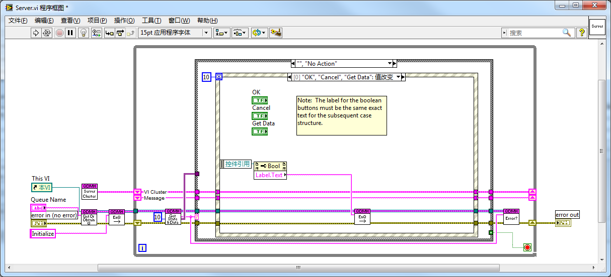 |  |
| Working Principle | Uses a queue to store messages. The outer Case Structure executes states sequentially by dequeuing messages. If the queue is empty, it enters an Idle state, where the Event Structure waits for user actions and enqueues corresponding message states. | Uses LabVIEW user events to drive states. The outer Event Structure waits for user interactions or user events. The custom User Event case contains an inner Case Structure to execute states based on the event payload. |
| Development History | Evolved from classic state machines. Before Event Structures, polling state machines were the standard. QMH became the industry standard for large applications. | Developed by engineers looking for a more streamlined, event-native design. It leverages LabVIEW's event routing engine directly. |
| Encapsulation | Requires multiple SubVIs to manage the queue (Create, Destroy, Enqueue, Dequeue). | Uses LabVIEW's built-in event functions directly. Highly clean when encapsulated with a few dynamic event SubVIs. |
| Readability & Complexity | More wires and SubVIs increase diagram complexity. It places the main user interface handler inside a sub-branch of the state machine, which can be counterintuitive. | Fewer wires and SubVIs. The Event Structure remains the top-level handler, which is highly intuitive for UI applications. |
| Message Queue Manipulation | High flexibility. Because the developer manages the queue reference, you can read, flush, or reorder messages dynamically. | Event management is handled internally by LabVIEW; the developer cannot inspect or reorder the event queue. |
| Inter-VI Control | Other VIs can obtain the queue reference (by name or wire) and enqueue messages to control the main VI. | Other VIs can trigger user events. Events have the advantage of being one-to-many (multiple VIs can register and listen to the same user event). |
| Event Structure Timeout | **Mandatory Timeout**: In single-loop QMH designs, you must configure a short timeout (e.g., 100ms) in the Event Structure. Otherwise, if a background thread enqueues a message, the loop will remain blocked inside the Event Structure waiting for a UI event. | **Optional Timeout**: The Event Structure does not block because background threads can trigger User Events to wake it up immediately. |
| Execution Latency | In single-loop designs, the loop may experience up to a 100-300ms latency due to the Event Structure's timeout polling. | Zero latency; events trigger execution instantly. |
| Best Suitability | Large, complex applications requiring flexible command queues. | Medium-to-large applications focusing primarily on UI interactions and event dispatching. |

> [!NOTE]
> The timeout blocking issue and execution latency described above only apply to **single-loop** QMH designs where event capture and message execution share the same loop. In a standard multi-loop **Producer-Consumer** QMH, the Event Structure runs in its own loop (the Producer) and never blocks the message execution loop (the Consumer), completely eliminating these limitations.

## Practice Exercise

Create a simple calculator in LabVIEW that performs basic arithmetic operations.

- **Front Panel**:
  - A numeric indicator to display inputs and results.
  - Buttons for digits `0-9`.
  - Buttons for basic operations: Addition (`+`), Subtraction (`-`), Multiplication (`*`), and Division (`/`).
  - An Equals (`=`) button to compute the result.
  - A Clear (`C`) button to reset the calculator.

- **Block Diagram**:
  - Implement an Event Loop.
  - Create event cases for the buttons.
  - Implement a Case Structure or state variables to manage input buffering, operator storage, and final calculation logic.
  - Display the results in the numeric indicator.

