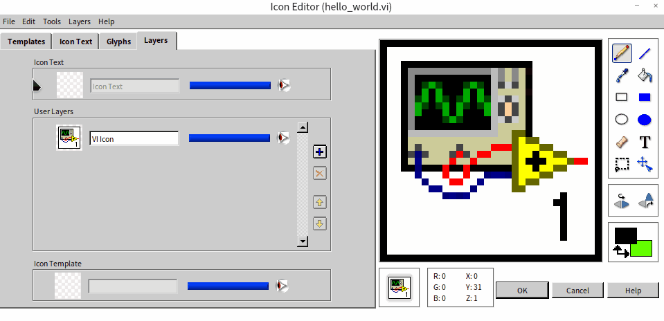
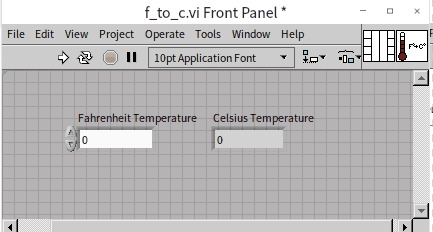

# Complex Programs

In the section titled "[Hello，World!](ramp_up_hello_world)", we embarked on our journey with LabVIEW by creating a basic VI. Now, let's delve deeper. We're about to enhance our initial creation and explore more of LabVIEW's essential capabilities. It marks your true initiation into the world of LabVIEW.

## Elevating the Aesthetics of Your VI

### Polishing  Icons

First off, adopting a neat and meaningful icon for every VI you craft is not just good practice; it's a step towards professional refinement.

An icon is a 32x32 pixel, 256-color visual emblem located at the top right corner of the VI's front panel or block diagram window. Look at the image below – the arrow highlights the VI's icon:

Icons are a distinctive feature in LabVIEW, setting it apart from text-based programming languages. Those languages don't necessitate or even support the creation of icons for each function. It's crucial to recognize that our brains process visual information far more swiftly than textual content. Hence, navigating through a well-crafted LabVIEW code with intuitive icons is often more efficient than sifting through text-based code. For example, the VI icon displayed below immediately conveys its connection with waveform generation:

While these icons are immensely beneficial for users, they demand a certain level of commitment from developers in terms of design and creation. The LabVIEW 2009 version brought significant enhancements to the icon editor. Unlike its predecessors, which offered a rather basic icon editor with limited capabilities, this updated version integrates features typical of advanced drawing tools, facilitating the quick and creative design of appealing VI icons. We will now delve into the intricacies and capabilities of this updated icon editor.

Opening the icon editor is straightforward: simply double-click the icon located on the VI's front panel or block diagram window:

Once inside the icon editor, you'll encounter various tabs, each designed to assist in different aspects of icon development and refinement.

#### The Template Page

This is where you begin when creating icons for a series of functionally related VIs. Developers often pre-plan to give these VIs a unified look, incorporating elements like similar borders, background colors, labels, and decorative motifs. This approach is not only aesthetically pleasing but also aligns with many companies' and organizations' standards for visual consistency. You can save these design elements as templates, which can then be applied to new icons, streamlining the creation process.

To save a current icon as a template in the icon editor, go to "File -> Save -> Template" menu. Remember, a template is essentially a 32x32 pixel PNG image file. You can also utilize other professional graphics tools to craft or modify these templates.

For new VIs, simply clearing the default icon and selecting an existing template will transfer that design onto the icon of the new VI.

#### The Icon Text Page

This section is particularly handy for those who favor simplicity, allowing direct text entry onto the icon. The editor provides space for four lines of text, each line accommodating different colors, fonts, and sizes. Should the text appear blurry, likely due to a small font size, adjusting the font size can enhance clarity. However, keep in mind LabVIEW's essence as a graphical programming language; it's generally more effective to use images over text for VI icons.

As we are showcasing the first VI in this book, let's symbolize it with the number "1" on its icon:

#### The Glyphs Page

This page is arguably the most crucial for many developers. The challenge of creating icons that both accurately represent the function of the program and are aesthetically pleasing is significant. This page facilitates the process by allowing developers to choose and combine graphics from a pre-existing library to craft the perfect icon. The Glyphs tab houses a variety of small image elements that can be directly dragged onto the icon frame on the right side.

Should the available symbols not meet your needs, the icon editor also allows for direct drawing in the editing area, similar to the functionality in Windows’ Paint application, with tools like brushes and erasers. For more personalized designs, importing a pre-drawn image is possible by selecting "Edit -> Import Image from File". It's crucial to be mindful of the image size, as VI icons are restricted to a 32x32 pixel dimension.

#### The Layers Page

On this page, layer management becomes key. Different elements such as the template background, text, and graphic elements are organized in separate layers. This organization allows for modifications to a specific layer without impacting others, enabling actions like moving graphics on one layer or setting them to semi-transparent:

A new VI typically begins with a default layer containing a default icon. My personal approach is to delete this default layer and start a fresh design with a new layer.

It's worth noting that the icon editor itself is a product of LabVIEW code and is an excellent resource for learning LabVIEW programming. Its main VI can be found at `[labview]\resource\plugins\lv_icon.vi`.

While the updated icon editor boasts enhanced features, the older version had its merits, particularly in terms of stability and faster startup. In some rare instances, if the new icon editor encounters issues, LabVIEW may revert to the older version:

Renaming the new icon editor file at `[labview]\resource\plugins\lv_icon.vi` will prompt LabVIEW to default to the older version if the new one is not found.

Opting for a simplistic design with just a few words might be easier, but it doesn't fully leverage the graphical potential of LabVIEW. Even though the earlier example used only the number "1", for formal programs, designing simple yet evocative icons for each VI is recommended.

### Enhancing Text Visibility

Our VI's front panel currently showcases a solitary string display control, containing just a brief message. To enhance readability, we can increase the text size. Simply select the text within the string display control and then click the text settings button on the window toolbar  to enlarge the font. Additionally, readers are encouraged to experiment with other modifications like font style, typeface, and color to augment the interface's visual appeal.

This principle of text customization isn't limited to string controls. Indeed, any text on LabVIEW controls can be aesthetically refined using the same text settings button:

Later in this book, we will delve deeper into selecting the right fonts, colors, and other design elements for program interfaces in the chapter on  [Interface Design](ui__).

### Professionalizing the Title

To elevate the VI interface to a more professional level, altering the default title of the VI window is a useful strategy. Access the VI Properties dialog box either by selecting "File -> VI Properties" from the menu or by right-clicking the VI icon and choosing "VI Properties":

Within this dialog, navigate to the "Window Appearance" category to modify the window title. This VI Properties dialog box offers a plethora of settings for exploration and customization. Key settings among these will be further explored in subsequent chapters of this book.

After these modifications, the appearance of our VI is significantly more polished and user-friendly:

### Alternative Implementation

Regarding the "Hello World!" program, alternative implementations are possible. For instance, this message could be displayed in a pop-up dialog window using the "One Button Dialog" function.

This One Button Dialog function is found under the "Programming -> Dialog & User Interface" functions palette.

## Implementing Continuous Execution

The initial program we developed activates instantaneously with the run button, processes the required action, and then halts. However, there are many scenarios where a program needs to operate continuously over a period. Take, for instance, a monitoring application that persistently watches an object, instantly processing and updating the display whenever there's a change in the measurements.

To illustrate how to enable continuous running in a program, let’s consider a basic addition program as an example:

The corresponding front panel is displayed here:

This program's purpose is to show the sum of the "Knob" and "Dial" inputs on the "Gauge" control. By default, it executes a single run and immediately displays the result. However, our goal is to modify it for continuous operation, allowing real-time updates on the "Gauge" as the "Knob" and "Dial" values are adjusted.

A quick way to achieve this is by using the "Continuous Run" button  on the toolbar. Once activated, the program doesn’t stop after a single calculation but keeps rerunning until the "Stop Running" button  is clicked. With this mode, any adjustments to the "Knob" and "Dial" will be immediately reflected in the "Gauge".

Nonetheless, this approach has limitations. The "Continuous Run" method is typically used for temporary debugging and is not a viable solution for end users. In a standard application scenario, users interact with an executable file derived from the VI, which doesn't include a "Continuous Run" button. Furthermore, this method results in the entire code block running repetitively, making it challenging to separate the code that needs to run just once from the code that should run continuously.

For effective continuous operation in your program, employing loop structures is a key strategy. Navigate to "Programming -> Structures -> While Loop" in the Functions Palette, and drag this loop structure onto your VI's block diagram, encompassing the entire addition operation within the loop. The while loop is visually represented as a bordered rectangle, with the enclosed area known as the loop body. The principle of the while loop is simple: it repeats the code inside the loop body continuously, as long as the loop's stop condition is not met (or the continuation condition is satisfied). A more comprehensive discussion on the while loop structure will be presented in the [Loop Structures](data_array) section of this book.

Inside the loop's rectangle, you'll find a small red square at the bottom right corner. This is where you input the loop condition. Right-click this square and choose "Create Control" from the context menu to create a control button, typically named "Stop". Clicking this button will terminate the loop.

Once you start the program using the "Run" button on the toolbar, it will operate continuously, similar to the effect achieved with the "Continuous Run" button. To stop the program, simply click the "Stop" control on the VI front panel.

However, this program can still be refined. When running, it can rapidly reach a high number of iterations - over ten million per second depending on the computer's hardware configuration - thus consuming substantial CPU resources. In practical scenarios, such a high update frequency is unnecessary. The human eye can't discern changes that occur more rapidly than three or four times per second. To address this, we can moderate the loop's iteration frequency by introducing a delay. Add a "Programming -> Timing -> Wait" function from the Functions Palette into the loop body, setting the wait duration to 200 milliseconds. This adjustment means that after completing the addition calculation within the loop, the program pauses for about 200 milliseconds before proceeding to the next iteration. This modification significantly reduces CPU usage, ensuring more efficient resource utilization. Here's the enhanced block diagram for the program:

In real-world applications, user interaction with the "Knob" input may vary. Sometimes it's adjusted frequently, while at other times it may remain unchanged for extended periods. Therefore, this fixed 200-millisecond refresh rate is not entirely optimal. A more sophisticated approach to interface and program design, utilizing event structures, will be introduced in the [Event Structures and User Interface](pattern_ui) section of the book.

## Organizing up Block Diagram

In programming, the neatness of your code is crucial, and this holds especially true for LabVIEW. Unlike text-based programming languages, which can still be deciphered in a sequential top-to-bottom manner despite being somewhat messy, LabVIEW's unique two-dimensional structure demands organization for readability. Clear, well-thought-out layout and wiring are essential in LabVIEW programs. Ideally, each node and wire should be carefully positioned to create a logical flow that is also visually appealing. This meticulous arrangement, while time-consuming, is integral for maintaining code clarity.

For less critical or practice programs, dedicating extensive time to manually organize every element might seem excessive. However, a good practice is to regularly utilize the "Clean Up Diagram" feature available on the VI block diagram toolbar. This tool automatically arranges LabVIEW code in a tidy and orderly fashion. Consider the following example: initially, the program functions were scattered randomly, leading to a confusing and hard-to-follow diagram. By simply clicking the "Clean Up Diagram" button, the layout becomes significantly more structured. The reorganized code can now be easily interpreted by reading from left to right, enhancing both its functionality and accessibility:

## Utilizing Sub VIs

In LabVIEW, a VI that is used within other VIs is known as a sub VI, akin to a subfunction in text-based programming languages.

Complex VIs with multifaceted functionality can result in block diagrams crowded with numerous nodes and wires, often extending beyond the confines of a single computer screen. These complex diagrams can be challenging to decipher. To mitigate this, it’s standard practice to break down intricate programs into smaller, manageable modules. Each module is represented by a sub VI, characterized by a simple and concise block diagram, ensuring ease of understanding. The main VI integrates these sub VIs, collectively executing the comprehensive functionalities. As a result, the main VI’s block diagram, predominantly consisting of these sub VIs, remains relatively straightforward, significantly improving the overall program readability.

Here's an example of a main VI’s block diagram for a complex program:

Even without detailed annotations, it's apparent that the program involves steps like opening a hardware device, configuring it, reading data, and closing the device. If this program were implemented without sub VIs, encapsulating all the code in a single VI's block diagram, it would be exceedingly complex and hard to grasp.

For contrast, consider this deliberately complex VI:

The block diagram here is so extensive and convoluted that comprehending its functionality becomes a formidable task. The portion displayed is just a fraction of the entire diagram. For navigating such large diagrams, the "View -> Navigation Window" option offers a thumbnail view of the complete code diagram, as illustrated by the grey floating window in the bottom right of the above image.

Those familiar with text-based programming might typically create subfunctions primarily for code reuse. However, LabVIEW's approach differs. In LabVIEW, the primary purpose of most sub VIs is not code reuse but rather to enhance the clarity and maintainability of the code. An ideal VI hierarchy in a project resembles a pyramid structure: accessible through "View -> VI Hierarchy" in the main VI's menu, it reveals a clear, layered organization. The main VI calls upon several sub VIs, each of which, in turn, may call additional sub VIs at a secondary layer, and so on. This kind of structured, level-based organization, devoid of cross-calling, is the most readable and understandable, as demonstrated in the VI hierarchy of a complex program shown below:

## Creating a Sub VI

Creating a sub VI begins in the same manner as any standard VI: you design the front panel, compose the block diagram, customize the icon, and save your work. However, the distinctive aspect of a sub VI is its role in being called by other VIs, which necessitates a particular configuration for its input and output parameters.

In a sub VI, the control elements on the front panel function as input parameters, and the indicator elements act as output parameters. Crucially, these elements are designated as input or output parameters only when they are connected to the VI's connector pane, which serves as the interface for linking the sub VI with other VIs.

Consider the example of constructing a simple sub VI that converts temperatures from Fahrenheit to Celsius. This VI will feature one numeric control for input and one numeric indicator for output. The initial step involves creating the front panel and block diagram for this VI. The calculation logic of the problem is:

The next phase is to configure the input and output parameters. In this case, "Fahrenheit Temperature" is assigned as the input parameter, and "Celsius Temperature" as the output parameter. In recent versions of LabVIEW, the connector pane, which is pivotal for this setup, is readily visible directly on the VI's front panel, simplifying the process of linking these parameters.

In earlier versions of LabVIEW, the connector pane isn't immediately visible and can be accessed by right-clicking on the VI's icon and choosing "Show Connector Pane" from the contextual menu. This action reveals the icon area as a grid of small rectangles, known as "terminals": . The default layout of the connector pane is organized into four columns, containing 4, 2, 2, and 4 terminals respectively. This layout is typically referred to by the number of terminals in each column, with the default being 4224. While other patterns are available in the right-click menu under "Patterns", a good rule of thumb for clean and efficient code design is to stick with the 4224 pattern wherever possible.

Each terminal on the connector pane can be associated with a control. In LabVIEW, where data flow is predominantly left to right, inputs are usually placed on the left and outputs on the right. Therefore, when configuring the connector pane, aim to link the terminals on the left to control elements and those on the right to indicator elements.

To connect a control to a terminal, click on a terminal on the connector pane and then on the corresponding control. The terminal will change color upon successful linkage, helping to prevent incorrect connections. The terminal color is matched with the wire color of the connected control for easy identification. A connector pane that has been correctly set up will look something like this:

Incorporating a sub VI into a main VI is akin to invoking a function and can be achieved in several ways. The most straightforward method is to drag and drop the sub VI's icon onto the block diagram of the main VI. Alternatively, if the sub VI has been saved and closed, you can navigate to the Functions Palette in the main VI's block diagram, select "Select a VI..." and then position the desired sub VI on the block diagram. Here’s an example of a main VI's block diagram that includes a sub VI:

Within the block diagram of the main VI, hovering the cursor over a sub VI's icon displays its terminals. This visual aid simplifies the process of making the correct connections.

## Creating Sub VIs from the Block Diagram

In the course of developing a VI, it’s quite typical for the block diagram to expand and become complex. This complexity often signals the need to segment the diagram into sub VIs, simplifying the overall structure. LabVIEW facilitates this process by allowing the direct creation of sub VIs from selected portions of the block diagram.

Consider the example below, which illustrates a section of a more extensive program's block diagram. By dragging the mouse to draw a rectangle around a portion of the diagram, you can select a specific area, highlighted by a dotted line. In our example, the chosen code segment is relatively independent, making it an ideal candidate for conversion into a sub VI. After selecting this segment, navigate to "Edit -> Create SubVI" in the menu. This action converts the selected code into a new sub VI, effectively replacing the original code section with this newly created sub VI.

When transforming a section of the block diagram into a sub VI, there are two crucial considerations:

**Independence of the Code Section:** Aim to select segments that are relatively autonomous, with minimal dependencies or connections to other parts of the block diagram. This independence ensures that the new sub VI is self-contained and does not overly complicate the main VI's structure.

**Customization of the New Sub VI:** Typically, a newly generated sub VI will have default icons and connector pane configurations. It's important to promptly open this new sub VI, personalize its icon, set up the connector pane appropriately, and then save these changes. This customization enhances the clarity and professionalism of your VI, making it easier to identify and understand within the larger context of the main program.

## Managing Project

For complex projects that transcend the capabilities of a single VI, a more robust management approach is needed. Practical applications often comprise multiple VIs, and larger projects can include thousands. To effectively organize and handle such an extensive number of VIs, LabVIEW introduced the "Project Explorer" starting with version 8.0. This feature offers a workspace analogous to the project/workspace frameworks in programming languages like VC and VB, enabling users to easily navigate and structure their program systems.

With the introduction of the Project Explorer, managing projects in LabVIEW has become more streamlined. Hence, when embarking on new programs, it is advisable to initiate the process by creating a new project. In the LabVIEW startup interface, you can create a new project by selecting "New -> Project":

The Project Explorer organizes elements using a tree-like structure, encompassing all the VIs, associated files, and settings information within the project.

- **Top Level:** The highest level in this hierarchy is the project's name.

- **Second Level:** This level shows the target machine where the project will run. With a standard desktop version of LabVIEW installed, this typically lists "My Computer" as the sole target. However, if additional LabVIEW environments like LabVIEW RT or FPGA are installed, these target devices will also appear here.

- **Third Level and Below:** Here, you find all the files involved in the project. Users have the flexibility to create virtual folders for better organization. This level is not limited to VIs and [Custom Controls](data_custom_control); it also accommodates [Libraries](manage_project#library), [Classes](oop_class), [XControls](ui_xcontrol), and various other file types, especially if specific LabVIEW toolkits are installed. Right-clicking on any item in this structure unveils additional settings and options.

By right-clicking on "My Computer" and selecting "add", you can incorporate all the VIs previously written into the project. The Project Explorer is a powerful tool, and its detailed functionalities are further explored in the [Project and Library](manage_project) section of this book.

Through the use of the Project Explorer, LabVIEW significantly simplifies the process of organizing and managing complex projects, allowing developers to maintain a clear overview of their program’s structure and its various components.

## Practice

- Create a new VI and then design a beautiful icon for the VI.
