# Complex Programs

In the "[Hello, World!](ramp_up_hello_world)" section, we started our LabVIEW journey by creating a basic VI. Now, let's build on that foundation and explore some of LabVIEW's more advanced features.

## Elevating the Aesthetics of Your VI

### Designing Meaningful Icons {#polishing-icons}

First, creating a clear and meaningful icon for every VI you write is not just good practice—it is key to keeping your code professional and readable.

An icon is a 32x32 pixel graphic located in the top-right corner of both the Front Panel and Block Diagram windows:

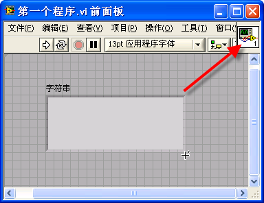

Icons are a unique feature of LabVIEW. Text-based languages do not require (or support) designing a custom graphic for every function. However, because our brains process visual information much faster than text, reading LabVIEW code that uses intuitive icons is far more efficient than scrolling through text-based code. For example, the icon below immediately tells you the VI is used for waveform generation:

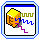

While designing icons requires a bit of effort, the payoff is substantial. LabVIEW's Icon Editor (greatly improved since version 2009) includes features common to modern drawing apps, making it easy to create polished graphics.

To open the Icon Editor, simply double-click the icon in the top-right corner of the Front Panel or Block Diagram:

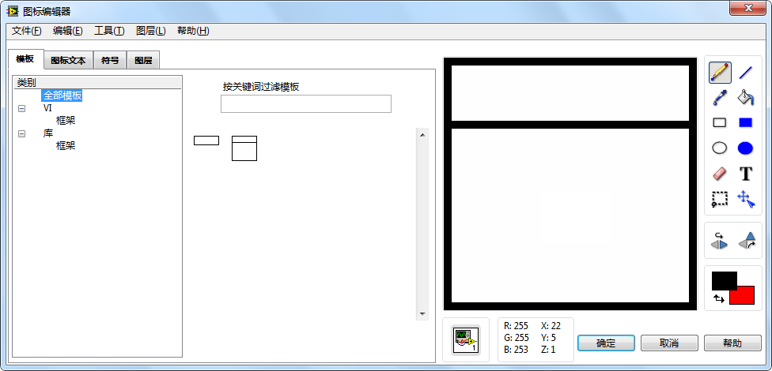

The editor contains several tabs to help you design and customize your icons:

#### Templates

If you are building a library of related VIs, it is helpful to give them a unified look (e.g., matching borders, background colors, or styles). You can save these design elements as templates.

To save the current icon as a template, select **File -> Save -> Template** from the Icon Editor menu. Since templates are simply 32x32 pixel PNG files, you can also create or edit them in external graphics editors. For a new VI, you can clear the default icon and apply an existing template to get started instantly.

#### Icon Text

This tab lets you write text directly onto the icon. It supports up to four lines, and you can customize the font, size, and color of each line. Because a 32x32 canvas is small, text can sometimes look blurry; choosing clean, simple fonts helps. Keep in mind that since LabVIEW is graphical, visual symbols are generally more effective than text.

For our first VI, let's add a simple "1" using the Icon Text tab:

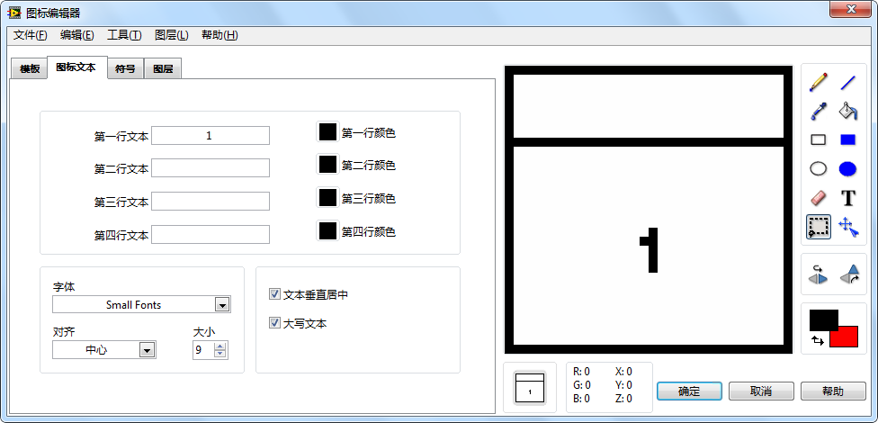

#### Glyphs

This is the most useful tab for most developers. It contains a library of small, pre-made graphics (glyphs) representing common software and hardware concepts. You can search the library and drag glyphs directly onto your icon canvas:

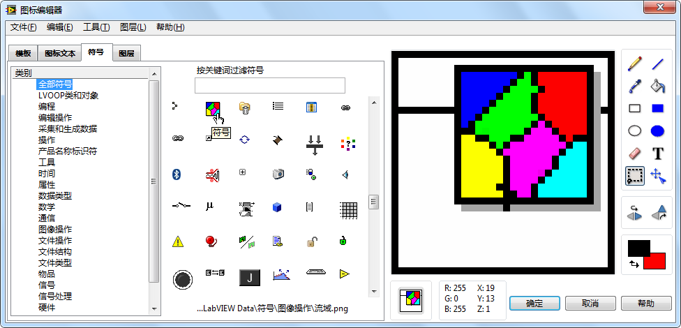

If you can't find the right glyph, you can draw custom shapes directly using the brush, eraser, and bucket tools on the toolbar. You can also import external images via **Edit -> Import Image from File** (just remember they will be scaled to 32x32 pixels).

#### Layers

Like Photoshop, the Icon Editor supports layers. The background template, text, and glyphs are placed on separate layers, allowing you to edit or move one element without affecting the others:

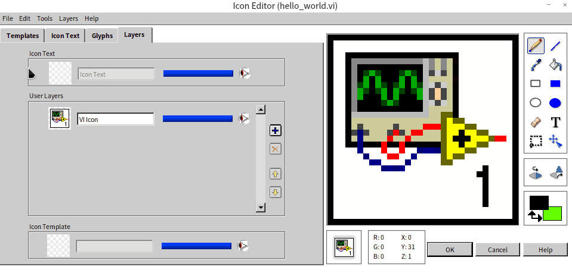

A new VI defaults to a layer containing the standard LabVIEW logo. A good habit is to delete this default layer and start your design on a clean sheet.

*Fun fact: The Icon Editor itself is written entirely in LabVIEW. If you are curious, you can find and inspect its source code at `[labview]\resource\plugins\lv_icon.vi`.*

While typing a few words on a gray box is the easiest way to make an icon, taking a minute to design a clean visual icon makes a big difference in the long-run quality of your code.

### Customizing Fonts and Text

Our Front Panel currently has a single string indicator displaying a small message. To make it more readable, we can increase the font size. Double-click the text or select it, then click the **Font Settings** button on the toolbar () to change the size, font style, or color.

This styling applies to all text elements in LabVIEW, including labels, captions, and control values:

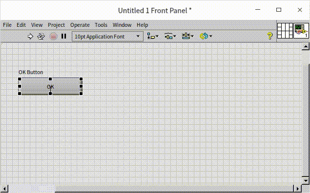

We will discuss fonts, colors, and UI layouts in detail in the [Interface Design](ui__) chapter.

### Setting a Custom Window Title

By default, the title of the VI window is the filename. To make your application look more professional, you can set a custom title. Open the **VI Properties** dialog box by selecting **File -> VI Properties** from the menu, or by right-clicking the VI icon and choosing **VI Properties**:

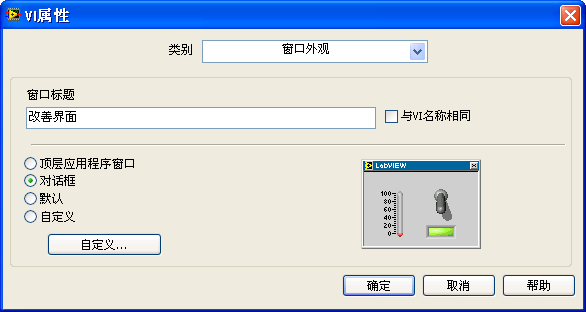

Select the **Window Appearance** category from the drop-down menu at the top, and customize the window title. The VI Properties dialog contains dozens of settings for customizing how your VI behaves, which we will explore throughout this book.

With these cosmetic updates, our VI looks much more polished:

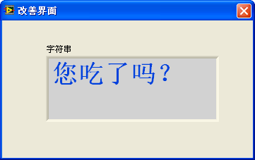

### Alternative Implementation: Pop-up Dialogs

Alternatively, you can display a "Hello, World!" message in a pop-up dialog using the **One Button Dialog** function:

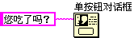

This function is located in the **Functions Palette** under **Programming -> Dialog & User Interface**.

## Continuous Execution and Loop Timing {#implementing-continuous-execution}

Our first program runs once and immediately stops. However, most real-world software needs to run continuously—for example, a monitoring program that constantly polls sensors and updates the user interface.

Let's consider a simple addition program to illustrate this:

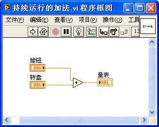

On the Front Panel, we have a **Knob** and a **Dial** as inputs, and a **Gauge** as the output:

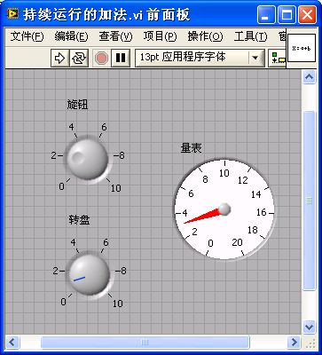

Normally, this VI calculates the sum of the inputs once, updates the gauge, and stops. To update the gauge continuously in real-time as we spin the knob or dial, we need to keep the program running.

A quick way to do this is by clicking the **Run Continuously** button () on the toolbar. This keeps restarting the VI automatically until you click the red **Abort Execution** button ().

*Warning: Using the Run Continuously and Abort Execution buttons is highly discouraged. Aborting a program abruptly kills its execution thread. If the code is writing to a file or controlling hardware, it won't have the chance to safely close file references or power down instruments, potentially causing file corruption or leaving hardware in a dangerous state.*

The professional standard for continuous execution is using a **While Loop**. In the Functions Palette, select **Programming -> Structures -> While Loop** and drag a rectangle to enclose your code. The While Loop is represented by a grey border. The loop repeats all code inside it until its stop condition is met. We will cover loop structures in detail in the [Loop Structures](data_array#while-loop) section.

In the bottom-right corner of the loop border is the **Loop Condition** (a red stop sign). Right-click this icon and select **Create Control**. This generates a **Stop** button on your Front Panel connected to the loop condition.

Now, when you click the standard **Run** button, the program runs continuously inside the While Loop. Clicking the **Stop** button on the UI terminates the loop and lets the VI exit gracefully.

However, if you run this While Loop as-is, it will execute as fast as your CPU allows (potentially millions of times per second), spiking CPU usage to 100%. Since human eyes cannot process UI updates faster than about 30 frames per second, running a loop this fast is wasteful.

To fix this, we introduce a timing delay. In the Functions Palette, select **Programming -> Timing -> Wait (ms)** and drag it into the loop. Right-click its input terminal, select **Create Constant**, and enter `200`. This pauses the loop for 200 milliseconds between iterations, capping execution to 5 times per second and dropping CPU usage to nearly 0%:

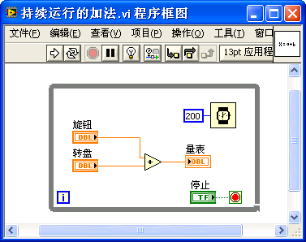

While a fixed 200ms delay is great for simple polling loops, it is not ideal for complex interfaces where user inputs happen sporadically. We will introduce a more elegant approach using the **Event Structure** in the [Event Structures and User Interface](pattern_ui) chapter.

## Organizing the Block Diagram

Writing clean, organized code is vital in any language, but it is especially important in LabVIEW. While messy text code is read sequentially, a messy two-dimensional LabVIEW diagram quickly becomes unreadable spaghetti code. Good LabVIEW code should flow logically from left to right, with clean wires and aligned nodes.

If your diagram gets messy, you can use the **Clean Up Diagram** tool (the broom icon on the toolbar). This tool automatically aligns nodes and routes wires:

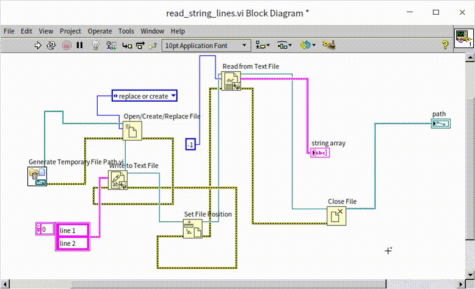

*Warning: While the Clean Up tool is great for small diagrams, running it on a complex, custom-architected block diagram can break your carefully designed layout. Instead of cleaning the entire diagram, select a specific messy section by dragging a selection box around it, right-click, and select **Clean Up Selection** (or click the Clean Up button while the selection is active). This cleans up only the target area, preserving the rest of your layout.*

## Modularizing with SubVIs {#utilizing-sub-vis}

In LabVIEW, a VI called by another VI is referred to as a **subVI** (equivalent to a function or subroutine in text-based languages).

As VIs grow, their block diagrams can quickly become cluttered with wires and nodes, often expanding far beyond the size of a single screen. To keep your programs readable, you should divide complex tasks into smaller, modular subVIs. The main VI then connects these subVIs, leaving the top-level block diagram clean and easy to follow.

Here is an example of a modular block diagram:

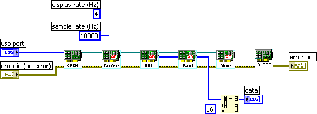

Even without looking inside the subVIs, you can easily tell the program follows a logical sequence: open device -> configure -> read data -> close.

If all this code were written on a single diagram without subVIs, it would be overwhelming. Take a look at this monolithic block diagram:

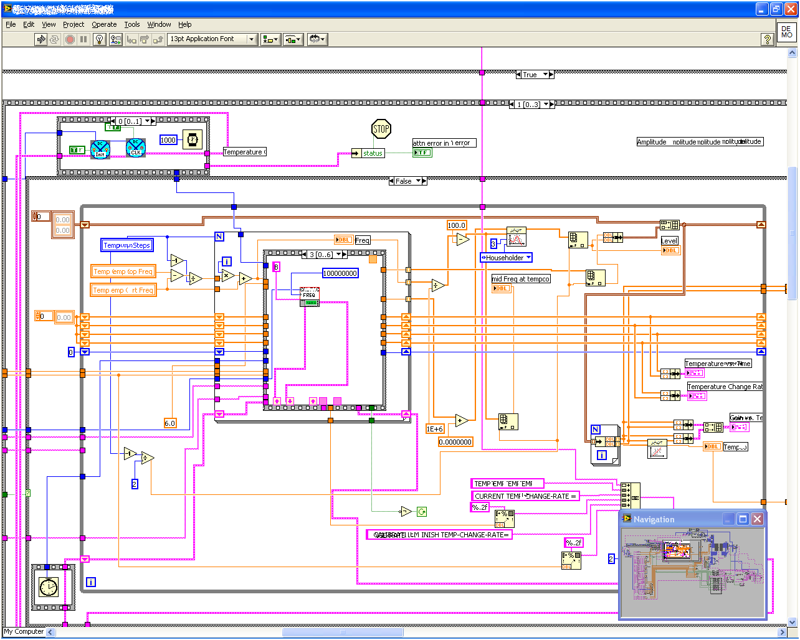

This diagram is so large that understanding it is almost impossible. The screenshot shows only a small fraction of the code. If you ever have to navigate a massive diagram like this, you can open the **Navigation Window** (**View -> Navigation Window**) to see a thumbnail layout of the entire canvas.

In text-based programming, subroutines are usually created for code reuse. In LabVIEW, subVIs are just as important for readability and code organization. A well-designed project should resemble a pyramid structure, which you can visualize by selecting **View -> VI Hierarchy** from the menu. The top-level VI calls a layer of high-level subVIs, which in turn call mid-level utility VIs:

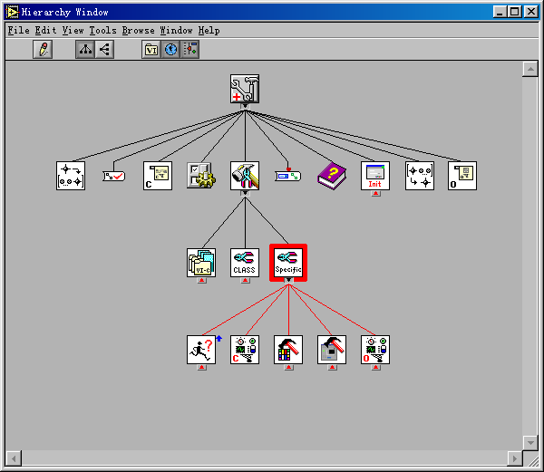

## Designing a SubVI and Setting the Connector Pane

To build a subVI, you design its Front Panel and Block Diagram, customize its icon, and save it just like a normal VI. The key difference is that a subVI must expose input and output parameters so other VIs can pass data to and from it.

On a subVI's Front Panel, **controls** act as input parameters and **indicators** act as output parameters. To expose these parameters, you must link them to the **Connector Pane**, which defines the VI's external interface.

Let's build a simple subVI that converts temperature from Fahrenheit to Celsius. The VI needs one numeric control (input) and one numeric indicator (output). Here is the conversion logic on the block diagram:

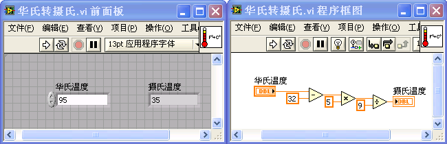

Next, we configure the parameter inputs and outputs. The connector pane is located in the top-right corner of the Front Panel, next to the VI icon.

If you are using an older version of LabVIEW, right-click the VI icon and select **Show Connector Pane** to reveal the terminal grid: . By default, LabVIEW uses a grid layout with 12 terminals arranged in a 4-2-2-4 pattern (four terminals on the left, four on the right, and four in the middle). While you can select different patterns by right-clicking the pane and choosing **Patterns**, it is standard practice to stick to the default **4-2-2-4** layout. This consistency makes it easy to wire VIs in a modular way.

Because data flows from left to right, always map inputs (controls) to the left terminals and outputs (indicators) to the right terminals.

To map a control to a terminal:

1. Click a terminal on the connector pane.
2. Click the corresponding control or indicator on the Front Panel.

The terminal will change color to match the data type of the connected control. A fully configured connector pane looks like this:

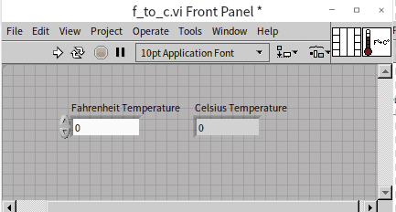

To call this subVI from a main VI, simply drag the subVI file from your computer's file explorer (or the LabVIEW Project Explorer) directly onto the main VI's block diagram. You can also select **Select a VI...** from the Functions Palette and choose the file.

Once placed, you can wire data to its inputs and outputs:

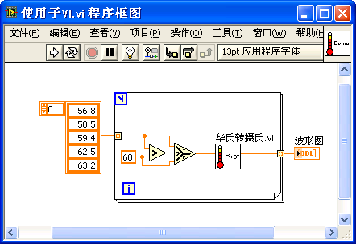

Hovering your cursor over the subVI icon on the block diagram displays a tooltip showing the linked terminals, making it easy to wire the inputs and outputs correctly.

## Creating SubVIs Automatically from the Block Diagram

As your block diagram grows, you may want to clean it up by refactoring a section of code into a subVI. LabVIEW makes this easy:

1. Drag a selection box around the section of code you want to modularize.
2. Select **Edit -> Create SubVI** from the menu.

LabVIEW will automatically package the selected code into a new subVI, create the inputs/outputs, wire the terminals, and replace the selected block diagram area with the new subVI icon:

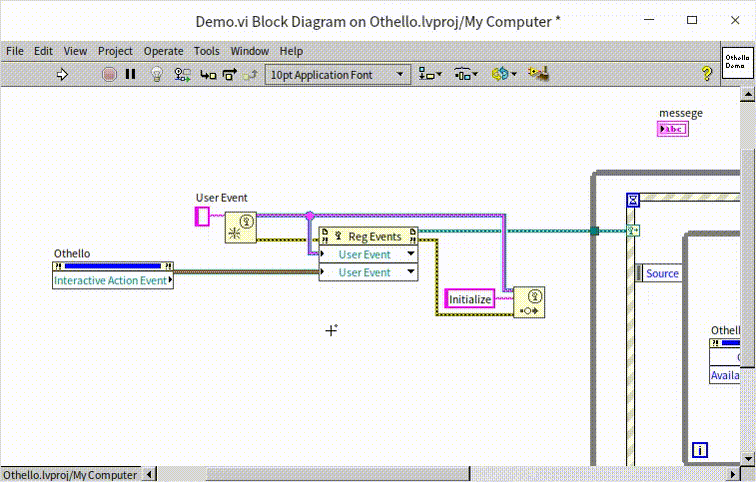

When refactoring code this way, keep two things in mind:

- **Choose self-contained blocks:** Select areas with clear inputs and outputs and minimal cross-connections to the rest of the diagram.
- **Customize the generated subVI:** The auto-generated subVI will have a generic icon and default terminal mapping. Open the new subVI immediately, design a descriptive icon, adjust the connector pane layout if necessary, and save the file.

## Managing Code with the Project Explorer {#managing-project}

For applications that require multiple VIs (or large systems containing thousands of files), you need a structured management system. LabVIEW provides the **Project Explorer** (introduced in version 8.0) to organize your files, targets, and build specifications in a single workspace.

When starting any serious application, you should begin by creating a LabVIEW Project (`.lvproj`). On the Getting Started window, select **Create Project** or choose **File -> New Project** to open the Project Explorer:

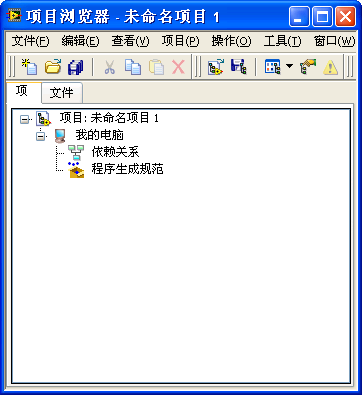

The Project Explorer structures project files in a tree hierarchy:

- **Project Root:** Shows the name of the project file.

- **Targets (e.g., My Computer):** Lists the hardware targets where the code will execute. On a standard PC, this is **My Computer**. If you are using Real-Time (RT) controllers or FPGAs, those targets will appear here under their respective hardware categories.

- **Dependencies:** Automatically lists subVIs and external DLLs/files that your project VIs require, preventing broken file paths.

- **Build Specifications:** Where you configure settings to build your application into an installer, executable (`.exe`), or packed library.

You can organize your source files under **My Computer** using virtual folders or auto-populating folders. In addition to VIs, the project manages custom controls, project libraries, classes, and other assets.

Right-clicking **My Computer** and selecting **Add -> File** lets you add your existing VIs to the project. The Project Explorer is essential for modern software development, and we will cover its advanced features in the [Project and Library](manage_project) chapter.

## Practice Exercise

- Create a new VI and then design a beautiful icon for the VI.
