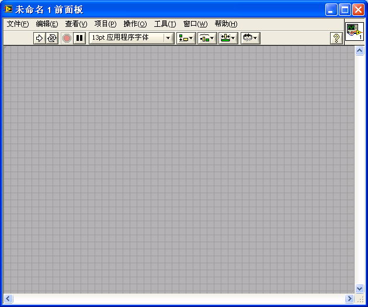
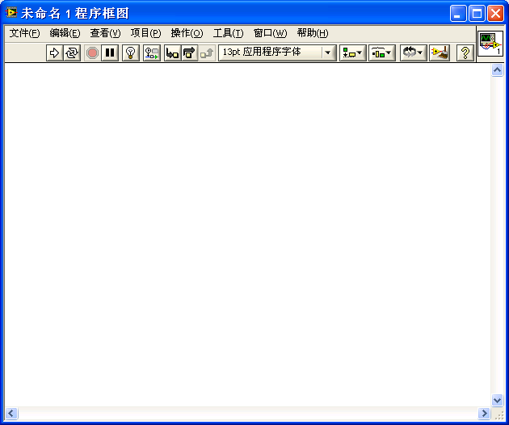
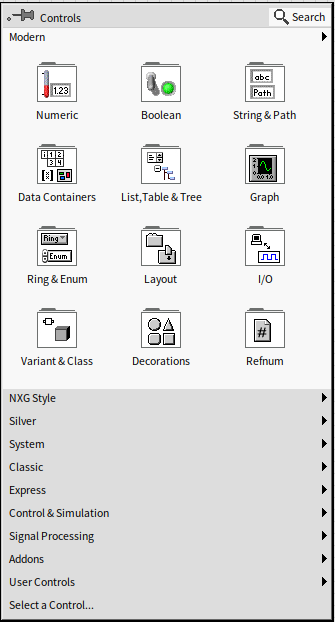
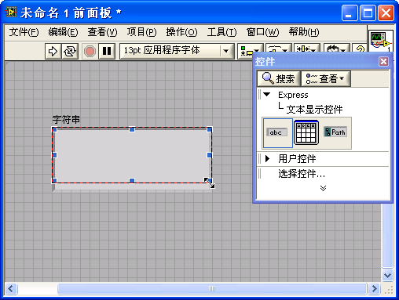
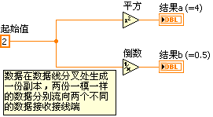

# “Hello，World!” 程序

很多计算机编程语言的书籍在指导读者编写第一个程序时，往往都会选用 "Hello, World!" 程序。也就是说，编写一段程序，让程序运行起来，在屏幕上显示出 "Hello, World!" 几个字。我们也沿用这一传统，编写一个具有中国特色的 "Hello, World!" 程序作为我们的第一个 LabVIEW 程序，即在屏幕上显示“您吃了吗？”几个字。

## 启动界面

启动 LabVIEW，首先显示出来的是 LabVIEW 的启动界面。不同版本的 LabVIEW 启动画面的风格会有所不同，比如下面两张图片分别是 LabVIEW 8.6 和 LabVIEW 2021 的启动画面：

尽管风格不同，LabVIEW 的启动界面总会包括一些共同的内容，比如：

* “新建”栏，用于创建新的 LabVIEW 程序文件。LabVIEW 程序会使用到很多不同类型的文件，比如 VI、XControl、库、类、全局变量、运行菜单、自定义控件等等，本书会在后续章节一一介绍。

* “打开”栏列出了最近打开过的项目和文件。如果是新安装的 LabVIEW，这里会是空的。

## 创建一个新的 VI

LabVIEW 程序被保存在“VI”中。LabVIEW 的第一个版本始于 1986 年。早期的 LabVIEW 是专为模拟测试测量仪器而设计的。一台计算机，插上相关的数据采集卡，再配上一段 LabVIEW 程序，就成了一台虚拟仪器，可以完成一定的测量功能。因此，LabVIEW 的源代码文件被叫做了“虚拟仪器”（Virtual Instrument），文件的后缀名为“.vi”(Virtual Instrument 的首字母缩写)。时隔几十年，LabVIEW 的应用早已超出了虚拟仪器的范畴，拓展到了测试测量、控制、仿真等多个领域，但是 VI 这个名称还是保留了下来。现在，我们可以把 VI 理解为实现了一定功能的一个 LabVIEW 代码模块，相当于其它编程语言中的函数。

在 LabVIEW 启动界面上选择“新建 -\> VI”，或者在菜单上选择“文件 -\> 新 VI”，屏幕上就出现了两个新的窗口，一个是灰色背景的：

另一个是白色背景的：

这就是新创建出来的不带任何代码的空白 VI。鼠标移动到这两个界面的边框处，变为双向箭头状时，按下鼠标便可随意调整它们的大小。

一个 VI 由两个窗口组成：灰色背景的是“前面板”；白色背景的是“程序框图”。前面板是程序与用户交互使用的界面。用户可以在这里输入程序运行所需的参数，观察程序运行的结果；程序框图是用户编写程序代码的地方。程序运行时的逻辑是由代码决定的。

## 编辑 VI 前面板

下面我们可以着手实现第一个 LabVIEW 程序了。

首先设计它的界面，也就是要编辑一下 VI 的前面板。

当 VI 的前面板成为活动窗口时，我们同时可能会看到另一个浮动的窗口，这就是 LabVIEW 的控件选板：

这个活动窗口也可能是被关闭的，可能没有出现。这时，需要鼠标右键在 VI 前面板空白的地方点击一下，控件选板就会以弹出菜单的方式显示出来：

如果需要，可以点击控件选板左上角的图钉标志，让它在 VI 前面板是活动窗口时始终显示。如果觉得它遮挡视线，也可以将其关闭，只在点击鼠标右键时才显示。

不同版本的 LabVIEW，控件选板风格略有不同，但用途和使用方法都相同。控件选板上分门别类地列出了各式各样的控件及其图标。有些控件分类是收缩状态，点击它们可以展开看到分类中的控件或子分类。对于多数的控件，我们基本上一眼就可以从图标上判别出它们的类型以及其功能用途。在设计程序界面时，我们就从控件选板上选择所需的控件。

我们的这个程序需要显示文字，所以应该在前面板上选择一个文本或字符串显示控件。LabVIEW 控件选板的第一行，前三个子类通常分别是数值、布尔和字符串相关的控件子类。点击控件选板上第一排、第三列的图标，（与文字显示相关分类的图标），进一步查看其子选板：

继续用鼠标点击“字符串显示控件”（String Indicator），再在 VI 的前面板上点击鼠标，此控件就被放置在 VI 前面板上了。我们也可以用鼠标直接把选中的控件拖拽到前面板上的某个位置。

把鼠标移动到新放置的控件的边缘，控件的边框出现了八个蓝色的小方块。

鼠标移动到控件边框处，光标会变成了最常见的箭头状，此时，按下鼠标左键，即可拖动控件的位置；若鼠标移动到边框蓝色方小块处，光标会变成双向箭头状，此时，按下鼠标左键，可以调整控件的尺寸。将控件按需要调整合适后，我们第一个 VI 的界面就设计完成了。

## 编写 VI 程序框图

程序的逻辑功能是在程序框图中实现的。当我们在 VI 前面板上放置一个控件后，VI 的程序框图上会自动增加一个与其对应的接线端：

在程序框图中把数据传给该接线端，程序运行后，前面板上的控件就显示出传入的数据。我们把字符串“您吃了吗？”传递给这个名为“字符串”的接线端，运行程序，界面上的“字符串”控件就会显示出这几个文字。

VI 的程序框图窗口为活动窗口时，会同时出现一个与控件选板相类似的浮动窗口（或者在程序框图空白处点击鼠标右键弹出的菜单），这就是函数选板。函数选板的使用方法与控件选板一致，只是它上面的图标代表了控制程序运行的函数、结构、常量和 LabVIEW 自带的 VI 等。我们现在需要从中找出一个字符串常量来存放“您吃了吗？”这几个字。

与控件选板的操作相同，点击函数选板上的图标，依次进入 "编程 -\> 字符串" 子选板，找到字符串常量（String Constant）：

把字符串常量拖拽到 VI 的程序框图中。此时，立即敲击键盘，即可在字符串常量内输入相应的文字。

LabVIEW 通过连线来传递数据。将鼠标移至字符串常量的右侧中间位置，鼠标会变成一个绕线轴的模样。这时点击鼠标，就会从字符串常量上引出一根线，再在字符串显示控件接线端的左侧中间位置点击一下鼠标，这两个对象就被一根连线连接起来了。

至此，我们的整个程序就编写完成了。在 VI 的前面板上，点击工具条上左侧第一个箭头图案的按钮，运行 VI。即可以在 VI 前面板上看到程序运行的结果了：

若程序中有错误，工具栏上的运行按钮的箭头会变成断裂状，程序不能运行。按钮的名称也从 "运行" 变成了 "列出错误"。此时点击这个按钮，会弹出错误列表对话框。必须按照列表中的提示，改正错误，修改好程序代码。待运行按钮恢复箭头状，程序方可运行。

作为学习 LabVIEW 的第一个程序，我们要把它保存好，作为留念。在菜单中选择 "文件 -\> 保存"，或直接使用快捷键 "Ctrl+S"，再选择合适的路径和文件名，这个 VI 便保存下来了。

LabVIEW 编程就这么简便易学！

## LabVIEW 程序的运行逻辑

目前，常见的编程语言多是文本形式的编程语言，即便是一些自称为图形化编程的编程语言。例如 VC、V# 等，虽然它们的界面可以直接进行所见即所得式的编辑，但程序逻辑部分，还是由文本方式的代码来编写的。有一些图形化编程语言，比如 Scratch （参考“[其它编程语言](appendix_languages)”一节），尽管使用了图形表达代码逻辑，但其编程思想依然是面向过程的，与传统面向过程的文本编程语言（比如 C 语言）类似。

但是，从前面的例子可以看出，LabVIEW 与文本编程语言区别极大。它不仅具有图形化编辑程序界面的功能，更重要的是，程序逻辑部分也是通过“画图” 的方式实现的。并且，编写 LabVIEW 程序时考虑的核心也并不是解决问题的过程，而是数据如何在代码间流动。为了帮助读者理解 LabVIEW 与文本编程语言的区别，本书在讲解后面的章节时，常常会把 LabVIEW 与文本编程语言，比如 C, Java 等进行比较。

正因为 LabVIEW 的图形化编程特性，它常常会引起一些人的误解，把 LabVIEW 与 AUTO
CAD，或电路板、化工机械等专业常用的图形化设计、控制应用软件等同起来。但实际上，LabVIEW 的灵活性与功能强大是一般行业应用软件无法比拟的，它是一种编程语言。

为了更清楚的讲解 LabVIEW 程序，我们先来定义 LabVIEW 编程中使用到的一些名词。VI 前面板和程序框图上的各种图形元素都被称为对象。VI 前面板上最常见的图形对象是控件，用于输入或显示数据。前面板上有时也会有其他一些对象，比如纯粹用来装饰的，不包含程序运行数据的各种线条、图片等。VI 程序框图中所有的图形对象可分为两部份：节点和连线。连线也被称为数据线，在我们上一段所编写的简单程序中，连接两个控件接线端之间的就是连线。连线在程序框图中很容易辨别。除此之外，程序框图中的其它对象统统被称为节点。

节点又可被细分为多个类型，常用的有：

- 接线端。我们在前面提到过接线端，它与 VI 前面板上的某个控件相对应，用于读出或写入控件数据。接线端的功能与文本编程语言中函数的参数相类似，程序通过接线端（或者说是控件）进行数据交换。 
- 函数。函数是 LabVIEW 自带的实现了某些功能的节点。函数实现的功能是最为基础的，不能再进行拆分。LabVIEW 中的函数类似于文本编程语言中的操作符和自带的底层库函数。例如，LabVIEW 中的加法函数（）与文本编程语言中 "+" 运算符相类似，LabVIEW 中求字符串长度的函数（）与 C 语言中的 strlen() 函数或 Python 中的 len() 函数功能类似。
- 结构。结构用于控制程序的执行顺序。它与文本编程语言中那些控制程序流程的关键字功能相类似。例如，LabVIEW 中的 for 循环结构（），与 C 或 Python 语言中的 for 语句功能类似。
- 子 VI。一个 VI 被其它的 VI 所调用，我们就称之为子 VI。它与文本编程语言中子函数的概念是相似的。
- 装饰。VI 的程序框图上还可以放置一些与程序运行无关的节点，比如一个背景图片、一段说明文字等等。它仅仅是为了让程序代码更容易被阅读和理解。这相当于文本编程语语言中的注释。
 
在文本语言中，多数情况下，程序的基本执行顺序就是语句的书写顺序。也就是说，如果没有改变程序流程的跳转语句出现，程序将按照从上到下的顺序，逐条执行每一行语句。在 LabVIEW 中，程序的基本执行顺序由连线来控制，即程序是沿着程序框图上的连线执行的。

我们可以这样来理解 LabVIEW 程序的执行顺序：

一个数据从程序框图上的某个起始节点出发，沿着与它相连的数据线流动到下一个节点的某个输入端点。数据在这个节点被加工处理后，再从这个节点的输出端点沿着连线流出，流向下一个节点，直到流入某个终止节点为止。数据流动的顺序，也就是程序执行的顺序。因此，LabVIEW 编写出来的程序被称为数据流驱动的程序。

上图所示是一段数学运算程序。在一个简单的 VI 中，数据的初始节点和终止节点通常都是控件的接线端。原始数据从“初始值”接线端流出，沿数据线流到“加 1”函数，再从“加 1”函数右端流出，沿数据线流至“平方根”函数，最后流入“结果”接线端。

“初始值”和“结果”同为接线端，为什么一个是数据流出，一个是数据流入呢？这是因为 LabVIEW 的每个控件都可以选择作为控制控件或是显示控件，这就决定了数据流动方向。作为控制控件时，数据从其接线端流出；作为显示控件时，数据从其接线端流入。

默认情况下，一个控件是控制控件还是显示控件，取决于这个控件所代表的物理实体的特征。比如说，表示开关的控件，默认情况下是控制控件；而表示灯泡的则是显示控件。鼠标右键点击控件，在弹出的快捷菜单中有一项 "转换为显示 / 控制控件" 选项，可以用来改变控件的数据流向。

函数以及子 VI 通常有多个接线端，并且这些接线端的方向是固定的。数据总是从函数的输入接线端流入，从输出接线端流出。

数据线是可以有分叉的。数据从一个接线端流出，可以同时流向多个接收数据的接线端。数据沿着数据线流动至分叉处，数据会自动生成一个副本，变成两份一模一样的独立数据，分别传递到各自的下一个节点。后续的节点再分别对两份数据进行处理，两者不会相互影响。（这是一个比较易于理解的描述方式，实际上 LabVIEW 并不一定在每个分叉都产生副本，随着的 LabVIEW 理解的深入，本书后文会给出更精确的描述。）如下图所示：

但反之则不可，即一个接收数据的接线端不能同时接受来自不同源的数据。假如硬要如此连线，数据线就变成了虚线：

这时，如果按下这个 VI 程序框图窗口工具条上的“列出错误”按钮（与“运行”是同一个按钮），就会得到错误提示：

## 练习

* 创建一个新的 VI，放置一个开关控件和一个灯泡控件，然后使用开关来控制灯泡的明灭。
