# Hello, World!

Many programming books start by guiding readers to write a "Hello, World!" program—a simple piece of code that displays "Hello, World!" on the screen. Embracing this tradition, we will begin our LabVIEW journey with "Hello, World!" as our first project.

## Getting Started Window

When you launch LabVIEW, you are greeted by the **Getting Started Window**. The style of this window varies across versions, as shown in the screenshots below for LabVIEW 8.6 and LabVIEW 2021:

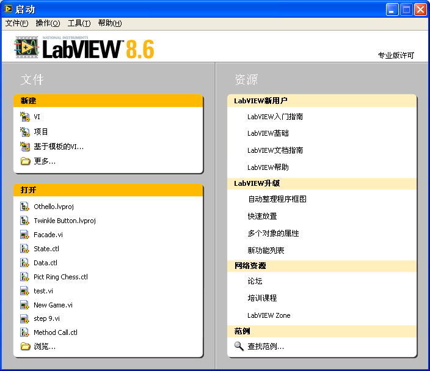

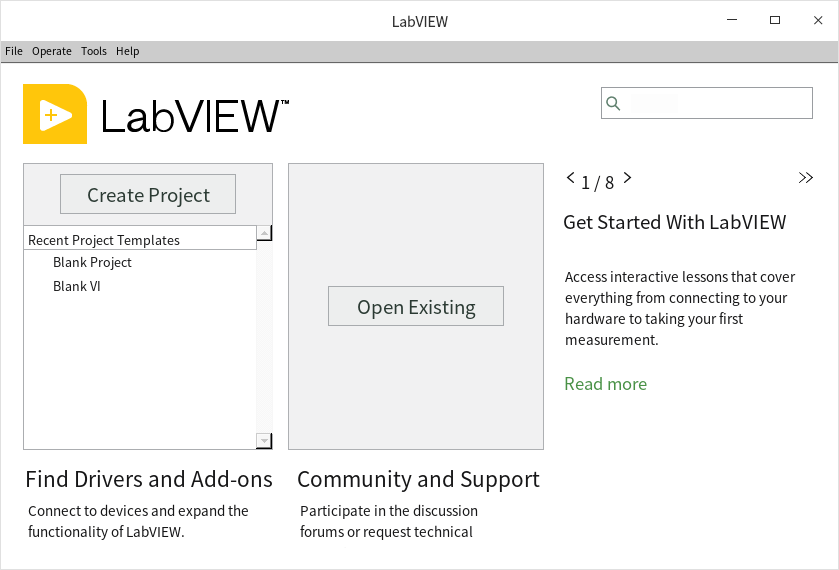

Despite these differences, the Getting Started Window always contains a few key areas:

- **New / Create Project:** For creating new LabVIEW files. A LabVIEW program can consist of many file types, including VIs, XControls, project libraries, classes, global variables, runtime menus, and custom controls. We will discuss these in detail in the chapters ahead.

- **Open / Recent Files:** Displays a list of recently opened projects and files. If you have just installed LabVIEW, this list will be empty.

## Creating a New VI

LabVIEW programs are stored in files called **VIs** (Virtual Instruments). When LabVIEW was invented in 1986, its primary purpose was to simulate physical test and measurement hardware. By combining a computer with a data acquisition (DAQ) card and LabVIEW software, engineers could create a "virtual instrument" to perform specific measurements. Because of this, LabVIEW source files were named Virtual Instruments, using the `.vi` file extension. Decades later, LabVIEW's scope has expanded far beyond basic measurements to encompass control, automation, and simulation, but the term "VI" remains. Today, a VI is simply a LabVIEW code module, equivalent to a function or subroutine in other programming languages.

To create a new VI, select **Blank VI** from the Getting Started Window, or select **File -> New VI** from the menu. This will open two windows on your screen:

One with a gray grid background:

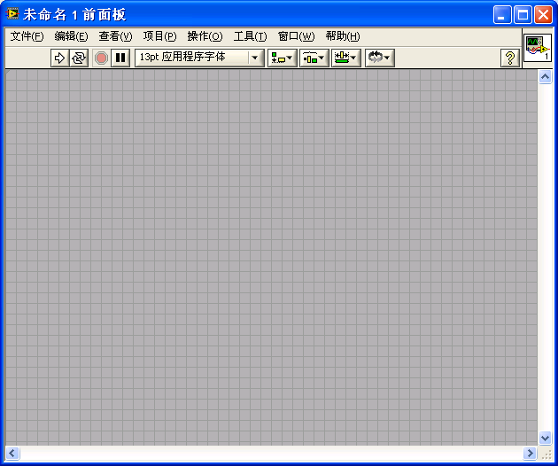

And one with a white background:

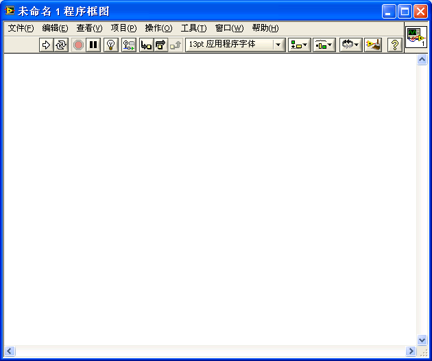

These windows are the two core components of any VI:

- **The Front Panel** (gray background): This is the user interface. Here, you place controls (inputs) for users to interact with and indicators (outputs) to display results.

- **The Block Diagram** (white background): This is where you write the graphical source code. It contains the logic, functions, structures, and wires that dictate the program's execution.

You can resize, move, or tile these windows side-by-side (using the shortcut **Ctrl+T**) to view both at the same time.

## Editing the Front Panel

We are now ready to design the interface of our first program by editing the front panel. When the Front Panel window is active, a floating window called the **Controls Palette** should appear:

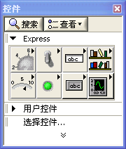

If it is not visible, simply right-click anywhere on the empty space of the Front Panel to bring it up:

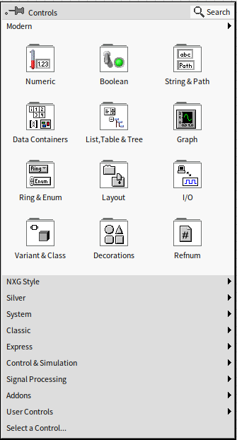

You can pin the palette to keep it visible by clicking the thumbtack icon in its top-left corner. If you prefer to keep your workspace clear, close the pinned palette and bring it up temporarily with a right-click whenever you need to place a control.

The Controls Palette contains categorized icons representing various user interface elements. While the visual style varies slightly between LabVIEW versions, the categories and behavior remain identical.

For our "Hello, World!" program, we need a control that can display text. On the Controls Palette, the top row contains the most common data types: Numeric, Boolean, and String. Clicking the String category opens the String subpalette:

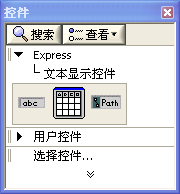

Select the **String Indicator** (used for displaying output text) and click on the Front Panel to place it. Alternatively, you can drag and drop it directly onto the panel.

Once placed, clicking the indicator reveals eight small blue or black selection handles along its border. Hovering the mouse over the border changes the cursor to an arrow, allowing you to drag the control to reposition it. Hovering over one of the corner handles changes the cursor to a resizing arrow, letting you drag to resize the control.

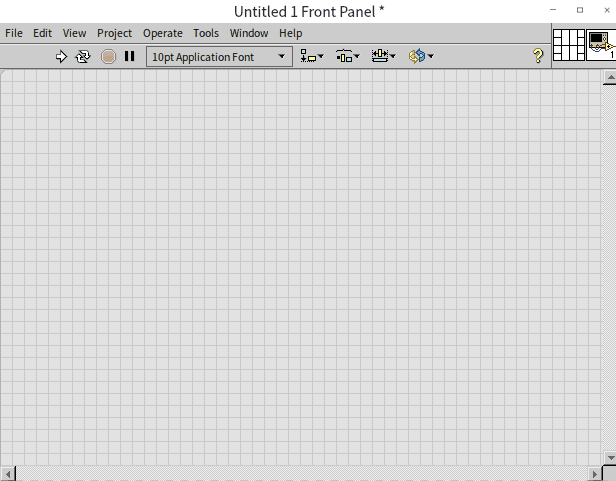

## Editing the Block Diagram

The block diagram is where the program's logic is implemented. When you placed the String Indicator on the Front Panel, LabVIEW automatically added a corresponding **terminal** to the Block Diagram:

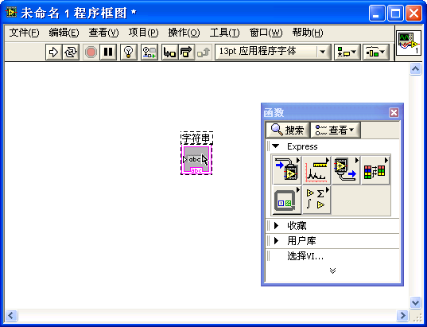

Any data wired to this terminal on the block diagram will be displayed in the front panel indicator when the program runs. If we send the string "Hello, World!" to this terminal (labeled "String"), the text box on the user interface will display "Hello, World!".

When the Block Diagram window is active, the **Functions Palette** becomes available (right-click on the empty space of the diagram if it is not open). This palette works just like the Controls Palette, but instead of UI elements, it contains programming nodes: functions, structures, constants, and subVIs. We need to find a **String Constant** to hold our "Hello, World!" text.

In the Functions Palette, select **Programming -> String** to locate the **String Constant**:

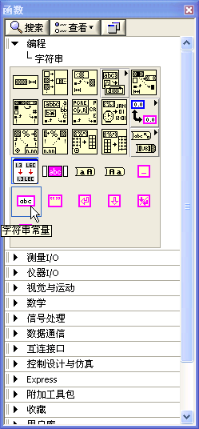

Drag the String Constant onto the block diagram. Once placed, type `Hello, World!` inside it.

LabVIEW uses **wires** to pass data between nodes. Hover your cursor over the output terminal on the right side of the String Constant; the cursor will change into a wire spool icon. Click once to start the wire, move the cursor to the input terminal of the String Indicator, and click again to connect them.

Notice that the wire and the terminals are pink. In LabVIEW, wire colors represent specific data types. Pink indicates string (text) data, orange or blue represents numeric data, and green represents Boolean (True/False) values. This color coding is a powerful feature of graphical programming, letting you identify data types and flow at a glance.

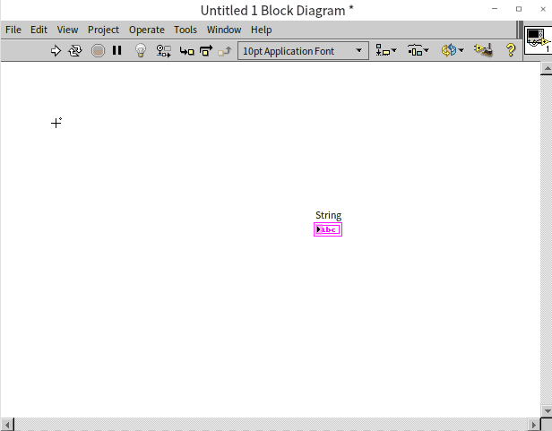

With the wire connected, our program is complete! Switch back to the Front Panel and click the **Run** button (the single white arrow icon on the far left of the toolbar) to execute it. The text "Hello, World!" will instantly appear in the String Indicator:

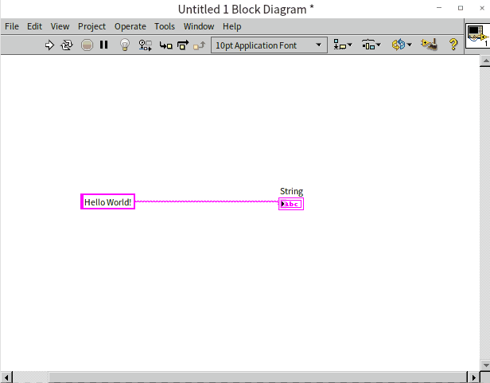

*Warning: Avoid clicking the **Run Continuously** button (the icon with two circular arrows) next to the Run button. This forces the VI to run in an infinite loop, which is generally a bad programming practice because it bypasses programmatic control over when the software stops.*

If there are compilation errors in your program, the Run arrow will appear broken, indicating that the code cannot run. The button will act as a **List Errors** button. Clicking it opens a window detailing the compilation errors. You must fix these errors on the block diagram according to the error descriptions. Once resolved, the Run arrow will return to normal, and the VI can execute.

Finally, save your work by selecting **File -> Save** or pressing **Ctrl+S**.

This simplicity is what makes LabVIEW programming so accessible and easy to learn!

## The Execution Logic of LabVIEW Programs

In most programming environments, the source code is written in text. While IDEs for languages like Visual Basic or C# offer visual drag-and-drop interfaces for creating UI, the logic remains text-based. Even visual languages like Scratch (discussed in [Other Programming Languages](appendix_languages)) use visual blocks to represent text-like procedural logic.

LabVIEW is completely different. It uses graphical techniques not just for UI layout, but for the actual programming logic. The core concept is managing the flow of data between elements on a canvas rather than executing sequential text commands. To help illustrate these differences, this book frequently compares LabVIEW paradigms with text-based equivalents in C or Java.

Because of its visual nature, beginners sometimes confuse LabVIEW with drafting programs like CAD, or design tools for PCBs and chemical schematics. However, LabVIEW is a general-purpose, Turing-complete programming language with advanced capabilities that far exceed standard application design tools.

Let's clarify some common LabVIEW terms. All elements on a front panel or block diagram are called **objects**.

On the Front Panel, the most common objects are **controls** (inputs) and **indicators** (outputs). It can also contain static objects like decorative shapes or labels, which do not run code.

On the Block Diagram, objects are categorized into **nodes** and **wires**. Wires are the lines connecting terminals to transfer data. Nodes represent execution blocks.

LabVIEW nodes include:

- **Terminals:** Visual block diagram representatives of Front Panel controls and indicators, which read or write data between the UI and the code (similar to variables or function parameters).
- **Functions:** Fundamental programming blocks that perform basic tasks (like math operators). For example, the Add function (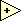) is equivalent to the `+` operator, and the String Length function (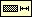) is equivalent to C's `strlen()` or Python's `len()`.
- **Structures:** Graphical frames that control execution flow (like loops or conditional statements). The For Loop structure (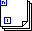), for instance, is equivalent to a `for` statement.
- **SubVIs:** VIs called from within another VI, equivalent to subroutines or helper functions.
- **Decorations:** Static text or shapes on the diagram used to comment or organize code without affecting execution.
 
In text-based programming, code executes sequentially from top to bottom unless a branching statement changes the path. In LabVIEW, execution order is governed entirely by wires: a node executes only when it has received data at all of its input terminals. This paradigm is called **dataflow**.

The execution logic of LabVIEW programs can be understood as follows:

Data originates from a source node on the block diagram and follows the connecting wire to an input terminal of the subsequent node. After processing at this node, the data exits through the node's output terminal and continues along the wire to the next node. This flow persists until the data reaches a terminal node. Thus, the sequence of data flow dictates the execution order, characterizing LabVIEW programs as dataflow-driven.

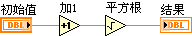

The figure above shows a simple mathematical operation. Data originates at the input terminal, flows through a wire to the **Increment** function, passes from the output of the Increment function to the **Square Root** function, and finally flows into the output terminal.

This directional flow is determined by whether a UI object is a Control or an Indicator. While we pull both from the "Controls Palette," LabVIEW distinguishes them:

- **Controls** are inputs (data sources). Their terminals on the block diagram have output ports on the right.
- **Indicators** are outputs (data sinks). Their terminals have input ports on the left.

LabVIEW automatically guesses which type you need based on the control style (e.g., a toggle switch defaults to a control, whereas a light bulb defaults to an indicator). You can toggle between them by right-clicking an object on the front panel or block diagram and selecting **Change to Control** or **Change to Indicator**.

Functions and subVIs have fixed terminal directions: inputs on the left, outputs on the right.

Wires can branch to send the same data to multiple targets:

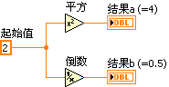

When a wire branches, LabVIEW duplicates the data so that both receiving nodes process it independently (in practice, LabVIEW optimized this with smart buffers, which we will discuss later).

Conversely, you cannot connect multiple data sources to a single input terminal. Doing so creates a **broken wire**, indicated by a dashed line with a red 'X':

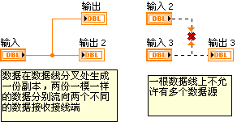

When a block diagram has a broken wire, the Run button on the toolbar breaks into a fractured arrow, and clicking it opens the Error List detailing the conflict:

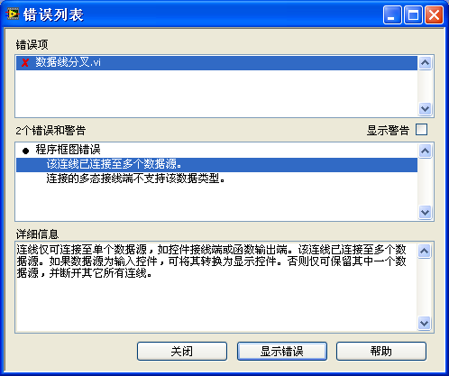

## Practice Exercise

- Create a new VI, place a switch control and a lightbulb control, and then use the switch to control the turning on and off of the lightbulb.
