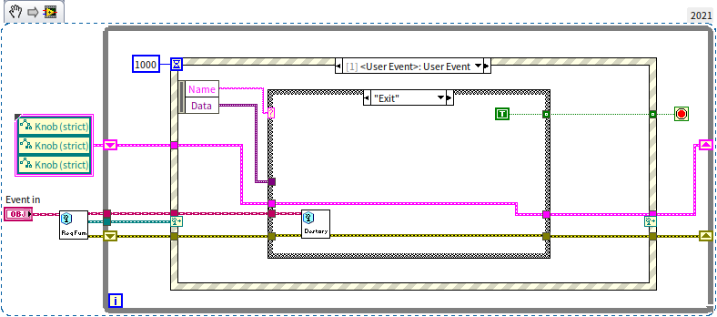

# How Do We Learn

## Approaches to Learning LabVIEW

The proverb, "Give a man a fish and you feed him for a day; teach a man to fish and you feed him for a lifetime", aptly applies to learning LabVIEW. As we progress through this book, detailed step-by-step program writing instructions may become less frequent, but the aim is to empower learners to find their most effective approach to mastering LabVIEW. Here we explore three primary methods of learning LabVIEW: systematic, exploratory, and goal-driven learning. These methods are not mutually exclusive, and each individual can select the approach that aligns best with their personality, environment, and familiarity with LabVIEW.

### Systematic Learning

Systematic learning is a traditional approach often employed in academic settings. It involves following a structured learning plan created by others. The effectiveness of this method depends on the learner's engagement as well as the quality of the teacher and the materials used. For LabVIEW, this could involve participating in training courses offered by NI. Through these courses, a beginner can typically acquire the skills to write simple programs within a week. Many universities now offer LabVIEW courses, providing easy access to structured learning. For those unable to attend a course, self-study using a tutorial book or video series is a viable alternative. The chosen materials should focus on LabVIEW's programming concepts and principles, rather than merely listing functions or VIs, which are more appropriate for reference than initial learning.

### Exploratory learning

Exploratory learning suits those who enjoy self-guided discovery. Knowledge gained independently often leaves a more lasting impression. No tutorial can cover every function of LabVIEW, so opening unexplored menus or function palettes and experimenting with their capabilities can be enlightening. Before diving into each new feature, consulting LabVIEW's help documentation can significantly accelerate the learning process. Additionally, reviewing code written by others can expand your understanding, as personal exploration has its limits. The programming insights shared in this book are not solely the author's inventions but also draw from various LabVIEW code examples.

### Goal-Driven Learning

Goal-driven learning is a common approach among working professionals. Many people, unless personally interested, tend not to learn skills that are not immediately needed, often waiting until a specific project or task arises. This approach is efficient but tends to focus narrowly on solving immediate problems. Seeking assistance from more experienced colleagues or company experts is an effective learning strategy in such scenarios. If local resources are insufficient, reaching out for broader assistance through forums can be valuable.

Each of these learning methods offers unique advantages, and selecting the right approach can significantly enhance your LabVIEW learning experience.

## Self-Learning LabVIEW

While systematic and goal-driven learning styles are effective for passing exams or completing projects, true mastery of LabVIEW requires a learner's personal exploration. The distinctiveness of exploratory learning lies in its self-initiative approach, and its learning content is not confined within the boundaries set by teachers or textbooks.

Compared to self-learning text-based programming languages, self-learning LabVIEW can be more straightforward, making LabVIEW particularly amenable to exploratory learning. This is largely due to LabVIEW's graphical programming nature.

Firstly, graphics can convey meanings more richly than words. A newcomer to programming, when encountering a LabVIEW function icon, can often intuitively guess its general purpose. For instance, upon seeing this LabVIEW function: , it's immediately apparent that it's used for calculating square roots. Additionally, LabVIEW allows for displaying labels on functions, offering localized text descriptions of their purpose. Conversely, encountering a textual function like sqrt() in a text-based language might not be as immediately understandable, especially for non-native English speakers.

Here's an example of a labeled function:

Secondly, LabVIEW organizes various functions, structures, VIs, etc., into functionally categorized and hierarchical groups, displayed in the function palette:

In contrast, most text-based programming languages do not provide a similarly accessible, functionally categorized list of all their features for on-the-fly reference. For example, in VC++, functions are typically typed out. The environment typically suggests functions based on already-typed characters. For instance, typing "sq" might prompt a suggestion for "sqrt". However, if you need a function to convert a floating-point number to a hexadecimal string and don't know the function's name, you can't rely on such prompts. This may necessitate searching through reference materials or, if unsuccessful, writing and debugging a function yourself.

Addressing programming challenges in LabVIEW is often straightforward, even for beginners. Learners can intuitively navigate LabVIEW's structured organization of functions to find solutions. For instance, if LabVIEW were to provide a function for the above task, it would likely be located under the "Numeric" or "String" function palettes, or under a dedicated data conversion category in the Functions palette. This systematic arrangement simplifies the search process.

LabVIEW's organization of internal functions enables learners to explore function groups that align with their interests or project requirements without needing additional reference materials. For example, if you anticipate that your future programming tasks will involve extensive string manipulation, you could examine each function under the "String" palette to familiarize yourself with the available tools. This pre-emptive exploration equips you with the knowledge of which function to use when faced with specific string-related tasks.

Besides functions and controls, it's also beneficial to experiment with LabVIEW's various menus and configuration options. Commonly used features include the right-click menu and property settings for controls, as well as the menu and property configurations of VI. Sometimes, exploring a menu option out of curiosity can lead to discovering a feature that precisely meets your needs.

It's a worthwhile exercise to now search and identify where the While loop structure is located in LabVIEW. Also, where can you find simple mathematical operations such as addition, subtraction, multiplication, and division in the function palette? These structures and functions will soon be essential in our LabVIEW journey.

## Online Help and Documentation

For many basic functions or menu options in LabVIEW, users can often intuitively infer their purposes. A quick trial can usually solidify understanding of their usage. However, for more complex functions, relying solely on experimentation can be inefficient. It's advisable for readers to consult LabVIEW's help documentation before using such functions.

The help documentation in LabVIEW is an essential tool for mastering the software, but it's often underutilized. While earlier versions were only available in English, challenging those not fluent in the language, LabVIEW has since expanded its documentation to include various localized versions. This development significantly reduces language barriers, making LabVIEW more accessible to a global audience.

One of the most accessible forms of help is LabVIEW's Context Help. This feature provides a floating window that displays help information related to the object under the mouse cursor. To activate Context Help, click the yellow question mark button  on the toolbar of the front panel or block diagram, select "Help -> Show Context Help" from the menu, or use the shortcut key Ctrl+H. This action opens the Context Help window:

In the example above, the "Format Date/Time String" function is used on a VI's block diagram. While one can guess the general purpose and usage of this function from its label, the specific way to format the "time format string" parameter might not be immediately clear. In such cases, you can open the Context Help window and hover the mouse over the "Format Date/Time String" function. The Context Help window will then display detailed information about this function, including guidelines for commonly used time format codes.

In LabVIEW's Context Help window, located on the lower left, you'll find three small buttons. Their functions are best discovered through exploration. Try clicking on them and observe the changes in the Context Help window. For a more comprehensive experience, place various structures and sub-VIs on the block diagram, hover the mouse over different nodes, and watch how the Context Help window responds.

While the Context Help window offers quick tips, it might not be sufficiently detailed for first-time users. To access more comprehensive information, click "Detailed Help Information" at the bottom of the Context Help window, or the blue question mark button in the lower left corner. This action opens the extensive LabVIEW online help documentation:

This documentation meticulously details the functionalities of each LabVIEW function and the application of parameters. It's arguably more thorough and authoritative than any book on LabVIEW structures, functions, and VIs. Therefore, when exploring LabVIEW functions, the help documentation should be your first point of reference.

To access the LabVIEW help documentation, navigate to 'Help -> Search LabVIEW Help' in the LabVIEW menu. In the help window, use the 'Index' and 'Search' tabs to locate specific content.

Although LabVIEW's help documentation is comprehensive, it doesn't cover everything. Topics like choosing the right function for specific scenarios, designing user-friendly interfaces, and writing efficient code are beyond its scope. These practical aspects form the core discussions of this book, aiming to bridge the gaps left by the official documentation.

## LabVIEW Examples

While LabVIEW's documentation is informative, its abstract nature can sometimes be challenging to grasp. Practical examples, however, can make understanding much clearer.

In the LabVIEW help documentation, you will often find links to examples at the bottom of help pages. These examples are specifically related to the topic discussed on the page. Users can click "Open Example" directly within the help page to see how the explained concepts are implemented in actual programs:

If you haven't opened the relevant help document, the "NI Example Finder" provides another way to search for examples. On the LabVIEW startup interface, select "Find Examples", or choose "Help -> Find Examples" from the menu to launch the NI Example Finder:

The NI Example Finder offers two primary search methods. On the "Browse" tab, you can find examples by category. For instance, to explore file reading and writing, select "Basics -> File Input and Output" from the category list to access various examples in this category. Alternatively, the "Search" tab allows keyword-based searches for example VIs. For example, typing "loop" in the search bar will display all examples related to loop structures.

By default, the NI Example Finder only shows examples included with LabVIEW. However, if your computer is connected to the Internet, check the "Include ni.com examples" option at the bottom left of the dialog box. This enables the finder to also search for examples available on the NI website.

Many examples on the NI website are user-contributed. You can contribute your VIs for community reference. User-submitted VIs are collated on the "NI Developer Community" page (URL: <https://forums.ni.com/>).Directly browsing this page in a web browser reveals the latest and most popular examples, along with community feedback:

The VIs on the LabVIEW function palette and many in the vi.lib folder have publicly accessible block diagrams. Users can open these diagrams for in-depth study, making them excellent learning resources. Additionally, the VIs used to illustrate concepts in this book serve as helpful examples. They are available at <https://github.com/ruanqizhen/labview_book/tree/main/code>.

## Seeking Help

When specific problems or challenges arise in LabVIEW programming that you can't resolve with the help documentation or examples, turning to experienced individuals can be highly effective. This could include colleagues, NI technical support staff, or other knowledgeable sources. If these avenues don't suffice, consider seeking broader assistance online.

Several online platforms can be helpful:

- **Search Engines:**Use search engines like Google to look for answers to your questions. Typing in specific keywords related to your query can yield useful results.
- **[NI Offical Forum](https://forums.ni.com/):** This active forum is regularly visited by NI technical support and development engineers, who often respond to various queries. It features dedicated areas for discussions in localized languages. However, if you're proficient in English, consider posting in the English discussion area. This section tends to be more active, potentially leading to faster and more diverse responses.
- **[LAVA](http://forums.lavag.org>):** This is the largest independent LabVIEW community and an excellent resource for support and discussion. LAVA offers a platform for free discussion, but it is primarily English-speaking.
- **Social Media Groups:** Various Facebook groups and Google Groups dedicated to LabVIEW discussions exist. If you use these platforms, searching for relevant group names or keywords can lead you to these communities.
- **Large Language Models:** We are in an era of technological evolution where large language models could potentially replace traditional search engines as a primary resource for learning materials. These models can already answer many simple questions. However, as of 2023, their effectiveness in addressing LabVIEW-specific queries is limited. This limitation may stem from LabVIEW's niche status, leading to a scarcity of learning materials for these models compared to more widespread languages like Python and Java. Furthermore, large language models currently struggle to effectively generate LabVIEW block diagrams, an advantage held by text-based programming languages.

## Sharing LabVIEW Code

Sharing and managing code in LabVIEW presents unique challenges compared to text-based programming languages (refer to [The Challenges of LabVIEW](appendix_problem)). When seeking assistance with programming issues, such as posting on forums, the approach to explaining your code differs significantly from text-based languages.

While sharing source code in text-based languages is straightforward, typically involving just copying and pasting into a forum thread, the process is more intricate with LabVIEW. There are a few options, each with its own set of challenges:

- **Attaching VI Files:** You can attach the VI file to your forum post. However, this requires others to actively download and open it in their LabVIEW environment. This approach also faces potential compatibility issues, especially if their version of LabVIEW is older than the one you used.

- **Posting Screenshots:** An alternative is to share screenshots of your code. This method allows others to immediately visualize your code without needing to download anything. However, it's important to note that many LabVIEW structures consist of multiple layers, and a screenshot can only capture one layer at a time. This limitation means that vital parts of your code may remain unseen. Furthermore, if readers need to reproduce a problem, they face the additional task of recreating the block diagram from scratch, based on the screenshots.

- **VI Snippet：** Relatively speaking, the most convenient method for sharing VI code in forums is using VI Snippet. A VI Snippet is essentially a png image that resembles a screenshot of the block diagram. The png format allows embedding additional data beyond the image content. LabVIEW embeds the program's logic and layout information into this png file. Thus, when opened in LabVIEW, it can reconstruct a new VI with an identical block diagram. Sharing a VI Snippet means others can view the program directly as an image. If they need more detailed information or wish to run and debug the code, they can simply drag the VI Snippet into LabVIEW, converting it back into a VI.

To create a VI Snippet, select all the code you want to include, then go to "Edit -> Create VI Snippet from Selection" and save the image file:

A VI Snippet is a pictorial representation of your block diagram, complete with a border and an icon indicating it can be dragged into LabVIEW to add code. Below is a VI Snippet of a recently created program block diagram:

In this book, we will use VI Snippet for code screenshots wherever possible. Readers interested in testing the programs shown in VI Snippet illustrations can directly drag them onto a blank VI's block diagram, as demonstrated here:

## Practice Questions

- Search a LabVIEW forum and sign up for an account.
- If you know of any popular LabVIEW forums or discussion groups, please share them in the message area.