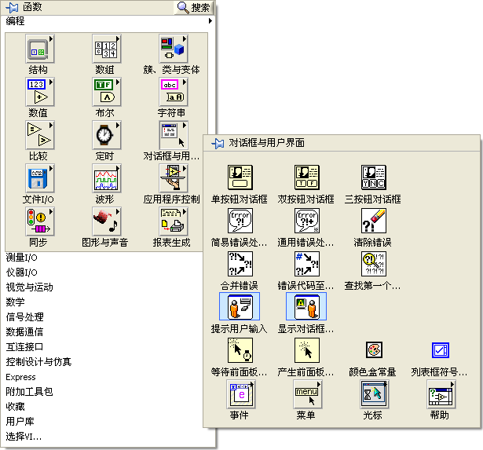
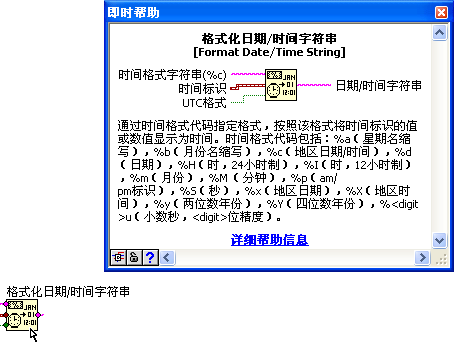
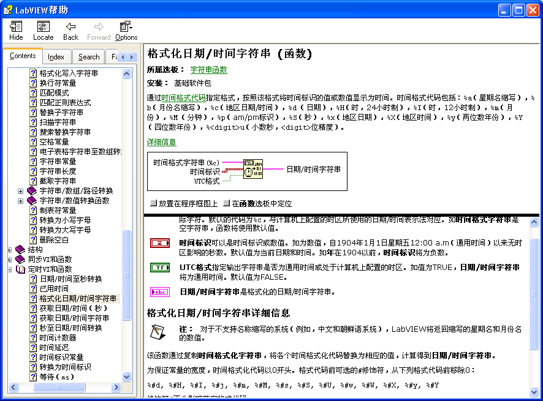
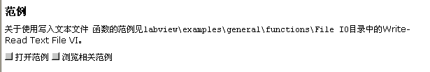
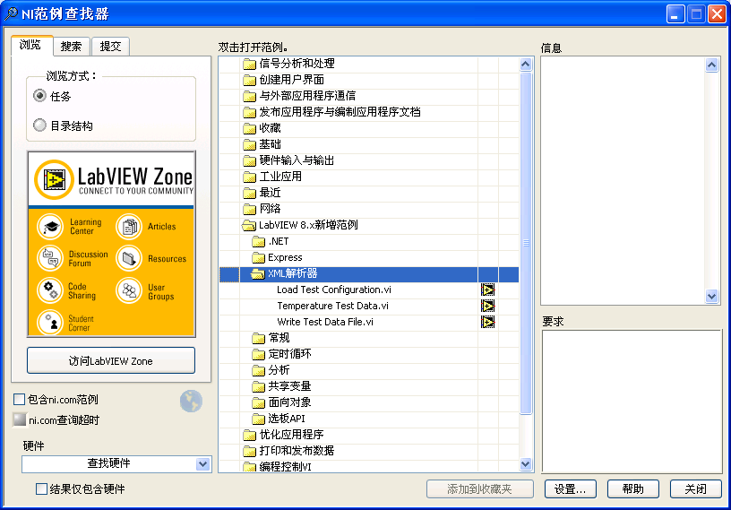
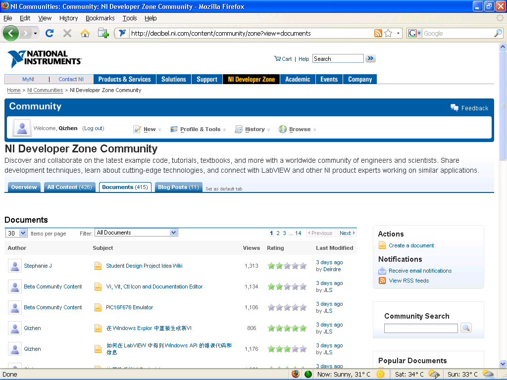
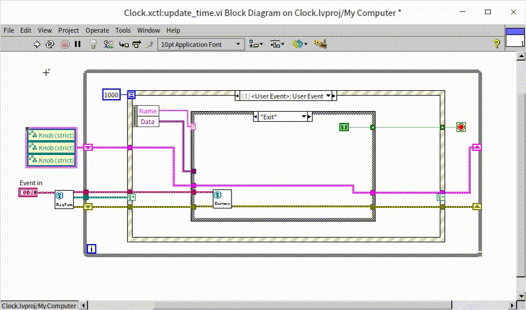
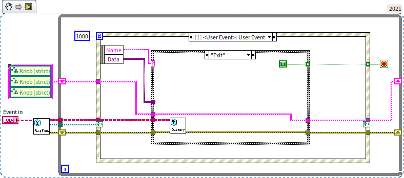
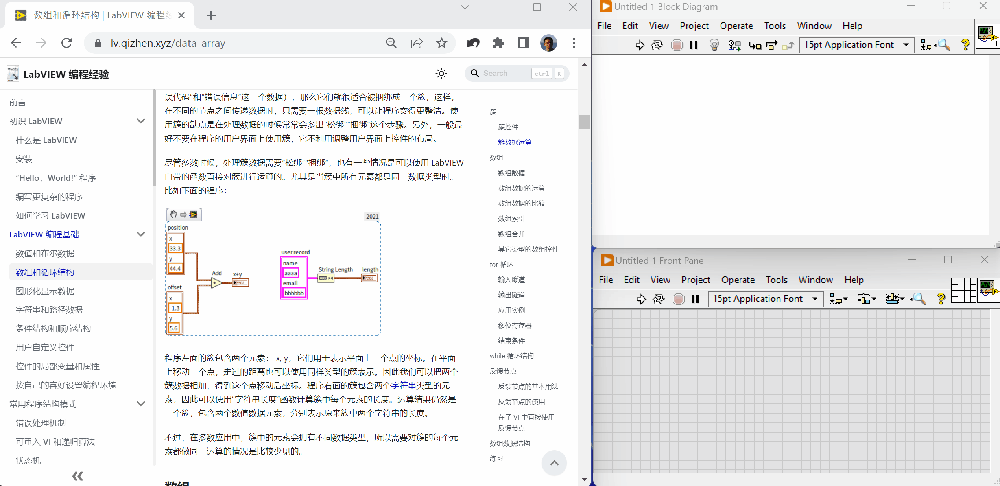

# How Do We Learn

## Approaches to Learning LabVIEW

The proverb, "Give a man a fish and you feed him for a day; teach a man to fish and you feed him for a lifetime," applies perfectly to learning LabVIEW. As we progress through this book, detailed step-by-step instructions for writing programs will become less frequent. Instead, the goal is to help you find the most effective approach for mastering LabVIEW on your own. Here, we explore three primary styles of learning: systematic, exploratory, and goal-driven. These approaches are not mutually exclusive, and you can choose the combination that best fits your personality, learning style, and background.

### Systematic Learning

Systematic learning is the traditional structured approach common in academic settings, where you follow a curriculum designed by others. The effectiveness of this method depends on your own engagement, as well as the quality of the instructor and the materials. For LabVIEW, this often means taking formal training courses, such as those offered by NI. In these courses, a beginner can typically learn to write basic programs in just a week. Many universities also offer LabVIEW courses. If you are self-studying, a structured tutorial book or video series is a great alternative. Look for materials that focus on core concepts and programming principles, rather than books that simply list functions and VIs (which are better suited as reference manuals).

### Exploratory Learning

Exploratory learning is ideal for those who prefer self-guided discovery. Concepts you figure out on your own often stick with you much longer. Since no tutorial can cover every single LabVIEW function, opening up unfamiliar menus or palettes and experimenting with different blocks can be highly educational. Reading the LabVIEW Help documentation before trying a new feature can speed up this process. Reviewing code written by other developers is also a great way to expand your horizons, as individual exploration has its limits. In fact, many of the programming techniques shared in this book are drawn from code written by other engineers.

### Goal-Driven Learning

Goal-driven learning is common among working professionals. Many people naturally prefer not to learn a skill until they actually need it for a project or task. While highly efficient, this approach can lead to a narrow focus on immediate troubleshooting. In these situations, seeking guidance from experienced colleagues or in-house experts is incredibly helpful. If you don't have local resources, posting on developer forums is a great way to get help.

Each of these learning styles has its strengths, and combining them can significantly enrich your journey.

## Self-Learning LabVIEW

While systematic and goal-driven learning are great for passing exams or meeting project deadlines, truly mastering LabVIEW requires hands-on exploration. Exploratory learning is self-directed and free from the constraints of structured courses or textbooks.

Fortunately, LabVIEW's graphical nature makes self-directed exploration much easier compared to text-based programming languages.

First, icons convey meaning much faster than code syntax. A beginner looking at a LabVIEW function icon can often guess what it does at a glance. For example, seeing the square root function () immediately tells you its purpose. LabVIEW also lets you show text labels on functions to clarify their role. By contrast, a text-based function like `sqrt()` might not be intuitive to a beginner or a non-native English speaker who isn't familiar with the abbreviation.

Here's an example of a labeled function:

Second, LabVIEW organizes all functions, structures, and subVIs into a hierarchical, categorized menu called the **Functions Palette**:

Most text-based languages do not offer a visual, categorized directory of all their built-in features for real-time reference. In a text editor, you write functions manually. While autocompletion helps—typing `sq` might suggest `sqrt`—it cannot help if you don't know the name of the function you need (for instance, a function to convert a float to a hex string). In that case, you have to search external documentation or write the helper function yourself.

In LabVIEW, finding solutions is often much more intuitive. Even as a beginner, you can navigate the visual categories to find what you need. A float-to-hex string converter, for example, is naturally located under the **Numeric** or **String** palettes, or a dedicated data conversion category.

This structural layout allows you to browse and learn at your own pace without constantly referencing external books. If you know your project will involve string manipulation, you can browse the **String** palette beforehand to see what functions are available. This proactive browsing makes it much easier to remember what tools are at your disposal when you need them.

In addition to palettes, get in the habit of exploring context menus and settings. Right-clicking front panel controls or block diagram elements reveals their properties and configuration options. Often, exploring a menu out of curiosity will lead you to a built-in feature that solves your problem.

As a quick exercise, try to find the **While Loop** structure in the Functions Palette. Also, locate basic math functions like addition, subtraction, multiplication, and division. You will be using these frequently in the chapters ahead.

## Online Help and Documentation

For simple functions or menu items, you can often guess their purpose and verify it with a quick trial. For complex functions, however, guesswork is inefficient. You should make a habit of consulting LabVIEW's built-in help resources.

The LabVIEW Help is an essential yet underutilized tool. While older versions were English-only (presenting a barrier for non-native speakers), today NI provides fully localized documentation in several languages, making the platform highly accessible.

The fastest way to get help is the **Context Help** window. This floating window dynamically displays description and wiring information for whatever object your mouse is hovering over. To open it, click the yellow question mark icon () on the toolbar of either the front panel or the block diagram, select **Help -> Show Context Help** from the menu, or press **Ctrl+H**:

In the example above, the **Format Date/Time String** function is placed on the block diagram. While its name suggests its general purpose, formatting a date/time string requires specific format codes (like `%Y` or `%m`). Hovering your mouse over the function with Context Help open immediately displays a list of these codes in the floating window.

In the bottom-left corner of the Context Help window, you will find three small icons. Try clicking them to see how they change the detail level and layout of the window. You can also drag various structures or subVIs onto the block diagram and hover over them to see the Context Help update.

While Context Help is great for quick reference, it is often too brief. For deeper explanations, hover over the node and click the **Detailed Help** link at the bottom of the Context Help window (or click the blue question mark). This will open the main LabVIEW Help browser directly to the documentation page for that specific function:

This official documentation details the behavior of every node and parameter. It is the most complete and authoritative reference available. Make it your first stop when exploring new functions.

You can open the main help browser anytime by selecting **Help -> Search LabVIEW Help** from the menu. Use the **Index** or **Search** tabs to look up topics.

Of course, official documentation has its limits. It tells you what a function does, but not *how* to use it effectively, *when* to choose it over another, how to design clean user interfaces, or how to write high-performance code. Providing that practical, real-world context is the goal of this book.

## LabVIEW Examples

While documentation is helpful, abstract concepts are often much easier to understand through working code.

At the bottom of many help pages, you will find direct links to related example VIs. Clicking **Open Example** opens the program in LabVIEW so you can run it and inspect its block diagram:

You can also browse all available examples using the **NI Example Finder**. Launch it by selecting **Find Examples** on the LabVIEW welcome screen, or by going to **Help -> Find Examples** in the menu:

The Example Finder allows you to browse examples by category. For example, to learn about file I/O, you would navigate to **Basics -> File Input and Output**.

*Note: The examples shown in the finder depend on the drivers and toolkits you have installed via the NI Package Manager. If you are looking for hardware-specific examples (like sensor data acquisition) but cannot find a "Hardware Input and Output" folder, make sure you have installed the necessary drivers (like NI-DAQmx).*

If you are online, checking the **Include ni.com examples** box in the bottom-left corner of the finder lets you search the extensive library of examples hosted on NI's website.

Many of these online examples are contributed by the community. You can search or share your own VIs on the [NI Forums](https://forums.ni.com/):

Finally, keep in mind that many built-in LabVIEW functions and palette VIs are open; you can double-click them to inspect their block diagrams and learn how NI's engineers wrote them. The example VIs shown in this book are also available in our GitHub repository at [code](https://github.com/ruanqizhen/labview_book/tree/main/code).

## Seeking Help

If you encounter a programming hurdle that documentation or examples cannot resolve, asking other developers is often the fastest path forward. You can consult colleagues, NI technical support, or turn to the global online community.

Here are the best online platforms for seeking help:

- **Search Engines:** Searching for specific LabVIEW error codes or warning messages on Google or other search engines will often lead to forum threads detailing the exact solution.
- **[NI Forums](https://forums.ni.com/):** The official NI community forum is very active and frequented by NI support engineers and product developers. While there are regional sub-forums, posting in the English section typically yields the fastest and most detailed replies.
- **[LAVA (LabVIEW Advanced Virtual Instrument Association)](https://lavag.org/):** LAVA is the largest independent LabVIEW community. It is an outstanding resource for advanced technical discussions and architectural support.
- **Large Language Models (LLMs):** AI assistants are now a staple for developers. Because LabVIEW is a visual programming language, LLMs cannot generate block diagrams or connect wires for you. However, they are excellent for explaining concepts, troubleshooting error codes, or mapping LabVIEW paradigms to text-based ones (e.g., asking: *'How does a LabVIEW shift register compare to a static variable in C++?'*).

## Sharing LabVIEW Code

Sharing and version-controlling LabVIEW code comes with unique challenges due to its binary, graphical format (see [The Challenges of LabVIEW](appendix_problem)). When asking for help online, explaining visual code is very different from pasting text.

You have three primary options for sharing LabVIEW code, each with its trade-offs:

- **Attaching VI Files:** You can upload your raw `.vi` files. However, others must download and open them in LabVIEW. Also, LabVIEW files are not backward-compatible: a developer using LabVIEW 2020 cannot open a VI saved in LabVIEW 2023.

- **Posting Screenshots:** Sharing an image of your block diagram is convenient because anyone can view it instantly in their browser. However, a static screenshot cannot capture hidden layers (such as different cases in a Case Structure or subdiagrams in a Stacked Sequence). Furthermore, others cannot run or debug your code without manually rebuilding the entire diagram block-by-block.

- **VI Snippets:** The most convenient way to share code is via a **VI Snippet**. A VI Snippet is a PNG image of your block diagram that embeds the actual source code and layout structure in its XML metadata. When viewed in a browser, it looks like a normal screenshot. But if you drag and drop that PNG file directly onto a blank LabVIEW block diagram, LabVIEW reconstructs the functional, editable code.

To create a VI Snippet, select the portion of code you want to share on your block diagram, select **Edit -> Create VI Snippet from Selection** from the menu, and save the file:

A VI Snippet includes a distinctive border indicating it can be dragged into LabVIEW. Here is a VI Snippet of a simple block diagram:

In this book, we use VI Snippets for code illustrations wherever possible. You can test these programs by dragging the images directly from your browser onto a blank VI's block diagram:

*Warning: LabVIEW embeds the code logic inside the PNG file's metadata. If you upload a Snippet to platforms that compress images or strip metadata (such as Discord, Slack, WeChat, or image-hosting sites like Imgur), the embedded code will be lost. The image will become a flat screenshot. To preserve the metadata when sharing via chat or email, compress the PNG into a `.zip` archive first.*

## Practice Exercise

- Search a LabVIEW forum and sign up for an account.
- If you know of any popular LabVIEW forums or discussion groups, please share them in the comments section below this chapter.
