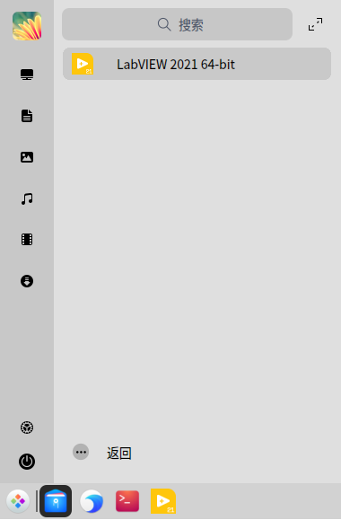
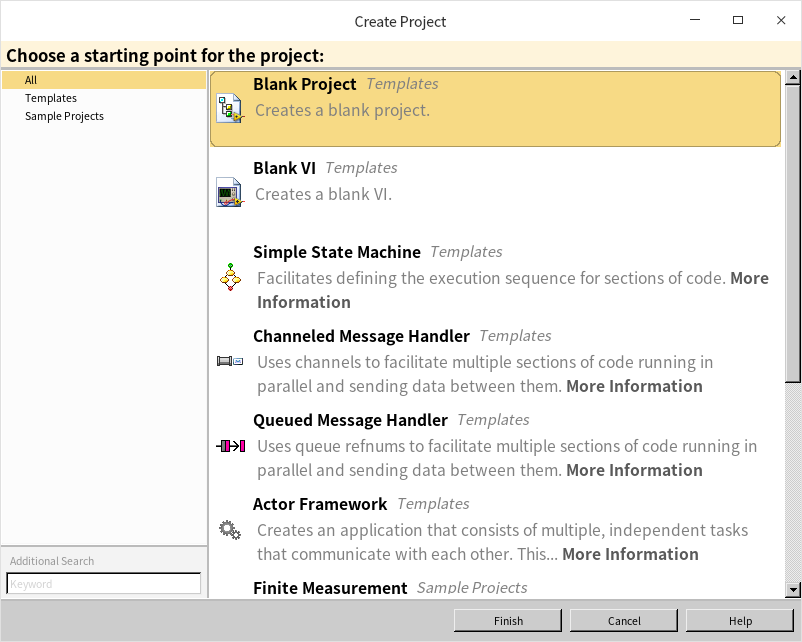

# Install

Most readers probably have LabVIEW installed already, but if you don't, NI offers a free Community Edition that is perfect for learning. You can download it from NI's [official website](https://www.ni.com/en-us/shop/labview.html). Make sure to choose the 'Community' version, as others require a paid license. The Community Edition includes almost all the features of the Professional Edition, with the sole restriction that it cannot be used for commercial purposes.

To download it, you will need to create a free NI account by clicking 'Create an Account' in the top-right corner of the NI website. You will also use this account to activate the software after installation.

On Windows, installation is managed by the NI Package Manager (NIPM). When you run the installer, NIPM will ask you to select the components you want to install. For beginners, the default **LabVIEW Core** is sufficient. You can safely deselect additional hardware drivers (such as NI-DAQmx or NI-VISA) and specialized toolkits to save considerable disk space. After making your selections, follow the installation wizard to complete the setup, then log in with your NI account to activate the software.

Historically, LabVIEW supported macOS with an installer similar to the Windows version. However, please note that NI has discontinued macOS support in newer releases of LabVIEW. If you are using an older or legacy version of the Community Edition on Mac, you can install it using the standard `.dmg` package from the NI website.

For Linux, LabVIEW officially supports select distributions, including Red Hat Enterprise Linux (RHEL), CentOS, openSUSE, and Ubuntu. If you are on a supported distribution like Ubuntu, installation is straightforward: download the NI repository `.deb` file, install it, and then use the standard `apt` package manager to install LabVIEW natively.

If you are running an unsupported Debian-based distribution and only have access to the `.rpm` packages, you can convert them to `.deb` format using the `alien` package conversion tool.

First, install `alien`:

```sh
sudo apt-get install alien
```

Next, extract the downloaded LabVIEW installation package. Navigate to the `rpm` subdirectory and convert the packages to `.deb` format. Since some RPMs are for legacy 32-bit systems, you can delete any files containing `i386` in their names before running:

```sh
sudo alien *.rpm --scripts
```

Finally, run the following command to install all the .deb packages:

```sh
sudo dpkg -i *.deb
```

LabVIEW will be installed in `/usr/local/natinst/LabVIEW-20xx-64` (where `xx` represents the version year). You can launch it by running `./labviewcommunity` from that directory.

The start menu shortcut included in the installation package might not work out of the box on some Debian distributions:



Linux desktop shortcuts are stored in `/usr/share/applications/`. Find the file named `labview64-20xx.desktop`, open it in a text editor, and update the `Exec` line to: `Exec=/usr/local/natinst/LabVIEW-2021-64/labviewcommunity %F`. This will enable launching LabVIEW directly from your system's application menu.

While using an officially supported OS is critical for commercial work, troubleshooting these configurations is a great way to deepen your technical knowledge during the learning phase.

The LabVIEW 2021 startup screen looks like this, offering options to create a new file or open existing ones:


If you choose to start a new project, LabVIEW provides several templates to help you begin quickly:


