# 条件结构和顺序结构

## 条件结构

LabVIEW 中的条件结构由多个分支组成，每个分支中有不同的程序代码。条件结构根据输入数据的不同，每次只执行其中一个分支中的代码。这与 C 语言中的 if else 和 switch 语句的功能相类似。

上图是一个条件结构。它的外观与之前介绍过的[循环结构](data_array)有些类似，也是一个矩形框架，但是在条件结构这个框架内，是存在多个分支页面的，虽然它每次只能显示一个页面的内容。

条件结构左侧带问号的小矩形是分支选择器。条件结构根据流入分支选择器的数据的值来决定执行某一分支内的代码。条件结构上方带文字的矩形方框是选择标签，文字表示了当前显示的分支的条件。鼠标点击该处，可以修改当前分支的条件；点击向下的三角形，可以按顺序列出选择框所有的分支条件，并切换分支；点击选择标签两侧的小三角，可以依次切换至其它分支。如果需要顺序的翻看每个分支，也可以把鼠标光标挪到条件结构内，然后按住键盘的 Ctrl 键，再滚动鼠标滚轮，顺序翻页到相邻的分支。

### 布尔类型条件选择结构

条件结构的一种常见程序模式是：首先比较某个数据，然后把比较的结果传递给分支选择器。条件结构中的两个分支分别是比较结果为“真”、“假”时需要执行的代码。如下图所示：

其实，在 LabVIEW 中最为常见的布尔型条件结构是用来处理错误数据的。很多子 VI 都有两个专门用于错误处理的参数：“错误输入”和“错误输出”，这两个参数的数据类型是在[簇数据类型](data_array)一节中介绍过的错误簇。子 VI 中最外层的结构就是一个条件结构，“错误输入”的数据线直接连至它的分支选择器。如下两图所示：

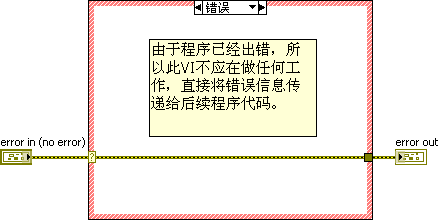

若“错误输入”是一个错误信息，表示之前的程序已经出错，条件结构执行“错误”分支。由于先前程序已出错，这个子 VI 就没有必要再运行后续的功能了，直接把错误信息传递给后续程序即可。所以错误分支中无任何代码。

若“错误输入”并非错误信息，表示之前的程序运行正常。条件结构执行“无错误”分支。该分支中包含有这个 VI 所需完成的全部功能的代码。

这是 LabVIEW 中使用最为普遍的错误处理机制，本书将在[错误处理机制](pattern_error_handling)一节详细介绍它的机制。

### 其它数据类型的条件选择

字符串、整数和 [枚举类型](data_custome_control) 的数据也可以作为条件结构的条件。布尔类型数据只可能有两个值：“真”或“假”，相应的条件结构也只需要为其配备两个分支；而另外这三种类型的数据，它们可能使用的值通常都是比较多的，相应的条件结构也需要配备多个分支去处理不同的条件值。

当需要为条件结构增加新的分支时，可以用鼠标在条件结构的边框上右键点击，然后在弹出的菜单中选择“在后面添加分支”/“在前面添加分支”，或者想要在新分支内利用一些当前分支的代码，就选择“复制分支”。然后设置新分支的条件。 

条件结构中的一个分支可以对应多个条件，不同条件间用逗号隔开。比如下图所示条件结构的第三个分支有三个条件，当输入分支选择器的数值为 2、4、6 时，都会执行这一分支：

条件标签还可以是一段值，在两个值之间用两个点连接就表示这两个数值之间的一段值。比如上图中的第四个分支表示该分支的条件是 7 到 11。当输入数据为 7 至 11 中的任何一个数值时，都会执行这个分支。第五个分支的条件标签表示所有大于等于 12 的数值。用字符串作为条件时，也可以表示一段值，其数值就是与字符串对应的 ASCII 码。

不同分支的条件必须是唯一的。如果同一个条件出现在不同的分支标签中，VI 会报错，不能运行。

### 是否要设置默认分支？

大家可能已经注意到了，选择结构有些分支可能会被标识为“默认”（Default），如果输入的条件值，不满足任何一个结构内分支的条件设定，条件结构就会执行默认分支内的代码。如果输入条件是布尔类型数据，条件结构只需要两个分支，一般不用考虑设置默认分支；如果条件是其它类型的数据，条件结构已有的分支不能覆盖所有可能的条件值的时候，VI 会报错，不能运行，比如下图的程序，条件是整数类型，分支没有处理 0 和 1 条件值，所以 VI 报错：

这时候，我们有两个选择，一是把已有的一个分支设为默认分支，在条件结构框的右键菜单中选择“把当前分支设为默认”(Make This The Default Case)。或者，不使用默认分支，可以为缺失的 0 和 1 添加相应的分支，也可以把一个已有分支的条件范围改动一下，让它覆盖到 0 和 1：

那么两种解决方案哪个好呢？作为初学者来说，使用默认分支会感觉好一些，因为操作起来最方便。尤其值得一提的是，当条件是一个 [枚举类型](data_custome_control)  的时候，它的值的个数是有限的，我们可以在条件结构中为每个条件都设置好相应的分支。但是，将来程序可能会出现变动，可能会在枚举类型中添加一个新的条目，或改动某个条目的名字。如果条件结构没有默认分支，作为条件的枚举类型一旦改动，VI 就会出错；而如果条件结构有默认分支，则 VI 不会报错，还能运行。

笔者的亲身体会是这样的：在做简单小项目的时候，希望程序能运行，出了结果就好，其它都是怎么方便怎么来。但是，如果编写一个大型项目的时候，最大的难题就变成了如何才能提高程序的稳定性，可扩展性，可维护性。这时候可能会发现，一个有隐患的程序能运行还不如不能运行。

首先，从后果的严重性考虑，如果程序运行返回错误，可以提示程序员去查找修正错误。否则，程序员以为程序没有问题，交给客户之后，被客户现它的结果不对，那问题就严重了。

其次，是从解决错误的成本考虑。解决程序中错误最耗时的不是修改，而是定位，找到错误。如果一个程序运行基本上都没问题，可就是有 1% 左右的概率，会随机的返回错误结果。这种 bug 是最难调试的，因为都不知道它与什么有关。但如果一个 bug 能够让程序返回一个错误代码，那就好多了，程序员就可以从出错信息中获得线索，更快的定位 bug。更理想一点的状态是，bug 能够直接导致程序甚至无法编译（也就是 VI 无法运行），这样 LabVIEW 系统甚至直接就可以帮助程序员定位到问题所在之处。

还是以枚举类型条件为例，程序最开始设计条件结构时，很可能并没有预料到将来会添加一个条件值。这个新添加的条件值，有可能是需要在条件结构中做一些特殊处理的。如果 VI 在改动枚举类型后，并不报错，程序员就有可能忘记去更新条件结构，这就是个隐患。相反，如果条件结构中没有默认分支，枚举类型被改动后，VI 会报错，就相当于强迫程序员必须去更新条件结构。

这可能是一个比较违反最初直觉的原则：如果程序有可能出错，那么我们会希望它越早出错越好，错误越严重越好，最好能够在编译时就报错。

### 合理设置选择条件

LabVIEW 条件结构的一个主要缺陷是：每次只能显示一个分支中的代码。用户必须翻页才能看到其它分支的代码，这严重的影响的程序的可读性。为了抵消这一缺陷，我们在设计条件结构的时候，首先要尽量避免嵌套的条件结构，其次再尽可能减少分支数量。利用条件选择器可以接受多种数据类型、每一分支又可以处理多个条件的特点，合理设置条件结构的判断逻辑，可以大大简化代码的复杂度。

比如，要求比较两个输入整数：a 和 b。a > b 时，弹出对话框显示“a > b”；a = b 时显示“a = b”；a < b 时显示“a < b”。编写这个程序并不困难，但是如果直接按照程序要求的逻辑来编写程序，程序中会出现一个嵌套的条件结构：

当代码中存在嵌套的条件结构时，阅读程序需要在不同的条件结构中翻页查看，可读性会更差。稍微改动一下程序的条件判断逻辑，即可避免条件结构的嵌套。比如，我们可以利用 a、b 的差值来判断它们的大小关系，这样仅需一个条件结构即可实现所需的功能：

上图所示程序的另一处优化，是把每个条件分支中共同的代码“单按钮对话框”提取至结构之外，这样即可以改善程序的可读性，也可以提供程序运行效率。把共同的代码放在结构之外，这个原则在条件结构中是务必遵循的。

再举一个例子，输入 a，b 两个布尔参数，a 和 b 的值在不同情况下完成不同工作。我们先把 a 与 b 组成一个布尔数组，再把它转换为数值，这样，两个布尔数据的不同组合就被转换成了一个大小在 0 ~ 3 之间的整数，使用整数判断条件，避免了条件结构嵌套。

### 隧道

与循环结构相类似，数据在流入流出条件结构时，也要通过隧道。但条件结构的隧道只有一种：数据流入条件结构的隧道，其输入端在结构外侧，它可以与其它节点的输出端相连接；其输出端在条件结构内侧，条件结构每个分支都可以使用隧道输入端的数据。而数据流出条件结构的隧道则正相反，它的输出端在结构外侧，输入端在结构内侧。

虽然条件结构每次只执行其中某一分支的代码，但编程的时候并不知道某一次运行会执行哪个分支，所以每个分支都必须为输出隧道的输入端接上数据线。这样编程是比较繁琐的，多数情况下，可能只有某个分支中才会产生一个有意义的输出数据，供结构外代码使用，其它分支只需提供一个默认值就可以了。所以，一个偷懒的编程方法是把输出隧道设置为“未连线时使用默认值”。这样，如果某一分支不传递任何数据给这个输出隧道的输入端，输出隧道就使用该数据类型的默认值作为输出。

关于隧道要不要设置“未连线时使用默认值”的考量，与上文提到的是否要为条件结构设置默认分支，是非常类似的问题。

在很多场合，条件结构的输出隧道是与某一输入隧道相对应的。如果程序没有特殊说明，流出结构的数据应当与流入结构的数据相同。如果希望把这种有对应关系的输入输出隧道的各个分支，一次性都连接起来，可以鼠标右键点击输出隧道，选择“连接输入隧道 -\> 创建并连接未连接的分支”，再用鼠标点击一下输入隧道，即可在每个分支中把输入输出隧道连接起来：

### 避免把控件放在条件结构内

假设我们需要编写一个子 VI，它有两个输入参数，一个是整数“condition”，一个数实数数组“input array”。当“condition”的值为 2 的时候，我们需要给“input array”中的每一个元素都加 1 输出；其它情况不做特殊处理。有读者可能会考虑编写一个类似下图的程序：

这个程序的问题在于把输入和输出控件放在了条件结构内，它有两个问题：

一是逻辑上容易出错。因为输出控件被放在了条件为 2 这个分支中，如果程序执行了其它分支，那么不会有数据传递给输出控件“output array”，那么它的输出值是不确定的（它会保持上一次的值，但我们不能确定程序运行时上一次是什么值），这可能会引起调用它的程序代码得到了意料之外的结果。

二是，这样的代码运行效率会差很多。我们会在[内存优化](optimization_memory)一节详细讨论它的效率问题。

所以，在编写类似程序时，一定要注意把输入输出控件放置在条件结构之外：

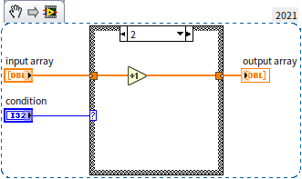

:::tip

如果需要在代码比较密集的地方再插入一些代码，可以先按住 Ctrl 键，再在需要插入代码的地方按住鼠标左键，拖动鼠标，就会把原本附近的代码挤走，开辟出一块空白区域供插入新的代码。

:::

## 选择函数

条件结构的可读性比较差，但它又是程序必不可少的一种结构。不过，在某些情况下，可以使用选择函数（位于“编程 -\> 比较 -\> 选择”函数选板）来代替条件结构。选择函数有三个输入，其中第二个输入参数的数据类型必须是布尔类型；另外两个参数的数据类型必须相同。当输入的第二个参数为“真” 时，函数把第一个输入参数的值作为输出；否则把第三个输入参数的值作为输出。这类似于 C 语言中的 `y = x ? a : b;` 语句。

如果条件结构的分支选择数据参数为布尔类型，或者可以转换为布尔类型，且每个分支只是用来选择一个不同的数值，则这个条件结构完全可以用选择函数代替。比如，上文介绍过的这段程序：

它的条件结构就可以用下图中的选择函数代替：

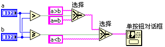

使用选择函数最明显的优点是，所有候选数据都直接展现在程序框图上，用户一眼便可了解整个程序的逻辑，程序可读性大大提高。

## 顺序结构

### 程序执行顺序

LabVIEW 是数据流驱动的编程语言，程序沿着数据在连线上的流动方向顺序执行。LabVIEW 又是自动多线程的编程语言。如果在程序中有两个并行放置、之间无任何连线的模块，则 LabVIEW 会自动把它们放置到不同的线程中，并行执行。比如下图中的程序：

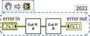

数据从控制控件 error in 接线端流出，流经子 VI “Sub VI A” 和 “Sub VI B”，最后流入显示控件 error out 的接线端。这个程序的执行顺序也就是数据流动的顺序：先运行 “Sub VI A”，再运行 “Sub VI B”。

下图是两个子 VI 并行执行的例子：

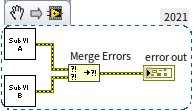

子 VI “Sub VI A” 和 “Sub VI B” 之间没有数据线相连接，LabVIEW 认为这两个子 VI 没有先后顺序依赖，就会同时运行这两个子 VI。函数“Merge Errors”位于函数选板“编程 -> 对话框与用户界面”，它负责把多个错误簇数据合并成一个。本书在[错误处理机制](pattern_error_handling)一节会详细介绍它的用途。它与子 VI “Sub VI A” 和 “Sub VI B” 之间均有数据线相连，它所需的输入数据是由这两个子 VI 输出的。所以这个 VI 的执行顺序是：子 VI “Sub VI A” 和 “Sub VI B” 同时开始运行，当它们都执行结束后，函数“Merge
Errors”得到了全部输入数据，开始执行。

### 创建顺序结构

没有数据线相连的各函数或子 VI 之间，也可能需要有执行顺序的依赖关系。比如上图中的程序，假设“Sub VI A”完成的工作是在某文件中写入一个数据，而“Sub VI B”需要从文件中读出此数据。那我们就知道，程序应当按顺序执行完“Sub VI A”，再执行“Sub VI B”。然而，它们之间没有数据线相连，我们需要将它们的顺序关系以另一种方式告诉 LabVIEW。

要让相互之间没有数据线相连的几部分代码，按照特定顺序执行，可以使用顺序结构。在函数选板中选择“编程 -\> 结构 -\> 平铺式顺序结构”，就可以在程序框图上放置一个顺序结构。

初次被放置在程序框图上的是一个深灰色的方框，这是一个只有一帧的顺序结构。在顺序结构的右键菜单中选择相关的选项，可以为顺序结构添加新的帧。结构的每一帧内都可以放入程序代码。当程序运行到顺序结构时，会按照帧的顺序依次执行每一帧。平铺式顺序结构按照从左到右的顺序依次执行每一帧的代码。

在程序框图上放置顺序结构时，可以先在程序框图的空白处放置一个结构，再在结构体内添加代码。也可以把程序框图上已有的代码，直接放置在新添的结构体内。具体操作方法是：在函数选板上，选择顺序结构；然后在程序框图的那些打算放入结构的代码的左上方按下鼠标左键，拖曳出一个包含所有需要放入结构的代码的矩形；释放鼠标，就创建了包含指定代码的结构。过程如下图所示：

放置好的顺序结构：

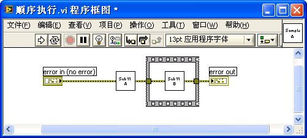

顺序结构有两种模式：平铺式顺序结构与层叠式顺序结构。这两种模式的功能完全相同，它们的区别仅仅在于：平铺式顺序结构可以把所有的框架按照从左到右的顺序展开在 VI 的框图上；而层叠式顺序结构的每个框架是重叠的，每一时刻都只有一个框架可以直接在 VI 的框图上显示出来。层叠式顺序结构的框架正上方显示有每一帧的编号，程序运行时按照编号顺序执行每一帧。

### 层叠式顺序结构

LabVIEW 的早起版本只有层叠式顺序结构，而现在层叠式顺序结构已经在函数选板上消失了。LabVIEW 的这一发展恰好体现了什么样的编码风格才是 LabVIEW 所推荐的，所以本书还是从层叠式顺序结构讲起。

假设需要编写一个 VI，用于测试某一段程序代码运行所耗费的时间。考虑的思路是：在被测试代码运行前，记录下当时的系统时间，然后运行被测试代码。被测试代码运行结束时，再记录下新的系统时间。这两个时间之差就是被测代码运行的时间。

由于记录时间的代码部分，与被测试的代码部分并无数据线相连，而它们之间又必须以一定的先后顺序执行，所以可以考虑使用顺序结构。首先使用层叠式顺序结构，它有三个帧：第 0 帧记录下系统当前的时间，也就是测试代码运行前的时间；第 1 帧中的代码是被测试代码；第 2 帧再次读取系统当前时间，这个时间减去第 0 帧读到的时间，就是第 1 帧测试代码运行的时间。

在编写这个程序的时候，遇到了一个小麻烦：第 2 帧需要用到第 0 帧提供的起始时间。也就是说，在第 0 帧产生的那个时间数据，需要传递到第 2 帧中去。由于两个接线端不在同一帧上，无法直接将这两个接线端连线。在此情况下，需要借助“顺序局部变量”。在顺序结构的边框上点击鼠标右键，选择“添加顺序局部变量”，即可为顺序结构创建一个顺序局部变量。该顺序变量在未与输入数据连线时是一个淡黄色的小矩形。把第 0 帧中“时间计数器”函数的输出值与新创建的顺序局部变量相连，数据就传给了它。该顺序局部变量与输入数据线相连后，小矩形内生成了一个与数据线颜色相同的箭头。在后续的那些帧中，可以根据需要，通过连线，把顺序局部变量中的数据引出来。

顺序局部变量上的箭头表示数据流动方向：箭头指向边框表示数据流入；箭头离开边框表示数据流出。在循环结构中，每一个顺序局部变量只能选择其中一帧将数据写入，其后的所有帧都可以从中读取写入的数据。而在这之前的任何帧中，顺序局部变量仍然是个实心矩形，表明在这些帧中，都不能读写它。层叠式顺序结构的代码可读性比较差。在程序框图上，层叠式顺序结构每次只能显示一帧。用户无法直接看到其它帧的代码，因而也难以快速了解整个程序的功能。

下图是这个程序的层叠式顺序结构的第 0 帧，调用“时间计数器”函数（在“编程 -> 时间”函数选板）读取当前系统时间：

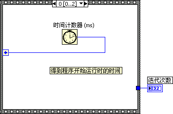

层叠式顺序结构的第 1 帧中的代码是被测试代码，它的功能是循环运行一段程序，每次循环迭代产生一个随机数，直到这个数字与给定的“比较数值”相同，才退出循环。产生随机数的函数“随机数(0-1)”位于 “编程 -\> 数值 -\> 随机数”函数选板。

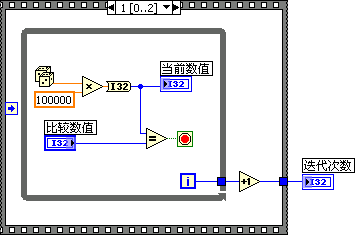

层叠式顺序结构的第 2 帧再次读取系统时间，然后与第 0 帧的到的时间相比较。

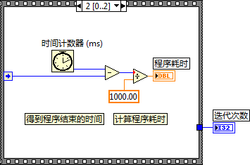

流入或流出顺序结构的数据在通过顺序结构时，也需要通过隧道。顺序结构的隧道与循环结构和选择结构的隧道类似，负责把数据传进或传出结构。在层叠式顺序结构中，对于输入隧道，每一帧均可从它读出数据；对于输出隧道，只能有一帧与其相连，写入数据。

当数据进出顺序结构时，在层叠式顺序结构上难以一眼就找到数据接收节点或数据源。比如示例中的层叠循环结构的第 1 帧产生了一个数据，从顺序结构内部流到外部，传递个控件“迭代次数”；在层叠顺序结构的第 0 帧和第 2 帧中，我们看不到这个数据是如何产生的，只有等到顺序结构切换到第 1 帧，才能找到数据来源。对于这个只有三帧的顺序结构来说，翻看一遍所有的帧，并不困难。但是，如果程序比较复杂，顺序结构超过七八帧以上，要搞清楚整个结构的功能就比较麻烦了。

顺序局部变量的使用，使得层叠式顺序结构的可读性雪上加霜。首先，顺序局部变量与隧道一样，只能通过翻看结构中的每一帧来找到数据源和接收数据的节点。其次，由于一个顺序局部变量在每一帧的位置都是固定的，必然导致某些数据线上数据流动的方向与习惯不符。

大多数人在书写文字的时候，都是按照从左到右的顺序。所以，如果程序也从左到右地执行，就比较符合大多数人的自然习惯。编写 LabVIEW 程序的时候，也应该让所有数据的流动方向是从左到右。也正是遵循了这一原则，几乎所有的 LabVIEW 的函数和子 VI 都把输入参数放在左侧，输出参数放在右侧。

但是数据在流入流出顺序局部变量时，总有一段连线要违背这个原则。例如第 0 帧中的程序，顺序局部变量在左侧，数据从时间计数函数流出后，只好向左流动至顺序局部变量。如果把顺序局部变量放在右侧，写入时数据流动是从左向右了，但在第 2 帧中读出时数据的流动就必须从右向左了。

层叠式顺序结构的存在是因为早期计算机显示器的分辨率都比较低，屏幕的可视范围内放不下太多的函数和子 VI，使用层叠式顺序结构可以在同样面积的程序框图内多放置一些代码。但是现在，编程人员使用的显示器都足够大，完全不需要使用层叠式顺序结构来增加代码密度。

### 平铺式顺序结构

在上图示例中的顺序结构框上点击鼠标右键，选择“替换 -\> 替换为平铺式顺序结构”菜单项，可以将层叠式顺序结构替换成功能相同的平铺式顺序结构。平铺式顺序结构的可读性比层叠式顺序结构好得多：

平铺式顺序结构可以在程序框图上展开显示结构中所有的帧，不再需要使用顺序局部变量。用户对整体程序结构可以一目了然，在上图的程序中，一眼就可找到 "迭代次数" 数据的来源。

平铺式顺序结构从左到右依次执行各帧的代码，在每一帧中也是从左到右执行各代码，这样保证了从左至右的整体程序的执行顺序。

平铺式顺序结构的可读性较好。因此，在必须使用顺序结构时，应当考虑使用平铺式顺序结构。当然，层叠式顺序结构也有其优点：它可以很方便地调整每一帧的先后顺序（在层叠式顺序结构的右键菜单中选择“本帧设置为......”）。

### 无形胜有形的最高境界

武侠小说中常常说：练剑的最高境界就是手中无剑。套用到顺序结构上来说，使用顺序结构的最高境界就是不用顺序结构。

以一个简单程序为例：要求在程序中设置一台仪器，再从仪器读取一个数据。但在设置后，需要等待一小段时间，设置才会生效，才可以开始读数为此，我们需要在设置仪器和读取仪器数据之间插入一个一秒钟的延时，以避免读数有误。

如果我们把程序写成如下的样子：

它是不能满足需求的。这段程序的延时代码与读写仪器的代码之间没有数据线连接，LabVIEW 就会同时执行这两段代码。所以，尽管这段程序的总运行时间会延迟至 1 秒，但仪器读写部分的代码并不受延时的影响。程序在执行完设置仪器子 VI 后，立即执行读取仪器数据子 VI，致使读取数据错误。

在上面的示例程序中，用到的“设置仪器.vi”和“读仪器数据.vi”是两个演示用的子 VI，在标签中已表明其功能；“仪器名称”常量表示的是某一个仪器（读者目前只需知道他代表某一仪器，仪器的具体使用方法本书会在[测试测量应用程序设计](measurement__)一章去讲解）；两个子 VI 之间下方的连线是错误数据线；“等待（ms）”是 LabVIEW 自带的用于延时的函数，位于“编程 -\> 定时”函数选板。

上面的示例程序需要改进一下，利用顺序结构才可以确保程序的时序正确：

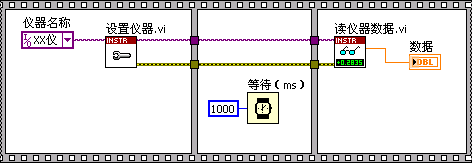

上图中的代码还可以再改进一下。在这个程序中，我们只需要保证“等待”函数的执行顺序，没必要把其它代码也挪入顺序结构中。改进后的程序如下所示：只把“等待”函数放入顺序结构中，通过进出顺序结构的数据线控制各子 VI 的执行顺序。改进后的程序，看起来就干净利索多了：

大家也许已经注意到了，在这个程序中，真正控制程序执行顺序的已经是数据连线，而不再是顺序结构了。代码通过改变数据连线方式，控制数据的流动顺序，从而控制了程序的执行顺序。既然数据连线才是 LabVIEW 中最普遍的控制程序执行顺序的方式，那就完全可以在程序中通过合理布线，替换所有的顺序结构。

回过头来再看一看上图中的程序，它依然存在着一个比较严重的问题。按照程序的逻辑，程序在执行“设置仪器”时，无论是否出错，都得继续执行“等待”函数，程序延时 1 秒才会结束。而理想的方案是，一旦“设置仪器”时出错，程序就没必要再等待了，应当立即退出。

解决方案是把程序的延时部分做成一个子 VI，下图是这个子 VI 的程序框图：

该子 VI 利用条件结构设定：只有“error in”输入“无错误”时，才执行延时；否则跳过延时。

整个程序经过优化后，就成了下图的样子。我们可以看到，利用错误连线来控制程序执行顺序大大增强了程序的可读性。

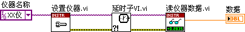

使用这种方法，移走所有的顺序结构，是使得程序代码更有效更美观的重要手段之一。比如，一个比较直接的方案是，把顺序结构中的每一帧中的代码都做成一个子 VI，并且让这个子 VI 具有错误输入输出参数。这样就可以通过错误数据线把它们串联起来，这样的由几个子 VI 顺序连接组成的程序是最简单易懂的了。

这的一提的是，笔者在最初编写上图的示例的时候，LabVIEW 中还没有自带的带有错误输入输出的 VI，但是目前新版本 LabVIEW 中已经自带了这样的子 VI，分别是“Time Delay” [Express VI](measurement_express_vi) 和“High Resolution Polling Wait.vi”：

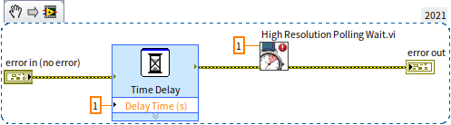

## 练习

* 编写一个 VI。VI 只有一个字符串类型的输入控件，这个字符串是一个简单的四则运算表达式，它只有固定的三个部分：第一部分是一个整数，第二部分是加减乘除中的一个运算符，第三部分是另一个整数。比如，输入可以是 "23-6", "445*78"等。VI 对输入的表达式进行运算，返回输出结果。比如当输入为 "45+7" 时，返回 52。
* 编写一段新的程序，序测量一下你为上一个题目编写的 VI 的运行时间。

