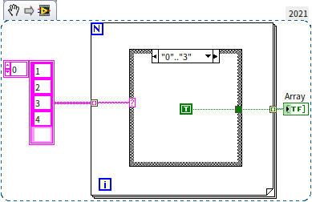
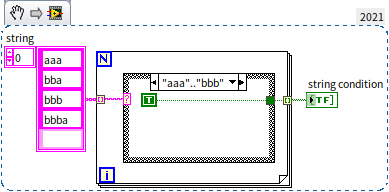
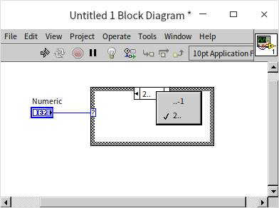
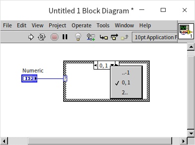
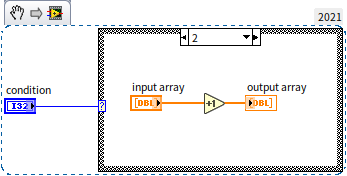
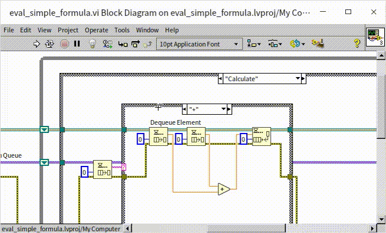

# Case and Sequence Structures

## Case Structure

In LabVIEW, a Case Structure consists of several branches. Each branch contains its unique set of subdiagram. The structure operates by examining the input condition and executing the code in only one of its branches, depending on this condition. This is akin to the `if else` and `switch` statements in C language.

The image above illustrates a Case Structure, which shares a resemblance to the [Loop Structure](data_array#for-loop) we previously discussed. It's enclosed within a rectangular frame, but distinctively, it houses multiple branch pages. Notably, only one page's content is visible at any given moment.

On the Case Structure's left, a small rectangle marked with a question mark serves as the case selector. The structure determines which branch to execute based on the data received by this selector. Above the structure, there’s a rectangular label, known as the selector label. This label indicates the condition of the branch currently on display. You can modify the condition of the branch by clicking on this label.

Further, a downward triangle next to the selector label reveals a list of all the branch conditions. This feature allows for easy switching between different branches. Additionally, small triangles flanking the selector label enable sequential navigation through the branches. For a hands-on exploration, place your cursor within the structure, hold down the Ctrl key, and use the mouse wheel to scroll. This action lets you navigate through the branches sequentially, providing a comprehensive view of the Case Structure's functionality.

### Boolean Case Structure

Boolean case structures are a fundamental pattern in programming, often used to process the results of data comparisons. Typically, these structures consist of two branches: one executes if the comparison is "True", and the other if it is "False". For instance:

In LabVIEW, Boolean case structures are frequently applied to manage error data. This is particularly evident with many subVIs, which include two dedicated parameters for error handling: "Error In" and "Error Out". These parameters employ a specific data type known as error clusters, a concept introduced in the [Cluster](data_array) section. Usually, at the heart of a subVI's structure is a case structure, with the "Error In" data line directly feeding its case selector. Below are two illustrative examples:

When the "Error In" data signifies an error, it implies that the preceding program encountered an issue, triggering the "Error" branch of the case structure. Since an error has already occurred, the subVI bypasses running additional functions, instead passing the error information onward. As such, the "Error" branch typically does not contain any operational code.

Conversely, if the "Error In" data does not indicate an error, it suggests that the previous program executed successfully. In this scenario, the case structure activates the "No Error" branch, containing all necessary code for the VI's (Virtual Instrument) operation.

This approach to error handling is a widely-used practice in LabVIEW. The intricacies of this mechanism will be more thoroughly explored in the [Error Handling Mechanism](pattern_error_handling) section of this book.

### Other Data Types

Case structures in programming can handle different data types, such as strings, integers, and [Enum](data_custom_control). Unlike Boolean data, which is limited to "True" or "False" and typically requires only two branches, these data types often necessitate multiple branches due to their wider range of possible values.

When expanding a case structure to include additional conditions, you can easily add new branches. Simply right-click on the case structure's border and select "Add Branch After" or "Add Branch Before" from the context menu. To reuse code from an existing branch in the new one, choose "Duplicate Branch". Afterward, you can set the specific conditions for each new branch.

It's worth noting that a single branch can respond to multiple conditions. These conditions are separated by commas. For instance, as shown in the image below, the third branch of the case structure is programmed to trigger under three distinct conditions - when the input is either 2, 4, or 6:

Furthermore, condition labels can denote a range of values. This is indicated by placing two dots between the minimum and maximum values of the range. For example, in the case structure from the above image, the fourth branch covers a range of values from 7 to 11. Thus, any input falling within this range will activate this particular branch. The fifth branch is set to handle all values greater than or equal to 12. When dealing with strings as conditions, ranges can also be defined, with the string values corresponding to their ASCII codes.

It's crucial to ensure that each branch condition is unique within the structure. If a condition is duplicated across different branches, LabVIEW will flag an error, preventing the VI (Virtual Instrument) from running. This requirement for unique conditions ensures clarity and accuracy in the execution of the case structure.

:::caution

LabVIEW exhibits some peculiar behaviors when handling case structures with conditions of different data types, particularly concerning how it interprets range conditions.

For instance, when using integer data types in a case structure, a condition like `1..3` encompasses values 1, 2, and 3, allowing any of these to match the branch. However, this logic slightly changes when dealing with string data types. If the condition is specified as `'1'..'3'` with string values, only '1' and '2' are included in the range, excluding '3'. This subtle difference in behavior can lead to unexpected outcomes in the program's execution. The two case structures illustrated below exemplify this discrepancy. While they appear very similar, differing only in the data type of their condition, they produce different results:

To correctly include the character '3' in a string condition range, the condition should be set as `'1'..'4'`. This is because, in string conditions, the upper limit of the range is exclusive. Therefore, to include all numeric characters from '0' to '9', the condition should be set as `'0'..':'` (since ':' is the ASCII character following '9'), or alternatively, as `'0'..'9','9'`. Similarly, to include the characters 'b', 'c', and 'd', you would set the condition as `'b'..'e'`.

The distinct behavior of string conditions arises from the variable length of strings and the manner in which they are sorted. It is not feasible to directly define a string that precisely precedes a specific string. For instance, directly defining all strings beginning with the character 'a' is not straightforward. Therefore, we resort to using 'a'..'b' to denote all strings starting with 'a'.

Considering these nuances, readers are encouraged to think about what the outcome of the following program might be:

:::

### Default Branch

In some case structures, you might encounter branches labeled as "Default". This default branch comes into play when the input condition values don't match any of the specified branch conditions, leading the case structure to execute the code within the default branch. For Boolean data conditions, where only two branches (True and False) are typically needed, a default branch is usually unnecessary. However, with other data types, if the case structure's branches don't account for all potential condition values, LabVIEW will flag an error, preventing the VI from running. For instance, in the program shown below, the condition is an integer type, but the branches fail to handle values 0 and 1, causing an error:

In such scenarios, you have a couple of options. You can designate one of the existing branches as the default by right-clicking it and choosing "Make This The Default Case" from the context menu. Alternatively, you could add branches for the missing conditions or modify the condition ranges of the existing branches to include 0 and 1:

So, which approach is preferable? For beginners, opting for a default branch can be more straightforward and simplify the programming process. It's important to note that with [Enum](data_custom_control), where the number of values is finite, it's feasible to create a branch for each possible condition. However, in more complex projects, the focus shifts towards enhancing the program's stability, scalability, and maintainability. In such cases, a program designed to identify and address potential issues early on may be more advantageous than one that runs without immediate errors but has underlying issues.

From the standpoint of severity, a program that returns an error prompts the programmer to locate and fix the issue. However, a program that seems to run smoothly yet produces unexpected results for the client poses a more serious problem.

Another key factor is the cost associated with fixing errors. Often, the most time-consuming aspect of error resolution in programming isn't the modification itself, but the debugging process required to identify the error. For instance, a program that is almost error-free but has a 1% chance of randomly generating an erroneous result can be particularly challenging to debug due to the uncertainty surrounding the error's cause. On the other hand, a bug that causes a program to return an error code can be more easily addressed, as the error message provides valuable clues for quicker debugging. Ideally, a bug should be detectable at the compilation stage (i.e., preventing the VI from running), enabling the LabVIEW system to assist programmers in pinpointing the issue.

Consider the case of an Enum type condition. When initially designing a case structure, you may not foresee the need to add a new condition value in the future. This unforeseen condition might require specific handling within the case structure. If the VI is updated to include or rename an item in the Enum type without a default branch in the case structure, it will result in an error. In contrast, with a default branch, the VI won't trigger an error and will continue to operate.

From my personal experience, the approach varies based on the project scale. In smaller, simpler projects, the primary goal is often just to get the program running and producing results. However, in larger-scale projects, the focus shifts to enhancing program stability, scalability, and maintainability. In such scenarios, it's often more advantageous for a program with potential issues to fail early rather than later.

### Optimizing Case Structures

A significant challenge with case structures is their limitation to displaying only one subdaigram at a time. This constraint can hinder code readability, as it may require flipping through various branches to understand the program fully. To counteract this, it's crucial to minimize the use of nested case structures and limit the number of branches during the design phase. Leveraging a branch selector that can handle multiple data types and allowing each branch to manage multiple conditions can greatly simplify your code.

Consider, for example, a scenario where you need to compare two integers, `a` and `b`. The goal is to display `"a > b"` if `a > b`, `"a = b"` if `a = b`, and `"a < b"` if `a < b`. While straightforward, strictly adhering to the program's logic might lead you to create nested case structures:

Nested structures can make reading the program more challenging due to the need to navigate between different sections. This can be improved by adjusting the program's logic to avoid nesting. For instance, using the difference between `a` and `b` as a basis for comparison can condense the logic into a single case structure:

An additional refinement in the above program is to extract the common "Single-Button Dialog" code from each branch and place it outside the case structure. This practice not only enhances readability but also improves the program's efficiency. Extracting and centralizing common code is a key strategy when working with case structures.

Here's another scenario: suppose you have two Boolean parameters, `a` and `b`, and you want to execute different actions based on their combined value. By forming a Boolean array from `a` and `b` and then converting it into a number, you can simplify the decision-making process. This approach allows you to use a single integer for logic determination, thereby avoiding nested structures:

### Tunnel

Similar to loop structures, data flows into and out of case structures through tunnels. However, case structures have only one type of tunnel: the input tunnel, which is located outside the structure and can be connected to the output terminals of other nodes. The output tunnel is located inside the case structure, and each branch can use the data from the input tunnel. While it may be cumbersome to connect each branch with data lines since you don't know which branch will execute at runtime, there is a shortcut. You can set the output tunnel to "Use Default If Unwired." In this case, if a branch doesn't pass any data to the input of the output tunnel, the output tunnel uses the default value of the data type as the output.

Considerations about whether to set the "Use Default If Unwired" option for tunnels are similar to the earlier discussion about setting default branches in case structures.

In many cases, the output tunnel of a case structure corresponds to an input tunnel. If the program doesn't specify otherwise, the data flowing out of the structure should match the data flowing into the structure. If you want to connect all branches that correspond to these matching input and output tunnels in one go, right-click on the output tunnel, select "Connect Input Tunnels -> Create and Connect Unwired Branches," and then click on the input tunnel to connect the input and output tunnels in each branch:

### Avoid Placing Controls Inside case structures

Suppose you need to create a subVI with two input parameters: an integer "condition" and a floating-point array "input array." When the "condition" value is 2, you need to add 1 to each element in the "input array" and output the result. Otherwise, you do not need to perform any special processing. Some readers may consider writing a program similar to the one shown below, with controls placed inside the case structure:

This program has two issues:

First, it is prone to logical errors. Because the output control is placed inside the branch where the condition is 2, if the program executes another branch, no data will be passed to the output control "output array." Consequently, the output value is undetermined (it will retain its previous value, but we cannot be sure of the previous value at runtime). This can lead to unexpected results in the calling code.

Second, this code is less efficient. Placing the input and output controls inside the case structure causes performance issues, which will be discussed in detail in the [Memory Optimization](optimization_memory) section.

Therefore, when writing similar programs, it is essential to place input and output controls outside the case structure:

:::tip

If you need to insert some code in a densely populated area, you can hold down the Ctrl key, click and drag the mouse in the desired location where you want to insert code. This action will push the nearby code aside and create a blank area for inserting new code.

:::

## Selector Function

case structures have relatively poor readability but are an essential part of programming. However, in certain situations, you can use the Selector function (located under "Programming -> Comparison -> Selector" in the function palette) instead of a case structure. The Selector function has three inputs, with the second input parameter requiring a Boolean data type, while the other two parameters must have matching data types. When the second input parameter is "true", the function outputs the value of the first input parameter, and when it's "false", it outputs the value of the third input parameter. This is similar to the `y = x ? a : b;` statement in the C language.

If the branch selector data parameter in a case structure is of Boolean type or can be converted to Boolean type, and each branch is only used to select a different value, then this case structure can be entirely replaced with a Selector function. For example, consider this section of code we discussed earlier:

This case structure can be replaced with the Selector function as shown in the image below:

The most significant advantage of using the Selector function is that all candidate data is directly displayed on the block diagram, significantly improving program readability.

## sequence structure

### Program Execution Order

LabVIEW is a dataflow-driven programming language where the program executes sequentially along the direction of data flow on the wires. LabVIEW is also an inherently multithreaded programming language. If there are two modules in the program placed in parallel without any wires connecting them, LabVIEW will automatically run them in separate threads concurrently. For example, in the program shown below:

Data flows from the "error in" control, goes through the subVI "Sub VI A" and "Sub VI B," and finally enters the "error out" control. The execution order of this program is determined by the flow of data: "Sub VI A" runs first, followed by "Sub VI B."

Here's an example where two subVIs run in parallel:

In this example, "Sub VI A" and "Sub VI B" have no data wires connecting them, so LabVIEW considers them independent and runs them concurrently. The "Merge Errors" function, found under "Programming -> Dialog & User Interface," is responsible for merging multiple error clusters into one. This function is explained in detail in the [Error Handling Mechanism](pattern_error_handling) section. "Merge Errors" is connected to both "Sub VI A" and "Sub VI B," so the execution order is as follows: "Sub VI A" and "Sub VI B" start running simultaneously, and once both are finished, "Merge Errors" processes the combined data.

### Creating sequence structures

In cases where there are no data wires connecting various functions or subVIs, but you still need a specific execution order, you can use a sequence structure. Select "Programming -> Structures -> Flat Sequence Structure" from the function palette to place a flat sequence structure on the block diagram.

When you first place a structure on the block diagram, it appears as a dark gray box with a single frame. You can add new frames to the structure by right-clicking on it and selecting the relevant option from the context menu. Each frame can contain program code. When the program reaches a sequence structure during execution, it will execute each frame in sequence. Flat sequence structures execute frames from left to right.

You can place a sequence structure on the block diagram by either adding the structure first and then inserting code into it or by dragging a rectangle around the existing code that you want to include in the structure. To do this, select the sequence structure from the function palette, click and drag the mouse over the code you want to include, and release the mouse button to create a structure containing the selected code.

放置好的顺序结构：

After placing a sequence structure, you can add code to it. Sequence structures have two modes: flat sequence structures and stacked sequence structures. Both modes have the same functionality; the difference lies in how frames are displayed. In flat sequence structures, all frames are displayed simultaneously from left to right, making it easier to view all code at once. In stacked sequence structures, only one frame is shown at a time, with frame numbers displayed above, indicating the execution order.

### Stacked Sequence Structure

LabVIEW initially had only stacked sequence structures, and the option for these structures has been removed from the function palette in later versions. This evolution in LabVIEW development highlights the coding style that LabVIEW recommends. Therefore, this book will begin with stacked sequence structures.

Let's assume you need to create a VI to test how long a section of code takes to execute. The idea is to record the system time before running the code to be tested, then run the code, and finally record the system time again after the code has completed. The time difference between these two instances will be the execution time of the code.

Because the code for recording time and the code for running the test are not connected by data wires and must execute in a specific order, you can use a sequence structure. Start with a stacked sequence structure, which consists of three frames: Frame 0 records the current system time, which is the time before the test code runs; Frame 1 contains the test code; Frame 2 records the system time again, which is the time after the test code completes.

While writing this program, you encounter a minor issue: Frame 2 needs access to the start time provided by Frame 0. In other words, the time data generated in Frame 0 needs to be passed to Frame 2. Since these two frame endpoints are not in the same frame, you cannot directly connect these two endpoints with a wire. In this situation, you can use a "sequence local variable."

By right-clicking on the border of the sequence structure, you can add a sequence local variable, which creates a variable within the structure. This sequence variable starts as a pale yellow rectangle when it's not connected to any input data. Connect the output of the "Time Counter" function in Frame 0 to the newly created sequence local variable. Once the sequence local variable is connected to an input data wire, an arrow matching the color of the data wire appears inside the rectangle. In the subsequent frames, you can extract data from this sequence local variable as needed by connecting wires.

The arrow on the sequence local variable indicates the direction of data flow: an arrow pointing towards the border means data flows into the variable, and an arrow moving away from the border means data flows out of the variable. In sequence structures, each sequence local variable can only be written to in one frame and read from in any frame following that. In frames before the frame where data is written, the sequence local variable remains a solid rectangle, indicating that it cannot be read or written. sequence structures with stacked frames have relatively poor readability. In the block diagram, only one frame can be displayed at a time, making it difficult for users to see the code in other frames and understand the overall program logic.

Here's Frame 0 of the program, which uses the "Time Counter" function (located in the "Programming -> Time" function palette) to read the current system time:

Frame 1 of the stacked sequence structure contains the test code, which loops until a randomly generated number matches a given "comparison value." The "Random Number (0-1)" function is found in the "Programming -> Numeric -> Random Number" function palette.

Frame 2 of the stacked sequence structure reads the system time again and compares it to the time recorded in Frame 0.

Data entering or leaving a sequence structure must pass through tunnels. These tunnels, both input and output, are similar to tunnels in loop and case structures and are responsible for transferring data into and out of the structure. In a sequence structure, input tunnels allow any frame to read data from them, while output tunnels can only be connected to one frame to write data.

When data flows into or out of a sequence structure, it's challenging to find the data receiving or data source nodes from the sequence structure. For instance, in the example, Frame 1 of the stacked loop structure generates data that flows out of the structure and is passed to the "Iteration Count" control. In Frames 0 and 2 of the sequence structure, you cannot see how this data was generated. You can only find the source of the data once the sequence structure switches to Frame 1. For this small three-frame sequence structure, navigating through all the frames may not be difficult. However, in more complex programs with many frames, understanding the functionality of the entire structure can be challenging.

The use of sequential local variables further complicates readability in stacked sequence structures. First, like tunnels, sequential local variables require you to examine each frame to find the data source and the nodes that receive the data. Second, due to the fixed position of a sequential local variable in each frame, it can result in data flow directions on some wires that go against the typical left-to-right flow.

Most people write text from left to right, so it's natural to expect program execution to follow the same left-to-right direction. When writing LabVIEW programs, it's essential to maintain the left-to-right data flow direction. This principle is why almost all LabVIEW functions and subVIs place input parameters on the left and output parameters on the right.

However, when data flows into or out of a sequential local variable, there is always a section of wire that violates this principle. For example, in Frame 0 of the program, the sequential local variable is on the left, and data flows leftward from the "Time Counter" function after reading the current time, as it must flow to the left to reach the sequential local variable. If you place the sequential local variable on the right, the data flow would be left-to-right when writing, but when reading in Frame 2, the data would have to flow right-to-left.

The existence of stacked sequence structures is due to the limitations of early computer displays, which had lower resolutions. These displays couldn't fit many functions and subVIs within the visible area. Using stacked sequence structures allowed you to place more code in the same block diagram area. However, with modern large displays, there's no need to use stacked sequence structures to increase code density.

### Flat Sequence Structure

In the example shown in the figure above, right-click on the sequence structure frame and select the "Replace -> Replace with Flat Sequence Structure" menu item to replace the stacked sequence structure with a flat sequence structure that has the same functionality. The flat sequence structure offers much better readability:

The flat sequence structure can expand to display all frames within the structure on the block diagram, eliminating the need for sequence local variables. Users can easily see the overall program structure, and in the program shown in the image above, the source of the "Iteration Count" data can be immediately identified.

The flat sequence structure executes the code in each frame from left to right, ensuring that the overall program's execution order is from left to right.

Flat sequence structures are more readable. Therefore, when you must use a sequence structure, consider using a flat sequence structure. However, stacked sequence structures also have their advantages: they allow for easy adjustment of the execution order of each frame (you can choose "Set Frame to..." in the right-click menu of a stacked sequence structure).

### The Highest Realm of the Intangible Over the Tangible

In martial arts novels, it is often said that the highest realm of swordsmanship is to have no sword in hand. Applying this to sequence structures, the highest realm of using sequence structures is to not use them at all.

Take a simple program as an example: it requires setting up an instrument in the program and then reading data from the instrument. However, after the setup, there is a need to wait for a short period of time for the setup to take effect before reading the data. To achieve this, a one-second delay needs to be inserted between setting up the instrument and reading it to avoid erroneous readings.

If we write the program like this:

It will not meet the requirements. The delay code in this program is not connected by data wires to the code for reading and writing the instrument, so LabVIEW will execute both sections of code simultaneously. Therefore, even though the total runtime of this program will be delayed by 1 second, the instrument read and write code is not affected by the delay. The program executes the "Set Instrument" subVI first, and immediately after that, it executes the "Read Instrument Data" subVI, causing incorrect data reading.

In the example program above, the "Set Instrument.vi" and "Read Instrument Data.vi" used are two demonstration subVIs, as indicated by their labels. The "Instrument Name" constant represents a specific instrument, readers only need to know that it represents an instrument; the specific usage of instruments will be explained in the [Measurement Applications](measurement__) chapter of this book. The line between the two subVIs at the bottom represents an error data wire. The "Wait (ms)" function is a built-in LabVIEW function used for delays and can be found in the "Programming -> Timing" function palette.

This example program needs improvement. To ensure the correct timing of the program, you need to use a sequence structure:

The code in the image above can be further improved. In this program, you only need to ensure the execution order of the "Wait" function. There is no need to include other code in the sequence structure. The improved program looks much cleaner:

It's worth noting that in this program, the actual control of the program's execution order is through data connections, not the sequence structure itself. By changing the way data wires are connected, you can control the flow of data and, consequently, the program's execution order. Since data wires are the most common way to control program execution order in LabVIEW, it is entirely possible to replace all sequence structures in the program by using proper wiring.

Going back to the program in the image, there is still a significant issue. According to the program logic, whether there is an error during the execution of "Set Instrument," the program continues to execute the "Wait" function and waits for 1 second before finishing. The ideal solution is that if an error occurs during "Set Instrument," the program should not wait any longer and should exit immediately.

The solution is to create the delay portion of the program as a subVI. The image below shows the block diagram of this subVI:

This subVI uses a case structure to set the delay only when the "error in" input is "no error." Otherwise, it skips the delay.

After optimizing the entire program, it looks like the image below. You can see that using error wires to control program execution greatly enhances program readability:

Using this approach, removing all sequence structures is one of the essential means to make the program code more efficient and cleaner. For example, a straightforward solution is to create a subVI for the code in each frame of the sequence structure and make sure that each subVI has error input and output parameters. This way, you can connect them using error wires, resulting in a program composed of several subVIs connected in sequence. This is the simplest and most understandable structure.

It should be noted that when the example program in the image above was originally written, LabVIEW did not provide VIs with error input and output by default. However, in the current versions of LabVIEW, such subVIs are included, namely, the "Time Delay" [Express VI](measurement_express_vi) and "High Resolution Polling Wait.vi":

## Practice Questions

- Create a VI that takes a single string input control, which is a simple arithmetic expression consisting of three parts: the first part is an integer, the second part is an arithmetic operator (addition, subtraction, multiplication, or division), and the third part is another integer. For example, the input could be "23-6" or "445*78". The VI should evaluate the input expression and return the result. For instance, if the input is "45+7," the VI should return 52.
- Write a new program to measure the runtime of the VI you created in the previous question.
