# Case and Sequence Structures

## Case Structure

A **Case Structure** is a conditional structure containing multiple subdiagrams (cases). It evaluates an input value at its selection terminal and executes exactly one subdiagram. This is equivalent to `if-else` or `switch` statements in text-based programming languages.

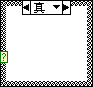

Like loops, the Case Structure is a resizable rectangular frame. It houses multiple branch pages (cases), but only one case is visible on the Block Diagram at a time.

On the left border, a small terminal marked with a question mark `?` serves as the **Case Selector**. Above the structure border, the **Selector Label** displays the case condition currently shown. You can edit this label directly to change the case condition values.

Clicking the drop-down arrow next to the selector label displays a list of all defined cases, letting you switch views. The small arrows on either side let you cycle through them sequentially. 

:::tip

You can also hover your cursor inside the Case Structure frame, hold **Ctrl**, and scroll the mouse wheel to quickly cycle through all the cases.

:::

### Boolean Case Structure {#boolean-case-structure}

When you wire a Boolean value to the selector terminal, the Case Structure configures itself with two cases: `True` and `False`:

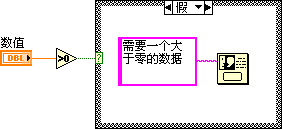

Boolean Case Structures are the standard way to handle error state flow. Most low-level subVIs receive an `Error In` cluster and output an `Error Out` cluster. The `Error In` wire is connected directly to the Case Selector. This turns the Case Structure into an **Error Case Structure** with `Error` and `No Error` cases:

And:

If `Error In` carries an error, the `Error` case executes. Because an upstream node already failed, the subVI skips its main logic and passes the error cluster straight through to the output.

If `Error In` is clean, the `No Error` case executes, running the subVI's main functional code.

This pattern is central to robust [Error Handling](pattern_error_handling) in LabVIEW.

### Other Data Types {#other-data-types}

Case selectors can also accept integers, strings, or [Enums](data_custom_control). Since these types allow more than two values, the structure can contain arbitrary numbers of cases.

To add a case, right-click the structure border and select **Add Case After** or **Add Case Before**. Select **Duplicate Case** to copy the code layout of the current case into a new one. You can delete unneeded cases using **Delete This Case**, or clean up all empty cases at once with **Remove Empty Cases**.

A single case can handle multiple distinct input values, separated by commas. For example, the case label `2, 4, 6` triggers this branch if the selector receives any of those three values:

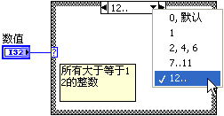

You can also specify a range of values using two dots (`..`). For example, the label `7..11` matches any integer from 7 to 11 inclusive. The label `12..` matches any integer greater than or equal to 12. For strings, ranges are evaluated based on ASCII sorting order.

All case labels must be mutually exclusive. If you define duplicate condition values in different cases, the run arrow breaks, and LabVIEW flags a compilation error.

:::caution

Be aware of how LabVIEW evaluates range boundaries for different data types.

For integers, a range like `1..3` is inclusive on both ends, matching `1`, `2`, and `3`.

For strings, the upper limit of a range is **exclusive**. For example, the string case range `'1'..'3'` matches `'1'` and `'2'`, but *not* `'3'`. This is due to string sorting rules and arbitrary string lengths (e.g., `'2.99'` fits within the alphabetical range `'1'` to `'3'`, but `'3'` is the boundary limit itself). The two structures below behave differently because of this distinction:

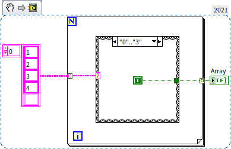

To include `'3'` in a string range, write `'1'..'4'`. To match all numeric character digits (`'0'` to `'9'`), write `'0'..':'` (since `:` is the character following `9` in ASCII), or explicitly write `'0'..'9','9'`. Similarly, to match the characters `b`, `c`, and `d`, write `'b'..'e'`.

This behavior arises from alphabetical string sorting rules. For instance, because it is difficult to define all strings starting with the letter `'a'` explicitly, you use the range `'a'..'b'` to match them.

Consider this and guess the outcome of the following program:

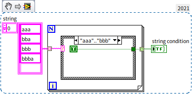

:::

### Default Branch

For open-ended types (like integers and strings), a Case Structure must define a **Default** case to handle all inputs that do not match the explicit case labels. If you wire an integer and do not cover all possible integer values, and have no default case, the run arrow breaks:

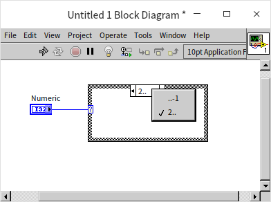

To fix this, right-click any case and select **Make This The Default Case**, or add explicit cases to cover all possible inputs:

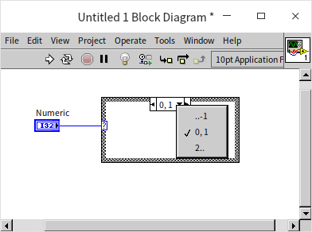

Which design is better?

For Enums, because the value set is finite, it is best practice to define an explicit case for every single Enum value and **avoid using a Default case** in production code. If you do this, adding a new item to the Enum Type Def will break the run arrow of all VIs using it, forcing you to explicitly handle the new case.

If you use a Default case, the VI will compile successfully but will execute the Default branch for the new state, which can hide silent bugs and result in unpredictable runtime errors that are extremely hard to debug.

A compiler check that breaks the run arrow is always preferred over silent runtime failures. It forces you to fix the logic immediately.

### Optimizing Case Structures

Because Case Structures hide code, you should avoid nesting them. Deeply nested Case Structures make the code hard to read and debug. You can consolidate multiple conditions into a single selector using clean programming strategies:

- **Consolidate Comparisons**: Instead of nesting comparisons (`a > b` and `a == b`), use the difference `a - b` or a comparison function that outputs an Enum/integer to select a single Case Structure:

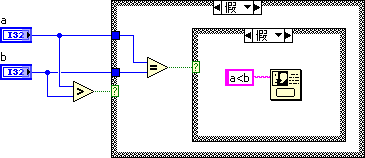

Refactored to:

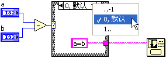

- **Centralize Common Code**: In the nested comparison above, the dialog function was duplicated in every branch. Moving it outside the Case Structure simplifies the branches and improves efficiency.
- **Combine Multiple Boolean Inputs**: Instead of nesting Boolean checks, build them into an array and convert it to an integer (using **Boolean Array To Number**) to drive a single Case Structure with cases `0`, `1`, `2`, `3`:

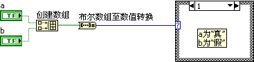

### Tunnels

Tunnels pass data across Case Structure borders. Input tunnels pass values from the outside into all cases. Output tunnels pass data from the cases back to the outside.

Because only one case executes at runtime, an output tunnel must have a data source in **every single case**. If you leave a tunnel unwired in even one case, the tunnel icon turns white (hollow) with a red border, and the VI will not run.

To simplify development, you can right-click the output tunnel and select **Use Default If Unwired**. If a case leaves this tunnel unwired, LabVIEW automatically outputs the default value of the data type (e.g., `0` for numerics, `False` for Booleans).

While convenient, **Use Default If Unwired is considered a poor programming practice** in professional code. It hides errors: if you forget to wire a case, it silently outputs `0` or `False` rather than throwing a compiler error. This can introduce subtle runtime bugs. Instead, explicitly wire all outputs. If an input simply passes through the structure in some cases, use **Linked Input Tunnels** (via right-click -> **Connect Input Tunnels**) to route the wire through clean and automatically:

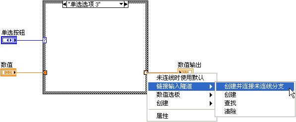

### Avoid Placing Control Terminals Inside Case Structures

Placing Front Panel control or indicator terminals inside Case Structures is inefficient and error-prone.

If an indicator is inside a case, and a different case executes, the indicator receives no data. This results in an unpredictable, indeterminate value.

Furthermore, placing terminals inside structures forces LabVIEW to create redundant memory copies (buffer allocations).

To prevent this, always place your controls and indicators outside the structures, and pass data through tunnels:

- Avoid:

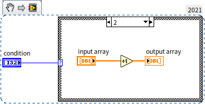

- Preferred:

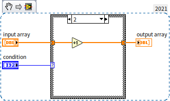

:::tip

To make space for new code in a crowded Block Diagram, hold **Ctrl**, then click and drag the mouse on a blank area to push existing nodes aside:

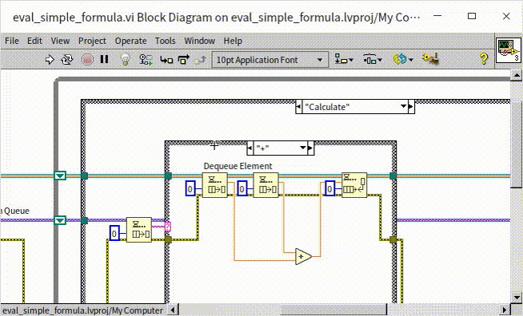

:::

## Select Function

For simple, single-variable decisions, a Case Structure is often overkill and hurts readability. A cleaner alternative is the **Select** function (located under **Programming -> Comparison**).

The Select node has three inputs:
- The middle input is a Boolean selector.
- The top input is the value returned if the Boolean is `True`.
- The bottom input is the value returned if the Boolean is `False`.

This is equivalent to the ternary operator `x = c ? a : b;` in C-style languages.

Consider this nested Case Structure:

We can refactor it cleanly using the Select function:

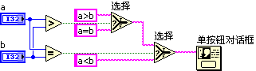

The Select function improves readability by displaying all data paths clearly on the Block Diagram.

## Sequence Structures

### Program Execution Order

LabVIEW is driven by dataflow: the order of execution follows the wires. If two nodes have no wire dependencies, LabVIEW executes them in parallel using different threads:

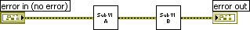

Here, data flows sequentially: `Sub VI A` executes, then `Sub VI B`.

If they are not wired together:

`Sub VI A` and `Sub VI B` execute concurrently in parallel. Once both finish, **Merge Errors** executes.

### Implementing Sequence Structures

If you must enforce a specific execution order for functions that share no data wires, use a **Sequence Structure** (located under **Programming -> Structures**).

A **Flat Sequence Structure** appears as a resizable frame. You can right-click the border and select **Add Frame After** or **Add Frame Before** to add sequential stages. The frames execute strictly from left to right:

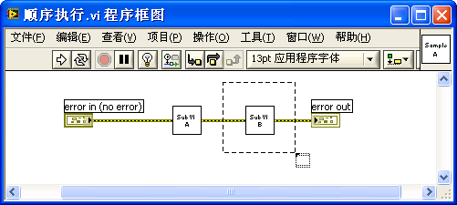
Enclosing:
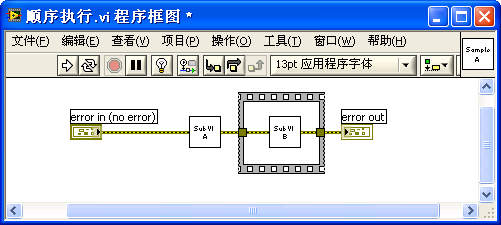

There are two types of sequence structures in LabVIEW: **Flat Sequence Structures** (where all frames are displayed side-by-side) and **Stacked Sequence Structures** (which stack frames on top of each other, displaying only one at a time).

### Stacked Sequence Structure

In modern LabVIEW development, **Stacked Sequence Structures are discouraged and considered a legacy anti-pattern**. They hide code from view, require sequential local variables that violate standard left-to-right dataflow, and block compiler optimizations. We cover them here so you can read legacy VIs, but you should avoid them in new projects.

For example, to measure the execution time of a VI, we record the tick count before and after it runs:
- Frame 0: Capture start time.
- Frame 1: Execute test code.
- Frame 2: Capture end time and calculate elapsed time.

Because Stacked Sequence frames cannot be wired together directly, you must use a **Sequence Local** variable (a yellow terminal on the border) to pass the start time from Frame 0 to Frame 2:

- Frame 0 writes the start time to the Sequence Local terminal:

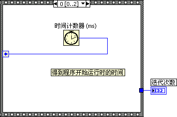

- Frame 1 runs the test code:

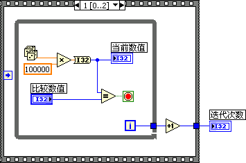

- Frame 2 reads the Sequence Local value and calculates elapsed time:

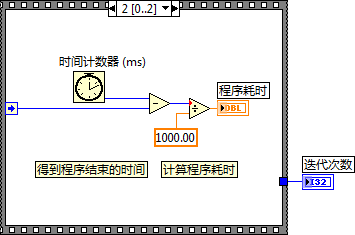

Sequence Locals make code hard to read because they reverse dataflow direction, forcing wires to flow right-to-left in some frames. Stacked sequence structures were created for low-resolution monitors in early computers but are no longer necessary.

### Flat Sequence Structure {#flat-sequence-structure}

We can convert the stacked sequence to a **Flat Sequence Structure** by right-clicking it and selecting **Replace with Flat Sequence Structure**. This displays all frames side-by-side, allowing normal data wiring and eliminating the need for Sequence Locals:

This makes the dataflow clear and easy to audit.

### The Intangible Over the Tangible {#the-intangible-over-the-tangible}

In martial arts folklore, the highest level of mastery is using a sword without having a sword in your hand. In LabVIEW, the highest level of sequence design is **not needing sequence structures at all**.

Consider setting up an instrument and reading its data, where we must wait 1 second for the hardware to stabilize:

- **Flawed implementation**: The wait function is unwired, meaning it runs in parallel with the setup rather than after it:

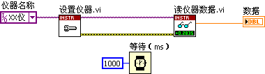

- **Using a Sequence Structure**: We place the wait function in a separate frame to enforce order:

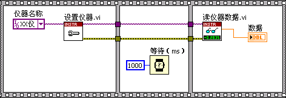

- **Optimized Sequence**: We only wrap the wait function, utilizing the error wire to enforce order:

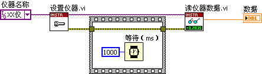

- **Dataflow Alternative (Preferred)**: We avoid the sequence structure entirely by packaging the delay into a subVI that accepts and outputs the error cluster. If an error is detected, the subVI skips the delay:

The resulting main program is clean and sequence-free, using the error wire to enforce execution order:

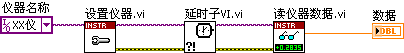

Most built-in LabVIEW functions and VIs (such as **Time Delay** or **High Resolution Polling Wait**) support error terminals so you can wire them inline to control execution order:

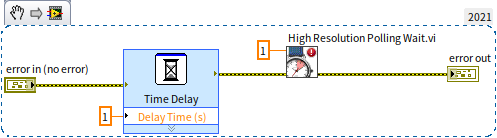

## Practice Exercises

1. **Arithmetic Expression Evaluator VI**

   Build a VI that parses and evaluates a basic arithmetic expression from a single string input (e.g., `"23-6"` or `"445*78"`). 
   - Parse the string to extract the two numbers and the operator (`+`, `-`, `*`, `/`). (Hint: Use **Scan From String** or **Match Regular Expression**).
   - Use a **Case Structure** to execute the corresponding operation.
   - Handle division by zero and invalid input formats gracefully.

2. **Runtime Measurement Program**

   Build a test VI to measure the execution time of the Arithmetic Expression Evaluator VI.
   - Capture the start and end times around the evaluator call using **Tick Count (ms)** or **High Resolution Relative Seconds**.
   - Calculate the difference to display the execution duration.
   - Run the evaluator in a loop to get average execution times over multiple iterations.
