# UI Design Examples

Even though numerous principles and standards for interface design have already been discussed, actual interface design remains highly adaptable, with multiple potential designs for a single functionality.

To explore various methods used in interface design, let's take designing the interface for a Reversi (Othello) game as an example, introducing specific techniques that can streamline the design process and enhance aesthetics. Reversi is chosen because it is engaging and features a relatively simple interface, making it an ideal teaching example. The game board consists of an 8x8 grid with pieces in two colors, black and white, placed within the squares. 

Creating such an interface can employ different approaches. Here, we'll demonstrate several methods, ranging from straightforward to more complex.

## Utilizing LabVIEW's Built-in Controls

The first step in interface design should always be to consider using or adapting existing controls. Leveraging built-in controls can significantly shorten development time. For this game, standard interface elements like buttons and text boxes can use LabVIEW's built-in controls. For the board and pieces, we can custom-build them using basic controls.

Consider the game pieces: the pieces are circular and only come in two colors, black and white, with a maximum of 64 pieces on the board. This makes LabVIEW's circular LED controls a suitable choice for representing the pieces:

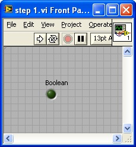

To make it look more like a real game piece, we can make some adjustments:
1. Increase its size.
2. Use the **Color tool** from the Tools Palette to set its *On* and *Off* colors to black and white, respectively.
3. Give it a meaningful label like `chess0` (we hide the label on the Front Panel, but use it in the Block Diagram code).

The enhanced appearance of the game piece is shown in the image below:

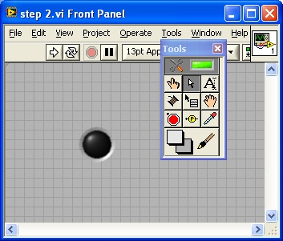

For Reversi, a total of 64 pieces are required, arranged in 8 rows by 8 columns. To create the additional pieces, copy and paste the first piece as a template. Selecting two pieces and copying them creates four; repeating this allows you to quickly generate 8, 16, 32, and finally 64 pieces:

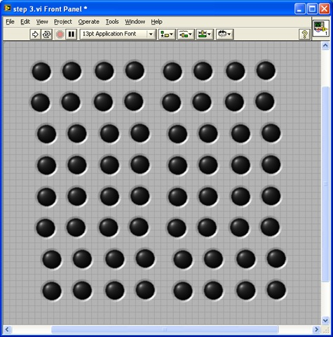

Next, arrange these pieces neatly using the **Align Objects**, **Distribute Objects**, and **Resize Objects** tools on the Front Panel toolbar. First, align the first row and column, adjust their spacing to be even, and then align the remaining pieces with them:

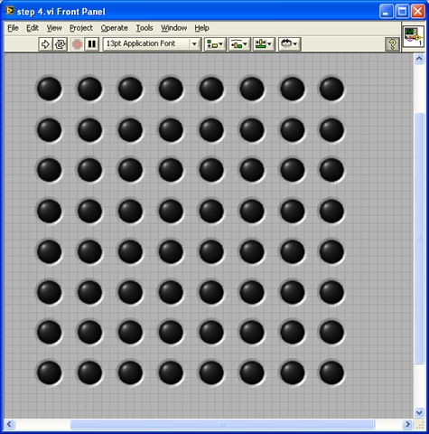

With the Front Panel design finished, we move to the Block Diagram to handle the dynamic behavior of the pieces during gameplay.

## Implementing Code for Runtime Interface Changes

The 64 pieces are not always visible. At the start of the game, only four pieces are displayed, with subsequent moves adding more pieces. Each LabVIEW control has a **Visible** property that controls whether it is shown on the Front Panel. For board positions without a piece, the corresponding control can be hidden by setting its **Visible** property to `False`:

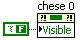

When designing interfaces, you often need to show or hide controls dynamically. Here are the most common strategies to achieve this:

- **Toggling Visibility**: You set the **Visible** property to `False` to hide the control and `True` to show it. This works well for a small number of controls. However, it can make editing the Front Panel difficult because hidden controls are invisible when the program is stopped, requiring you to find and show them manually before making changes. It also becomes cluttered if you try to overlap multiple controls in the same area.
- **Position Off-Screen**: You manipulate the control's **Position** property (coordinates) to move it outside the visible bounds of the Front Panel. For example, if the Front Panel window is 500x400, you can "hide" a control by moving it to coordinate (1000, 1000). To show it, you move it back. This ensures the controls are always visible on the Front Panel during edit mode (by scrolling) but hidden from the user at runtime.
- **Tab Control**: If you need to switch between groups of controls, place them on different pages of a Tab Control. You can then change the visible page programmatically. By setting the Tab Control's background and borders to transparent, you can create a seamless transition. This is the standard approach for building wizard-style (step-by-step) interfaces.

Returning to our Reversi game, opening the Block Diagram reveals a neatly organized array of 64 control terminals:

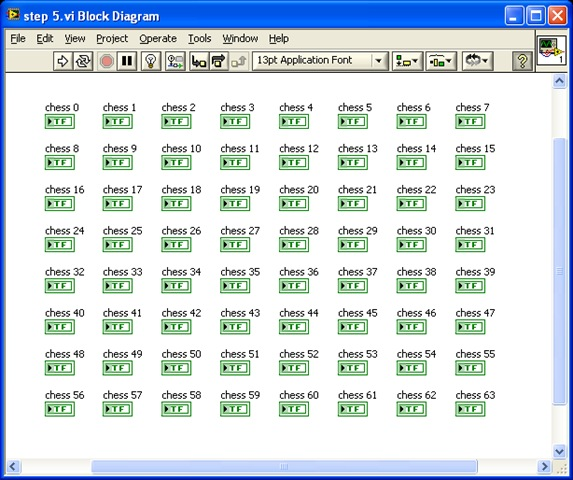

Manipulating 64 individual terminals manually would make the Block Diagram code bloated and difficult to maintain. To simplify the code, we can organize these 64 control references into an 8x8 two-dimensional array.

Instead of manually wiring 64 control references, we can build the array dynamically by fetching the controls by name. Since our controls are named systematically (`chess0` to `chess63`), we can loop through the names, obtain their references, and construct the 8x8 array:

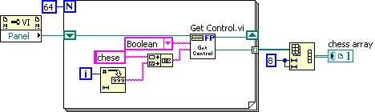

This code uses a SubVI named `Get Control.vi` to fetch a control reference by its name. This VI is a built-in LabVIEW utility located at `[LabVIEW]\resource\importtools\Common\VI Scripting\VI\Front Panel\Method\Get Control.vi`.

The resulting `chess array` output is an 8x8 array of control references. During gameplay, updating a piece simply requires indexing this array to obtain the target control's reference.

In modular designs, you often need to pass multiple control references to a SubVI. A clean way to do this is to bundle the references into a cluster at startup and pass the cluster to the SubVI. This reduces the number of wires crossing the diagram.

However, a downside to this approach is that any layout change (adding or removing controls) requires updating the cluster definition, which propagates changes to all SubVIs using that cluster. To avoid this, you can pass only the main VI's reference to the SubVI, and use the `Get Control.vi` method inside the SubVI to fetch controls dynamically by name.

### Adding Decorations and Background Images

Once the pieces are configured, we need to add the chessboard grid. Since the board is static, we can build it using decorative elements. LabVIEW provides lines, boxes, and other shapes under the **Modern -> Decorations** palette:

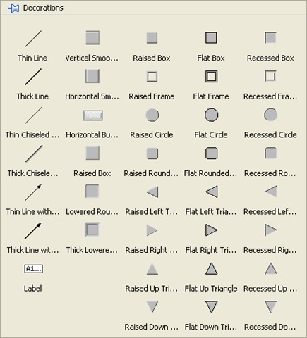

Using these shapes, you can construct a chessboard grid. The image below shows a board built using black decorative lines:

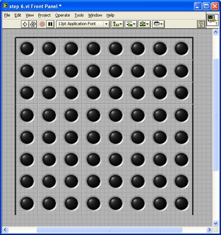

Decorations are highly useful for grouping related controls visually or separating distinct sections of the UI.

If LabVIEW's built-in decorations are too simple, you can design a high-quality chessboard image in an external graphic editor and import it. You can copy the image and paste it directly onto the Front Panel, or drag and drop the image file onto the panel.

When imported, the image might sit on the top layer, obscuring the pieces. Use the **Reorder** tool on the toolbar and select **Move to Back** to place it behind the pieces. Once aligned, select the board and all the pieces, and select **Group** from the **Reorder** menu. This locks their relative positions so they can be moved together:

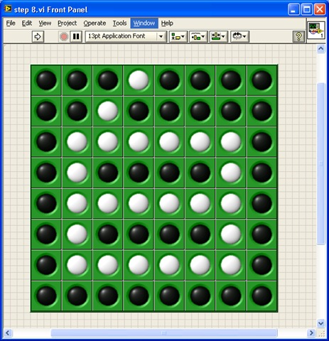

To achieve transparent backgrounds or drop shadows for irregular controls, use image formats that support alpha transparency, such as PNG or GIF. The VI below shows two panels with custom drop shadows created using transparent PNGs:

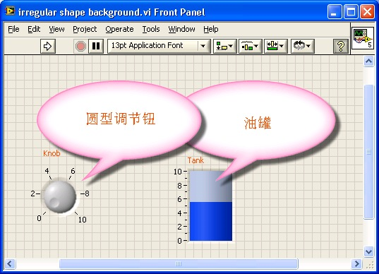

If you want the background image to cover the entire window and scale automatically, you can set it as the pane background. Right-click the scrollbar of the Front Panel window, select **Properties**, and go to the **Background** tab to select an image (such as the "Clouds" theme shown below):

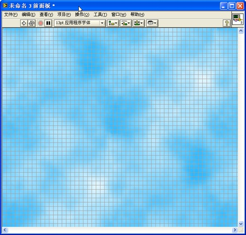

### Creating Custom User Controls

While the board looks professional, the pieces still look like industrial LEDs. We can create custom controls to give them a polished, physical look.

We can customize the circular LED by right-clicking it and selecting **Advanced -> Customize...** to open the Control Editor. We can remove the default glow effect and borders to make the piece look flat. Alternatively, in the VI, we can turn off the glow effect simply by unchecking **Visible Items -> Decal** in the control's right-click context menu:

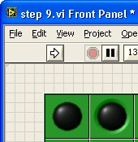

For a premium look, you can import high-quality rendering files of game pieces (complete with realistic shadows and textures) directly into the Control Editor:

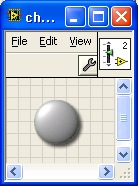

By configuring these custom controls as a [Strict Type Definition](data_custom_control#strict-type-definition) (.ctl), any future visual changes made to the `.ctl` file will automatically propagate to all 64 instances on your game interface.

### Refining the Interface Implementation

Let's evaluate this initial design by writing a brief initialization routine. At the start of the game, only four pieces (two black, two white) are placed at the center of the board:

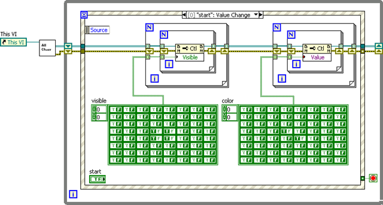

Executing this code yields the following output:

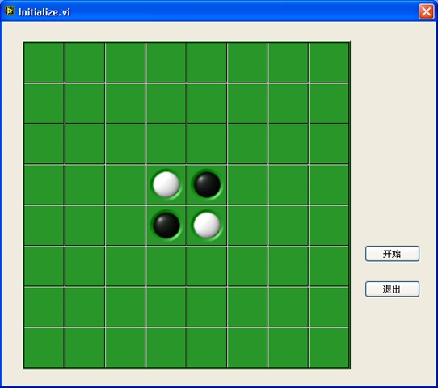

Here, `Get All Chess.vi` parses the Front Panel to construct the 8x8 control reference array.

While this works, the implementation highlights several limitations:
1. Each board cell can have three states: *Empty*, *Black*, or *White*. However, the Boolean LED control only supports two states (*On* and *Off*). To represent three states, we are forced to combine the Boolean state with the control's **Visible** property, which requires maintaining two separate arrays in the code, complicating the logic.
2. Detecting which cell the user clicked is difficult. The Event Structure only returns the coordinates relative to the top-left of the Front Panel. If the chessboard moves, the coordinate calculation code breaks.

To resolve these issues, we can use a control that natively supports multiple states, such as a **Picture Ring** (located under **Classic -> Classic List & Ring -> Picture Ring**). We configure it with three values corresponding to three images:
- Value 0: Empty (transparent image)
- Value 1: Black piece
- Value 2: White piece

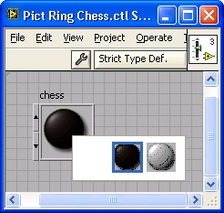

We use transparent PNGs for the pieces to preserve shadows. By using the **Color tool** to set the Picture Ring's borders and background to transparent, the control blends seamlessly into the board:

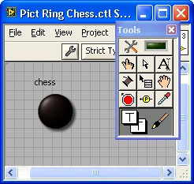

Even though the transparent cells look empty, they are active controls and can detect mouse clicks, returning the index of the clicked control directly.

However, placing 64 individual Picture Rings still clutters the Block Diagram. The most elegant solution is to place a single Picture Ring inside an **Array Control**, and expand the array to an 8x8 grid:

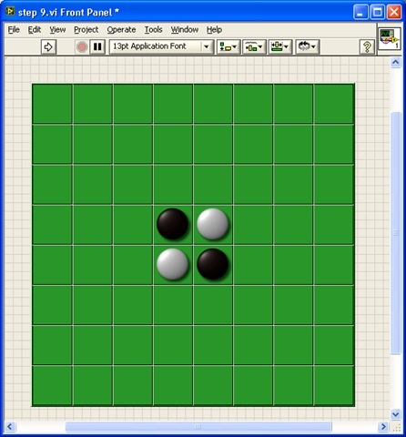

We hide the array index display and set the array borders to transparent. Now, the entire chessboard is represented by a single, clean 2D array control. Initializing the board becomes a single write operation:

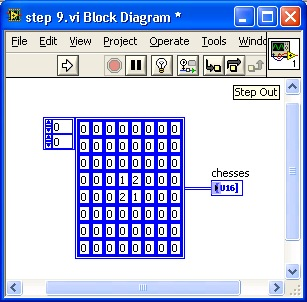

## Utilizing Drawing Controls

Some applications require custom graphics, plots, or dynamic drawings that cannot be built using standard controls. LabVIEW provides drawing controls for these requirements, primarily:
- **XY Graph** (for Cartesian plots)
- **3D Picture Control** (for 3D scene rendering)
- **2D Picture Control** (for freeform 2D graphics)

The **2D Picture Control** (located under **Programming -> Graphics & Sound -> Picture Functions**) is a blank canvas that allows you to draw shapes, text, and images programmatically at runtime:

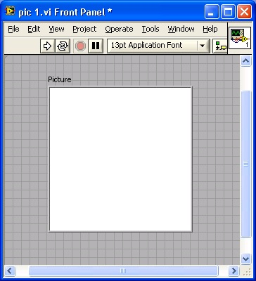

The drawing palette contains VIs to draw lines, circles, text, and import images:

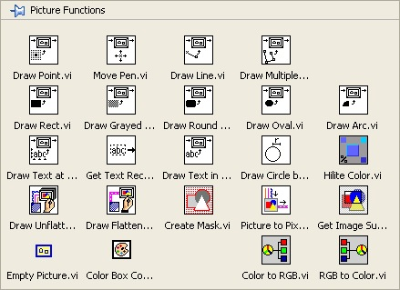

The 2D Picture Control has a **Clear Picture Before Drawing** property with three options:
- **0 (Never erase)**: New drawings are overlaid on top of existing drawings, accumulating graphics over time.
- **1 (Erase on first run)**: Clears the canvas when the VI starts, then accumulates drawings.
- **2 (Erase every time)**: Clears the canvas before every new draw operation. This ensures only the latest drawing is shown, but it can cause screen flickering during rapid updates.

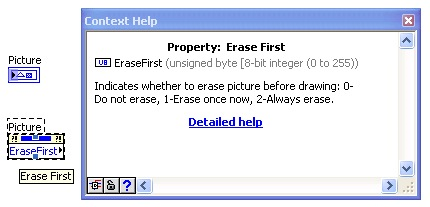

To build our Reversi board using a Picture Control, we draw the chessboard image as the background:

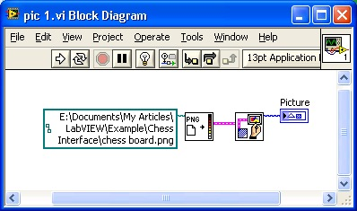

> [!NOTE]
> LabVIEW natively supports BMP, JPEG, and PNG image formats. Other formats (like GIF or TIFF) must be converted externally before loading.

When executed, the chessboard image is rendered on the control:

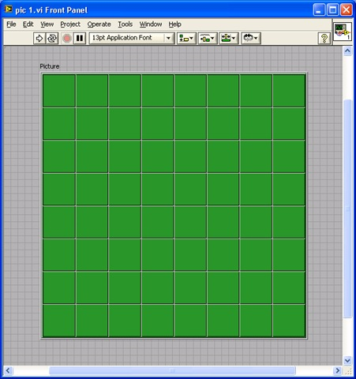

Next, we draw the pieces dynamically. We load the piece images and draw them at the calculated cell coordinates:

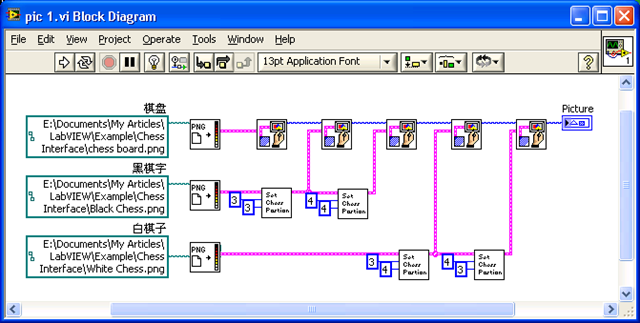

The execution result shows the pieces drawn on the board:

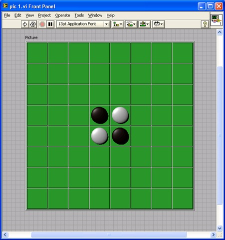

If we want to package this chessboard (both its visual display and game logic) into a reusable component that other developers can drag and drop into their VIs, we can use an **XControl**. Introduced in LabVIEW 8, XControls allow you to encapsulate custom controls and behaviors into a single distributable file. We will discuss this in detail in the [XControl](ui_xcontrol) section.

## Special Interface Effects

### Window Transparency

For applications that run in the background (like media players or system monitors), you can make the Front Panel translucent.

In VI Properties, select the **Window Appearance** category, click **Customize...**, and set the **Window Run-time Transparency** percentage:

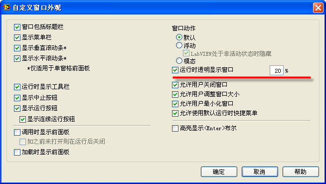

You can also adjust transparency dynamically at runtime using the **Front Panel Window -> Run VI Transparently** (`FP.RunTransparently`) and **Front Panel Window -> Transparency** (`FP.Transparency`) properties:

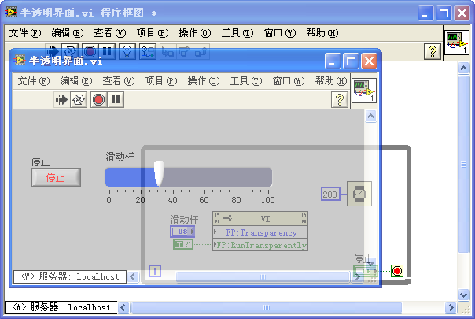

### Irregular Window Shapes

You can create non-rectangular interfaces (such as circular widgets or custom-shaped panels) by calling the Windows API.

To create an irregular interface, place your custom-shaped graphic on the Front Panel, and call Windows API functions to make the default gray background color transparent. The Block Diagram is shown below:

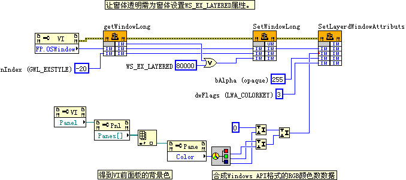

This program calls three Windows API functions: `GetWindowLong`, `SetWindowLong`, and `SetLayeredWindowAttributes`. 

> [!TIP]
> On modern 64-bit operating systems running 64-bit LabVIEW, you should call the 64-bit compatible `GetWindowLongPtr` and `SetWindowLongPtr` API functions instead of the older 32-bit `GetWindowLong` and `SetWindowLong` functions to prevent crashes.

Additionally, you should configure the VI Properties to hide the title bar, menu bar, and scrollbars:

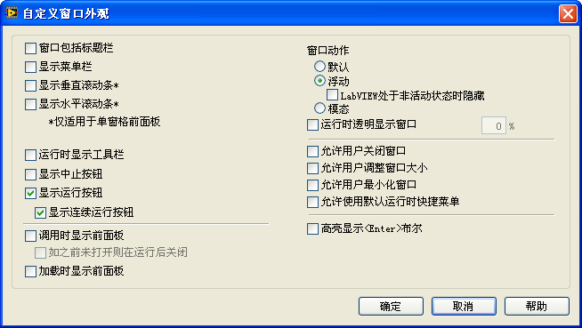

Before running, the Front Panel shows the pink bubble graphic on a gray background:

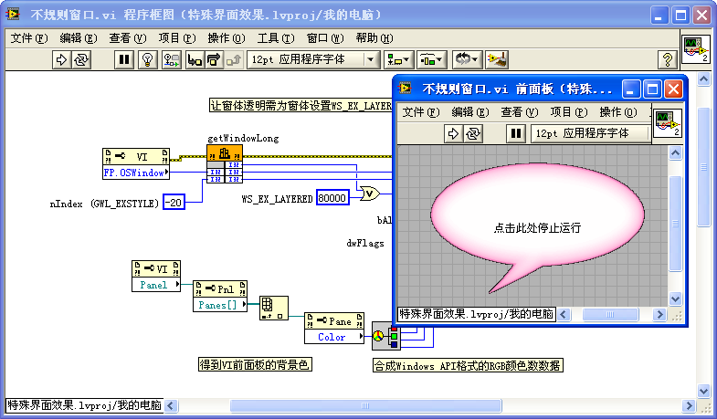

At runtime, the gray background becomes completely transparent, leaving only the pink bubble visible on the OS desktop:

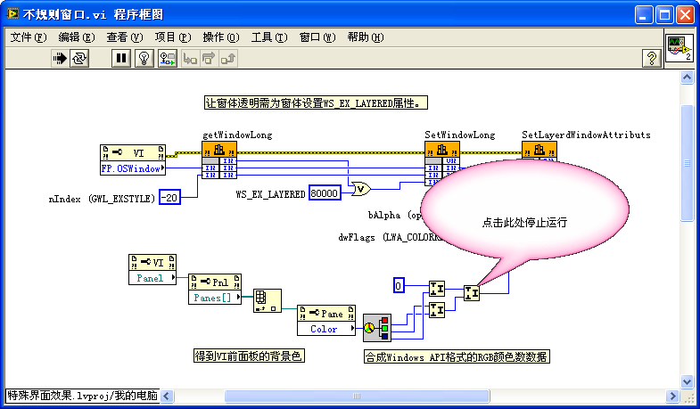

## Animation

To implement simple animations (like moving, rotating, or scaling elements), you can update the control's position/size properties dynamically or draw sequential frames.

For example, to simulate a rolling wheel:
1. Create a series of images depicting the wheel at different rotation angles.
2. Load these images into a Picture Ring control:

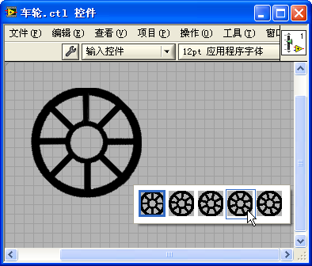

3. In a loop, increment the Picture Ring's value to rotate the wheel, and update its **Position** property to move it across the screen:

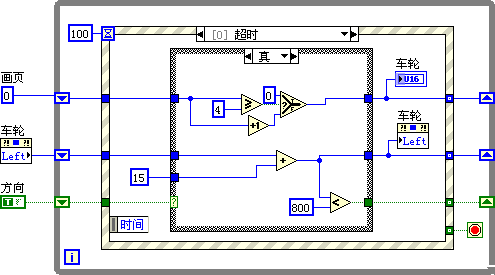

Combined with window transparency, this creates the effect of a wheel rolling across the desktop:

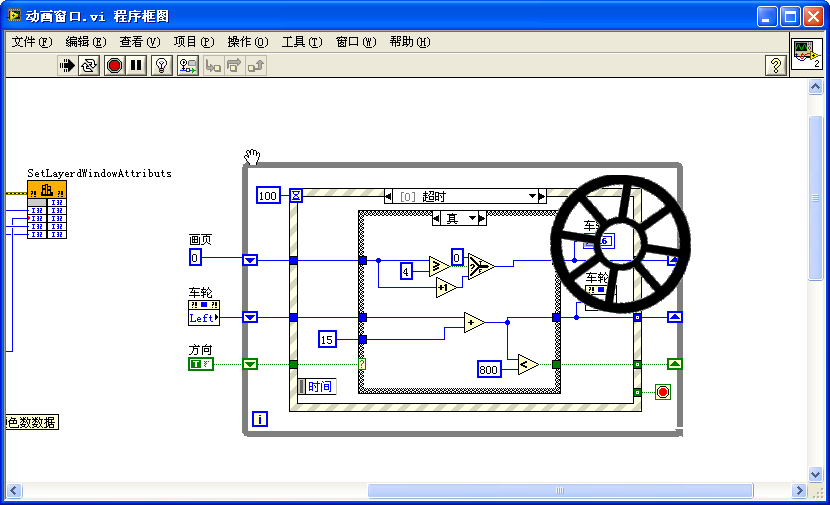
