# Modular UI Design

## Dividing Interfaces into Modules

For complex program diagrams, it is standard practice to divide the code into multiple SubVIs. This modular approach makes the code easier to manage, read, and maintain. Similarly, when a user interface becomes overly complex, dividing it into multiple UI modules is highly recommended. This strategy simplifies software development, layout design, and user interaction.

Some programs require users to input a vast amount of configuration data, such as the **Options** dialog in LabVIEW:

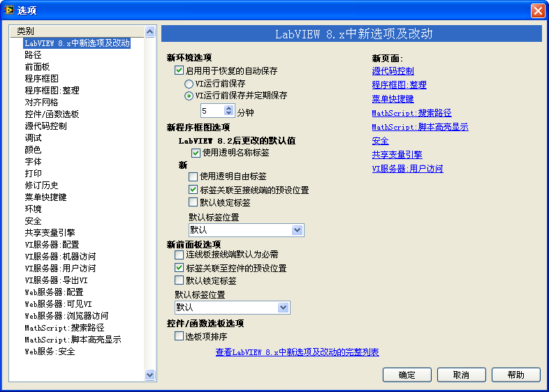

This dialog provides hundreds of settings within LabVIEW. Displaying all these settings simultaneously would overwhelm the user and require a massive screen. To prevent clutter and confusion, the LabVIEW Options interface organizes settings into functional groups, displaying only one group at a time. Users switch between groups using the **Category** list on the left.

Another example is the LabVIEW **Import Shared Library** wizard, which wraps C-DLL functions into LabVIEW VIs. This process requires step-by-step user inputs (such as selecting the DLL file, configuring header files, and naming the generated VIs). Rather than using a flat category list, this tool uses a **Wizard** interface to guide the user sequentially. The main difference between a wizard and a tabbed options dialog is the navigation flow: one allows arbitrary page switching, while the other enforces a sequential step-by-step process.

If your application requires extensive user inputs with strict sequential dependencies, a wizard-style interface is the most appropriate design.

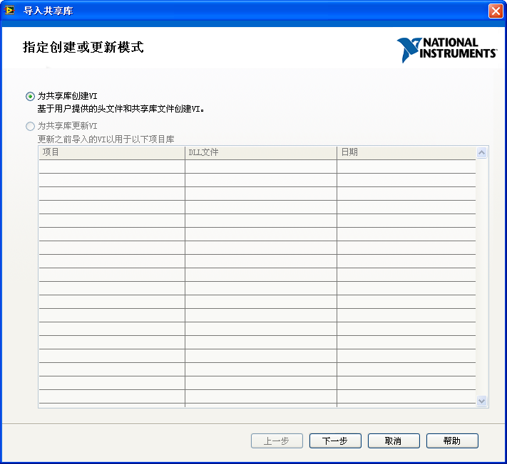

Both designs organize a multitude of controls into logical pages, displaying only one page at a time. This keeps the interface clean, focused, and user-friendly.

From a programming perspective, both patterns are implemented using a similar layout structure; they differ only in their navigation logic. Below, we will use a wizard-style application to illustrate how to implement multi-page UI architectures in LabVIEW.

## Utilizing Tab Controls for Wizard-Style Programs

Wizard-style interfaces, consisting of multiple pages containing various controls, are easily implemented using **Tab Controls**. Tab Controls are standard UI containers containing multiple pages. By default, users switch pages by clicking on the tab labels at the top of the control:

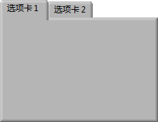

When building a wizard-style interface, you can customize the Tab Control to hide the tab labels entirely. You then programmatically control the active page using a Block Diagram property node, exposing only the **Next** and **Back** navigation buttons to the user:

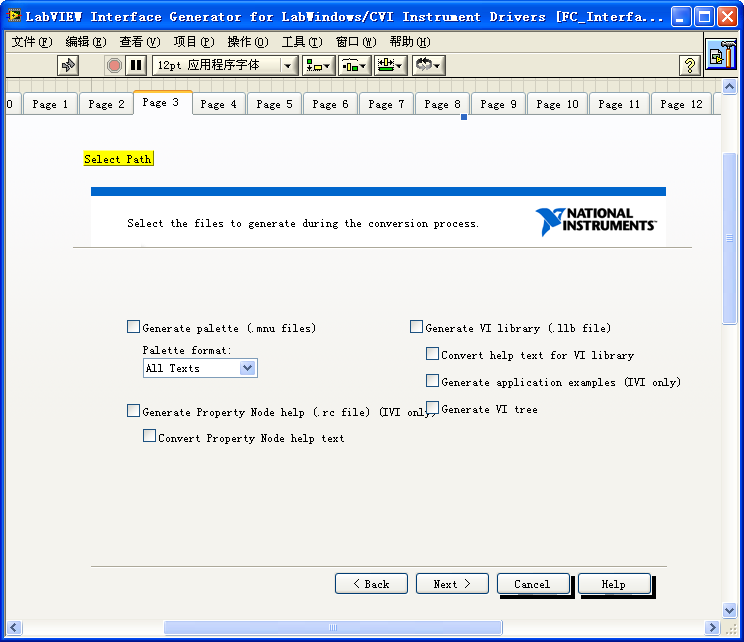

The image above shows a wizard interface in edit mode. The Front Panel features a large Tab Control with its tab labels hidden, containing the controls for each step.

When the user clicks the "Next" button, the Block Diagram code increments the Tab Control's value to transition to the next page:

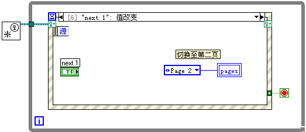

While Tab Controls simplify Front Panel layout design, they do not simplify the underlying Block Diagram code. Because all controls physically reside on the same main VI Front Panel, the main VI's Block Diagram must house the terminals and event handling code for every control across all pages. 

If you have a 10-step wizard, the main Block Diagram will contain dozens of control terminals and events. This leads to a massive, cluttered Event Loop that is difficult to read and maintain:

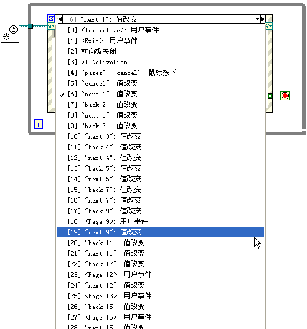

Locating a specific control's logic in such a massive VI is time-consuming, and adding a new step to the wizard requires modifying the main Event Loop, increasing the risk of introducing bugs. To make the application scalable and maintainable, we must modularize both the user interface and the underlying code.

## Subpanels

The **Subpanel** control (located in the Controls Palette under **Modern -> Containers**) allows you to display the Front Panel of a completely separate VI inside a container on your main VI's Front Panel. 

When you drag a Subpanel onto the Front Panel, it appears as a blank, transparent rectangle:

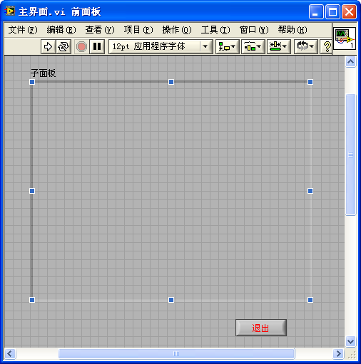

At runtime, the main VI must dynamically load and insert the Front Panel of a child VI into the Subpanel container. For example, we can create a child VI containing our step layout:

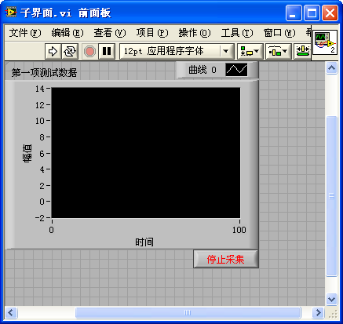

In the main VI Block Diagram, we use an **Invoke Node** linked to the Subpanel reference. The Invoke Node provides the **Insert VI** method, which accepts a reference to the child VI:

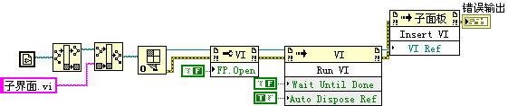

To insert a child VI into a Subpanel, keep these two rules in mind:
1. The child VI's Front Panel must not be open in edit mode or in another window. If it is open, the **Insert VI** method will return an error.
2. The child VI must be running to be interactive. Therefore, you must call the **Run VI** method on the child VI reference before (or immediately after) inserting it.

At runtime, the child VI's Front Panel is embedded seamlessly within the main window:

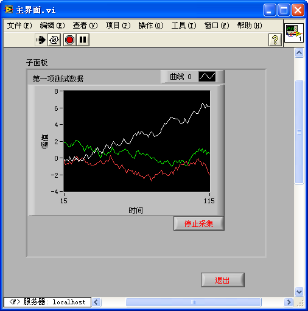

By combining Subpanels with a plugin-based architecture, we can build highly modular wizard interfaces. The diagram below illustrates this architecture:

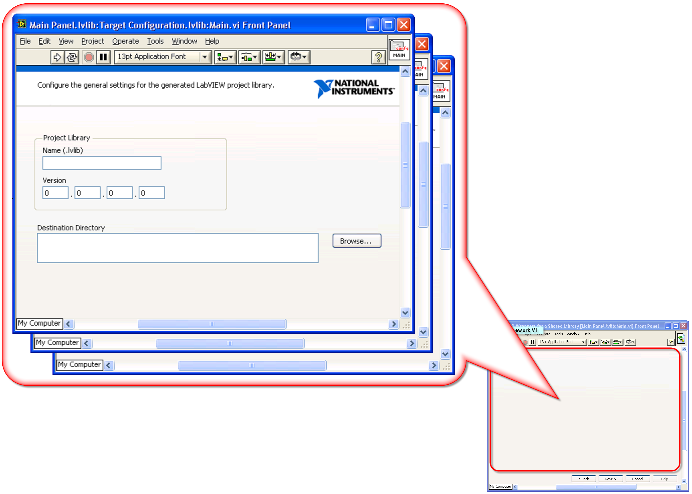

In this plugin framework:
- Each page of the wizard is designed as an independent child VI. All controls and event handling logic for that step are completely encapsulated within that child VI's Block Diagram.
- The main VI serves as the host shell. Its Front Panel contains a single Subpanel control and the global navigation buttons (**Back**, **Next**, **Cancel**).
- When the user clicks **Next**, the main VI unloads the current child VI, opens a reference to the next child VI, and inserts it into the Subpanel.

This decoupled design ensures that both the Front Panel layouts and the Block Diagrams remain small, focused, and easy to maintain. Adding a new step simply requires creating a new child VI without modifying the event handling logic of the other steps.

However, using Subpanels introduces some development trade-offs:
- **No Edit-Time Preview**: In edit mode, the Subpanel appears empty, making it difficult to adjust the overall layout alignment relative to the embedded pages.
- **Data Exchange Complexity**: Because the main VI and the child VIs run as independent entities, you must implement a mechanism (such as queues, user events, or references) to pass data between the host shell and the loaded plugins.
- **Extra Boilerplate**: You must write code to handle opening, running, inserting, and closing the child VI references.

## XControls

In large-scale applications, you often need to reuse complex UI modules across different projects. For example, you might need a reusable component that allows users to add, remove, and manage file paths:

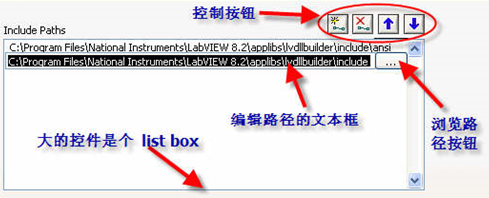

This path manager component consists of several controls: a listbox, a string input, a file browse button, and buttons to add, delete, and reorder paths.

It also requires custom runtime behaviors:
- When a path is selected, it pre-populates the edit text box.
- Clicking the browse button opens a file dialog.
- Clicking the arrow buttons shifts items up or down in the list.

The rest of the application should interact with this component as if it were a single control, reading or writing a 1D array of paths.

While LabVIEW's **Custom Controls** (.ctl) allow you to customize the visual appearance of controls, they cannot package execution logic or behaviors.

To solve this, LabVIEW provides **XControls**. An XControl encapsulates the Front Panel interface, local data state, properties, methods, and event handling logic into a single reusable component. Once created, an XControl appears in the Controls Palette and can be dragged, dropped, and wired like a native LabVIEW control. 

> [!NOTE]
> XControls are an advanced LabVIEW feature. While they provide powerful encapsulation, they have a steep learning curve and are largely succeeded by **Object-Oriented UI** techniques or **QControl** toolkits in modern LabVIEW development.

## Multiple Interface Styles for a Single Core Functionality

Suppose you are developing an application that will be deployed to various clients. While the core calculations and hardware logic remain identical, different clients require different UI layouts, color schemes, or languages. 

Ideally, you want to maintain a single Block Diagram codebase (to avoid duplicate code and parallel bug fixing) but swap the Front Panel interface dynamically. However, in LabVIEW, a VI's Front Panel and Block Diagram are tightly bound.

We can solve this using **Dynamic Event Registration** to completely decouple the user interface from the business logic. We design:
1. **Interface VIs**: Multiple VIs containing only Front Panel layouts. Their Block Diagrams contain no business logic—only a simple loop to keep the window open and code to output control references.
2. **Function VI**: A single VI containing the core state machine, calculations, and event handlers. It has no user-facing Front Panel.

By passing control references from the active Interface VI to the Function VI, the Function VI can register to receive UI events dynamically, execute the math, and write results back to the interface indicators.

Let's look at a simple example: a program that generates a random number when a button is clicked, supporting two different UI styles. The project contains three VIs: `Main.vi` (Function VI), `Interface1.vi` (Style 1), and `Interface2.vi` (Style 2).

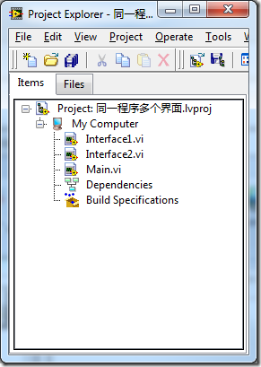

There are two primary approaches to implementing this architecture.

### Approach 1: Interface VI as the Caller

In this approach, the program launches `Interface1.vi` or `Interface2.vi` as the startup VI.

The Front Panel of `Interface1.vi` contains the UI controls:

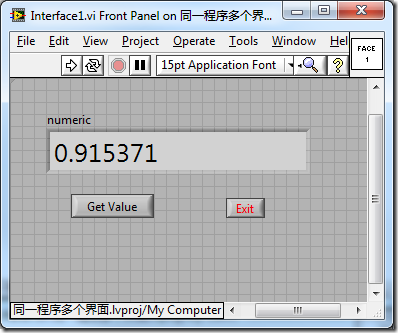

The Block Diagram of `Interface1.vi` contains no calculation logic. It simply bundles its control references and passes them to `Main.vi`, which it calls as a SubVI:

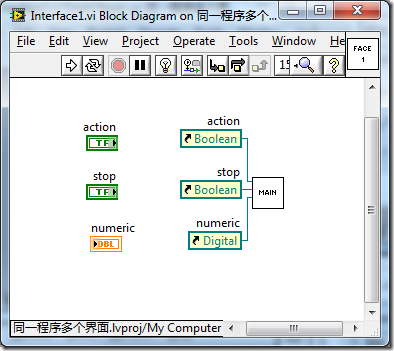

The Front Panel of `Main.vi` is not displayed; its controls serve as inputs to receive the references:

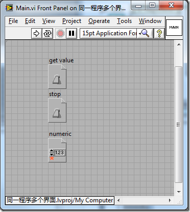

In `Main.vi`'s Block Diagram, the Event Structure registers the dynamic events from the passed control references. When the user clicks the button on `Interface1.vi`, `Main.vi` handles the event, generates the random number, and writes it back to the indicator using a property node:

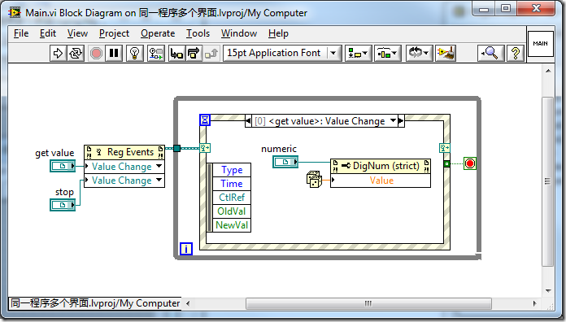

`Interface2.vi` has a completely different layout but uses the exact same Block Diagram code to call `Main.vi`:

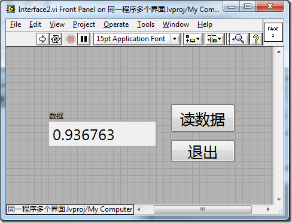

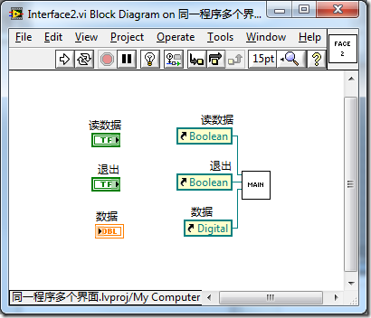

Because the core logic is isolated in `Main.vi`, any functional changes or bug fixes only need to be implemented once.

### Approach 2: Function VI as the Caller

In this approach, `Main.vi` serves as the startup VI. The Interface VIs (`Interface1.vi` and `Interface2.vi`) contain only a simple While Loop to remain open:

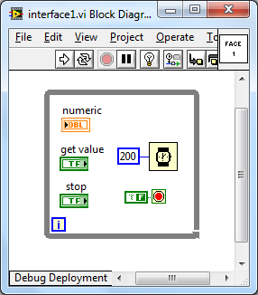

`Main.vi` is responsible for dynamically opening, displaying, and querying the Interface VIs:

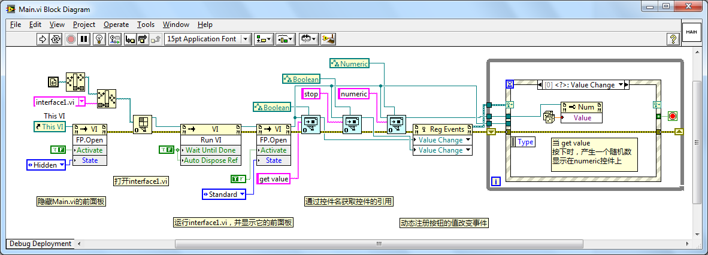

Here:
1. `Main.vi` uses **Open VI Reference** to load the target Interface VI and runs it.
2. Instead of the Interface VI passing references, `Main.vi` queries the Interface VI Front Panel dynamically to find the controls by name.
3. Once the references are acquired, `Main.vi` registers the events and runs the Event Loop.

> [!IMPORTANT]
> This approach requires that corresponding controls across all Interface VIs share identical label names (e.g., `Random Button` and `Result Indicator`) so that `Main.vi` can locate them programmatically.

This approach is highly clean because the Interface VIs are completely passive templates. You can also implement this by placing a **Subpanel** in `Main.vi` and loading the Interface VIs into it, treating the Interface VIs as interchangeable skin plugins.
