# Principles of UI Design

Some software interfaces immediately dazzle users when launched with their innovative or striking designs. However, a visually striking interface is not necessarily a well-functioning one. The primary benchmarks for evaluating a user interface are functionality (can users efficiently input data and receive the information they need?) and usability (how easy and intuitive is it to use?). Aesthetics, while important, come last.

From this standpoint, a well-designed interface should feel natural and intuitive, never drawing undue attention to itself. In fact, when an interface draws attention, it is often because users find it visually jarring or struggle to locate the fields or information they need.

The typical software development lifecycle consists of five stages: gathering requirements, system design, coding, testing, and deployment/maintenance. The design phase itself covers several areas, such as user interface design, software architecture design, API/interface design, and module design. In LabVIEW development, it is common practice to start with the user interface design. Prioritizing the UI design ensures that the user experience is not constrained by back-end implementation details. Conversely, designing the program structure first often tempts developers to prioritize coding simplicity over usability, resulting in interfaces that are awkward or inconvenient for end-users.

When designing user interfaces in traditional text-based languages, developers typically start by sketching prototypes on paper. LabVIEW offers a unique advantage here: its visual programming environment makes rapid prototyping incredibly easy. With a rich selection of built-in controls, developers can draft fully interactive UI mockups simply by dragging and dropping elements onto the Front Panel.

While aesthetics can be subjective, high-quality user interfaces generally share key traits: a consistent design language, appropriate choice of data and control types, logical layout, and smooth usability. Developers should carefully consider these principles when designing their VIs.

## Consistency

Consistency is critical for making a user interface easy to learn and operate. In UI design, consistency spans several dimensions:

### Internal Program Consistency

Different software applications cater to different domains and audiences. For instance, educational software designed for children—like the LEGO MINDSTORMS edition of LabVIEW—often features bright cartoon imagery to make it fun and engaging. In contrast, most LabVIEW applications are deployed in industrial, test, or laboratory environments for professional users. These applications should opt for a clean, professional, and uncluttered design that highlights utility rather than visual flair.

Regardless of the style you choose, all interfaces within an application—such as dialog boxes, setup screens, and subpanels—must maintain a consistent look and feel. Using a uniform style across all screens creates a cohesive, professional user experience.

Opening the LabVIEW Controls palette reveals controls in several distinct styles: Classic, Modern, System, and Silver:

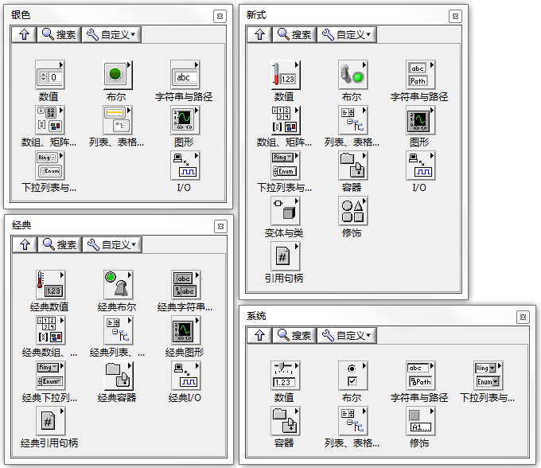

Classic controls look dated; they were the standard in LabVIEW versions prior to LabVIEW 6.0. Aside from two specific scenarios, this style has largely been abandoned.

The first scenario is legacy maintenance. If you are modifying an older application built with Classic controls, you should continue using them to maintain a consistent style unless you plan to revamp the entire interface.

The second scenario is when you need transparent controls. Setting a control's background or border to transparent is a powerful technique for creating special UI effects. For example, if you want to display dynamic instructional text on the Front Panel without showing the borders of a String Control, you can make its background and borders transparent.

To do this, select **View >> Tools Palette** from the menu to open the Tools Palette. Click the **Color Copy/Set Color** tool at the bottom of the palette, select the transparent option (represented by a "T" icon) in the upper right of the color picker, and paint the background and border of the control.

Unlike Classic controls, certain parts of Modern, System, and Silver controls cannot be painted transparent, which is why Classic controls are still used for this purpose:

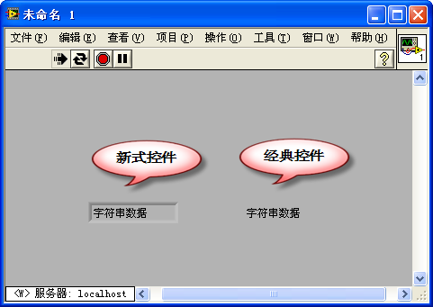

In LabVIEW 6.0, NI introduced Modern controls, which feature a three-dimensional, beveled appearance. These controls are highly popular and well-suited for traditional test and measurement software.

System controls match the look and feel of the host operating system (such as Windows or macOS). Using System controls makes your application look like a native OS application, which feels familiar to users. These controls automatically adapt to the host OS and user preferences. For instance, if you run the program on macOS, the controls will automatically adopt native macOS styling. Likewise, if a Windows user enables a high-contrast theme, the System controls will adjust their colors accordingly.

However, some LabVIEW-specific controls (such as the Waveform Graph and Waveform Chart) do not have native System equivalents. If your application relies heavily on System controls, you will need to manually adjust the colors and borders of these graphs to match the rest of the interface.

LabVIEW 2011 introduced Silver controls, which offer a flat, clean, and modern appearance aligned with modern software design. Using Silver controls can give your application a sleek, contemporary look.

### Adhering to Established Conventions

Many interface designs and interaction patterns are widely accepted by users simply because they are industry standards, even if they are not theoretically optimal.

For example, the standard QWERTY keyboard layout was originally designed for mechanical typewriters to prevent key jams by slowing down typing. Despite being inefficient compared to modern layouts like Dvorak, it is so deeply ingrained in user habits that attempting to change it is practically impossible.

Similarly, standard keyboard shortcuts like **Ctrl+C** for copy and **Ctrl+V** for paste are universal. Mapping these shortcuts to other functions in your application would frustrate and confuse users.

In desktop application design, users expect standard layouts: a title bar at the top, a menu bar and toolbar below it, a main workspace in the center, scroll bars on the right and bottom, and a status bar at the very bottom. Deviating from this layout (e.g., placing the menu bar at the bottom) makes the application feel awkward and difficult to navigate. A classic example is Microsoft Office 2007, which introduced the "Ribbon" interface. Although visually appealing, the drastic rearrangement of familiar menus frustrated users and delayed adoption, with many choosing to stick to older versions.

Because LabVIEW's default 3D/Modern controls and color schemes differ from standard OS windows, it is often best to use System controls and standard OS colors for general utility dialogs and configuration screens. This helps users feel immediately at home.

### Aligning with Real-World Analogues

Many software applications model or control real-world devices. Designing interfaces that mirror physical hardware makes them much more intuitive.

Since LabVIEW is primarily used for test, measurement, and control, users are often already familiar with physical instruments like oscilloscopes, multimeters, and power supplies. Designing software front panels to look and behave like their physical counterparts reduces the user's learning curve. For example, a virtual oscilloscope interface should feature a large waveform graph in the center, flanked by knobs and switches for adjusting horizontal (timebase) and vertical (gain) scales. Anyone who has operated a physical oscilloscope will immediately understand how to use it.

The figure below shows a classic example from LabVIEW's built-in library. While its styling uses older controls, its layout, knobs, and buttons mimic a physical benchtop oscilloscope. Operators familiar with hardware instruments can use this virtual instrument immediately without reading a manual.

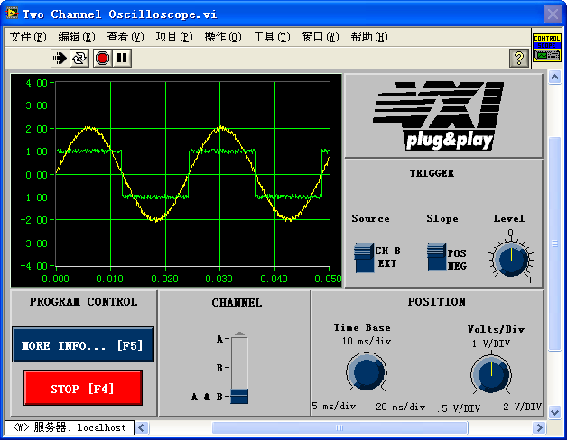

### Establishing and Adhering to Interface Standards

Maintaining UI consistency across a team or large project requires defining and adhering to clear interface standards. These standards dictate details such as window background colors, standard button sizes, font families, and text sizes.

These standards can be defined internally or align with platform-specific guidelines. For Windows-style applications, Microsoft's *Windows User Experience Interaction Guidelines* (historically found on MSDN) are the gold standard. For LabVIEW-specific guidelines, refer to the **LabVIEW Style Guide** (often chapter 6 of the *LabVIEW Development Guidelines* or NI's online developer zone), which details recommended panel colors, font choices, and control alignments.

## Association of Interface Elements

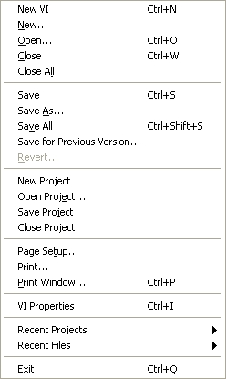    
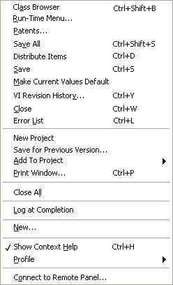

The figures above compare a standard LabVIEW menu with a scrambled, randomized menu. Most users will immediately prefer the first one because it is organized logically.

The more cluttered an interface, the longer it takes for a user to find what they need. When a user scans a UI, they look for visual patterns and groupings. A well-designed interface must provide clear visual cues to indicate which elements are related and which are independent.

You can group and associate interface elements using alignment, borders, whitespace, color, and typography.

Proximity is a powerful cue: users expect logically related items to be physically close to one another. For instance, file operations like **Save**, **Save As**, and **Save All** are grouped together in standard menus.

However, proximity alone is not always enough. Consider the following humorous example:

  

This is a classic joke from the Chinese internet: A teacher is handing back notebooks and calls out the names written on the covers: "Yellow Belly" and "Fish Is Worm", but no one answers. It turns out the notebooks of two students, "Huang Yupi" and "Lu Dan", were placed side-by-side. The teacher read horizontally across both books instead of vertically down each cover. Although the students wrote their names clearly, the lack of visual separation between the books led to a humorous mix-up.

For interfaces or menus with many items, proximity alone isn't enough. You should partition the elements into distinct functional zones. For example, using a horizontal separator line in a menu to split file saving from printing makes the structure immediately clear.

The same principle applies to Front Panel controls. Grouping related inputs and outputs using **Decorations** (such as boxes or lines), **Tab Controls**, or whitespace helps users grasp their functional relationships at a glance.

Color is another effective way to show relationships. For example, players on a sports field are easily identified by their jersey colors, even when they are mixed together. In UI design, you can use color coding to group related controls or highlight specific functions.

However, color should be used sparingly and as a secondary cue. Visual structure should rely primarily on alignment and spacing. Overly colorful interfaces are often distracting, look unprofessional, and can cause visual fatigue. Furthermore, some users have color vision deficiencies, so color should never be the sole mechanism for conveying meaning or grouping.

The LabVIEW color picker is organized into different functional palettes:

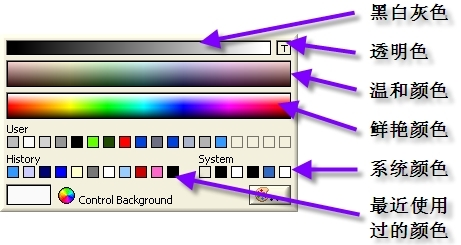

When designing system-style dialogs, always use the predefined **System Colors** (like *Panel*, *Window*, *App Font*). If you use a custom color scheme, opt for soft, muted tones instead of highly saturated primary colors. Ensure high contrast between text and backgrounds to accommodate visually impaired or color-blind users.

Simple interfaces should use minimal color variation. Color is best used to draw attention to exceptional states or highlight specific categories in information-dense displays (such as syntax highlighting in code editors or error flags in a system log). Even then, combining color with other visual cues (like bold text or status icons) ensures the interface remains accessible and clear.

## Providing Help and Feedback

A good user interface must guide and support its users, especially beginners. Help should be accessible right where the user needs it. LabVIEW provides several mechanisms for this: descriptive labels, the **Context Help** window, tooltips, embedded instructions, and external documentation.

First, ensure all controls and indicators have clear, descriptive labels. Consider the Boolean switch below, which selects the trigger edge for data acquisition. A vague label like "Mode" is unhelpful. A precise label like "Trigger Edge" immediately tells the user what the control does.

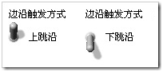

However, a label alone may not be enough. For a binary switch, the user might not know which position corresponds to which state. Enabling the **Boolean Text** property (e.g., displaying "Rising Edge" and "Falling Edge" on the switch itself) makes the current state and option immediately clear.

Tooltips (or hover help) are extremely useful. When a user hovers the cursor over a control, a brief description appears in a small popup box. For more detailed instructions, you can configure descriptions that display in LabVIEW's **Context Help** window (Ctrl+H) when the control is hovered.

To configure these, right-click the control on the Front Panel and select **Description and Tip...** to open the properties dialog:

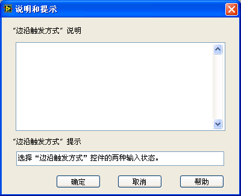

The upper text box (**Description**) defines the content displayed in the Context Help window, while the lower box (**Tip**) defines the hover tooltip.

Note that the Context Help window has limited space. Avoid writing excessively long text there, as it can clutter the screen and distract the user.

For complex operations, you should link to a user manual or compiled help file (`.chm`). You can place a **Help** button on dialog boxes that directly opens the relevant section of your documentation:

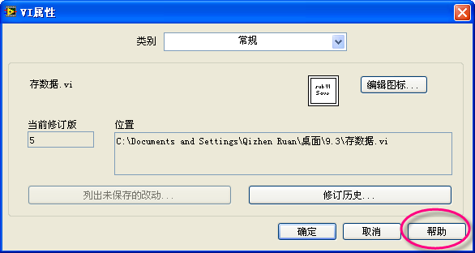

You can also embed hyperlinks in the Context Help description to point users to detailed web pages or local help files:

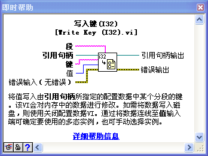

For screens that are rarely opened (such as system installation or calibration wizards), do not expect users to remember what every setting does. If space permits, embed concise instructional text directly on the panel itself.

For example, look at the **Tools >> Import >> Shared Library...** wizard. One of its steps requires the user to select an "Error Handling Mode". Because this wizard is run infrequently, the panel includes detailed explanations of each option, updated dynamically with text and diagrams to clarify the selected mode.

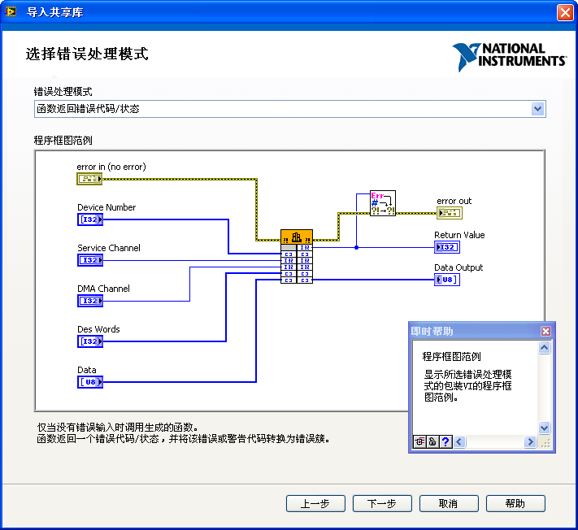

The text description at the bottom changes dynamically depending on the selected option, and a diagram in the center visualizes the selected mode. Pressing **Ctrl+H** brings up the Context Help window for additional details, and a dedicated **Help** button in the lower-right corner links directly to the full documentation.

## Implementing Constraints

Ensuring software reliability is the developer's responsibility. While a robust application should catch invalid inputs and display errors, it is far better to prevent users from entering invalid data or clicking the wrong buttons in the first place.

A well-designed UI restricts user input to valid ranges and operations, eliminating common errors at the source.

### Restricting Input Data

Many LabVIEW controls have built-in validation. For example, you can limit the range of a Numeric Control via its **Data Entry** properties tab. If a data acquisition VI only has channels 0 through 3, configure the control with a minimum of 0, a maximum of 3, and set the **Out of Range Response** to **Coerce**.

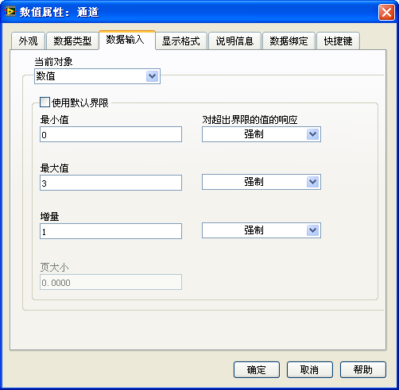

With these settings, if a user types `99`, LabVIEW automatically coerces it back to `3`, preventing the out-of-range value from propagating through your code.

An even safer design is to eliminate manual text entry entirely. For selecting channels, use an **Enum** (Enumeration) or **Ring** control. These restrict selection to a predefined list of valid channels:

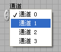

Radio buttons are another excellent choice when you want all options visible simultaneously, especially if they require brief descriptions. For example, the VI Properties dialog uses radio buttons to select protection settings:

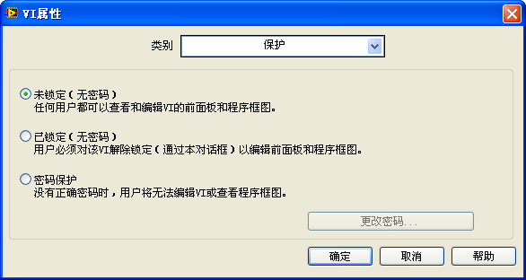

Similarly, if the user needs to select a color, using a **Color Box** control prevents them from entering invalid hexadecimal values.

### Preventing Misoperations

Users do not always interact with interfaces in the ways developers expect. Unplanned actions, whether accidental or intentional, can cause runtime exceptions. A resilient interface should actively prevent invalid actions.

The most effective way to prevent invalid actions is to disable or gray out controls that are not currently applicable. For example, in a password setup dialog, if the user selects "No Password (Unlocked)", the "Change Password" button should be grayed out. This prevents the user from clicking the button by accident and alerts them that the action is irrelevant. The button is re-enabled only when they select a password-protected option.

In LabVIEW, you can control this programmatically. Right-click a control on the Block Diagram and select **Create >> Property Node >> Disabled**. Writing a value of `0` enables the control, `1` disables it, and `2` disables and grays it out.

## Highlighting Key Elements

A good interface layout should remain simple. Cluttering the panel with too many controls—even if organized—can overwhelm users and obscure the primary functionality.

If your UI requires many elements, first check if you can simplify the layout. For example, instead of separate charts for each sensor, you can use a single **Waveform Graph** that plots multiple channels. If you cannot reduce the control count, you must establish a clear visual hierarchy. Key elements (like the primary data display or critical status indicators) should be larger, styled more prominently, and placed in central positions. Less important settings can be smaller or tucked away in tab controls. On our virtual oscilloscope interface, for example, the waveform screen dominates the display due to its size and central position, while control knobs are grouped neatly around the periphery.
