# UI Implementation Techniques

## Adjusting Interface Size

### Manually Adjusting Control Sizes and Positions

In any application, controls of the same type should maintain a consistent style and size. This is especially true for groups of identical controls on the same panel, which must look uniform to create a polished layout.

The figure below shows a Front Panel with a cluster of buttons. To make the interface look clean and professional, these buttons should have the same dimensions, align neatly, and use the exact same font settings.

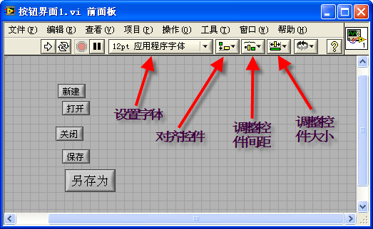

LabVIEW provides a suite of layout tools on the front panel toolbar to help organize and format controls. These include **Text Settings**, **Align Objects**, **Distribute Objects**, and **Resize Objects** (as highlighted in the toolbar above). The **Text Settings** menu allows you to modify the font family, size, color, and alignment of text. The other layout tools align selected objects, adjust spacing, resize multiple controls to match, and reorder their Z-stacking order.

To standardize button sizes, select all the target controls and click the **Resize Objects** button on the toolbar. For example, choosing **Match Maximum Width** resizes all selected controls to match the width of the widest control in the selection:

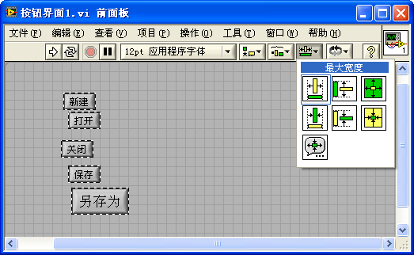 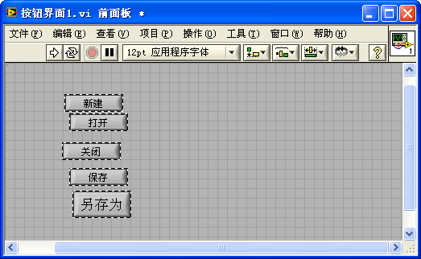

Alternatively, you can click **Set Width and Height...** to open a dialog box and specify precise dimensions in pixels:

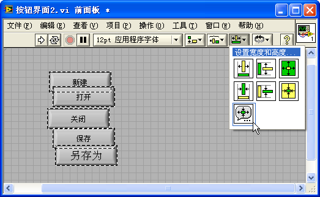 
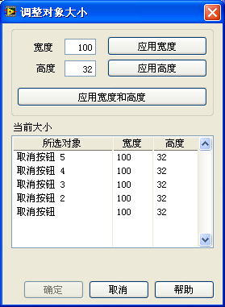

The other layout tools on the toolbar operate in a similar manner, so we will omit further explanation of their basic functions.

Using these alignment, spacing, and font tools ensures that controls are arranged neatly. A clean, aligned layout is significantly more professional and easier to navigate:

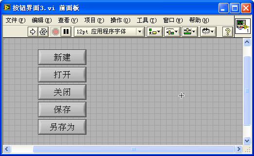

### Designing Interfaces with Adjustable Sizes

What is the optimal size for an application window? Since software is often deployed across monitors with varying resolutions, a static window size is problematic: a large window might not fit on low-resolution screens, while a small window wastes valuable space on high-resolution monitors. Ideally, application windows should be resizable, allowing users to scale the interface to fit their display. To maintain a clean layout as the window resizes, the controls on the Front Panel must adapt their sizes and positions dynamically.

Controls respond to window resizing in one of two ways. First, some controls need to expand or shrink: large data displays (such as Waveform Graphs, Tables, and Multi-line Text boxes) represent the primary content of the screen and should scale up to maximize the viewable data area. Second, other controls should remain a fixed size: buttons, checkboxes, and numeric inputs do not need to scale, but their positions must be adjusted (e.g., docked to the right or bottom edges) to keep the layout organized.

### Panes and Splitter Bars

Every VI Front Panel is composed of one or more **Panes**. By default, a new VI contains a single pane that occupies the entire panel, which is why developers often overlook them. However, it is technically the panes that sit on the Front Panel, and all controls are placed inside a specific pane.

You can divide a Front Panel into multiple panes using **Splitter Bars**. Splitter bars are located in the **Controls Palette** under **Containers** (available in Modern, System, Silver, and Classic styles). You can drag horizontal or vertical splitter bars onto the panel to split it into multiple independent regions. Moving a control from one pane to another changes only the visual layout; it does not affect block diagram wires or application logic.

When the Front Panel is resized, you can configure how the splitter bar behaves. Right-click the splitter bar and select **Splitter Sizing** to define whether the bar remains docked to a specific edge (e.g., stuck to the left or right) or scales proportionally with the window size:

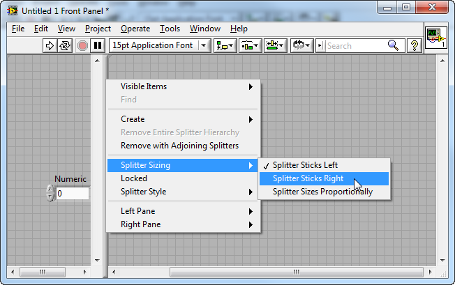

The right-click menu also contains settings for the panes on either side of the splitter (e.g., **Left Pane** and **Right Pane**, or **Top Pane** and **Bottom Pane**). For instance, when partitioning a UI, you typically want to hide scroll bars for specific panes. You can configure this via **Scrollbar >> Off** or **Scrollbar >> Show when Needed** in these submenus.

You can also configure splitter bar properties programmatically at runtime. Although splitter bars do not have corresponding terminals on the Block Diagram, you can right-click a splitter bar in the editor and select **Create >> Reference**, **Create >> Property Node**, or **Create >> Invoke Node** to manipulate it in your code. The simple VI below programmatically moves a splitter bar from left to right:

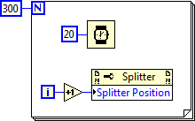

By default, users can manually drag splitter bars during execution to resize panes. To prevent this, right-click the splitter bar and select **Lock** to fix its position.

Splitter bars do not have a built-in "Hide" property. If you want to make a splitter bar invisible at runtime, use a **Classic Splitter Bar**, select the **Color Set** tool, and paint it the same color as the window background. This creates invisible boundary divisions. Additionally, note that the panes on either side of a splitter bar can be configured with different background colors.

Panes also lack a "Hide" property. To hide a specific pane dynamically during execution, programmatically adjust the position of its boundary splitter bar to collapse the pane to a size of zero.

### Programmatically Adjusting Control Positions and Sizes

A highly robust way to handle window resizing is to programmatically adjust control positions and dimensions. By listening for the **Pane Size** event in an Event Structure, the application can dynamically recalculate and update control properties whenever the window is resized.

Suppose we want the **Stop** button to remain anchored to the bottom-right corner of the window, while the **Waveform Chart** expands to fill all remaining space. We can implement this logic programmatically as shown below:

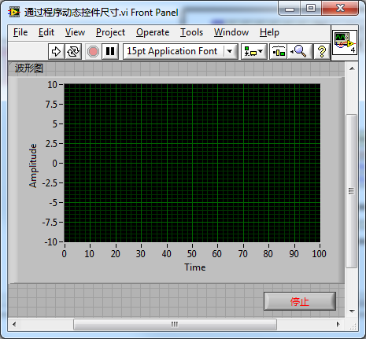

When the window is resized, the program queries the new width and height of the pane and calculates the new position coordinates and dimensions for each control. In this example, the layout adjustment code is placed in a custom **User Event** case named "Resize Controls", rather than directly inside the **Pane Size** event case. This is a best practice: layout adjustments are often required both at startup (initialization) and during resizing. Delegating the layout code to a single User Event case and programmatically triggering it from both the initialization code and the **Pane Size** event prevents code duplication.

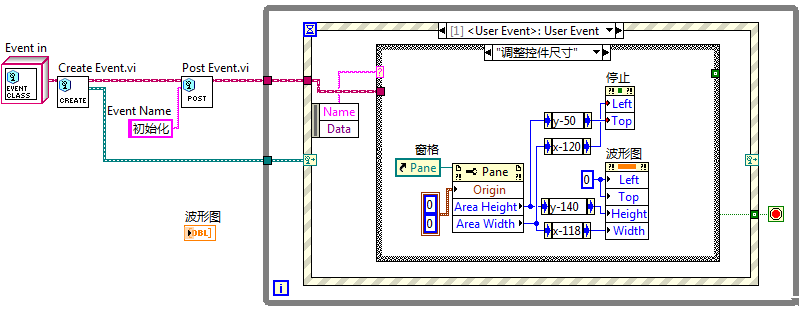

Managing control layouts programmatically provides precise control and is sometimes the only way to accurately scale complex components (such as circular gauges). The downside is the complexity of writing and maintaining the positioning math. For simple interfaces, utilizing splitter bars is a much cleaner, no-code alternative.

### Proportionally Scaling All Controls

For simple, single-pane VIs, you can enable the **Scale all objects with window size** option in the VI Properties dialog. This automatically scales all Front Panel objects proportionally when the window is resized:

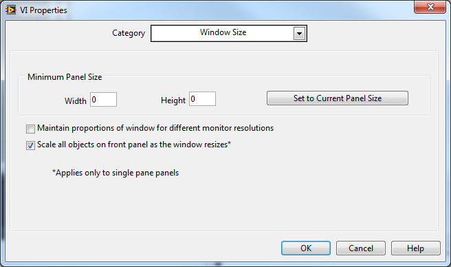

While convenient, this automatic scaling lacks precision. If the user repeatedly resizes the window and then returns it to its original size, you may notice that some controls have drifted slightly in size or position. This drift occurs because Front Panel coordinates and control dimensions are integers; rounding errors accumulate each time the size ratio is recalculated, leading to visible layout distortion over time.

### Scaling Only One Main Control

In many layouts, you only need a single primary control (like a main data graph) to expand and fill the screen, while other controls (like buttons and settings) remain a fixed size.

For instance, on an interface with a Waveform Chart and a Stop button, you can configure the chart to expand by right-clicking it and selecting **Scale Object with Pane**. Note that LabVIEW only allows *one* object per pane to have this setting enabled.

When selected, the control is highlighted with a gray outline in the editor. When the window is resized, the distance between the control's outer boundary and the edges of the pane remains constant, meaning only the control itself scales. The positions of all other controls remain fixed relative to their original coordinates.

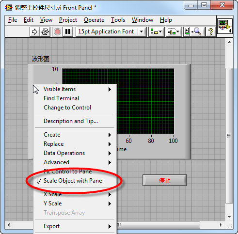

If you have multiple primary controls that need to scale (for example, two adjacent graphs), you can group them together. In LabVIEW, a grouped set of controls behaves as a single object. Selecting **Scale Object with Pane** on the group will scale all controls inside it proportionally:

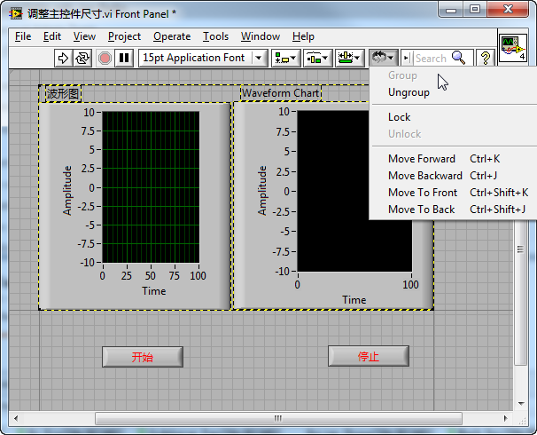

Grouping is also useful for keeping the relative spacing between fixed-size controls constant. For example, if you place a **Start** and a **Stop** button in a group, their size remains fixed and the distance between them does not drift when the window is resized.

### Adjusting Control Positions and Sizes Using Splitter Bars

For complex interfaces, you can design sophisticated, auto-scaling layouts using only splitter bars without writing layout code. Consider the interface below:

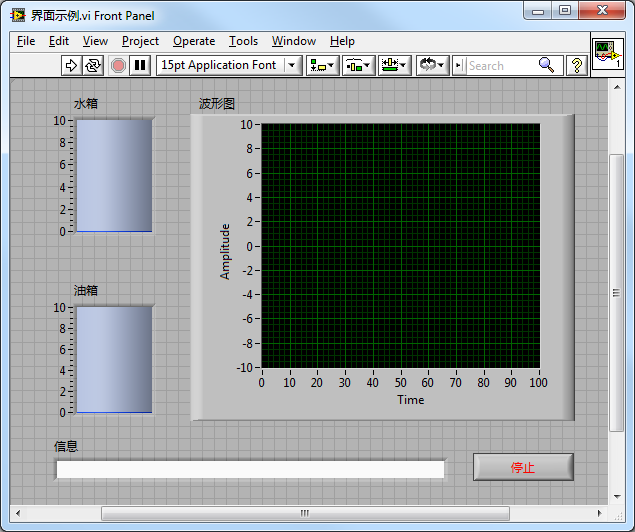

This panel contains five controls: a "Water Tank" level, an "Oil Tank" level, a "Waveform Chart", a "System Status" text box, and a **Stop** button. The levels and chart should scale proportionally, but their margins should remain constant. The status box should stretch horizontally but keep a fixed height. The **Stop** button should remain a fixed size at the bottom-right corner.

We can achieve this layout by dividing the panel into multiple panes using splitter bars. By placing each resizable control in its own dedicated pane and selecting **Scale Object with Pane** (or **Fit Control to Pane**), the controls will automatically stretch to fill their respective panes as the window resizes:

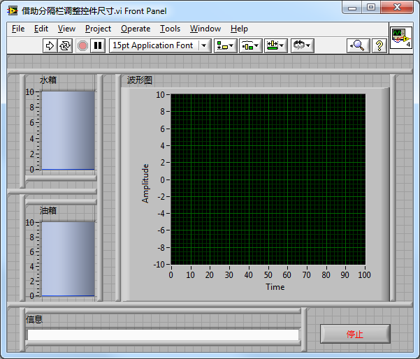

The tank indicators, graph, and text box are set to fill their panes, while the **Stop** button remains anchored in a fixed-size pane.

While this is an advanced layout, it demonstrates how splitter bars can resolve complex scaling rules. In simpler designs, you will only need one or two splitters.

The layout's behavior is governed by the alignment and sizing rules of each splitter bar. The image below shows the configuration for each splitter:

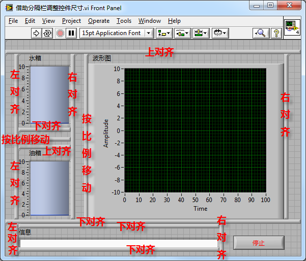

To make the interface look clean, you should hide the splitter bars at runtime by painting them transparent or matching the background color, as described in [Panes and Splitter Bars](#panes-and-splitter-bars).

### Key Points for Programmatically Adjusting UI Sizes

1. **Non-resizable Controls**: In LabVIEW, certain controls cannot be resized. While standard controls are fully resizable, System-style controls (like radio buttons, checkboxes, and certain dropdowns) have fixed heights or dimensions to match OS standards:

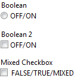

2. **Fixed Aspect Ratio Controls**: While most controls allow independent width and height scaling, circular objects (like knobs, dials, and gauges) require a fixed 1:1 aspect ratio. For these controls, the built-in **Scale Object with Pane** option can stretch and distort the graphic. If these controls must scale, you must adjust their dimensions programmatically on the Block Diagram to maintain the correct ratio:

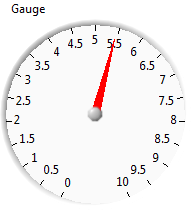

3. **Minimum Window Size**: When designing a resizable UI, always set a minimum window size. If a user shrinks the window too much, controls will overlap or disappear, rendering the interface unusable. You can configure the minimum panel size in the VI Properties dialog under **Window Size**:

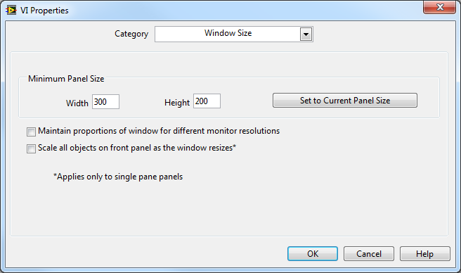

### Implementing an Application Exit Button

Although the window title bar provides a standard close button (the red "X"), you should always include an explicit **Exit**, **Close**, or **Cancel** button on the Front Panel. This conforms to standard operating system UX conventions, as users instinctively look for on-screen buttons to dismiss a dialog.

Furthermore, you must handle the title bar close event programmatically. Clicking the red "X" on a subVI's Front Panel closes the window, but does *not* stop the VI from executing or unload it from memory. If the VI has a running While Loop and relies on a button click (like "Stop") to exit the loop, closing the window removes the button from the user's view, trapping the loop in an infinite run. This can cause the application to hang or freeze.

To prevent this, handle the **Panel Close** event in your Event Structure (located under the **\<This VI>** event source). The Block Diagram below shows how to unify the **Stop** button value change and the **Panel Close** event to safely perform cleanup, close the panel, and exit the VI:

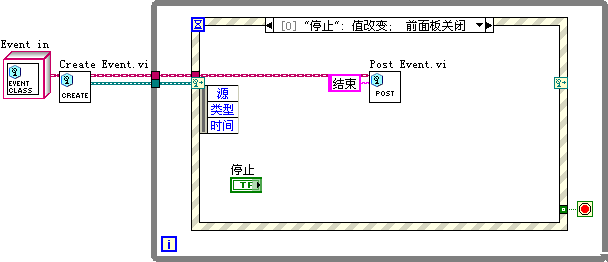

In critical applications, closing a window abruptly can interrupt ongoing processes or leave hardware in an unsafe state. In these scenarios, you should display a confirmation prompt when the user attempts to close the window.

This is accomplished using the **Panel Close?** filter event (identifiable by the red question mark icon, which indicates it can discard the event):

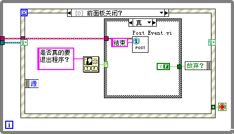

When the user clicks the close "X", the filter event pauses the close action, prompts the user, and discards the close event if the user selects "Cancel":

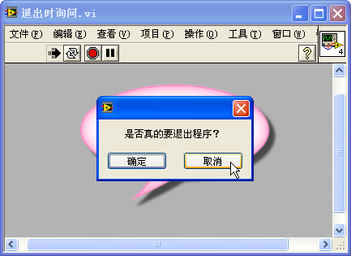

### Menus

By default, a running VI displays the standard LabVIEW menu bar. In standalone applications, these developer menus are unnecessary and should be replaced with custom application menus.

You can create custom menus using LabVIEW's built-in Menu Editor. Select **Edit >> Run-Time Menu...** from the menu bar to open the editor and select **Custom**:

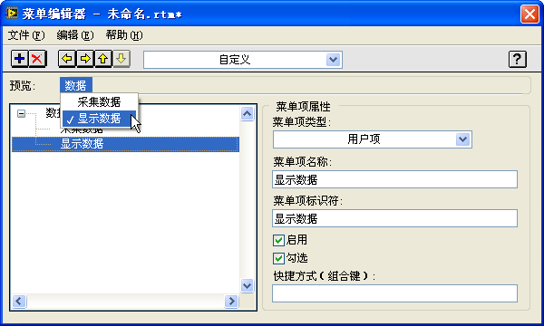

The Menu Editor is highly intuitive, allowing you to define menu hierarchies, item names, and user tags.

Once saved, the custom menu will replace the default LabVIEW menu bar when the VI runs:

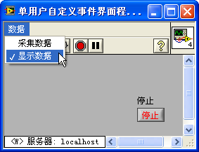

After creating the menu, you must write code to respond to menu selection events. When a user selects a menu item, LabVIEW generates a **Menu Selection (User)** event under the **\<This VI>** event source. You can handle this event in an Event Structure to execute the corresponding code. The example below shows how to toggle a checkmark next to a "Display Data" menu item programmatically:

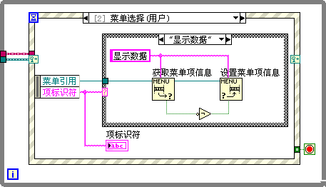

Additional menu manipulation VIs can be found in the **Programming >> Dialog & User Interface >> Menu** subpalette.

### Control Shortcut Menus

At runtime, right-clicking a control displays the default LabVIEW context menu:

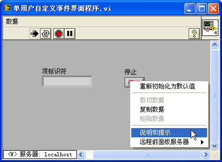

To prevent users from accessing development commands (like *Properties* or *Data Operations*), you can define a custom runtime shortcut menu. Right-click the control in edit mode and select **Advanced >> Run-Time Shortcut Menu >> Edit...** to open the Shortcut Menu Editor. Once configured and saved, right-clicking the control at runtime displays the custom shortcut menu. You then handle the **Shortcut Menu Activation?** (to build/modify the menu dynamically) and **Shortcut Menu Selection (User)** events in your Event Structure.

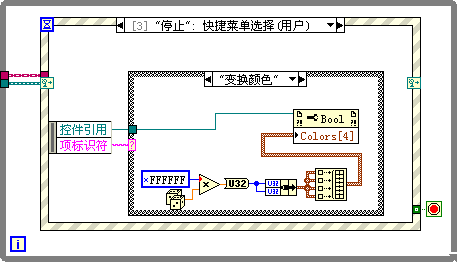

The example below configures a context menu for the **Stop** button with a single "Change Color" option. When clicked, the button changes its background color:

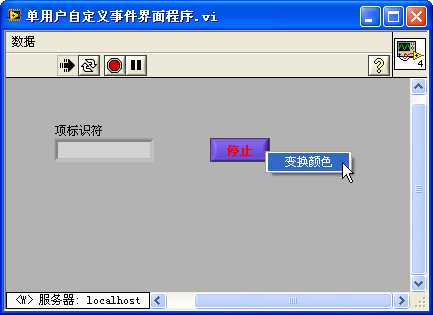

Note: The menu reference wire provided in the **Shortcut Menu Activation?** event case is temporary and only valid within that event case execution window.

### Keyboard Interface Operation

While the mouse is the primary navigation tool, a professional UI should accommodate keyboard navigation for speed and accessibility.

Users expect the **Tab** key to move focus between controls in a logical sequence (typically left-to-right, top-to-bottom). You can adjust this by selecting **Edit >> Set Tabbing Order** in the menu, clicking the controls in the desired sequence, and confirming the change:

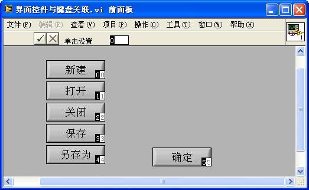

To exclude a control from the tabbing loop, open its Properties dialog, navigate to the **Key Navigation** tab, and check **Skip this control when tabbing**.

You can also assign keyboard shortcuts to frequently used buttons (such as mapping the **Enter** key to **OK**, or **Esc** to **Cancel**). This is configured in the **Key Navigation** tab of the control's properties:

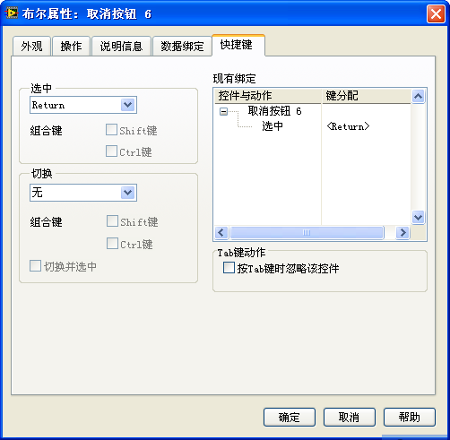

### Composite Controls

In modern user interfaces, complex controls are often built by combining simpler, primitive components.

### Controls in LabVIEW vs. Controls in WPF

Different programming frameworks use different approaches to build composite controls. Let's compare LabVIEW's model with WPF (Windows Presentation Foundation) to highlight their design trade-offs.

WPF is a powerful UI framework in .NET designed to separate user interface design from application logic. This division allows designers to work on UI layouts in XAML (Extensible Application Markup Language) while developers write backing logic in C# or VB.NET. Similarly, LabVIEW decouples the user interface (Front Panel) from the code (Block Diagram).

While LabVIEW provides an intuitive, WYSIWYG visual editor that is extremely stable, WPF's visual designer in Visual Studio has historically struggled to render complex layouts. In large-scale industrial projects with hundreds of XAML files, the designer often fails, forcing developers to edit the XML text directly and run the application to verify visual changes.

Furthermore, dynamic UI updates in WPF rely on data binding. In the WPF designer, controls do not hold runtime data, making it difficult to preview how the UI will look under actual operating conditions. In contrast, LabVIEW controls contain actual data values even during edit mode, allowing developers to view and test control states directly on the Front Panel before running the VI.

LabVIEW and WPF cater to different audiences. WPF is a general-purpose developer tool, offering a small set of primitive controls that are highly customizable. Developers are expected to compose these primitives to build custom UI elements. LabVIEW, designed for rapid test and measurement development, provides a massive palette of ready-to-use, domain-specific controls (like thermometers, slides, and graphs) out of the box. The trade-off is customizability: while dragging a ready-made graph onto the Front Panel is trivial, creating a completely custom control from scratch in LabVIEW can be extremely difficult.

As LabVIEW applications grew into large-scale systems, NI introduced object-oriented programming and **XControls** to provide reusable, smart UI components. However, XControls are notoriously complex to design and debug, especially compared to the composition models in WPF.

WPF controls are built on a container model. For example, a WPF button is a content container: you can embed text, images, or even another layout container inside it. In LabVIEW, controls are atomic and cannot be nested (with a few exceptions like Tab controls or Subpanels). This makes combining multiple control types difficult.

For example, if you need a table where the first column contains button triggers and the second column contains dropdown pickers, WPF can implement this natively by nesting controls within the grid cells. In LabVIEW, you cannot insert controls into cells. Implementing this behavior requires overlaying dynamic controls on top of a Listbox or Table control and moving them programmatically to match the active cell.

LabVIEW does have a few container-like controls, such as **Tab Controls** and **Subpanels**, which host and display other UI elements, but they do not support cell-level nesting.

### Combining List Box and Dropdown Menu Controls

In this section, we will walk through how to simulate a composite control by programmatically repositioning UI elements at runtime.

Tables are standard UI elements, but LabVIEW Tables only accept raw text input. If you want to restrict a cell's input to a predefined list (e.g., "A", "B", "C", or "D"), you can overlay a **Combo Box** or **Ring** control dynamically on top of the active cell when selected. To the user, it looks as though the cell itself contains a dropdown menu:

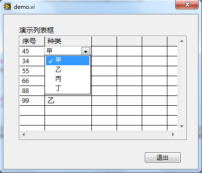

This effect is achieved by combining a **Multicolumn Listbox** control and a hidden **Combo Box** control:

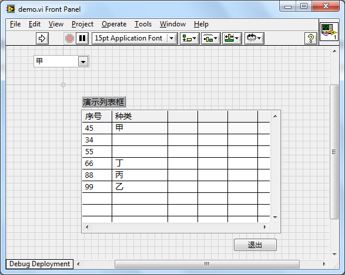

The application monitors the **Mouse Down?** event on the Multicolumn Listbox. When clicked, the code calculates the column index. If the click is in the second column ("Type"), the program reads the cell's coordinates and dimensions, positions the Combo Box directly over the cell, and resizes it to match. The block diagram snippet is shown below:

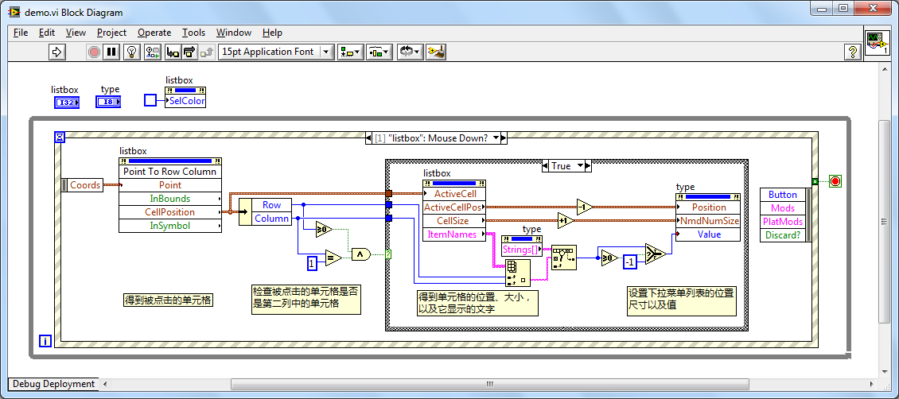

When the user selects an option from the Combo Box, its **Value Change** event triggers. The code writes the selected value into the listbox cell, then moves the Combo Box out of the visible screen area:

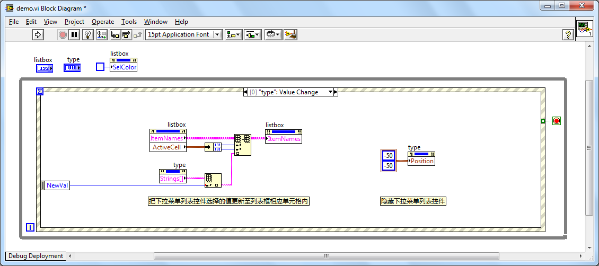

The code must also handle hiding the Combo Box when the user clicks elsewhere on the panel or in another column:

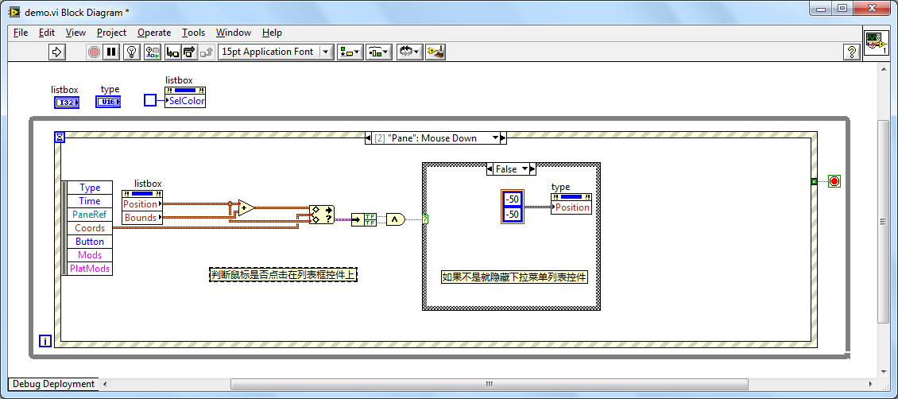