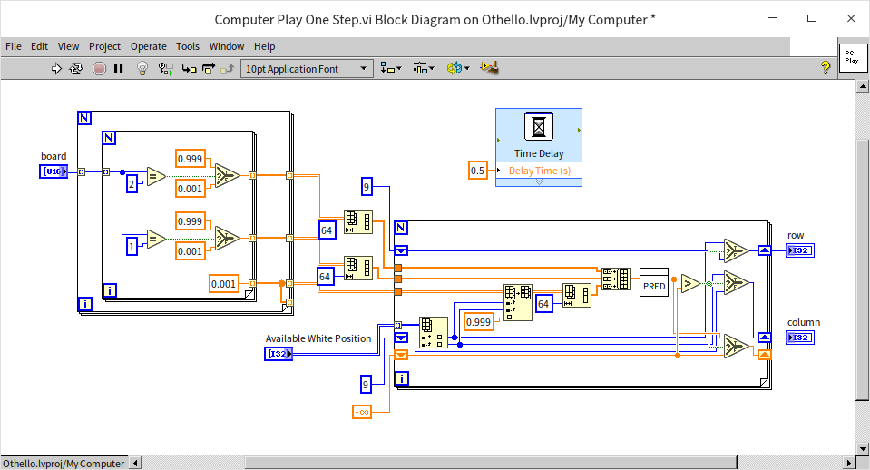

# XControl

This section will delve into the detailed process of creating an XControl. To facilitate explanation, we will use the chessboard example mentioned in the "[UI Design Examples](ui_cases.md)" as the primary example, showing how to develop an XControl. When explaining specific features of XControls, we will also introduce other examples.

## Design

The main advantage of an XControl is its ability to encapsulate both its interface elements and related code together, making it easier to publish and reuse these interface components. However, creating an XControl is challenging, and an improperly designed XControl can lead to serious issues, such as causing the user interface to freeze. Therefore, it's crucial to carefully plan both the structure and behavior of an XControl before starting development to avoid potential pitfalls.

Before creating a new interface component, consider how it will be implemented.

If an interface component is highly specialized and intended only for a specific program, it might not be necessary to develop it as a standalone control. Instead, this interface component can be created as a separate sub-interface VI and then incorporated into the main VI using a subpanel control.

If the component will be reused multiple times, then it should be considered for development as a reusable, independent control. If this control doesn't contain any special behavior – for example, a new type of button that only differs in appearance from standard buttons – then it is suitable to be made into a custom control.

If the new component requires reuse, and its behavior significantly differs from existing controls, then XControl becomes a suitable option. Examples include creating a new button with an extra state, controls with animation effects, controls using local measurement units, or a control dedicated to drawing specific types of curves. These scenarios are well-suited for XControl development.

The chess control mentioned before, which has both a unique interface and behavior and can be applied across different software, is a perfect candidate for XControl.

First, the specific interface and behavior that this XControl requires must be defined.

Its interface can directly use the one designed in the "[UI Design Examples](ui_cases.md)" section. Among the design options previously mentioned, the solution using an array of picture ring controls is the simplest in terms of programming. Therefore, this interface solution will be adopted for the XControl design.

The input and output data of the XControl on the program diagram should be the data that the application most frequently interacts with. In this case, the most common data is the layout information of the chessboard. Therefore, the input/output data for this XControl should be an 8x8 integer array representing the chess pieces' layout on the board.

The properties of the chess control should include which color's turn it is, potential positions for placing pieces, the number of pieces of each color on the board, and the position of the last placed piece.

Its methods should include placing a chess piece, which involves placing a piece in a new position, flipping captured pieces, and updating data and all property values.

Additionally, after a user places a piece on the interactive interface, an event should be triggered to notify the application.

## Creation

In the Project Explorer, right-click and choose "New -> XControl" to start creating a new XControl:

Structurally, an XControl is a specialized library. It encompasses specific functional VIs, as well as optional properties, method VIs, and other relevant files. A newly formed XControl comes with four mandatory functional VIs (controls): "Data", "State", "Facade", and "Init". Additionally, XControl has two optional functional VIs: "Uninit" and "Save for State Change".

- **Data functional control**: Defines the data type for XControl.
- **State functional control**: Specifies all data used internally by XControl, beyond the data function.
- **Facade functional VI**: The most critical functional VI within XControl, tasked with implementing both the interface of XControl and its behavior.
- **Init functional VI**: Establishes the initial state of XControl.
- **Uninit functional VI**: Handles cleanup, releasing all resources allocated to XControl upon its removal from memory.
- **Save for State Change functional VI**: Saves certain internal data of XControl within the VI that utilizes it.

The Uninit functional VI and Save for State Change functional VI do not exist in a newly created XControl. If needed, they can be added by right-clicking on the XControl in the project explorer window and selecting "New -> Function" to incorporate a functional VI into XControl.

XControl is stored in a .xctl file, closely resembling a LabVIEW library file and can be regarded as a unique LabVIEW library file type. Its property settings are identical to those of a LabVIEW library:

First, save the newly crafted XControl. It's important to note that the file names of XControl's functional VIs don't necessarily correspond to their function names. For instance, in this demonstration, for broader accessibility, you might opt to save the XControl under an English name:

Please note: XControl's functional VIs are designed to be invoked by the LabVIEW system, featuring pre-established input and output interfaces. It's crucial not to alter their input and output controls or their terminal layouts during XControl development. Additionally, these functional VIs should not be directly called from other VIs. XControl developers are only required to populate the necessary program code within the functional VIs. Direct data transmission between functional VIs is not possible, nor is the use of global variables advisable. Data transfer should only occur through the "Data" and "State" defined by the functional controls.

## "Data" Functional Control

XControl utilizes two key functional controls: "Data" for defining the XControl's data type, and "State" for specifying the types of internal data XControl employs.

Firstly, focusing on the "Data" functional control, this is encapsulated within a .ctl custom type file. The data type it delineates corresponds to the terminal data types on the XControl's program diagram. For instance, in this example, the chessboard layout is represented by a two-dimensional U16 array, thus necessitating the use of a two-dimensional array within the data functional control:

## "State" Functional Control

The "State" functional control is crafted as a custom type control, specifically a cluster control. This cluster aggregates all variables required for XControl's operational definitions.

Displayed below is the internal data essential for operating a Reversi (or Othello) chess XControl.

This encompasses the following components:

- **method**: Serves to define XControl's methods. Setting the method variable occurs when a user engages a specific method of an XControl. Different values are assigned to the method variable for each XControl method, thus enabling the "Facade" functional VI of the XControl to discern which method is being invoked by the user.

- **current color**: Signals the current color of the piece to be placed, indicating whether it should be white or black.

- **available black position**: A two-dimensional integer array that maps out potential positions for placing black pieces.

- **available white position**: Similarly, a two-dimensional integer array that identifies where white pieces can be positioned.

- **Interactive Action**: A custom event triggered when a user places a piece on the chessboard. This event informs the application that a move has been executed.

- **row and column**: These are two integers that log the location of the most recently placed piece.

The explanation above briefly introduces the significance of each piece of data. Further details and instructions for their use will be provided as they come into play later in the narrative. It's worth noting that achieving a perfect "State" functional control design from the outset may not be feasible during the XControl development process. It's often more practical to enhance and refine this aspect as the various functionalities of XControl are being implemented and realized.

## "Facade" Functional VI

The "Facade" Functional VI is at the heart of XControl, shaping both its appearance and behavior.

### Interface Design

The front panel of the "Facade" Functional VI serves as the canvas for XControl's interface. For practicality, you can directly employ the interface already crafted in the [UI Design Examples](ui_cases#improving-the-interface-implementation-method) section. Transferring the chessboard and piece design previously outlined to this panel will suffice. The dimensions of this "Facade" Functional VI window dictate the size at which the XControl widget will be displayed when it's dragged onto a VI's front panel. As such, this VI should be precisely sized to snugly fit around the chessboard:

For XControls intended to be resizable on the user VI's front panel, all controls within the "Facade" Functional VI's front panel must be designed to automatically adapt their size in tandem with the front panel's dimensions.

Take, for example, the following image depicting the front panel of a "Facade" Functional VI for an XControl. This panel represents the initial size of the XControl when integrated into another VI:

In the subsequent image, showcasing a VI utilizing this instance of XControl, users may opt to adjust the size of the XControl instance. This action is akin to altering the size of the front panel seen in the prior image. Therefore, button controls on this panel need to resize appropriately to match the panel's new dimensions. The adjustment of button sizes to correspond with changes to the XControl instance control size, as seen below, necessitates setting the "Facade" Functional VI to "Scale All Objects with Pane".

In the chessboard control scenario, it's feasible to restrict users from modifying its size. This restriction can be implemented by deselecting the "Allow user to resize window" option found in the window appearance section of the "Facade" Functional VI's property settings. This effectively prevents users from altering the dimensions of the XControl instance control.

### How It Works

The behavior of XControl is determined by the block diagram of the "Facade" Functional VI. This includes reactions to user interactions, such as clicks, mirroring the functionality found in standard application interfaces. Its structure utilizes a loop with event structures, yet it's essential to recognize its unique aspects compared to typical applications.

In conventional applications that employ an event structure loop, the application continuously runs, awaiting and then addressing events as they arise. In contrast, the "Facade" Functional VI is activated by LabVIEW only upon the occurrence of an event within XControl. Following event processing, it must terminate its operation promptly. LabVIEW proceeds with other interface tasks only after the "Facade" Functional VI concludes. Hence, embedding continuous execution code within the "Facade" Functional VI, such as for controlling animations on XControl, is ill-advised. This could render LabVIEW unresponsive to interface interactions.

Timeout event handling within the "Facade" Functional VI deviates from standard application practices. The loop is designed to exit, with a timeout interval set to zero. This setup ensures that immediately after all pending events are managed, the "Facade" Functional VI addresses the timeout event and then swiftly concludes its execution.

### Parameters

The "Facade" Functional VI features three input and three output parameters:

- **Data In / Data Out**: These parameters handle the data entering or exiting the XControl's terminals, with their type specified by the "Data" functional control. At the commencement of execution within the "Facade" Functional VI's block diagram, Data In contains XControl's current value, which may be modified as the diagram executes. Data Out then outputs this adjusted value back to LabVIEW.

- **Display State In / Display State Out**: This represents the comprehensive internal data utilized during XControl's operation, often referred to simply as the state. Its data type is delineated by the "State" functional control. Similar to Data, this state can be modified during execution, with inputs and outputs handled analogously.

- **Container State**: An input parameter, this cluster delineates the status of an XControl instance (created when XControl is dragged onto a VI's front panel) on the VI panel. It comprises three elements: "Indicator?", "Run Mode?", and "refnum". "Indicator?" identifies whether the XControl instance serves as a display control, with a false value indicating a control function. "Run Mode?" signals whether the VI that includes the XControl instance is active. "refnum" refers to the XControl instance itself.

- **Action**: An output parameter signaling to the LabVIEW program any alterations made to XControl in the course of its execution. It consists of three elements: "Data Changed?", "State Changed?", and "Action Name". Should there be any modifications to Data, it's imperative to set "Data Changed?" to true, thereby notifying LabVIEW and ensuring the changes are applied. Likewise, modifications to State necessitate setting "State Changed?" to true. "Action Name" is a textual field that allows for a brief description of the program's execution intent, which then appears under LabVIEW's "Edit -> Undo" menu option.

### Data Change Event

Within the "Facade" Functional VI, event handling primarily addresses two categories of events: those specific to XControl and those arising from user interactions with the interface.

XControl-specific events include data changes, display state changes, direction changes, and execution state changes.

A data change event occurs when data enters an XControl instance via its terminal. Handling such an event typically involves refreshing the interface controls and the XControl's Display State with the new information.

Take, for instance, the chessboard XControl, where the data corresponds to the chessboard's layout. Thus, if new data is set for the XControl, it necessitates an update to the arrangement of pieces displayed on the interface.

Below is an example of how the Reversi chess widget processes a data update event: it refreshes the chessboard's display on the interface based on the new layout. This process utilizes a sub-VI to determine viable positions for placing black and white pieces, aiding the XControl in validating user actions. This discussion centers on XControl specifics, so the sub-VI won't be further detailed. The possible positions for placing pieces are stored within the XControl's state. After the piece layout is updated, it's crucial to recalculate these positions and refresh the XControl's state. With changes to the XControl's state, it's imperative to inform LabVIEW to handle the updated state accordingly. Hence, "State Changed?" must be marked as true.

### Display State Change Event

Triggering a display state change event happens when XControl's state values are modified through its properties and methods. It's worth noting that altering XControl's state values through data change event handling does not activate a display state change event. Such events are only triggered by invoking XControl's properties and methods, which will be explained further on.

Handling a display state update involves adjusting interface controls to align with the new state values, alongside updating XControl's data and state. For example, the chessboard control features a "Play One Move" method. Activating this method executes a move on the chessboard, necessitating updates to the board's layout and other state aspects. Therefore, the "Play One Move" method needs to alter an XControl state datum, "method", setting it to "Play One". This change prompts the XControl's display state update event.

The handling for the "Play One Move" method is depicted below. Upon the display state update event's activation, the first step is to verify the value of "method". If it reads "Play One", it signifies the method's invocation. This necessitates recalculating the chessboard layout and potential positions for piece placement, akin to data change event processing. However, since this action updates both the Reversi chess XControl's data and its state, both "Data Changed?" and "State Changed?" must be set to true.

### Direction Change and Execution State Change Events

Direction change events occur when an XControl instance toggles between being a control widget and a display widget, or vice versa. Similarly, execution state change events happen when the VI containing the XControl instance switches from run mode to edit mode, or the reverse. The approach to handling both event types is akin: certain conditions necessitate disabling user interactions with the interface. In the case of the Reversi chess widget, the response to both events is the same: when the widget is in display mode and the VI is running, user clicks on the interface are disabled:

In certain cases, a change in the direction or execution state of an XControl instance may require further adjustments. This is somewhat similar to numeric controls, where changing orientation necessitates updating the visibility of increment/decrement buttons.

### Interface Events

Aside from the four special events previously discussed, the "Facade" Functional VI of XControl needs to react to user actions on the interface, just like any standard interface application. Therefore, the "Facade" Functional VI is also capable of processing events related to changes in control values on the interface, mouse clicks, and so on.

For the Reversi chess XControl, there's only one user interface event that needs attention: a mouse click on a legal position on the chessboard indicates making a move.

When a mouse click on the chessboard interface is detected, the initial step is to check if the position is legal for placing a piece. If the position is valid, a piece is placed, necessitating a reevaluation of the board layout and other states. At this juncture, an event is also generated for the VI using the chessboard XControl instance. How to utilize this event will be discussed subsequently.

## "Save for State Change" Functional VI

The "Save for State Change" Functional VI serves the purpose of preserving XControl's state data. By default, the entire Display State within the XControl's "Facade" Functional VI gets saved in the invoking VI. This can significantly increase the memory footprint of the VI, especially if the state data is voluminous. Nevertheless, it's not always necessary to save every piece of state data. While certain aspects of a control's state, such as color or size, should remain after the VI closes—to be retained upon reopening—other pieces of state data are merely temporary and need not be preserved. For instance, in the Reversi chess widget, there's no need to save any state data like current color or potential move positions since they are recalculated each time. Thus, in the "Save for State Change" Functional VI, all data can be discarded, opting to save an empty dataset instead:

## "Init" Functional VI

The "Init" Functional VI fulfills two key functions: firstly, it retrieves the state saved within the VI calling the XControl and assigns this state to the XControl. Secondly, it opens or initializes resources required by the XControl. For the VI that invokes the Reversi chess widget, no state data needs to be loaded since it doesn't save any. However, the Reversi chess widget utilizes a user event, necessitating the creation of this event within the "Init" Functional VI:

## "Uninit" Functional VI

The "Uninit" Functional VI takes care of closing any resources that were opened within the XControl. Given that a user event was established in the "Init" Functional VI for the Reversi chess widget, this event must be dismantled here:

## Properties

In programming, properties of a control can be accessed or modified through the control's property node, such as its position, color, etc. Likewise, custom properties can be designed for an XControl instance to be utilized at runtime.

By right-clicking on the XControl in the Project Explorer window and selecting "New -> Property", you can add properties to an XControl. Each property is associated with two VIs for reading and writing the property, respectively. Eliminating one of these VIs renders the property either read-only or write-only. Generally, the code inside the property read/write VIs is quite straightforward, essentially involving reading from or writing to a piece of data within the XControl's state.

The properties of the Reversi chess widget are straightforward. For instance, the "Current Color" property identifies which color piece is up next. This is a read-only property, with its read property VI implemented as follows:

Utilizing an XControl widget's properties within an application mirrors the process used for standard controls:

## Methods

Methods in XControl widgets function similarly to those in standard controls, being invoked in applications via call nodes. The distinction between methods and properties lies in their application: properties are for reading or writing a single value, while methods execute a specific function of the XControl and can manage multiple parameters at once.

Creating and implementing methods mirror the approach used for properties, with the associated VI primarily focused on manipulating the XControl's state. Although the number of parameters for an XControl method can vary, adjustments to the parameters' number or types must be made within the method's configuration dialog rather than by directly modifying the method VI. To access this dialog, right-click on the method VI within the Project Explorer and select "Configure Method":

For instance, the Reversi chess game features a "Play One Step" method. Each invocation of this method by the application corresponds to making a move on the chessboard. The algorithm for executing a move, however, is processed within the display state change event handling of the "Facade" Functional VI. Thus, the "Play One Step" method primarily records the move's position in the XControl's state.

The implementation is shown below:

Initially, it verifies the legality of the placement position. If deemed valid, the state is updated with the move's position. This method also modifies the "method" data, informing the "Facade" Functional VI which method has been activated.

## Events

Enabling controls to emit specific events is essential, particularly as most application interfaces now utilize an event-driven architecture. Regrettably, XControl instance widgets lack the inherent ability to generate events. Consequently, VIs that incorporate XControl cannot directly capture events (e.g., mouse clicks) from XControl instances in the event structure's edit event dialog as they would with standard controls. To facilitate event emission from XControl instance widgets for application use, akin to traditional controls, this feature must be implemented through user-defined events.

This approach entails creating a user event, storing it within the XControl's state, and subsequently registering this custom event within the application's event structure. The user-defined event is generated in the "Init" Functional VI and preserved within the XControl's state. For applications to access this custom event, an XControl property is established. Reading and registering this property in the application allows the application's event structure to capture events from the XControl widget.

The application's code for registering and leveraging XControl events is depicted below:

## Using the Chessboard XControl

Implementing XControl is akin to utilizing standard controls, albeit with a slightly more complex approach to event handling. To use it, you simply need to drag the XControl file onto the interface VI. The interface of a demo program shown below includes the Reversi chess XControl widget alongside several essential controls.

The demo program's block diagram showcases a classic event loop structure. The functionality of the program is executed by reading and writing the properties of the XControl and calling its methods:

### Artificial Intelligence in Chess

An interesting feature of this example program is its incorporation of a basic artificial intelligence (AI) for chess play. Each time "Computer Play One Step.vi" is invoked, it calculates and returns the optimal move position.

This VI assesses each potential move, assigning scores to each (via predict_score.vi) before selecting the position with the highest score for execution. The code includes a deliberate delay, which could be omitted. The delay was introduced because the scoring process completes almost instantly, which might seem slightly unnatural. Introducing a brief pause makes it appear as though the computer is thoughtfully considering its next move.

While this chess AI implementation is tangential to XControl, it's briefly discussed here due to its relevance. The logic behind AI chess strategies closely mirrors the described process: evaluating each potential move based on the current board setup and opting for the highest-scoring option. The challenge lies in crafting a scoring algorithm that's both logical and effective.

In Reversi, where the goal is to end with the most pieces, a straightforward scoring approach is to consider the number of one's pieces after a move as the score for that position. Essentially, this means choosing the move that results in the greatest number of one's pieces. However, this strategy has its limitations: the move that maximizes one's pieces in the short term might not lead to a long-term advantage. Sometimes, strategic retreats are necessary to clinch the final victory.

There are two principal strategies to rectify the flaw of focusing solely on the immediate gain of chess pieces:

1. **Future Moves Prediction**: This strategy involves not just scoring the current move but also predicting several moves ahead. Imagine enumerating all possible board states after each player makes three moves (six moves in total), then identifying which scenario yields the highest score. The more moves you predict into the future, the stronger the chess strategy becomes, potentially revealing a definitive winning strategy for simpler games. However, the drawback is the significantly increased computational demand; predicting more deeply results in an exponential growth in calculations. Though optimizations like pruning can help, their effectiveness is somewhat limited.

2. **Comprehensive Scoring Strategy**: This approach broadens the scope of considerations when scoring moves. Beyond just the number of pieces, it includes factors such as the strategic position of the move, the number of stable pieces, available surrounding space, and more. Deciding which factors matter most and how to weigh them can be daunting for amateur players like myself. This is where machine learning algorithms can shine, allowing the computer to autonomously discover the optimal solution. This strategy is computationally less intensive but finding the best approach isn't as straightforward.

In an ideal scenario, these strategies would be combined: first, devising an optimal scoring algorithm, then extending predictions as far into future moves as possible.

The demonstration program employs the second strategy, limiting its prediction to just one step ahead. It utilizes a straightforward fully connected neural network with a single hidden layer of 64 nodes to score all potential move positions. For a complex game like Reversi, a single layer of 64 nodes might be insufficient. Achieving satisfactory results with only one-step predictions likely necessitates a more complex model, such as a CNN with seven or eight layers. However, given the demonstration's purpose and the complexity of integrating such models into VI, the simplest model was selected.

The model's input includes the current state of the board (the color of the pieces on each position) and a candidate move position, outputting a score as a real number. The highest-scoring position is then chosen for the move.

The general approach to training the model allowed it to play against itself, alternating between black and white pieces, and documenting each move. Positions played by the winning side were labeled positively, while those by the losing side negatively. These data points were used to train the model, with the training process repeated multiple times.

During the model's training phase, I encountered challenges I hadn't previously considered, such as choosing an appropriate activation function. Initially opting for the ReLU function, the model consistently failed to train to expected standards. Further investigation revealed that the issue stemmed from the "dying" of ReLU neurons, which become permanently inactive for inputs less than zero, a phenomenon not problematic for large-scale models but devastating for a small-scale model with limited neurons. Switching to the Sigmoid function markedly improved outcomes.

Ultimately, the trained model could compete on par with my own limited skills, considering my basic understanding of Reversi's rules.

## Implementing Animation

While we've previously touched on the method for creating simple animations in LabVIEW in the [UI Design Examples](ui_cases) section, developing animated controls with XControl introduces a bit more complexity. This is primarily because the "Facade" Functional VI of XControl can only have its timeout set to zero. This limitation means you can't use the event structure of the "Facade" Functional VI for timed refreshes to facilitate animation. Implementing animations in XControl requires relocating the timing control for interface refreshes to a separate thread, a strategy that leverages the background task architecture discussed in the [Loading and Running SubVIs](vi_server_for_subvi) section.

Take, for instance, the task of creating an XControl featuring a button embedded with a light bulb that blinks continuously, illustrated below:

The conceptual approach for this program involves:

Firstly, setting up a background task. The reference to the light bulb control on the XControl interface is forwarded to a background task VI. This task manages timing; at predetermined intervals, it alters the light bulb control's color by adjusting its color property, thus achieving the blinking effect. Below is a simplified diagram of this background task's timing component. In reality, the program would need to manage events from the XControl, adding a layer of complexity beyond what the diagram conveys.

The "Init" Functional VI of XControl kicks off the background task. A critical point here is that the timing VI is reentrant, meaning when its reference is opened, the "options" input parameter is set to "8". This parameter ensures that each time the timing VI is opened, a new instance is created. Given that multiple instances of the same XControl can exist simultaneously, their respective background tasks must also operate independently to prevent timing conflicts and chaos. (For more detailed information on configuring the "Open VI Reference" function's "options" input parameter, refer to the "LabVIEW Help".)

Accordingly, the "Uninit" VI of XControl should terminate the background task. In this example, merely sending an "Exit" event to the background task prompts it to cease operation.

## Accessing Information from the VI Hosting the XControl Instance

In the "Facade" Functional VI of an XControl, you can obtain a reference to the XControl instance via the Container State input parameter. This instance refers to the specific XControl widget deployed within the application. With this reference in hand, the full suite of VI Scripting functionalities becomes available for manipulation of the widget. The power of VI Scripting enables the creation of XControls with diverse and intriguing functionalities. Here’s a practical example:

Consider designing an XControl that looks like a standard button but is ingeniously designed to be unclickable. Whenever the user attempts to hover the mouse over it, the button elusively moves to a different location. Achieving this functionality within an XControl necessitates knowledge of the widget's current position on the VI and the ability to reposition it. Additionally, to ensure the button does not escape the visible area of the front panel, understanding the dimensions of the front panel of the VI hosting the XControl is crucial. All this information can be gathered through the XControl instance widget’s reference.

Below is the code within the "Facade" Functional VI for handling the event of a mouse hovering over the control. The process involves determining the XControl instance widget's current position and the VI front panel's dimensions. Subsequently, a new position is randomly generated (with a sub-VI tasked with calculating this new position), and the XControl instance widget is moved accordingly.

This approach introduces a minor concern due to a loop’s presence. The loop is intended to animate the XControl's movement across the VI's front panel. Ideally, loops should be avoided within the "Facade" Functional VI of an XControl, as lengthy loops can hinder LabVIEW's response to other interface actions. Nevertheless, this particular loop executes swiftly and only a few times, thus minimizing any noticeable delay in interface responsiveness.

Let's call this creation the "Mischievous Button". Once placed on a VI's front panel, it playfully evades any click attempts. Yet, in edit mode, it can be caught. Simply selecting it with the mouse immobilizes it, preventing any movement. However, in the run mode of the VI, catching it becomes a real challenge.

## Error Handling

Typically, controls do not relay error information back to the application. Thus, within the functional, property, and method VIs of an XControl, errors that arise are generally bypassed. For those looking to reference such error messages during the debugging process, a temporary solution involves displaying these errors in pop-up dialogs or logging them to a file. Nevertheless, any non-essential code should be stripped out before the XControl is distributed to users.

## Debugging

Debugging XControl doesn't markedly differ from standard program debugging. Begin by placing breakpoints within the various functional, property, and method VIs of the XControl. Upon using the XControl, the program execution halts at these breakpoints, pausing for further instructions from the debugger.

Should any issues arise during debugging, immediate code modification might seem necessary. However, opening any instance of the XControl triggers a lock on the corresponding XControl in the Project Explorer, preventing any edits. This lock aims to avert any discrepancies that could emerge between the instance and the XControl following modifications. In such instances, you can right-click the XControl in the Project Explorer and select "Unlock Library for Editing" to proceed with changes.

While in edit mode, any XControl instances within the application are temporarily disabled, rendering the application non-operational.

After finalizing the XControl modifications, right-clicking the XControl in the Project Explorer and selecting "Apply Instance Changes" will revert it back to the operational state.

## Practice Exercise

* Develop a control that mimics the dimmer switch depicted below. It should not only toggle the light on and off but also adjust the bulb's brightness. Strive for a design that surpasses the aesthetics of the given example.

