# XControls

This section will delve into the detailed process of creating an XControl. To facilitate explanation, we will use the chessboard example mentioned in the "[UI Design Cases](ui_cases)" as the primary example, showing how to develop an XControl. When explaining specific features of XControls, we will also introduce other examples.

## Design

The main benefit of an XControl is its encapsulation: it packages UI elements, data properties, methods, and backing logic into a single reusable library. However, building an XControl is challenging. An improperly designed XControl can cause significant issues, such as blocking the LabVIEW user interface thread and freezing the application. Therefore, you must carefully plan the structure and behavior of your XControl before diving into development.

Before building a new UI component, choose the right implementation pattern based on your requirements:

- **Subpanel Controls**: If a UI component is highly specialized and used only in a single application, do not develop it as a custom control. Instead, build it as a separate subVI and display it in the main interface using a **Subpanel** control.
- **Custom Controls (.ctl)**: If a component is reused frequently but has no custom behavior (for example, a button that has a unique background image but still functions like a standard Boolean button), create it as a custom control (.ctl) or strict type definition.
- **XControls**: If a component needs to be reused across projects, but its behavior or data handling is fundamentally different from native controls (for example, a button with three states, an animated control, a chart that handles custom physical units, or a specialized drawing canvas), then developing an **XControl** is the appropriate choice.

The Reversi chessboard, with its specialized drawing rules, cell clicks, game logic, and reuse potential across different applications, is a perfect candidate for an XControl.

First, let's define the interface and behavior for this chessboard XControl:

1. **Interface**: We will reuse the layout designed in [UI Design Cases](ui_cases). Among the options discussed, using a 2D array of Picture Rings is the most straightforward to implement. We will adopt this approach.
2. **Data**: The data type of the XControl (which appears on the Block Diagram wire) should represent the primary value of the control. For a chessboard, this is the current board state. We will define the XControl's data type as an 8×8 U16 array representing the layout of the chess pieces.
3. **Properties**: We want to expose custom properties such as: whose turn it is (Active Player), valid move coordinates, the piece count for each color, and the coordinates of the last move.
4. **Methods**: We want to support methods like *Play One Move*, which takes coordinates, places a piece, flips the captured pieces, and updates the board array and properties.
5. **Events**: When the user clicks a cell on the Front Panel to make a move, the XControl should trigger a custom event to notify the host application.

## Creation

To create an XControl, right-click a folder or target in the Project Explorer and select **New >> XControl**:

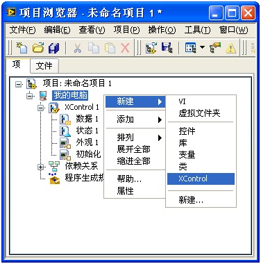

Structurally, an XControl is a specialized project library (saved as a `.xctl` file). It contains core **Ability VIs** (or functional VIs) that govern its behavior, along with optional custom properties and methods. A newly created XControl contains four mandatory Ability VIs:

- **Data**: A custom control (.ctl) defining the data type of the XControl (what flows through its terminal).
- **State**: A custom control (.ctl) defining internal configuration and state variables.
- **Facade VI**: The visual representation and event handler of the XControl. This is the most critical component.
- **Init VI**: Runs when the XControl is loaded into memory or initialized.

It also supports two optional Ability VIs:
- **Uninit**: Performs cleanup when the XControl is unloaded from memory.
- **Save for State Change**: Saves a customized portion of the internal state into the host VI's file.

These optional Ability VIs are not included by default. To add them, right-click the XControl library in the Project Explorer and select **New >> Ability** (or **Function**) to generate them.

An XControl is saved as a `.xctl` file. Because it is a specialized type of LabVIEW library, its properties and namespace settings are identical to standard LabVIEW project libraries (.lvlib):

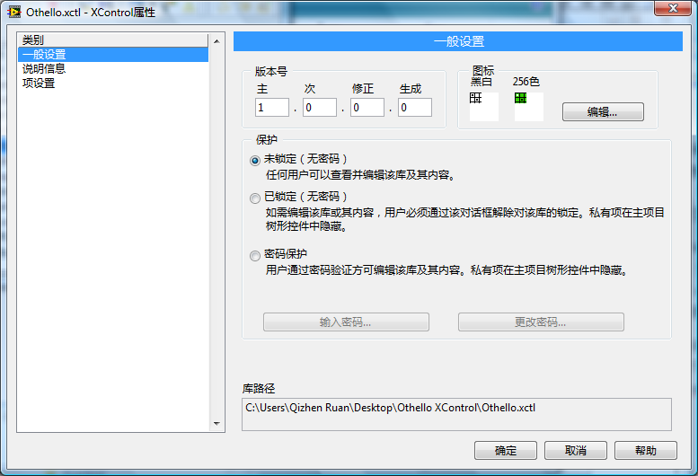

First, save the XControl and its components. Note that the physical filenames of the files inside the library do not have to match their logical ability names. For example, we will save the files under descriptive English names:

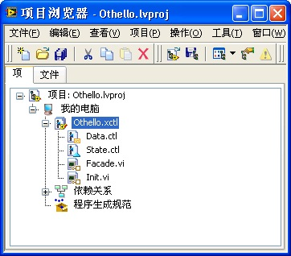

> [!IMPORTANT]
> Ability VIs are called directly by the LabVIEW runtime engine. They have strict connector pane templates. **Do not modify their controls, indicators, or connector pane layouts.** Furthermore, never call these VIs directly in your application code.
> Because these VIs run in separate contexts, you cannot pass data between them via standard wires or global variables. All data sharing must be handled through the defined **Data** and **State** controls.

## "Data" Functional Control

An XControl uses two custom controls (.ctl) to manage data: **Data** and **State**.

The **Data** control is a strict type definition. The data type you configure here is the exact type that flows through the XControl's terminal on the host VI's Block Diagram. For our chessboard, this is a 2D U16 array:

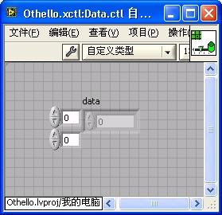

## "State" Functional Control

The **State** control is a custom control (typically a cluster). It holds all the variables required internally by the XControl to track its status, draw the interface, and maintain configuration.

The figure below shows the **State** cluster for the Reversi chessboard XControl:

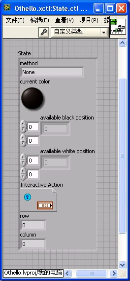

It contains the following elements:

- **method**: An enum used to track method calls. When a host application calls an XControl method, the method VI writes to this enum. The **Facade VI** reads this value to determine which method was invoked and execute the appropriate action.
- **current color**: Tracks whose turn it is (e.g., White or Black).
- **available black position / available white position**: 2D arrays storing valid coordinates for the respective players.
- **Interactive Action**: A User Event refnum. When the user clicks the board to make a move, the Facade VI triggers this event to notify the main application.
- **row and column**: The coordinates of the last move.

Don't worry about designing a perfect State cluster at the beginning. You can easily modify this control to add or remove variables as you develop the XControl's logic.

## "Facade" Functional VI

The **Facade VI** is the core of an XControl, defining its visual look and event-driven runtime behavior.

### Interface Design

The Front Panel of the Facade VI is what the user sees when they drag the XControl onto their application's Front Panel. We can copy the layout from [UI Design Cases](ui_cases) directly onto this panel. The boundaries of the Facade VI window determine the default size of the XControl instance, so crop the window layout closely around the chessboard:

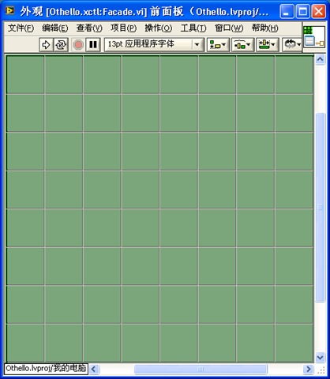

If you want the XControl to be resizable at edit time on the host VI, you must configure the controls within the Facade VI to resize dynamically.

For example, the Facade VI below represents the default size of an XControl in edit mode:

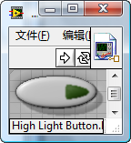

When the developer resizes the XControl on their host Front Panel, the Facade VI's panel changes size. To make the inner buttons scale with the control's boundaries, enable **Scale all objects with window size** in the Facade VI's window properties.

For the chessboard, it is better to prevent resizing to avoid distorting the square ratio. You can disable resizing by configuring the Facade VI's **Window Appearance** properties to disable user resizing, which prevents the host developer from scaling the XControl instance.

### How It Works

The Block Diagram of the Facade VI handles the runtime logic and event response of the XControl. It uses a While Loop containing an Event Structure, similar to standard UI applications, but with a critical difference in execution flow:

In a typical application, the event loop runs continuously. In contrast, the Facade VI is loaded and executed *only when a specific event occurs* on the XControl. Once the event is processed, the Facade VI **must immediately stop running and exit its loop**. The LabVIEW UI thread is blocked while the Facade VI is active. If the Facade VI hangs or runs a long loop (such as for animations), the host application will freeze. Therefore, the While Loop in the Facade VI must run exactly once per event invocation.

To ensure the Facade VI exits immediately after processing an event, the Event Structure's timeout is set to `0`, and the Timeout event case is configured to stop the While Loop:

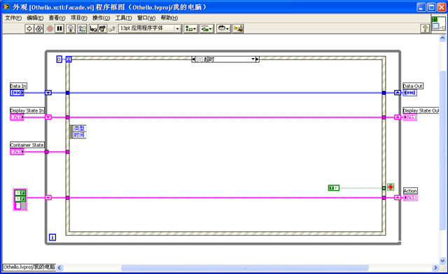

### Parameters

The Facade VI has three inputs and three outputs:

- **Data In / Data Out**: The value flowing through the XControl's wire. Its type is defined by the **Data** custom control.
- **Display State In / Display State Out**: The internal state cluster defined by the **State** custom control.
- **Container State**: A cluster containing metadata about the XControl's environment:
  - `Indicator?`: True if the XControl instance is placed as an Indicator, False if it is a Control.
  - `Run Mode?`: True if the host VI is running, False if the host VI is in edit mode.
  - `refnum`: A control refnum pointing to the XControl instance itself (allowing scripting and property/method calls).
- **Action**: An output cluster that tells the LabVIEW engine how to handle updates:
  - `Data Changed?`: Set to True if the Facade VI modified the control value. LabVIEW will update the wire value and propagate it.
  - `State Changed?`: Set to True if the Facade VI updated any variables in the State cluster. LabVIEW will save the new state and trigger a display refresh.
  - `Action Name`: A string describing the action. LabVIEW uses this text for its **Edit >> Undo** history list.

### Data Change Event

The Event Structure in the Facade VI handles two types of events: **XControl Events** (generated by the LabVIEW engine) and standard **User Interface Events** (clicks, keypresses, etc.).

XControl-specific events include: **Data Change**, **Display State Change**, **Direction Change**, and **Execution State Change**.

A **Data Change** event occurs when the host application writes a new value to the XControl's terminal. The Facade VI must respond by updating its front panel controls and state to match this new value.

In our chessboard XControl, when the host VI writes a new 8×8 board layout, the Facade VI must redraw the pieces on the Front Panel.

The figure below shows how the Facade VI handles **Data Change**: it updates the Picture Ring array on the panel and uses a helper VI to compute valid move positions for the active player. Since these valid positions are stored in the internal **State** cluster, the code updates **Display State Out** and sets `State Changed?` to True in the **Action** cluster to notify LabVIEW of the state update:

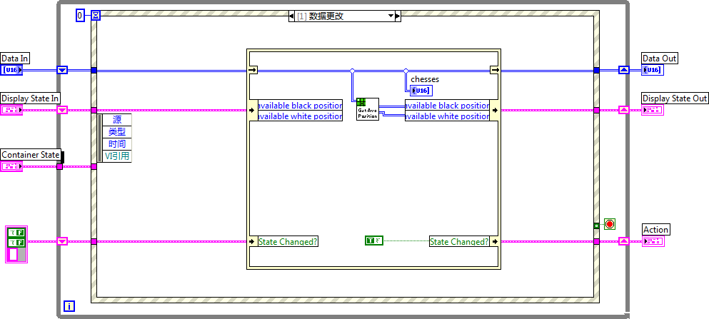

### Display State Change Event

A **Display State Change** event triggers when the XControl's state is programmatically modified by the host application calling a custom property or method. Note that updating the state *inside* the Facade VI's own event cases does not trigger this event; it is only invoked by external property/method calls.

When a display state change occurs, the Facade VI must update the Front Panel to reflect the new state. For example, when the host application calls the *Play One Move* method, the method VI updates the internal state variable `method` to 'Play One'. This action triggers the **Display State Change** event in the Facade VI.

The Facade VI's response to this event is shown below. It inspects the `method` variable in **Display State In**. If it matches 'Play One', the VI calculates the new piece layout, flips the captured pieces, and updates the board display. Because this operation updates both the chessboard data (value) and the internal state, the code sets both `Data Changed?` and `State Changed?` to True:

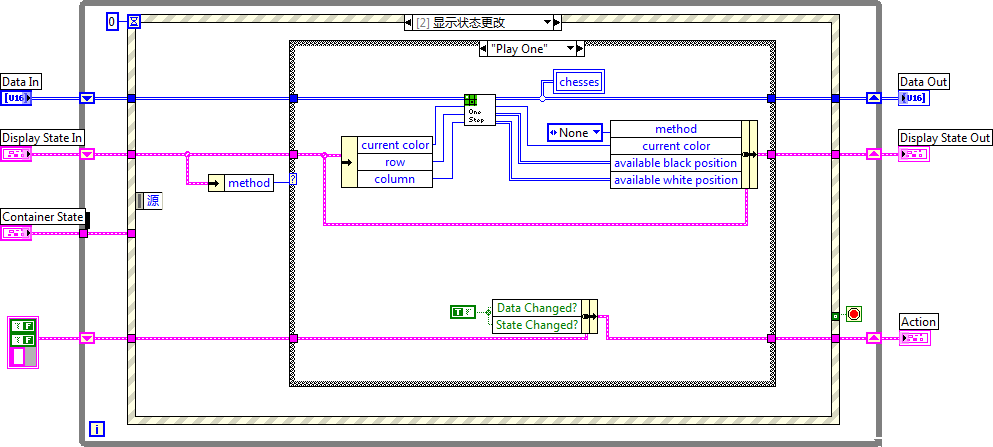

### Direction Change and Execution State Change Events

A **Direction Change** event fires when the XControl instance is switched between a Control and an Indicator. An **Execution State Change** event fires when the host VI transitions between Edit Mode and Run Mode.

Often, these events require you to enable or disable UI interactions. In our Reversi XControl, when the control is set to an Indicator or when the host VI is in Edit Mode, we must disable user inputs on the chessboard:

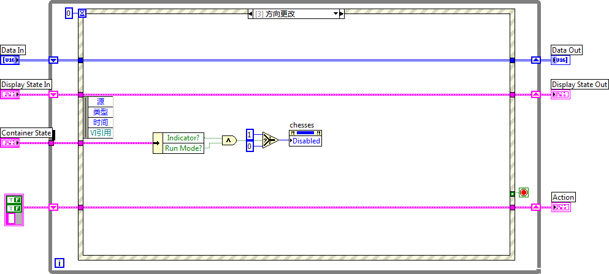

This is analogous to native controls: for instance, switching a Numeric control to an Indicator automatically hides its increment/decrement buttons.

### Interface Events

In addition to the four special XControl events, the Facade VI handles standard user interactions on its own Front Panel, such as clicks, key presses, and value changes.

In the chessboard XControl, the primary user interface event is when the player clicks the board to place a piece.

When a mouse click on the chessboard array is detected, the Facade VI checks if the selected coordinate is a valid move. If so, it places the piece, updates the layout, and fires a user event to notify the host application:

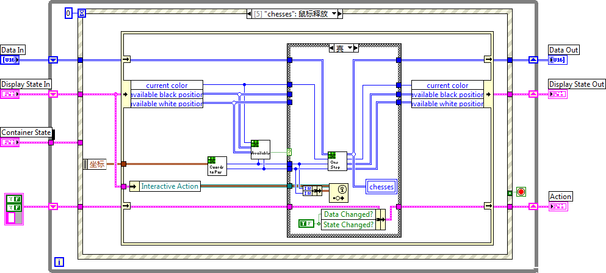

## "Save for State Change" Functional VI

The **Save for State Change** Ability VI controls which parts of the XControl's state cluster are saved into the host VI's file. By default, LabVIEW attempts to serialize the entire State cluster. If your state contains large data arrays, this can bloat the host VI's file size.

Often, most state variables (such as temporary layout coordinates, turn indicators, or dynamic calculations) do not need to be saved across sessions. Only configuration properties (like custom colors or grid sizes) should be preserved. In our chessboard XControl, since all game state is recalculated at startup, we do not need to save any state data. We can simply write an empty cluster to the output in this VI:

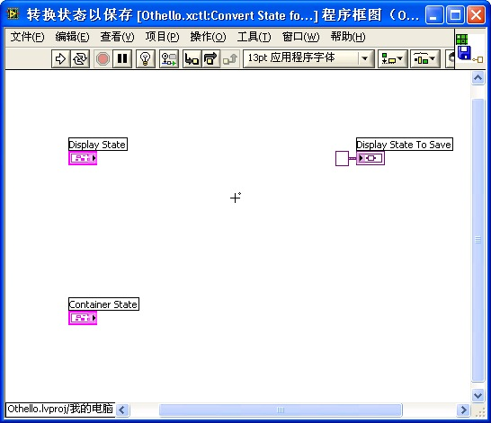

## "Init" Functional VI

The **Init** Ability VI runs when the XControl is loaded. It performs two duties: recovering the saved state from the host VI and initializing external resources (like file handles, hardware sessions, or User Events).

Since we are using a custom User Event to notify the host application of player moves, we create the User Event in the **Init** VI and store its refnum in the XControl's State cluster:

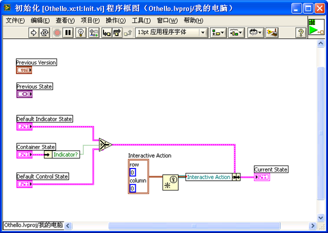

## "Uninit" Functional VI

The **Uninit** Ability VI runs when the XControl is unloaded from memory. It must release any resources allocated during initialization. For the chessboard XControl, we must destroy the User Event refnum here to prevent memory leaks:

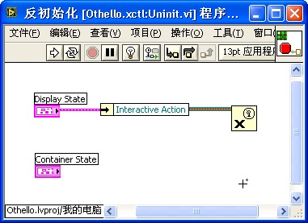

## Properties

Custom properties allow the host application to configure the XControl using standard Property Nodes at runtime.

To add a property, right-click the XControl library in the Project Explorer and select **New >> Property**. Each property generates a read VI and a write VI. Deleting one of these VIs makes the property read-only or write-only. The implementation of these VIs is straightforward: they read or write variables inside the XControl's State cluster.

For instance, the read-only **Current Color** property returns whose turn it is. Its read VI is implemented below:

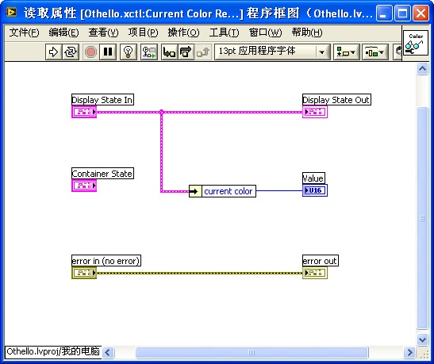

Once defined, these custom properties appear in the standard Property Node menu for the XControl instance:

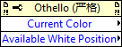

## Methods

Custom methods are executed via Invoke Nodes. While properties read or write single values, methods perform actions and can accept multiple inputs and return multiple outputs.

To create a method, right-click the XControl library and select **New >> Method**. Like properties, method VIs interact with the State cluster. If your method requires parameters, you must define them in the method configuration dialog rather than editing the VI connector pane directly. Right-click the method VI in the Project Explorer and select **Configure Method**:

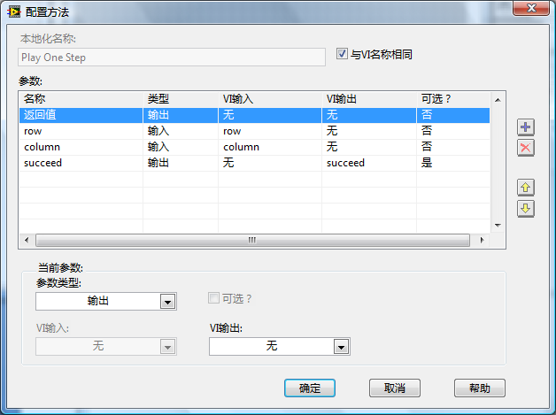

For example, the *Play One Step* method allows the application (or AI) to make a move. The actual game logic is executed in the Facade VI's **Display State Change** handler. Thus, this method simply validates the move coordinates and writes the target position and the 'Play One' command into the state:

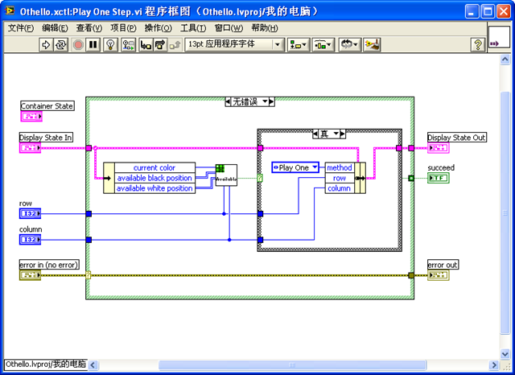

Initially, it verifies the legality of the placement position. If deemed valid, the state is updated with the move's position. This method also modifies the "method" data, informing the "Facade" Functional VI which method has been activated.

## Events

Since modern LabVIEW interfaces rely on event-driven architectures, custom controls should be able to fire events. Unfortunately, XControls cannot register custom events directly in the standard Event Structure configuration dialog.

To work around this limitation, you must use **User Events**:
1. Create a User Event in the XControl's **Init** VI and store its refnum in the XControl's State.
2. Expose the User Event refnum via a custom read-only property (e.g., *Player Moved Event*).
3. In the host application, read this property and register the event using **Register For Events** to handle it inside an Event Structure.

The host application block diagram for registering and handling this custom event is shown below:

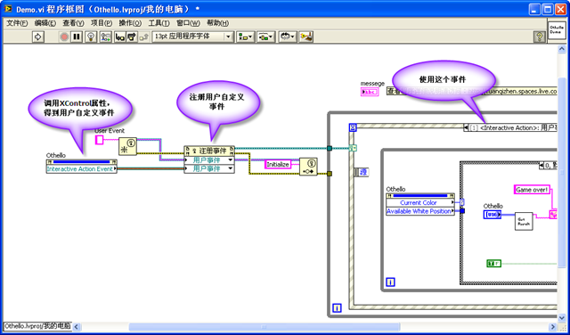

## Using the Chessboard XControl

Using an XControl in an application is simple: drag the `.xctl` file from the Project Explorer onto your host Front Panel. The figure below shows a demo application interface containing our chessboard XControl and general control buttons:

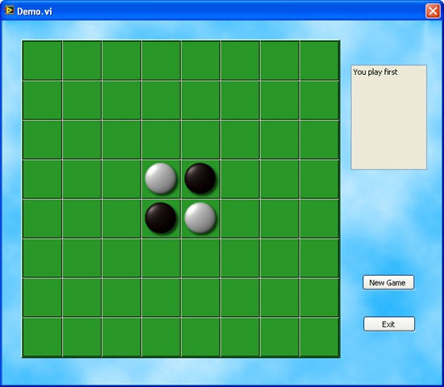

The block diagram uses a standard Event Structure loop. The host program coordinates the game by reading the XControl's properties, registering its player move event, and calling its methods:

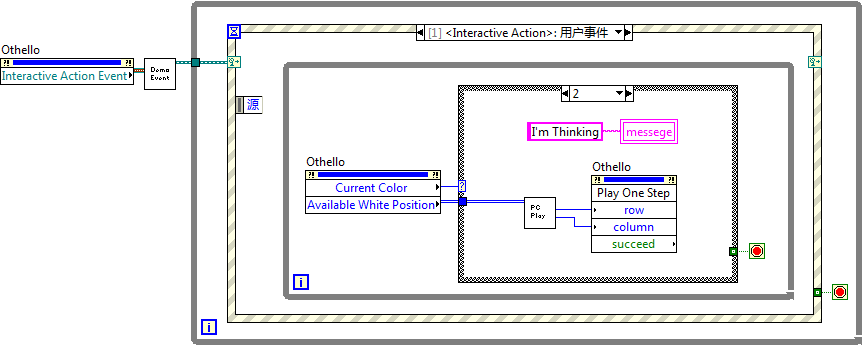

### Artificial Intelligence in Chess

An interesting feature of this demo is a simple artificial intelligence (AI) player. When `Computer Play One Step.vi` runs, it calculates and returns the best candidate move for the computer:

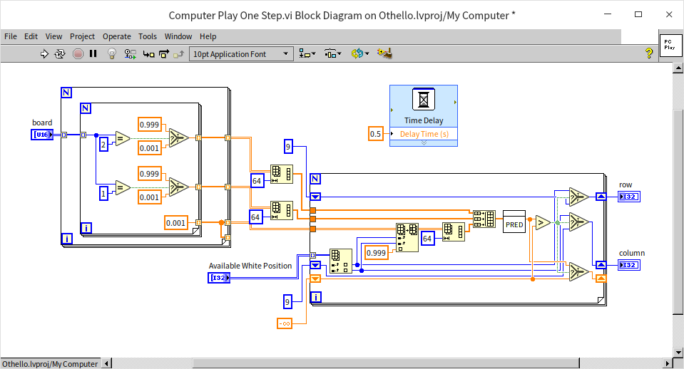

This VI evaluates all legal moves, scores them using a neural network (`predict_score.vi`), and selects the highest-scoring position. A deliberate delay is added before executing the move. Without it, the computer plays instantly, which can feel jarring and unnatural to a human opponent. The pause simulates the computer 'thinking' about its move.

Although the AI logic is separate from XControl mechanics, it is a great demonstration of how to integrate algorithmic logic. A basic board-game AI always evaluates potential board states and picks the move with the highest score. The core challenge is designing a scoring function that accurately measures board advantage.

In Reversi, a naive strategy is to score moves based purely on how many opponent pieces are flipped (maximizing your piece count on that turn). However, this greedy approach is short-sighted, as early board dominance often leads to a disadvantage in the late game when corner spaces are captured.

There are two ways to improve this scoring logic:

1. **Lookahead (Minimax Algorithm)**: Predict future turns. By constructing a game tree of all possible moves for the next few turns (e.g., 3 turns for each player), the AI can evaluate the final board state and select the move that guarantees the best outcome. The deeper the lookahead, the stronger the AI. The downside is exponential growth in computational complexity, which requires advanced search pruning (like Alpha-Beta pruning).

2. **Heuristic Evaluation Functions**: Create a sophisticated scoring formula that evaluates board quality beyond piece counts. In Reversi, this includes scoring corner occupancy, edge stability, and mobility (the number of available moves). Determining the relative weights of these parameters manually is difficult, which is where machine learning shines.

An ideal AI combines both: a lookahead search with a heuristic evaluation function.

This demo program uses the heuristic approach with a 1-step lookahead. It uses a simple feedforward neural network with a single hidden layer of 64 nodes to score candidate moves. While a larger convolutional neural network (CNN) would play much better, the simple network is lightweight and easy to run in LabVIEW.

The network inputs the current board representation (piece colors at all 64 coordinates) and a candidate move, then outputs a score. The computer picks the move with the highest score.

The model was trained using self-play reinforcement learning, where the AI played games against itself. Moves made by the winning color were labeled as positive training examples, while moves made by the losing color were labeled negative.

During training, I found that using a standard ReLU activation function caused the model to stall. This was due to the 'dying ReLU' problem, where neurons permanently output zero for negative inputs. While not an issue in massive models, this was fatal for our small 64-node network. Switching to a Sigmoid activation function resolved the issue and allowed successful training. The resulting AI plays at a casual amateur level.

## Implementing Animation

We discussed creating basic UI animations in [UI Design Cases](ui_cases). However, creating animations inside an XControl is more complicated. Because the Facade VI's timeout must be set to `0` to prevent blocking the UI thread, you cannot use the Facade's Event Structure timeout to drive animation timing.

Instead, you must offload the timing loop to an asynchronous background thread, using the dynamic background task model described in [Loading and Running SubVIs](vi_server_for_subvi).

For example, let's build an XControl that features a blinking light bulb on a button:

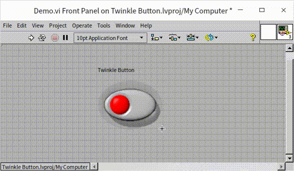

The architecture works as follows:

1. **Background Task**: When the XControl starts, it launches an asynchronous background VI and passes it a control reference to the bulb indicator.
2. **Timing Loop**: The background VI runs a While Loop with a Millisecond Multiple Delay. Every interval, it programmatically updates the **Color** property of the bulb indicator to toggle its state.

The simplified block diagram of the background loop is shown below:

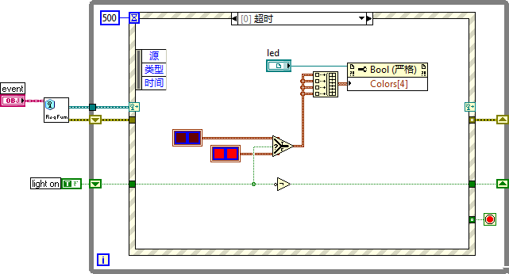

The background task is launched inside the XControl's **Init** Ability VI. Because multiple instances of the XControl can exist on the same Front Panel, the background VI must be configured as reentrant. When calling **Open VI Reference**, set the `options` input parameter to `0x08` (prepare reentrant clone) so that each XControl instance spawns its own isolated timing thread:

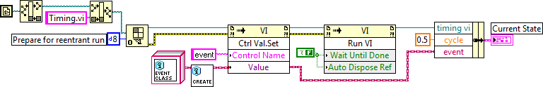

Correspondingly, the XControl's **Uninit** VI must stop the background task. It does this by firing an exit event to notify the timing thread to shut down:

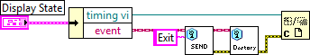

## Accessing Information from the VI Hosting the XControl Instance

In the Facade VI, the **Container State** cluster provides a control refnum (`refnum`) referencing the XControl instance on the host panel. With this reference, you can use **VI Scripting** to inspect and modify the XControl's own placement, surroundings, and parent window properties programmatically. This opens up creative UI possibilities.

For example, let's create a "Mischievous Button" XControl. When the user tries to click it, the button detects the mouse hover and jumps to a new, random coordinate on the screen. To implement this, the XControl needs to read its current position coordinates on the host panel, calculate new coordinates, and write to its own **Position** property. It also needs to read the bounds of the host VI's Front Panel to ensure it doesn't jump off-screen. All this is accessible via the container's control reference.

The Facade VI code for handling the **Mouse Enter** event is shown below. It reads the XControl's position and the parent panel bounds, calculates a safe random coordinate, and updates its own **Position** property:

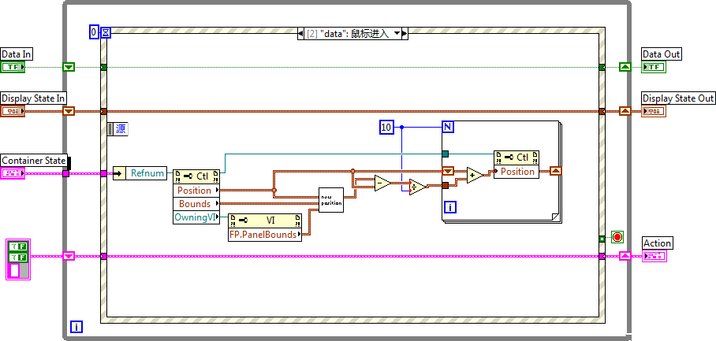

Note: In this event case, a brief loop is used to slide the button to its new position. While loops in the Facade VI should generally be avoided to prevent blocking the UI, this slide transition is extremely brief (a few milliseconds) and does not perceptibly impact UI responsiveness.

Once placed on a Front Panel, the button playfully evades any mouse hover. In edit mode, it remains static so the developer can position and wire it. In run mode, however, clicking it becomes a fun challenge.

## Error Handling

Standard LabVIEW controls do not have error terminals, and neither do XControls. Consequently, you should handle or ignore errors internally within the Ability, property, and method VIs. During development, you can log unexpected errors to a file or display them in pop-up dialogs for debugging. Be sure to remove any debugging pop-ups before distributing the XControl.

## Debugging

Debugging an XControl is very similar to debugging standard VIs. You can place breakpoints inside any Ability VI, property, or method VI. When the host VI runs and interacts with the XControl, execution will halt at these breakpoints, allowing you to step through the code.

When an XControl is active on an open Front Panel, LabVIEW locks the XControl library in the Project Explorer to prevent edits that could crash the active instances. To modify the code, right-click the XControl library in the Project Explorer and select **Unlock Library for Editing**:

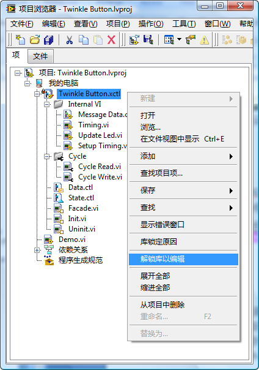

While unlocked for editing, all instances of the XControl on active Front Panels are replaced by a generic placeholder box with a red "X", indicating they are temporarily offline:

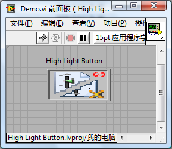

Once you finish editing, right-click the library in the Project Explorer and select **Apply Instance Changes** to compile the updates and restore all active instances to their normal operating state.

## Practice Exercise

* Develop a custom XControl that implements a dimmer switch (as pictured below). The control should support toggling the light on/off and sliding to adjust brightness. Aim for a modern, sleek design that improves upon this legacy appearance.

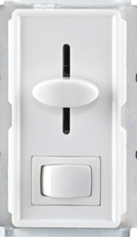
