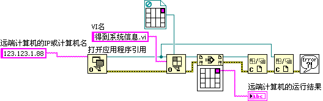

# Network Services and ActiveX Interfaces

## Network Services

The VI Server's capabilities extend over the TCP/IP protocol, enabling you to control or programmatically edit VIs on a remote computer using VI Scripting.

To use the network capabilities of the VI Server, both the controlling computer and the target remote computer must enable the TCP/IP protocol in LabVIEW's settings (under **Tools -> Options -> VI Server**). Additionally, the remote machine must configure its access list to allow connections from the controlling computer's IP address.

Let's look at an example. The block diagram below is designed to run on a remote computer and retrieve its operating system metadata:


From the controlling computer, we can invoke this remote VI and read its output. The G code is identical to a local dynamic subVI call, except that we first call **Open Application Reference** to establish a connection to the remote machine's IP address and port before opening the VI reference:




## ActiveX Interface

The VI Server also exposes an ActiveX interface. This allows external text-based programming languages (such as Python, C++, C#, or VBA) to interact with LabVIEW. For instance, if your test executive is written in Python, but you have a legacy measurement routine written in LabVIEW, the Python script can use ActiveX to open, configure, and execute the VI.

Below is an example script written in VBScript that launches LabVIEW, loads a VI, opens its front panel, and runs it:

```vb
Set lvapp = CreateObject("LabVIEW.Application")
Set vi = lvapp.GetVIReference("C:\temp\test.vi")
vi.FPWinOpen = True
vi.Run
```

Since Microsoft Windows and VBA (Excel) support ActiveX/COM objects, you can use similar scripts to automate LabVIEW directly from Microsoft Excel spreadsheets or HTML pages running in compatible environments.