# Loading and Executing SubVIs

## Static vs. Dynamic SubVI Loading

By default, when you open a main VI, LabVIEW automatically loads all of its subVIs into memory. This behavior is called **static loading**. While static loading is convenient for small applications, it poses major challenges for large-scale projects containing hundreds or thousands of VIs:
1. **Slow Startup Times:** LabVIEW must search for, load, and compile every single subVI in the dependency tree before the main interface can display.
2. **Excessive Memory Usage:** Many subVIs lie on rarely executed code paths (such as error recovery, calibration, or diagnostic routines). Loading these VIs at startup wastes memory.

To improve startup performance and reduce memory footprint, you should delay loading these non-critical subVIs until the application actually needs them (**dynamic loading**). Once the subVI completes its task, you can unload it to free memory.

### Configuring SubVI Load Options

You can control when a subVI is loaded using the **VI Call Configuration** dialog. Right-click a subVI on the block diagram and select **Call Setup**:

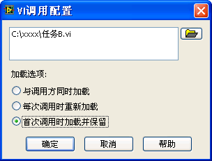

The dialog provides three load options:
1. **Load with caller (Default):** Static loading. The subVI loads as soon as the calling VI loads.
2. **Load and retain on first call:** The subVI is skipped at startup. G loads it into memory only when the execution path hits the node. The subVI remains in memory until the calling VI is closed.
3. **Reload on each call:** The subVI is loaded into memory only when called, runs, and is immediately unloaded from memory when it returns. This is ideal for memory-intensive VIs that run rarely, though loading and unloading incurs a performance overhead.

For example, in the diagram below, `Task B.vi` runs occasionally, so we set it to **Load and retain on first call**:

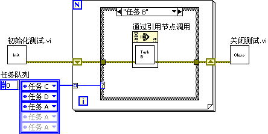

When you change a subVI's load configuration to option 2 or 3, its icon wrapper changes on the block diagram to resemble a **Call By Reference** node. If set to *Load and retain on first call*, an hourglass icon appears in the top-left corner; if set to *Reload on each call*, the hourglass is absent.

### Controlling Loading via VI Server

For complete control over the lifecycle of subVIs, you can use G's **VI Server** APIs:
- **Open VI Reference:** Loads the target VI into memory (if it isn't already loaded) and returns a handle. You must pass a file path to load it from disk. If the VI is already in memory, passing just the VI's filename is sufficient.
- **Close Reference:** Closes the handle. If a VI was loaded dynamically using `Open VI Reference` and all of its open references are closed, LabVIEW automatically unloads it from memory.

## Dynamic SubVI Invocation

Dynamic invocation allows your application to select and execute a subVI at runtime based on user actions, configuration files, or folder contents.

There are three common ways to dynamically invoke a subVI in G:
1. Using the **Call by Reference** node.
2. Using the VI's **Run VI** method.
3. Using **Asynchronous Calls** (introduced in LabVIEW 2011).

### Method 1: The Call by Reference Node

The **Call by Reference** node allows you to run a dynamically loaded VI as if it were a standard subVI on the diagram. Here are the visual differences between static, configured, and dynamic subVI nodes:

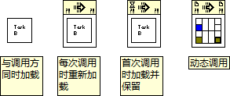

To use the Call by Reference node, you must supply a strictly typed VI reference. You configure this by passing a **type specifier** (a VI constant acting as a connector pane template) to `Open VI Reference.vi`:

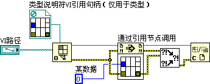

To set the template:
1. Right-click the **type specifier VI Refnum** terminal on `Open VI Reference.vi` and select **Create -> Constant**.
2. Right-click the new constant, select **Choose VI Server Class -> Browse**, and select a VI that has the exact same connector pane layout and terminal datatypes as the target VIs you plan to load.
3. Wire the returned reference to the **Call by Reference** node. The node will redraw to display the matching connector terminals, allowing you to pass parameters directly.

### Method 2: The Run VI Method

If you don't know the connector pane signature at edit-time (or want to load VIs with varying terminals), you can execute the VI using an Invoke Node calling the **Run VI** method:

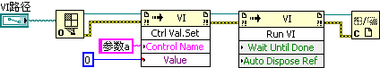

Because the Invoke Node doesn't expose physical wiring terminals, you must pass arguments programmatically:
- **Set Input Parameters:** Before running, call `Control Value.Set` to write data to the front panel controls matching the inputs.
- **Run the VI:** Call the `Run VI` method.
- **Get Output Parameters:** After execution completes, call `Control Value.Get` to read values from front panel indicators.

The `Run VI` method has two key configuration parameters:
- **Wait Until Done:** Defaults to `True`. If `True`, the calling diagram pauses until the subVI completes (synchronous execution). If set to `False`, the subVI launches in a separate background thread, and the caller immediately continues running downstream code (asynchronous execution). This is the standard way to run background workers without locking up the UI thread.
- **Auto Dispose Ref:** Defaults to `False`. If set to `True`, LabVIEW automatically closes the VI reference and unloads it from memory when the subVI stops running, eliminating the need to call `Close Reference` manually. If set to `False`, you must call `Close Reference` to prevent memory leaks.

## Multiple Reentrant UI Instances

You will often need to launch multiple independent instances of a subVI interface concurrently. For example, if you are building a monitoring system for a test bay and want to open a separate popup panel to monitor and control each valve or sensor independently.

To achieve this:
1. Configure the popup subVI to be **Reentrant** (open its **VI Properties**, navigate to **Execution**, and select **Preallocated clone reentrant execution** or **Shared clone reentrant execution**).
2. Invoke the subVI dynamically using the `Run VI` method with `Wait Until Done` set to `False`. If you call it statically, the caller diagram will block, preventing you from launching subsequent instances.

Here is the setup:

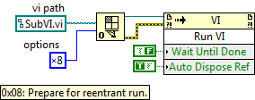

> [!IMPORTANT]
> When dynamically opening a reference to a reentrant VI, you **must** wire the value `0x08` (or `8`) to the **options** input of `Open VI Reference.vi`. This flag instructs LabVIEW to allocate a separate clone instance in memory for that specific reference.

## Plugin Architecture

Recall the step-based sequencing program from [State Machine](pattern_state_machine):

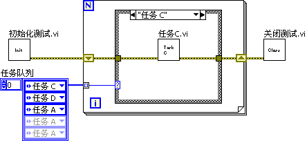

This program runs a queue of tasks (A, B, C, D) configured by the user. While flexible, the tasks are hardcoded. If you write a new `Task E.vi`, you must modify the main state machine diagram, rebuild the application, and redeploy it.

We can solve this by building a **Framework-Plugin** architecture. The main application is a generic framework. Each test routine is a separate plugin VI saved in a specific directory (e.g., `Plugins/`). When the framework starts, it scans the folder, lists the available VIs, and runs them dynamically based on user selection.

To build this:
1. **Define the Interface:** Every plugin must share the exact same connector pane layout (e.g., error in, error out, and test parameters):

   

2. **Implement the Framework:** The framework loops through the plugin files, dynamically loading them using `Open VI Reference.vi` with a strict type specifier, and calls them using the **Call by Reference** node:

   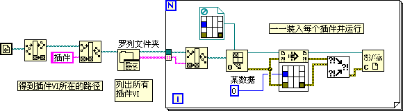

To add a new test task to the system, you simply write a VI matching the connector template and drop it into the `Plugins/` folder. The framework will detect and run it without requiring any modifications or code rebuilds.

## Running Background Tasks

Many software routines run silently in the background without requiring user interaction. These are called **background tasks**, while the interactive UI is the **foreground task**. A classic example is a text editor's auto-save routine: it runs periodically in the background, saving the active document without freezing the text entry panel.

In event-driven G applications, running a long, blocking task inside an event structure branch locks up the UI thread, making the window look frozen. Instead, you should launch the time-consuming process as a background task.

The foreground VI initiates the background task dynamically:

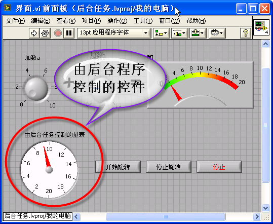

The background VI runs in a separate thread, communicating with the UI using control references, user events, or queues:

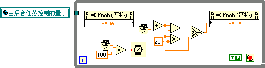

The foreground diagram launches the background VI asynchronously by calling the `Run VI` method with `Wait Until Done = False`:

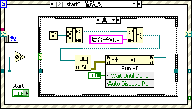

> [!IMPORTANT]
> The foreground program must signal the background task to stop and wait for it to exit before closing its own window:
>
> 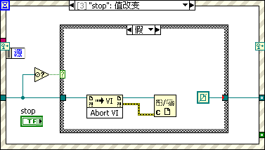
>
> Failing to shut down background tasks can leave orphaned threads running in the background, consuming CPU resources and preventing the LabVIEW runtime from closing correctly.

## Implementing a Startup Splash Screen

Large LabVIEW applications can take several seconds or minutes to load due to static subVI dependencies. If the user launches the application and nothing shows up on their screen for 10 seconds, they may assume the program failed and double-click the icon again, launching duplicate processes.

A professional application displays a **splash screen** immediately at startup to show loading progress while the main application VIs are pulled into memory.

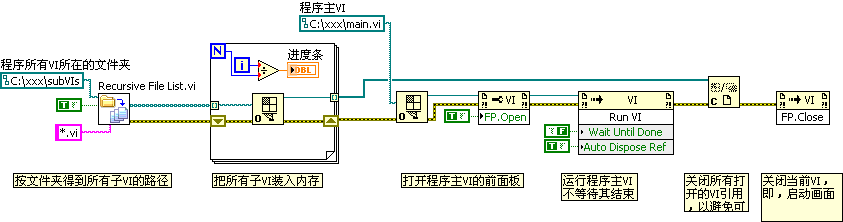

The splash screen workflow is as follows:
1. **Pre-load SubVIs:** The splash screen scans a target directory (e.g., `subVIs/`) and calls `Open VI Reference.vi` on each file. This loads all application dependencies into memory. We track the progress and update a loading bar on the splash screen UI.
2. **Launch Main Application:** Once all files are loaded, the splash screen opens a reference to `Main.vi`, sets its **Front Panel Window -> Open** property to `True` (making it visible), and executes it using the `Run VI` method.
3. **Clean Up:** The splash screen closes the references to the pre-loaded subVIs (this does not unload them from memory because `Main.vi` is now running and holds its own static references to them) and then closes its own front panel using the **Front Panel Window -> Close** method.

## Asynchronous Calls

LabVIEW 2011 introduced the **Start Asynchronous Call** primitive, which simplifies dynamic invocation by providing compile-time type safety for asynchronous execution. You can find it under **Programming -> Application Control**:

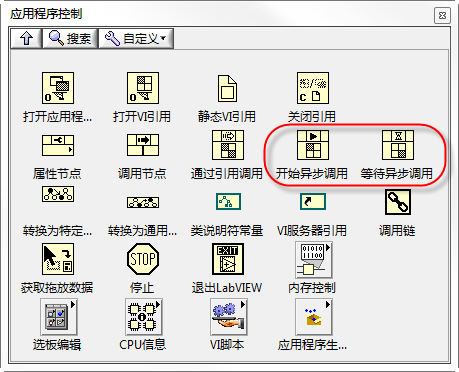

Suppose you have a UI containing a gauge indicator and two buttons (Play and Stop):

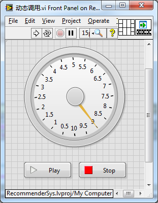

Pressing **Play** starts an animation loop that updates the gauge every 10 milliseconds for 10 seconds. The animation must run in a separate thread so it doesn't block the UI loop (which handles the **Stop** button).

We package the animation logic into a separate subVI that accepts references to the gauge control and the Stop button:

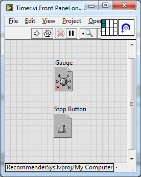

Here is the block diagram of this animation subVI:

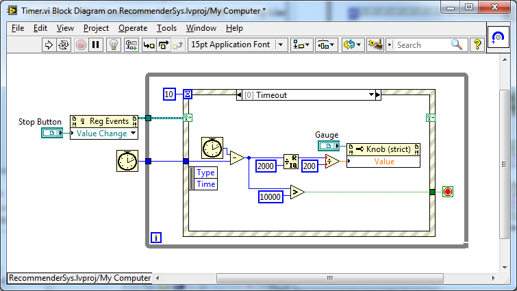

Inside its Event Structure, it updates the gauge needle value every 10 milliseconds:

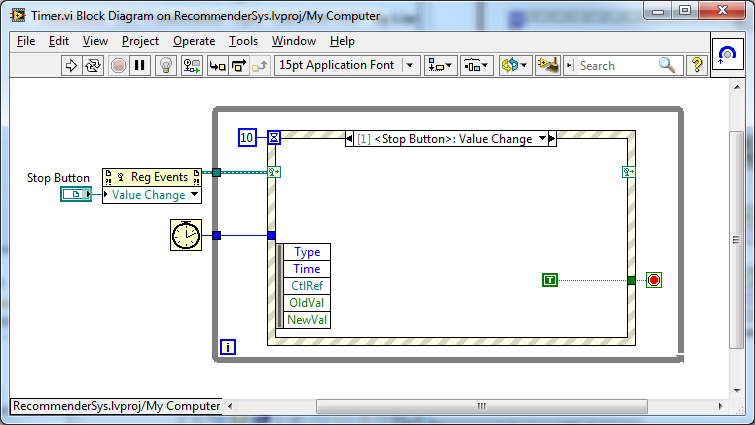

Before LabVIEW 2011, the only way to run this VI asynchronously was using the `Run VI` method with `Wait Until Done = False`:

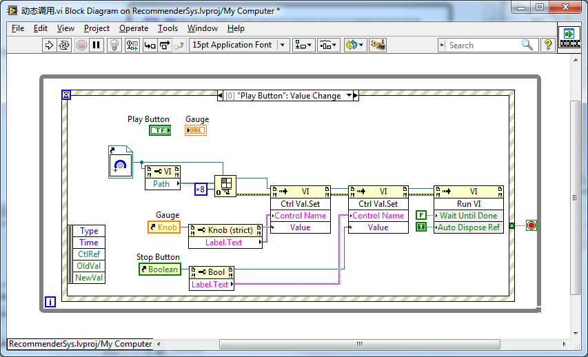

The major drawback here is passing parameters using the `Control Value.Set` method. This approach has two main issues:
1. **No Name Verification:** You must specify the control labels as strings (e.g., `"Stop Button Reference"`). If you rename a control inside the subVI, the compiler won't detect the change, resulting in a runtime silent failure.
2. **No Type Safety:** The `Control Value.Set` node takes a generic variant, so the compiler cannot check if you wired the correct datatype (e.g., passing a path instead of a control reference won't break the wire at compile-time).

Using the **Start Asynchronous Call** primitive resolves both issues, providing clean, type-safe, and self-documenting code:

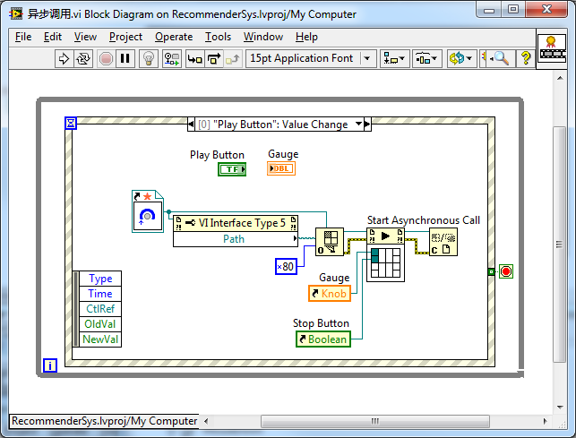

> [!IMPORTANT]
> When opening a VI reference for use with **Start Asynchronous Call**, you must wire the hex value `0x80` (or `128`) to the **options** input of `Open VI Reference.vi`. This option flag tells G that the reference is intended for asynchronous calls.

The **Start Asynchronous Call** node functions similarly to the Call by Reference node, but executes asynchronously: it spawns the subVI thread and immediately passes control to downstream code. It combines the clean terminal-based wiring of Call by Reference with the asynchronous execution of `Run VI (Wait Until Done = False)`.

### Collecting Asynchronous Returns: `Wait on Asynchronous Call`

If your asynchronous subVI returns data when it exits, you can retrieve its outputs using the **Wait on Asynchronous Call** node. However, this node is rarely used in practice. If the caller needs to block and wait for the results of the subVI, using a standard synchronous Call by Reference is usually cleaner.

### Strictly Typed VI References

Both the Call by Reference and Start Asynchronous Call nodes require a **strictly typed VI reference** to define their terminals. In the block diagram, these refnums display a red star icon:

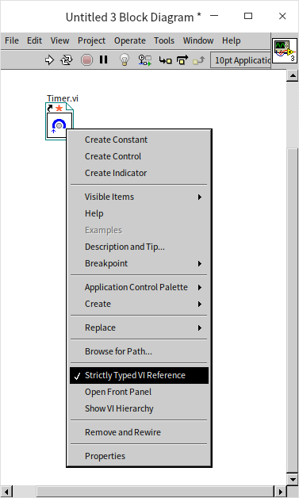

You configure this by right-clicking a **Static VI Reference** node and selecting **Strictly Typed VI Reference**. This binds the refnum type definition to the connector pane signature of the target VI.

When you wire a strictly typed VI reference to property or invoke nodes, the header label of the node updates from `VI` to `VI Interface Type n` (e.g., `VI Interface Type 1`), confirming that G is compiling properties against the specific template signature rather than the generic VI class.
