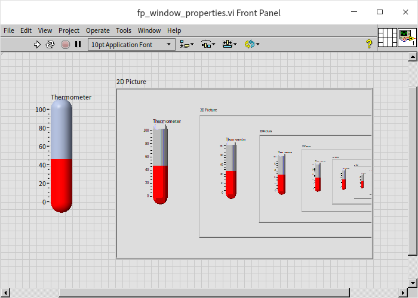

# Dynamic Interface Adjustments

During a program's execution, inevitable changes to the user interface occur. The most typical adjustments involve data updates on the interface, usually done by simply routing new data to the control's terminal. Previous sections also explored more complex modifications, such as altering a control's position or color through [control local variables and properties](data_and_controls). Beyond controls, various aspects of the interface, like window dimensions, title information, and decorative imagery, can also be dynamically modified within the program.

## VI Server

### Overview of VI Server

LabVIEW's VI Server module facilitates all programmatic adjustments and control over VIs (including controls, functions, sub-VIs, etc.) and LabVIEW environment settings. This feature set has been extensively utilized since the introduction of LabVIEW 5.0.

There are three principal methods for accessing VI Server services:

1. **Local LabVIEW Program as Client**: This is the most commonly employed method for using the VI Server. VIs directly leverage LabVIEW's property and invoke nodes for accessing VI Server services, a practice known as VI Scripting. Through [Property Nodes and Invoke Nodes](data_and_controls#property-and-invoke-nodes), these services are accessible within a LabVIEW program. VI Scripting is predominantly seen in programs requiring intricate interface alterations during runtime and programs needing dynamic execution of specific VIs.

2. **ActiveX**: For incorporating VI Server in other programming languages, LabVIEW's ActiveX interface can be employed by any language supporting ActiveX, including VB, VC++, and others.

3. **TCP/IP**: For remote machines, services on another computer running LabVIEW can be called over the TCP/IP protocol.

To activate these features, navigate to "Tools -> Options...” from the LabVIEW menu to bring up the "Options” dialog box. Then, on the "VI Server” page, settings can be adjusted to enable the aforementioned functionalities:

### VI Scripting

VI Scripting is a suite of properties and methods provided by the VI Server, allowing programmers to dynamically adjust and modify aspects of a VI's front panel, block diagram, the generated applications, and even LabVIEW's settings during runtime. VI Scripting is predominantly utilized for altering user interfaces on the fly, dynamically loading sub-VIs, managing code execution across different threads, and for the batch creation or alteration of multiple VIs.

Nodes pertinent to VI Scripting can be found within the "Programming -> Application Control" section of the Functions Palette:

In the realm of VI Scripting, property nodes and invoke nodes are the most frequently employed, having been extensively showcased in previous examples throughout this book.

Typically, the use of VI Scripting follows a sequence:

- Initially, a reference to a VI or an object is opened. For instance, the "Open VI Reference" function located in "Programming -> Application Control" can open a reference to a VI, or a property node may be utilized to access a reference to a control within a VI.
- Subsequently, property nodes are used to configure the object's properties, or invoke nodes to execute the object's methods.
- Finally, all opened references are closed using the "Close Reference" function.

While a portion of VI Scripting features is readily available within LabVIEW, other capabilities, such as editing and modifying a VI's block diagram, are not directly accessible in the professional version of LabVIEW. These require a separate license from NI for access.

### References

#### Invoking Properties Nodes via References

In the section on [Control's Local Variables and Properties](data_and_controls), we briefly introduced property nodes for controls. To set the properties of controls on the same VI, you can directly create their property nodes from the control's right-click menu. Property nodes created this way are not connected to their respective controls with data wires, yet the shared label between them makes their relationship evident. This method of invoking property nodes is straightforward and intuitive, but it has its limitations. For instance, it does not allow you to directly manipulate the property nodes of controls in another VI.

An alternative method to set control properties involves using references. By selecting "Create -> Reference” from a control's right-click menu, you can create a reference for that control. Then, connect this reference to a generic "Property Node” (found in the Function Palette under "Programming -> Application Control -> Property Node”), and select the property you wish to set:

The property nodes created by both methods function identically.

Property nodes directly created from a control can only be used within the VI that contains the control. If you need to set the properties of a control in another VI, the second method (creating a reference) is required. For example, setting multiple properties for a control could occupy a significant portion of the block diagram. To keep the main VI's block diagram tidy, you could move all property settings to a separate sub-VI. Since the control is on the main VI and the property node is in the sub-VI, using references to set properties becomes necessary.

Moreover, sometimes you need to set the same property for multiple controls within a program. Property nodes generated directly from a control can only be associated with that specific control, requiring the creation of identical property nodes for each control. Since a generic property node can apply to any control, creating a sub-VI with generic property nodes allows for setting the same property across all controls, maximizing code reuse.

Below is a simple VI that dynamically adjusts a control's vertical position on the interface during runtime:

The program's effect when running is as follows:

If we wish to use this VI to also control the position of a control in another VI, we can create a reference for the desired control in the other VI. Then, create an indicator to pass out this reference, allowing any VI that receives this reference to manipulate the referenced control. The block diagram for the controlled VI looks like this:

Passing the output reference to the original VI allows for the use of this reference to set the position property of the corresponding control:

The final effect of running the program is as follows:

### Obtaining Object References

In the previous section, "Invoking Property Nodes via References", we discussed passing a control's reference to another VI. This approach is somewhat static because you need to decide which references to pass while programming. In most real-world applications, a more dynamic method to obtain references to controls or other objects is essential.

Apart from generating a reference directly using the right-click menu on an object, we can also use property nodes to obtain references to related objects from a given object. For example, a VI has a "Panel" property, through which we can get a reference to the VI's front panel. The front panel has a "Controls[]" property, enabling us to obtain references to all controls on the front panel. The square brackets "[]" in this property name indicate the data type for this property is an array:

Sometimes, you need to obtain a reference to a specific control on a VI, rather than all controls. Using the method mentioned above to get all controls and then comparing their names one by one can be cumbersome. LabVIEW includes VIs that have implemented functionalities for such cases. For instance, the built-in LabVIEW VI: `[LabVIEW]\resource\importtools\Common\VI Scripting\VI\Front Panel\Method\Get Control.vi` can return a reference to a control based on its label:

There are objects for which you cannot directly create property nodes, such as decorations on the front panel (objects from the control palette "Modern -> Decorations”). If you need to change their properties, you must first get a reference to the VI, then to the front panel, and subsequently to the decoration itself, finally using this reference to adjust properties. For example, the program below changes the color of a decoration:

Note that the colors of some system-style decorations are determined by the system settings and cannot be changed through programming.

## Object Class Hierarchy

### Tree-like Hierarchy Structure

In VI Scripting, all references point to specific objects, which are categorized into different types. For instance, a VI (Virtual Instrument) is part of the VI class, and a control belongs to the control class, among others. These classes can be organized into a tree-like hierarchy based on their general and specific relationships, as illustrated below:

Take, for example, a standard numeric control on a user interface; it falls under the "Numeric" control class, which is quite specific. It also belongs to the broader "Value" class. The "Value" class, more general than the "Numeric" control class, encompasses other objects such as "Color" controls. The "Control" class, even more encompassing, includes a variety of control objects like Boolean and string controls. To simplify, we refer to a specific type as a subclass and its more general category as a superclass. Therefore, the "Control" class is the superclass of the "Value" class, and the "Value" class is a subclass of the "Control" class.

When transferring object references, you can assign the reference to any class type the object belongs to. For example, a reference to a standard numeric control could be classified as "Numeric" control type, "Control" type, or the more general "Graphical Object" type. Different types of property nodes possess distinct properties. A superclass will have certain properties that all its subclasses inherit, but a subclass may also have additional, more specific properties.

To set properties common to several objects, they must be represented by their most general shared class.

You can convert an object reference to a more general or more specific type by using "Programming -> Application Control -> Convert to Specific Class" or "Programming -> Application Control -> Convert to General Class". For instance, to access the labels of different controls, they can utilize the same "Label -> Text" property. To enable their use of the same property node, the references representing them must belong to the same class type. As shown in the program below, using "Convert to General Class" allows different control references to be treated as the "Control" class, thereby enabling the retrieval of their label information through the properties of the "Control" class:

There are times when you might start with a reference represented by a general class. If you need to apply specific properties to this object later in your program, you must first convert the reference to a specific class to access these unique properties.

For example, consider a cluster control on a VI's front panel that contains two elements, with the second one being an LED bulb control, as depicted below:

Should there be a need to change the color of this bulb while the program is running, the elements within the cluster can be accessed through the cluster's "Controls[]" property. Given that a cluster may include controls of various types, the "Controls[]" property outputs references of each control as the "Control" type. However, since "Color" is a special property of "Boolean" type controls, the "Control" reference obtained must be converted into the specific "Boolean" type to adjust its color property:

### The Class Browser

LabVIEW offers a tool designed to assist programmers in easily locating a specific property or method for a class, known as the "Class Browser". To access this tool, navigate through the menu by selecting "View -> Class Browser":

Within the Class Browser dialog, you choose a "VI Server" as the library source and then select the class you wish to explore. It will display all the properties and methods associated with that class in the "Properties and Methods" list. By double-clicking an entry, you can add that property or method directly to your VI's block diagram.

If you're looking to explore all the classes available for VI Scripting in LabVIEW, along with their respective properties and methods, you can consult the LabVIEW help documentation. Simply search for "VI Server Class Hierarchy" in the index to navigate through the hierarchy and examine the properties, methods, and events each class possesses:

## Commonly Used Properties and Methods

### Properties and Methods of the Application

Dragging a generic "Property Node" from the function palette onto the VI block diagram defaults it to the "Application" class. This class's properties are frequently used to access a wide range of information about the application itself and the operating system it operates on. For instance, retrieving user information enables the execution of different branches of the program based on the user. Similarly, system information such as the operating system type and version, printer availability, the number of monitors, and their resolutions can influence the execution of specific program logic.

During debugging, I sometimes leverage the "All VIs in Memory" property under the "Application" class to list all VIs loaded into memory, aiding in verifying the program's correct execution. The detailed procedure and purpose behind loading VIs will be covered in the section "[Loading and Running Sub VIs](vi_server_for_subvi)".

Property nodes are not limited to viewing and setting information on the local application; they can also access information about remote applications. This process involves opening a remote application reference using the "Open Application Reference" function and then passing this reference to the property node, thereby enabling access to the remote application's properties. The setup for remote applications will be discussed in the chapters dedicated to web services.

The "Kind" property of the "Application" is another frequently utilized feature. It reveals whether the current application is running within the LabVIEW development environment, an embedded system environment, or has been compiled into a standalone executable. Depending on the development and runtime environment, the program may require specific adjustments.

In the LabVIEW development environment, the application in question is LabVIEW itself. This allows for the use of "Invoke Nodes" within our programs to execute various LabVIEW functions, such as saving all open VIs, among others.

### Working with VI Properties and Methods

To access the properties of a VI, drag a generic "Property Node" from the function palette onto the VI's block diagram. You can then change its class object via the right-click context menu:

If you aim to modify the properties of the VI, set the property node's associated class to "VI". When no reference input is provided, the property node's settings apply directly to the VI where it's located. For instance, the following program changes the title of the VI it is part of:

To alter the properties of a different VI, you must supply a reference to that VI into the property node. VI references can be obtained in two main ways: statically and dynamically.

- **Static Approach**: Utilize the "Programming -> Application Control -> Static VI Reference" node. Place this node on your block diagram, double-click its icon, or select "Browse Path..." from its right-click menu to launch a dialog where you can choose a VI. This node then outputs a reference to the selected VI. This method is termed "static" because the reference is fixed at the time of programming:

- **Dynamic Approach**: If the decision about which VI to manipulate is made during runtime, the "Programming -> Application Control -> Open VI Reference" function is used to obtain a VI reference. By passing the VI's path to the "Open VI Reference" function, it returns a reference to that VI:

Common information related to VIs, such as their type, path, name, modification history, and the memory usage of different VI components, are accessible through corresponding properties. Likewise, invoke nodes can be employed to execute VI-related methods, among which the "Run VI" method is notably common for initiating VI execution. This will be elaborated upon in the section titled "[Loading and Running Sub VIs](vi_server_for_subvi)".

It's crucial to understand that properties and methods associated with the user interface are, in fact, directed towards the VI's front panel. For example, adjusting the size and position of the user interface essentially means modifying the front panel's size and position. Despite this, such properties and methods are not classified under a "Front Panel" object class but are instead grouped under the "VI" object category. There's an extensive range of VI properties, and you'll find a series of properties concerning the "Front Panel Window", where all adjustments to the front panel can be managed:

The following program demonstrates setting the position and size of the user interface, i.e., the VI's front panel. It then captures an image of the user interface using the "Get Image" method, displaying this captured image within the program's interface:

The front panel, once the program is executed, looks like an infinitely nested mirror image:

The "Get Image" method for VIs and controls is particularly useful when generating reports. After plotting the desired data curves on the program interface, this method allows for the direct capture and inclusion of the interface image into reports.

There's a "Front Panel" property within the VI object category that returns a reference to the current VI's front panel. By passing this reference to property and invoke nodes, you gain access to the genuine properties and methods of the "Front Panel" object category. These are advanced features, only applicable to VIs in their editing state. Their applications will be discussed in more detail in later chapters of the guide.