# Dynamic Interface Adjustments

As a program runs, its user interface often needs to change. The most common updates involve displaying new data, which is done simply by wiring new values to a control's block diagram terminal. Previous sections explored more complex adjustments, such as altering a control's position or color using [properties and local variables](data_and_controls). Beyond individual controls, you can also dynamically modify broader interface elements during execution, including window dimensions, window titles, and decorative images.

## VI Server

### VI Server Overview

LabVIEW's VI Server module enables programmatic control over VIs (including controls, functions, sub-VIs, etc.) and the LabVIEW environment. This powerful feature set has been a core part of LabVIEW since version 5.0.

There are three main ways to access VI Server services:

1. **Local LabVIEW Program as Client**: This is the most common approach. VIs use Property Nodes and Invoke Nodes to access VI Server features directly. Through [Property Nodes and Invoke Nodes](data_and_controls#property-nodes-and-invoke-nodes), these services are fully accessible within a LabVIEW application. This method is essential for programs that need to modify their user interface at runtime or execute specific VIs dynamically.
2. **ActiveX**: Other programming languages can interact with the VI Server using LabVIEW's ActiveX interface. Any language that supports ActiveX (such as VB, C++, etc.) can use this interface.
3. **TCP/IP**: For remote operations, you can call services on another machine running LabVIEW over TCP/IP.

To enable these features, select **Tools -> Options...** from the LabVIEW menu to open the **Options** dialog box. Under the **VI Server** category, you can configure and enable the required access methods:

### VI Scripting

VI Scripting is a suite of properties and methods provided by the VI Server, allowing programmers to dynamically inspect, adjust, and modify a VI's front panel, block diagram, generated applications, and even LabVIEW settings at runtime. Typical use cases include dynamically altering the user interface, loading sub-VIs, managing code execution across different threads, and batch-creating or modifying multiple VIs.

Nodes for VI Scripting are located in the **Programming -> Application Control** subpalette of the Functions Palette:

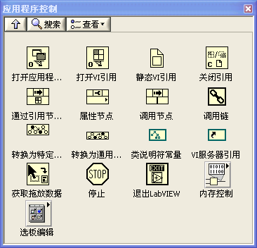

In VI Scripting, Property Nodes and Invoke Nodes are the most frequently used elements.

Typically, a VI Scripting workflow follows these steps:

- Open a reference to a VI or object. For example, use the **Open VI Reference** function in **Programming -> Application Control**, or use a property node to get a reference to a control inside a VI.
- Use a **Property Node** to get or set the object's properties, or an **Invoke Node** to execute its methods.
- Close all opened references using the **Close Reference** function.

While many VI Server features are readily available in LabVIEW, advanced editing capabilities (such as programmatically creating or modifying a VI's block diagram) belong to **VI Scripting** and require enabling in the options.

### VI Server vs. VI Scripting

In LabVIEW, the framework for programmatically controlling objects is collectively referred to as the **VI Server**. Modifying control positions or colors at runtime and dynamically loading and running subVIs are standard VI Server features. Beginners often confuse this with **VI Scripting**.

- **VI Server**: Operates primarily on the front panel (user interface) and the execution state of VIs. These functions are generally available in both the development environment and compiled standalone applications (`.exe` files).
- **VI Scripting**: An advanced subset of the VI Server designed specifically for programmatically manipulating the block diagram (e.g., automatically generating a While Loop or wiring two nodes). Because VI Scripting tools depend heavily on the editing environment, they are typically unavailable in compiled applications (where the block diagram is stripped).

The nodes related to the VI Server are located under **Programming -> Application Control**. To enable the lower-level VI Scripting features, you must check the **Show VI Scripting functions, properties and methods** option on the **VI Server** page of the LabVIEW **Options** dialog.

## References

### Invoking Property Nodes via References

In [Properties and Local Variables](data_and_controls), we introduced property nodes for controls. To configure controls in the current VI, you can create a Property Node directly from the control's right-click menu. These nodes are not connected to the controls by wires, but they share the same label, making their association clear. While this approach is simple and intuitive, it cannot access or modify controls inside another VI.

An alternative method is to use references. By right-clicking a control and selecting **Create -> Reference**, you can generate a reference to it. You can then wire this reference to a generic **Property Node** (found in **Programming -> Application Control -> Property Node**) and select the property you want to configure:

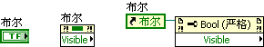

Both methods are functionally identical.

However, a Property Node created directly from a control is bound to the local VI. If you need to modify controls in another VI, you must pass a reference. For instance, setting many properties on a front panel can clutter your block diagram. To keep the code clean, you can package the property configuration into a subVI. Since the controls reside in the main VI and the Property Nodes are in the subVI, you must pass control references to the subVI.

Furthermore, if you need to configure the same property for multiple controls, creating individual Property Nodes for each control leads to duplicate code. Because a generic Property Node can operate on any control of the same class, you can create a subVI with a generic Property Node to set the property across all controls, maximizing code reuse.

Here is a simple VI that dynamically adjusts a control's vertical position at runtime:

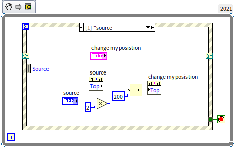

The runtime effect is as follows:

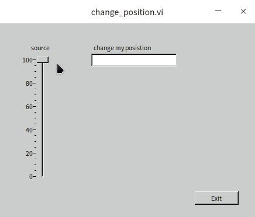

If we want to use this VI to control a control inside another VI, we can create a reference to that control, place a reference control (Refnum control) on the subVI's panel, and pass the reference. The process is shown below:

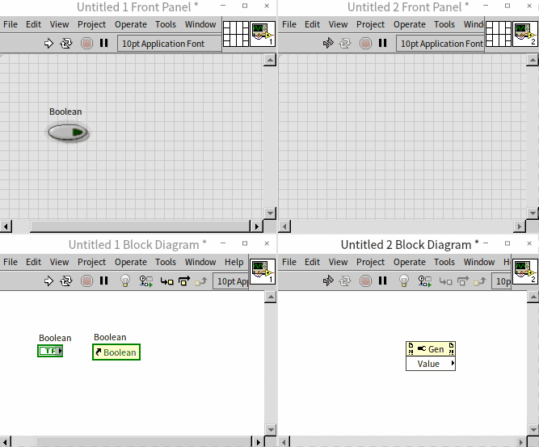

The block diagram of the controlled VI looks like this:

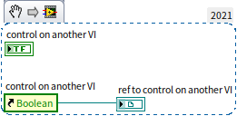

Wiring the output reference of the target control to the controller VI allows it to manipulate the target's position:

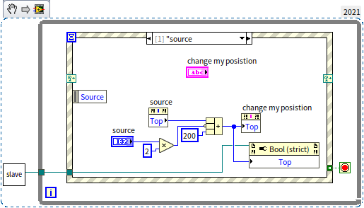

The final runtime effect:

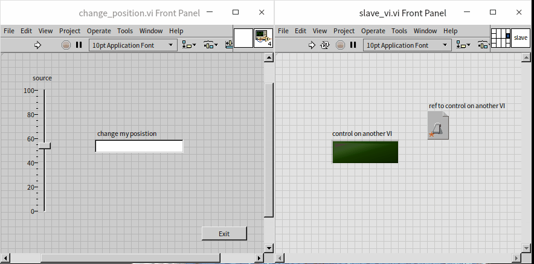

#### Property Nodes and the UI Thread

While Property Nodes (especially when invoked via references) are extremely flexible, you must design your architecture carefully. In LabVIEW, most properties related to front panel controls are forced to execute on the **User Interface (UI) Thread**.

If you frequently call Property Nodes inside a computation-intensive or high-speed data acquisition loop (such as reading a control's value or changing a decoration's color in every iteration), LabVIEW must constantly switch back and forth between the execution thread and the UI thread. The overhead of these thread switches is high and can cause execution speed to drop dramatically.

> [!TIP]
> Avoid calling UI-related Property Nodes in high-speed loops. To pass data, prefer wire connections or local variables. If you must update the UI, reduce the update frequency (e.g., using a timer to update every 100 ms).

### Obtaining Object References {#getting-object-references}

In the previous section, [Invoking Property Nodes via References](#invoking-property-nodes-via-references), we discussed passing a control's reference statically by deciding which references to wire at edit-time. In most practical applications, you need a more dynamic way to obtain references to controls or other front panel objects.

In addition to creating references via the right-click menu, you can use Property Nodes to navigate from one object reference to another. For example, a VI has a **Panel** property, which returns a reference to its front panel. The front panel, in turn, has a **Controls[]** property, which returns an array of references to all controls on that panel. The square brackets (`[]`) indicate that this property returns an array:

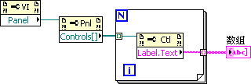

If you only need a reference to a specific control rather than all of them, retrieving the entire array and comparing labels one by one is tedious. LabVIEW provides built-in utilities for this, such as `[LabVIEW]\resource\importtools\Common\VI Scripting\VI\Front Panel\Method\Get Control.vi`, which finds a control reference by its label:

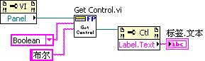

Some front panel objects cannot have Property Nodes created directly (e.g., decorations from the **Modern -> Decorations** palette). To modify their properties, you must obtain a reference to the VI, then to the front panel, and finally to the decoration itself. The following example changes the color of a front panel decoration:

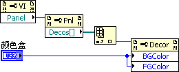

*Note: The colors of certain system-style decorations are determined by the operating system theme and cannot be changed programmatically.*

#### Cost of Front Panel Traversal at Runtime

Although you can retrieve all controls using `Panel -> Controls[]` and find a specific control by matching its label, this pattern is **strongly discouraged** in production applications for two main reasons:

1. **Poor Performance**: Traversing the front panel hierarchy is a relatively slow operation.
2. **Fragility**: This approach relies on string labels. If a developer renames a control on the front panel, the code will silently fail because the label no longer matches.

If you need to programmatically manipulate a specific set of controls, the best practice is to manually bundle their references (created via right-click -> Create -> Reference) into an array or a cluster during initialization, or store them in a Map, and pass them down using shift registers. This ensures strict type safety, runs efficiently, and prevents code from breaking when UI labels are updated.

## Class Hierarchy {#object-class-hierarchy}

### Tree-like Hierarchy Structure

In VI Server, all references are typed and point to specific objects. For example, a VI belongs to the VI class, and a control belongs to the Control class. These classes form a tree-like inheritance hierarchy based on generalization and specialization:

For example, a standard numeric control belongs to the specific **Numeric** class, which is a subclass of the broader **Value** class (which also includes color controls, sliders, etc.). The **Value** class is a subclass of the even broader **Control** class (which includes Booleans, strings, and other UI controls). To describe their relationships, we call the more specific type a **subclass** and the more general type a **superclass** (or parent class).

When passing object references, you can treat a reference as any class in its inheritance chain. For example, a numeric control reference can be treated as a **Numeric**, a **Control**, or a generic **Graphical Object**. Different classes expose different properties. A subclass inherits all properties from its superclass but also defines its own specialized properties.

To configure a property shared by multiple control types, you must cast their references to their most specific common superclass.

You can convert references up and down the inheritance tree using the nodes in **Programming -> Application Control**:

- **Upcasting (Convert to General Class)**: For instance, casting a "Waveform Graph" reference to a "Control" reference. This is usually done implicitly by LabVIEW when you wire lines, so explicit nodes are rarely needed.
- **Downcasting (Convert to Specific Class)**: This is very common in practice. For example, if you obtain an array of generic **Control** references via `Panel -> Controls[]`, and you know the second element is actually a **Boolean** control and want to change its color (a Boolean-specific property), you must cast the **Control** reference to the specific **Boolean** class.

*Note: Downcasting carries runtime risks. If you try to cast a control reference that is actually a String control into a Boolean class, the node will return an error at runtime. Always wire the error cluster to handle potential mismatch errors.*

Here is an example program that uses **Convert to General Class** to treat different control references as the generic **Control** class to read their labels:

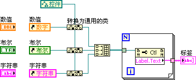

Conversely, if you start with a generic reference and need to adjust subclass-specific properties, you must cast it to the specific class first.

For example, consider a Cluster control containing two elements, where the second is an LED indicator:

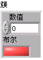

To programmatically change the LED's color at runtime, we first access the cluster's elements using its `Controls[]` property. Since a cluster can hold controls of any type, `Controls[]` returns an array of generic **Control** references. To modify the LED's color, we must cast its reference to the specific **Boolean** class:

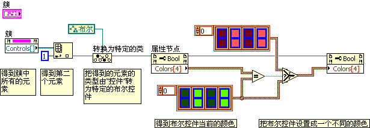

### The Class Browser

LabVIEW provides the **Class Browser** to help you quickly find properties and methods for any VI Server class. Open it by selecting **View -> Class Browser** from the menu:

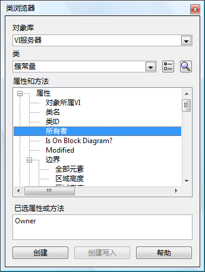

In this dialog, select **VI Server** as the library source, choose the target class, and browse its properties and methods. Double-clicking any item inserts it directly onto your block diagram.

For a complete overview of all VI Server classes, properties, and methods, refer to the LabVIEW Help by searching for **VI Server Class Hierarchy**:

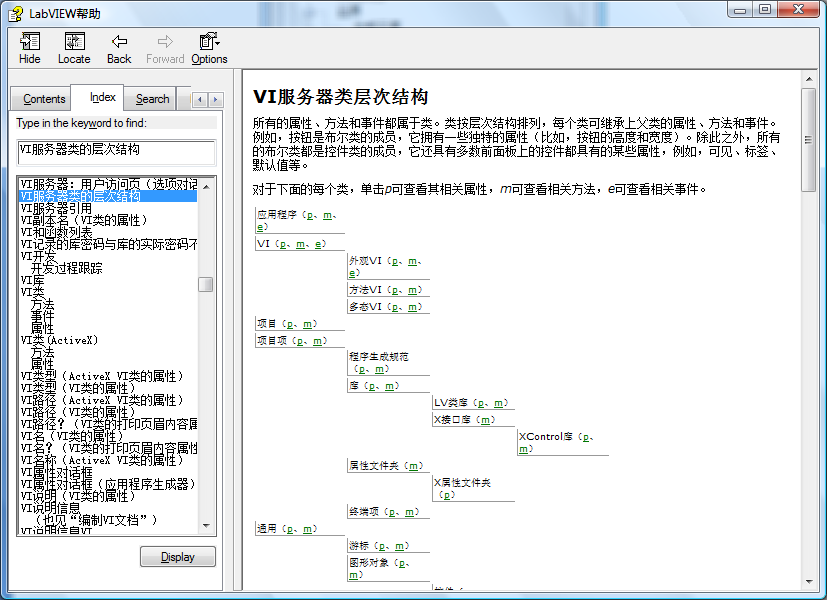

## Commonly Used Properties and Methods

### Application Properties and Methods

When you place a generic Property Node on the block diagram, it defaults to the **Application** class. This class is used to query information about the active LabVIEW application and the host operating system. For example, you can retrieve the current user's name to execute user-specific code branches. You can also inspect system parameters such as the OS type and version, printer availability, and monitor count/resolutions to adapt your program's behavior.

During debugging, the `All VIs in Memory` property is useful for listing all VIs currently loaded, helping verify execution states. We will discuss loading VIs in detail in [Loading and Running SubVIs](vi_server_for_subvi).

You can also use Property Nodes to access remote LabVIEW instances. Use the **Open Application Reference** function, specifying the target IP address and port, to obtain a remote application refnum, which you then wire to a Property Node.

> [!WARNING]
> **Security and Firewall Configuration**: Programmatic remote VI Server access is subject to strict security policies. You must configure the **Machine Access** list on the **VI Server** page of the target machine's LabVIEW **Options**, and ensure the OS firewall allows traffic through the configured port (default is `3363`). Because setting this up can be complex and fragile in modern network environments, modern architectures typically prefer **Network Streams** or **Web Services** over remote VI Server calls.

The `Kind` property is another frequently used Application property. It returns whether the program is running in the LabVIEW development environment, an embedded target, or as a standalone compiled executable. Programs often adjust their settings based on this environment.

In the LabVIEW development environment, the application is LabVIEW itself. This allows you to use Invoke Nodes to control LabVIEW functions, such as saving all open VIs.

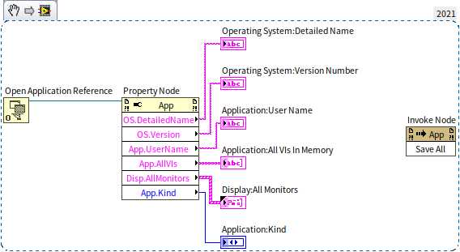

### VI Properties and Methods

To access VI properties, place a generic Property Node and change its class to **VI** via the right-click menu:

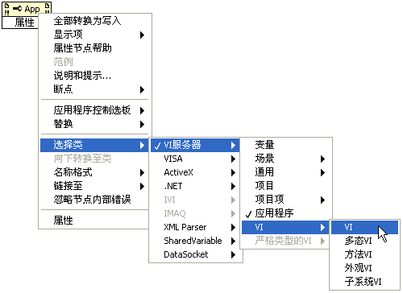

If you do not wire a reference input, the Property Node defaults to the VI in which it resides. The following example dynamically changes its own VI title:

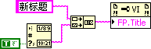

To control another VI, you must wire its reference to the Property Node. VI references can be obtained either statically or dynamically:

- **Static Reference**: Use the **Static VI Reference** node (**Programming -> Application Control -> Static VI Reference**). Double-click it or select **Browse Path...** from the right-click menu to select a VI. This node outputs a reference to that specific VI. The target VI is fixed at edit-time:
  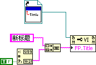
- **Dynamic Reference**: If the target VI is determined at runtime, use the **Open VI Reference** function (**Programming -> Application Control -> Open VI Reference**). Pass the file path to this function to open and return a reference to that VI:
  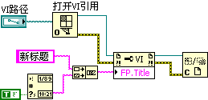

Common VI properties include the VI type, path, name, modification history, and memory allocation statistics. You can also use Invoke Nodes to run VI-specific methods, such as the `Run VI` method. This is covered in [Loading and Running SubVIs](vi_server_for_subvi).

Note that properties controlling the user interface (such as window size, position, and visibility) are technically directed at the VI's front panel. However, these are grouped under the **VI** class rather than a separate "Front Panel" class. You can find them under the **Front Panel Window** sub-menu:

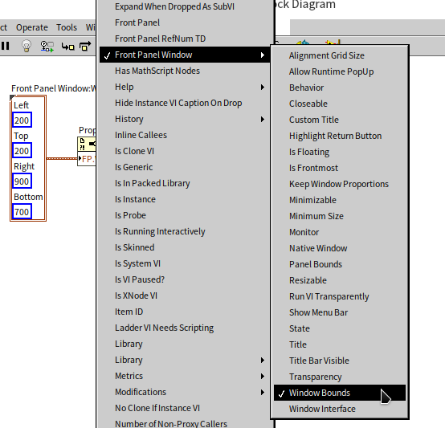

The following program sets the front panel window's size and position, then captures an image of the UI using the `Get Image` method, displaying the image in a picture control:

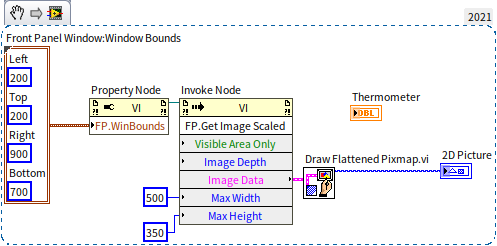

When run, the front panel creates a nested visual feedback loop:

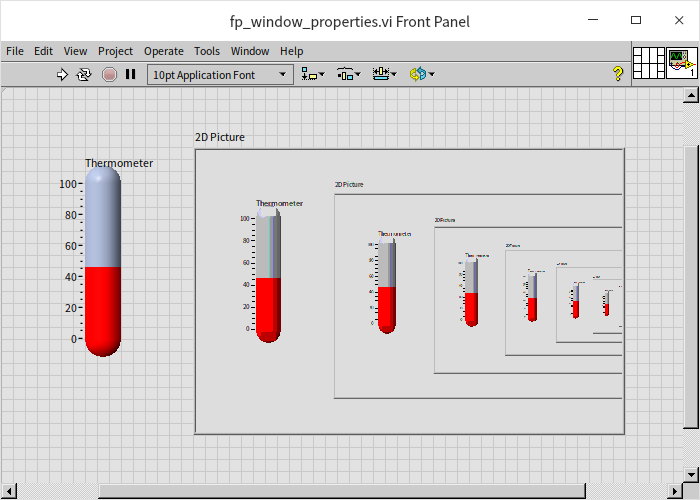

The `Get Image` method for VIs and controls is particularly useful for report generation, allowing you to capture UI states (like graphs or logs) and insert them directly into reports.

The VI class also has a **Front Panel** property that returns a reference to its Front Panel object. Wiring this to Property or Invoke Nodes opens up advanced front panel properties and methods, which are typically only valid for VIs in edit mode. These are discussed in later chapters.