# Programmatically Creating and Modifying VIs

Most developers are familiar with manually creating or editing VIs. However, when tasks become monotonous and repetitive, automation is highly desirable. For example, if you have a project with hundreds of VIs that all need copyright headers, or require renaming all controls matching `xxx handle` to `xxx reference`, manual editing is tedious and error-prone. This section introduces how to programmatically automate these editing and modification tasks.

## VI Scripting Permissions

The basic VI Server properties and methods discussed earlier are available in LabVIEW Professional without any special settings. However, more powerful capabilities (such as programmatically creating VIs, controls, and functions, or editing a VI's block diagram) are disabled by default.

To activate these advanced features, open the LabVIEW **Options** dialog box, navigate to the **VI Server** page, and check the **Show VI Scripting functions, properties and methods** checkbox:

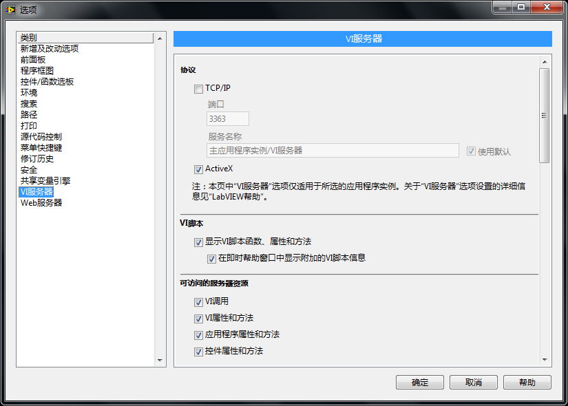

Once checked, a new **VI Scripting** subpalette appears under the **Application Control** functions palette:

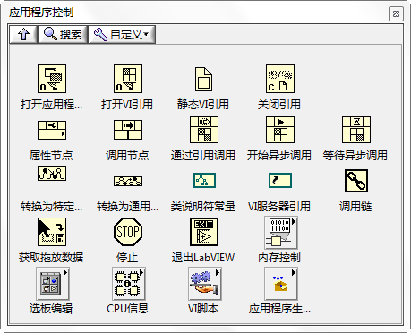
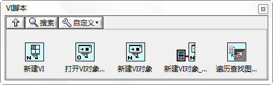

This subpalette provides specialized primitives:

- **New VI**: Creates a new, blank VI.
- **Open VI Object Reference**: Opens references to specific front panel or block diagram objects (like controls, terminals, or functions) by matching their labels. (Note: Using `Panel -> Controls[]` or `BD -> Nodes[]` properties can yield similar results.)
- **New VI Object**: Programmatically creates new objects on the front panel or block diagram.
- **Traverse for GObjects**: Retrieves references to all objects of a specified class on a VI. This is very similar to `Get Control.vi` discussed in [Obtaining Object References](vi_server_for_ui#getting-object-references) and can be used as a more robust replacement.

Enabling VI Scripting also unlocks many additional properties and methods. The image below shows the property selection menu for a VI object. Options like **Include Compiled Code**, **Block Diagram**, and **Block Diagram Window** only appear after enabling VI Scripting:

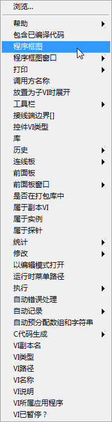

Because these properties and methods allow you to programmatically modify source code, their corresponding Property Nodes and Invoke Nodes are colored light blue on the block diagram, distinguishing them from the standard pale yellow VI Server nodes.

## Creating a VI

The **New VI** function creates a new VI and returns its reference. By setting its `Front Panel -> Open` and `Block Diagram -> Open` properties to True, you can programmatically display its front panel and block diagram windows:

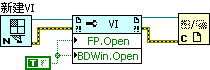

Running this code opens a blank VI on your screen, identical to selecting **File -> New VI** from the menu.

## Adding Controls

Once you have a blank VI reference, you can add controls using the **New VI Object** function. Pass the target control type, the refnum style, the front panel coordinates, and the owner reference (in this case, the newly created VI) to place a control on the front panel:

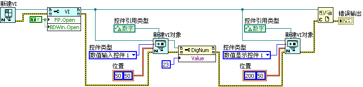

Running this code produces the following front panel layout on the new VI:

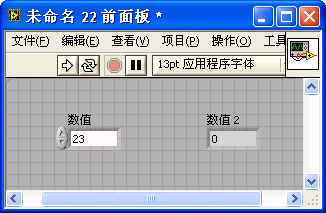

## Creating the Block Diagram

Placing objects on the block diagram uses the same **New VI Object** function. The following block diagram snippet demonstrates how to place an Add function and a numeric constant:

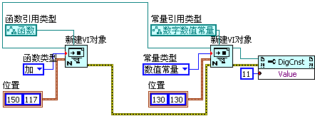

Running this code adds the function node and the constant to the block diagram.

To wire the nodes together, use the **Connect Wire** method. The following code demonstrates wiring the numeric constant to the input terminal of the Add function:

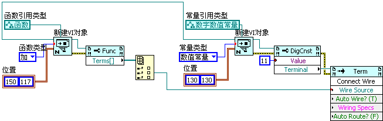

By wiring all remaining terminals, you can construct a fully functional block diagram programmatically:

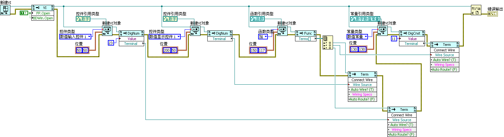

The resulting block diagram is shown below:

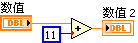

> [!WARNING]
> **Always Close References**: For simplicity, some of the example block diagrams in this chapter omit the **Close Reference** step. However, in production VI Scripting programs, every object reference obtained (such as nodes, wires, and terminals) must be explicitly closed using the **Close Reference** function once you are finished with it. Failing to close these references causes severe memory leaks, which can quickly consume all system memory and crash LabVIEW during batch operations.

Programmatically generating VIs from scratch is rarely needed unless you are mass-producing highly templated files, such as hardware driver VIs. Instead, VI Scripting is primarily used to develop editor extensions: creating custom **Quick Drop keyboard shortcut plugins** (e.g., to automatically wire nodes), writing custom right-click context menu options, or building static code analysis and automated refactoring tools. Dynamic code generation is also the foundation for building [XControls](ui_xcontrol) and [XNodes](oop_xnode).

## Batch Modifying VIs

A more common real-world scenario is batch-modifying existing VIs. For example, if you need to update a specific attribute, refactor inconsistent labels, or change the background color across dozens of files, scripting the changes is extremely efficient.

Let's look at a practical task: password-protecting a folder of VIs to protect intellectual property before distribution.

To automate this:

1. Retrieve the file paths of all target VIs (for simplicity, we will list all VI files within a specified directory).
2. Open each VI reference individually.
3. Modify the VI's properties or execute its methods. Here, we use the VI's `Lock State -> Set` method to apply a password.
4. **Save the modifications**: All changes made to a VI reference reside in memory. You must call the `Save -> Instrument` method to write these changes to disk; otherwise, they will be lost when the reference closes. (Note: "Instrument" is a historical name in G representing the VI instance itself).
5. **Close the reference** at the end of each iteration to release memory.

The following block diagram shows the batch scripting workflow:

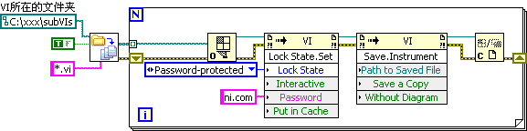